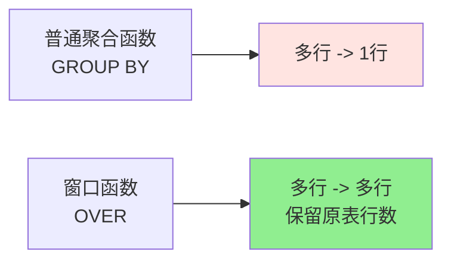

# 😎😎😎MySQL 窗口函数（Window Function）

> 业务场景里有一类问题特别常见：**Top N、排名、累计、同比环比、连续登录……** 用 `GROUP BY` 写起来又臭又长，而窗口函数几行搞定。
> MySQL **8.0+** 才支持，5.7 及之前没有。

---

## 📑 目录

- [一、什么是窗口函数](#一什么是窗口函数)
- [二、语法骨架](#二语法骨架)
- [三、四大排名函数](#三四大排名函数)
- [四、偏移函数](#四偏移函数)
- [五、聚合窗口函数](#五聚合窗口函数)
- [六、窗口帧 frame_clause](#六窗口帧-frame_clause)
- [七、窗口函数 vs GROUP BY](#七窗口函数-vs-group-by)
- [八、实战案例](#八实战案例)
- [九、面试高频题](#九面试高频题)
- [十、注意事项与坑](#十注意事项与坑)

---

## 一、什么是窗口函数

**窗口函数** = 在不改变原表行数的前提下，对**一组相关行**（窗口）进行计算，并把结果挂到每一行上。



| 类型 | 例子 | 输出行数 |
|------|------|---------|
| `GROUP BY` + 聚合 | `SELECT dept, COUNT(*) FROM emp GROUP BY dept` | 每个部门 1 行 |
| 窗口函数 | `SELECT name, dept, COUNT(*) OVER(PARTITION BY dept) FROM emp` | 每位员工 1 行 |

---

## 二、语法骨架

```mysql
函数() OVER (
    [PARTITION BY <分组列>]      -- 类似 GROUP BY，决定"窗口"范围
    [ORDER BY <排序列> [ASC|DESC]]
    [<窗口帧定义>]                -- 进一步限定窗口大小（ROWS / RANGE）
)
```

**完整执行流程**：


**一个最简单的例子**：

```mysql
-- 给每个员工按部门分组、按工资降序，标上"部门内排名"
SELECT name, dept, salary,
       RANK() OVER (PARTITION BY dept ORDER BY salary DESC) AS rk
FROM emp;
```

---

## 三、四大排名函数

### 3.1 ROW_NUMBER() / RANK() / DENSE_RANK() 区别

```mysql
SELECT name, score,
       ROW_NUMBER() OVER (ORDER BY score DESC) AS rn,
       RANK()       OVER (ORDER BY score DESC) AS rk,
       DENSE_RANK() OVER (ORDER BY score DESC) AS drk
FROM student;
```

| name | score | rn | rk | drk |
|------|-------|----|----|------|
| 小明 | 100 | 1 | 1 | 1 |
| 小红 | 100 | 2 | 1 | 1 |
| 小李 | 90  | 3 | 3 | 2 |
| 小王 | 80  | 4 | 4 | 3 |

**记忆口诀**：

| 函数 | 跳号？ | 用途 |
|------|------|------|
| `ROW_NUMBER()` | 永不跳号（1,2,3,4...） | 分页、去重保留一行 |
| `RANK()` | 跳号（1,1,3,4...） | 真实排名（奥运金牌） |
| `DENSE_RANK()` | 不跳号（1,1,2,3...） | 连续排名（等级评定） |

### 3.2 NTILE(n)：分桶

把结果切成 n 份，标上桶号（1~n）：

```mysql
-- 把学生按成绩分成 4 个梯队
SELECT name, score,
       NTILE(4) OVER (ORDER BY score DESC) AS tier
FROM student;
```

**用途**：分位数、A/B 测试分组、抽样。

### 3.3 Top N per Group（每组前 N 名）

```mysql
-- 每个部门工资最高的 2 名员工
SELECT * FROM (
    SELECT name, dept, salary,
           ROW_NUMBER() OVER (PARTITION BY dept ORDER BY salary DESC) AS rk
    FROM emp
) t
WHERE rk <= 2;
```

---

## 四、偏移函数

### 4.1 LAG() / LEAD()：取上一行 / 下一行

```mysql
LAG(col, offset, default)  OVER (ORDER BY ...)
LEAD(col, offset, default) OVER (ORDER BY ...)
```

| 参数 | 含义 |
|------|------|
| `col` | 要取的列 |
| `offset` | 偏移几行（默认 1） |
| `default` | 越界时的默认值（默认 NULL） |

**经典案例：计算连续两天的差值**

```mysql
SELECT date, sales,
       LAG(sales)   OVER (ORDER BY date) AS prev_sales,
       sales - LAG(sales) OVER (ORDER BY date) AS diff
FROM daily_sales;
```


### 4.2 FIRST_VALUE() / LAST_VALUE() / NTH_VALUE()

```mysql
-- 部门内工资最高 / 最低的员工
SELECT name, dept, salary,
       FIRST_VALUE(name) OVER (PARTITION BY dept ORDER BY salary DESC) AS top1,
       LAST_VALUE(name)  OVER (PARTITION BY dept ORDER BY salary DESC
                               ROWS BETWEEN UNBOUNDED PRECEDING AND UNBOUNDED FOLLOWING) AS last1
FROM emp;
```

**注意**：`LAST_VALUE` 默认窗口是 `RANGE BETWEEN UNBOUNDED PRECEDING AND CURRENT ROW`，**不写 frame 拿到的不是真"最后一行"**，这点巨坑。

---

## 五、聚合窗口函数

`SUM / AVG / COUNT / MAX / MIN` 加上 `OVER` 也能用，**不减少行数**。

### 5.1 累计求和

```mysql
SELECT date, sales,
       SUM(sales) OVER (ORDER BY date) AS cum_sales
FROM daily_sales;
```

| date | sales | cum_sales |
|------|-------|-----------|
| 2024-01-01 | 100 | 100 |
| 2024-01-02 | 150 | 250 |
| 2024-01-03 | 200 | 450 |

### 5.2 部门平均工资 + 个人对比

```mysql
SELECT name, dept, salary,
       AVG(salary) OVER (PARTITION BY dept) AS dept_avg,
       salary - AVG(salary) OVER (PARTITION BY dept) AS diff_from_avg
FROM emp;
```

### 5.3 移动平均（3 日）

```mysql
SELECT date, sales,
       AVG(sales) OVER (ORDER BY date ROWS BETWEEN 2 PRECEDING AND CURRENT ROW) AS ma3
FROM daily_sales;
```

---

## 六、窗口帧 frame_clause

帧是窗口函数的**子窗口**，在 `PARTITION BY` 之内再切一段。

```mysql
ROWS | RANGE BETWEEN <起点> AND <终点>
```

| 边界 | 含义 |
|------|------|
| `UNBOUNDED PRECEDING` | 分区第一行 |
| `n PRECEDING` | 当前行往前 n 行 / 距离 |
| `CURRENT ROW` | 当前行 |
| `n FOLLOWING` | 当前行往后 n 行 / 距离 |
| `UNBOUNDED FOLLOWING` | 分区最后一行 |

### 6.1 ROWS vs RANGE

| 关键字 | 含义 | 适用 |
|--------|------|------|
| `ROWS` | **物理**行偏移（n 行） | 整数排序 |
| `RANGE` | **逻辑**值偏移（同值算一组） | 时间、数值排序 |

```mysql
-- ROWS：取当前行及前 2 行（3 行窗口）
ROWS BETWEEN 2 PRECEDING AND CURRENT ROW

-- RANGE：取与当前值相差不超过 2 的行（同值算一组）
RANGE BETWEEN 2 PRECEDING AND CURRENT ROW
```

### 6.2 常用帧模板

```mysql
-- 累计（从开始到当前行）
ROWS BETWEEN UNBOUNDED PRECEDING AND CURRENT ROW

-- 全局（整个分区）
ROWS BETWEEN UNBOUNDED PRECEDING AND UNBOUNDED FOLLOWING

-- 中心窗口（前后各 n 行）
ROWS BETWEEN n PRECEDING AND n FOLLOWING
```

---

## 七、窗口函数 vs GROUP BY


| 维度 | GROUP BY | 窗口函数 |
|------|----------|----------|
| 输出行数 | 分组后 N 行 | 原表 M 行 |
| 能否 select 原字段 | 只能 select 分组键/聚合 | 可以 select 任意字段 |
| 执行顺序 | `WHERE` → `GROUP BY` → `HAVING` → `SELECT` | `WHERE` → `窗口` → `SELECT` |
| 性能 | 较好（数据少） | 略差（保留明细） |

---

## 八、实战案例

### 8.1 案例一：连续登录问题

> 找出连续登录 7 天以上的用户

```mysql
-- 思路：ROW_NUMBER 后用 date - rn 得到分组 key，相同 key 即"连续"
SELECT user_id, MIN(login_date) AS start_date,
       MAX(login_date) AS end_date,
       COUNT(*)          AS days
FROM (
    SELECT user_id, login_date,
           DATE_SUB(login_date, INTERVAL ROW_NUMBER() OVER (
               PARTITION BY user_id ORDER BY login_date
           ) DAY) AS grp
    FROM login_log
) t
GROUP BY user_id, grp
HAVING days >= 7;
```

**原理**：


### 8.2 案例二：同比环比

```mysql
-- 每月销售额 + 环比（vs 上月）+ 同比（vs 去年同月）
SELECT ym, sales,
       LAG(sales, 1)      OVER (ORDER BY ym) AS prev_month,
       LAG(sales, 12)     OVER (ORDER BY ym) AS prev_year,
       (sales - LAG(sales, 1)  OVER (ORDER BY ym)) 
         / LAG(sales, 1)  OVER (ORDER BY ym) AS mom_rate,
       (sales - LAG(sales, 12) OVER (ORDER BY ym)) 
         / LAG(sales, 12) OVER (ORDER BY ym) AS yoy_rate
FROM monthly_sales;
```

### 8.3 案例三：每个部门工资前 3 高的员工

```mysql
SELECT * FROM (
    SELECT name, dept, salary,
           DENSE_RANK() OVER (PARTITION BY dept ORDER BY salary DESC) AS rk
    FROM emp
) t
WHERE rk <= 3;
```

### 8.4 案例四：求每个用户最大连续登录天数

```mysql
-- 用户最大连续登录天数（思路：日期 - 序号 得到连续段，再求最大段长）
SELECT user_id, MAX(consec_days) AS max_consec
FROM (
    SELECT user_id, grp, COUNT(*) AS consec_days
    FROM (
        SELECT user_id, login_date,
               DATE_SUB(login_date, INTERVAL ROW_NUMBER() OVER (
                   PARTITION BY user_id ORDER BY login_date
               ) DAY) AS grp
        FROM (SELECT DISTINCT user_id, login_date FROM login_log) t
    ) x
    GROUP BY user_id, grp
) y
GROUP BY user_id;
```

### 8.5 案例五：删除重复数据，保留 id 最小的一行

```mysql
DELETE FROM user WHERE id IN (
    SELECT id FROM (
        SELECT id,
               ROW_NUMBER() OVER (PARTITION BY name ORDER BY id) AS rn
        FROM user
    ) t
    WHERE rn > 1
);
```

---

## 九、面试高频题

### 9.1 Top N 选不同函数？

| 业务诉求 | 推荐函数 |
|---------|---------|
| 每组前 N 名（**允许并列**） | `RANK()` / `DENSE_RANK()` |
| 每组前 N 名（**严格 N 条**） | `ROW_NUMBER()` |
| 每个用户的最近一笔订单 | `ROW_NUMBER() = 1` |
| 连续 N 天登录 | `ROW_NUMBER() + 日期偏移` |
| 同比环比 | `LAG()` |
| 累计 / 移动平均 | 聚合 `OVER (ORDER BY)` |

### 9.2 ROW_NUMBER / RANK / DENSE_RANK 区别？

> 看第三节的"跳号 vs 不跳号"表。

### 9.3 LAG 越界怎么处理？

```mysql
LAG(sales, 1, 0) OVER (...)   -- 越界返回 0
```

### 9.4 LAST_VALUE 拿不到"真最后一行"怎么办？

加 frame：

```mysql
LAST_VALUE(col) OVER (
    ... ROWS BETWEEN UNBOUNDED PRECEDING AND UNBOUNDED FOLLOWING
)
```

---

## 十、注意事项与坑

| 坑 | 现象 | 解决方案 |
|----|------|----------|
| MySQL 版本 < 8.0 | 语法报错 | 升级到 8.0，或用 `@rank:=@rank+1` 自定义变量模拟 |
| `LAST_VALUE` 不写 frame | 拿到的不是真最后一行 | 加 `ROWS BETWEEN UNBOUNDED PRECEDING AND UNBOUNDED FOLLOWING` |
| `ROW_NUMBER()` 分页用变量 | 性能差 | MySQL 8 推荐 `ROW_NUMBER()` + 子查询 |
| 窗口里写 `WHERE` 过滤 | 报错 | `WHERE` 在 `OVER` 之外，**先过滤再开窗** |
| `PARTITION BY` 列没建索引 | 全表扫 | 经常作为分区的列建索引 |
| `LAG` / `LEAD` 越界返回 NULL | 计算时 `NULL` 传染 | `COALESCE(LAG(...), 0)` |
| `RANGE` 用在非唯一排序上 | 同值会被视为一组，行为反直觉 | 想严格按行用 `ROWS` |

---

## 十一、一句话总结

> **窗口函数 = 不破坏行数的"分组聚合 + 排名 + 偏移"** 🎉🎉🎉
> 复杂业务逻辑能减少 80% 的 SQL 复杂度，**MySQL 8.0+ 才能用**。
> 面试必考（Top N、连续问题、环比）、工作必用、看着装杯 👍

---

## 🔗 相关笔记

- [[多表查询]] —— JOIN 基础
- [[分页查询]] —— 配合窗口函数做高效分页
- [[SQL知识]] —— 流程控制函数（IF / CASE）
- [[MySQL索引/索引和索引下推]] —— 窗口函数性能调优必备
