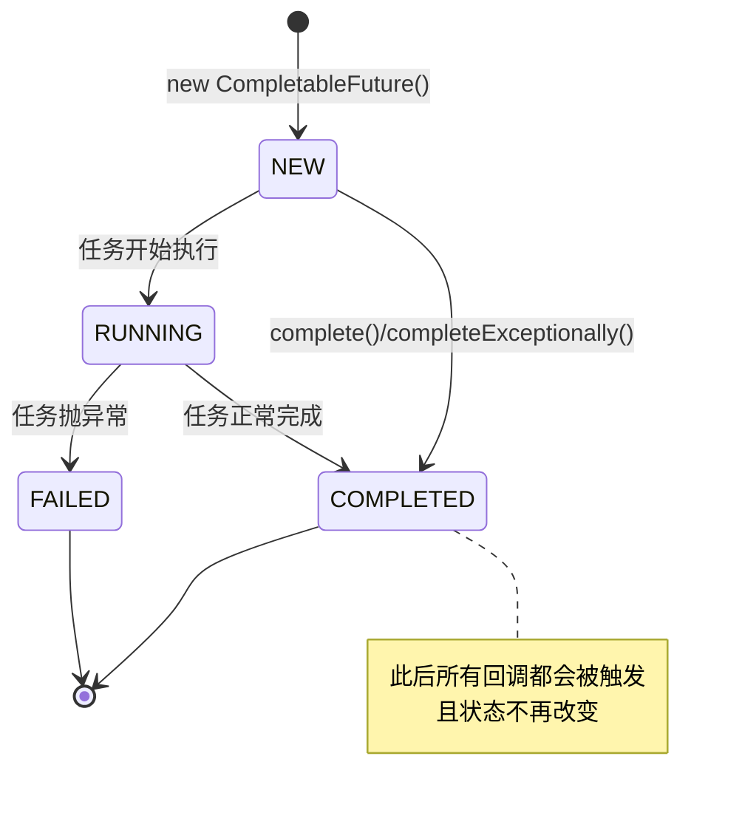
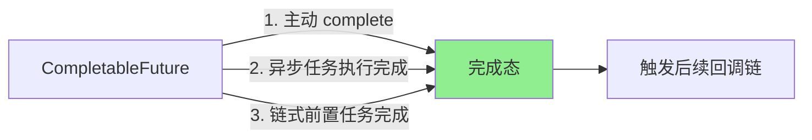
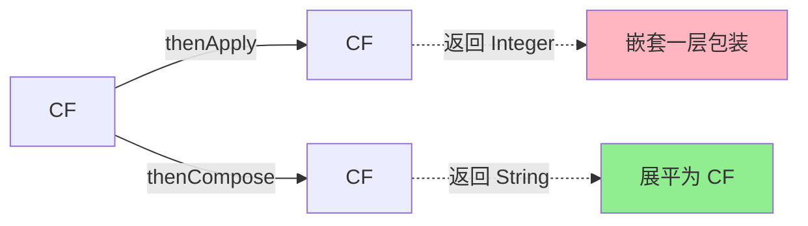
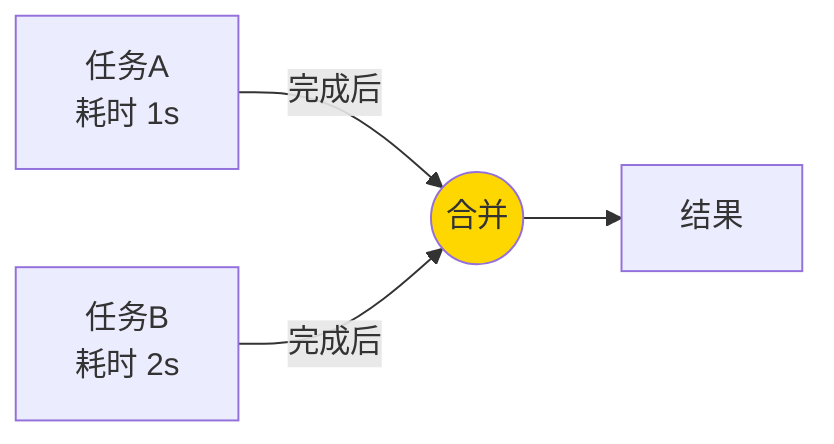
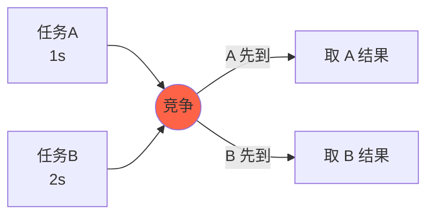
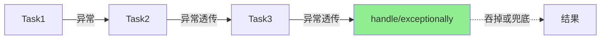
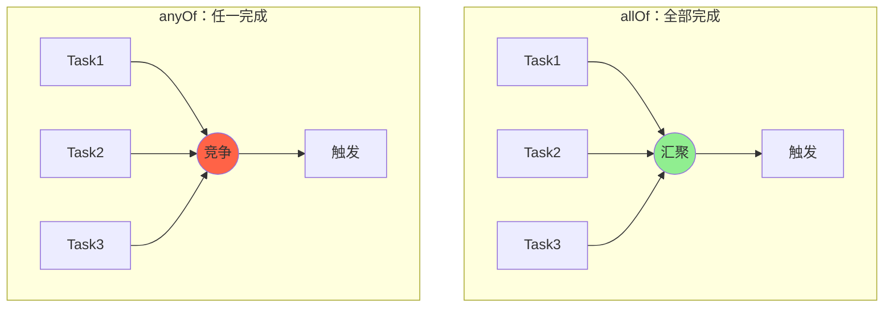
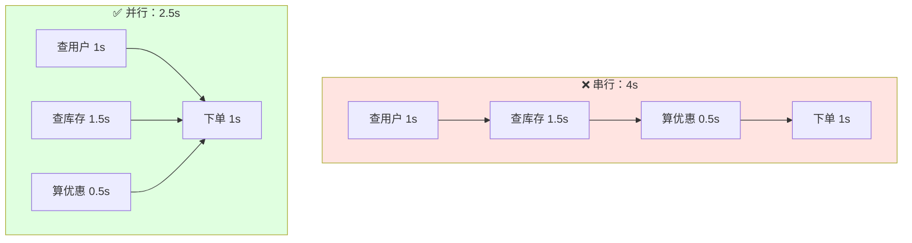
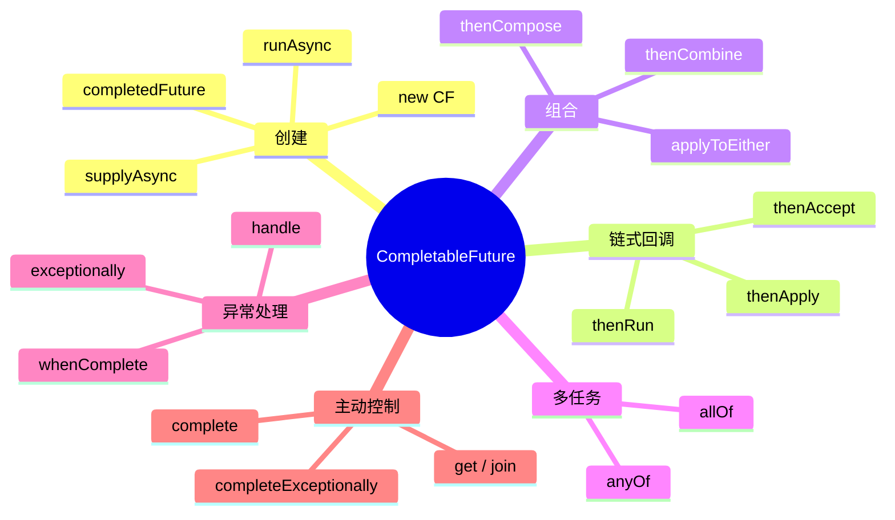

# 😎😎😎聊聊 CompletableFuture：异步任务编排与并发执行

> Java 8 引入的 `java.util.concurrent.CompletableFuture`，是对 `Future` 的增强版，支持**链式编排、回调、组合、异常处理**，是异步编程的"瑞士军刀"。

---

## 📑 目录

- [一、为什么需要 CompletableFuture](#一为什么需要-completablefuture)
- [二、核心思想](#二核心思想)
- [三、四种创建方式](#三四种创建方式)
- [四、链式编排：结果转换与消费](#四链式编排结果转换与消费)
- [五、组合：多任务协同](#五组合多任务协同)
- [六、异常处理](#六异常处理)
- [七、allOf 与 anyOf](#七allof-与-anyof)
- [八、实战案例：电商下单](#八实战案例电商下单)
- [九、注意事项与坑](#九注意事项与坑)

---

## 一、为什么需要 CompletableFuture

### 1.1 传统 `Future` 的痛点

`Future` 是 Java 5 引入的异步结果占位符，但**只能阻塞 `get()` 取结果**，无法做到：

- 任务完成后**自动通知**我
- 多个异步任务**编排组合**（先后、并行、汇聚）
- 任务执行过程中**捕获异常**并处理
- 像写同步代码一样**链式调用**

### 1.2 CompletableFuture 解决了什么

| 能力 | 说明 |
|------|------|
| 主动完成 | `complete()` / `completeExceptionally()` 手动结束 |
| 回调通知 | `thenApply` / `thenAccept` / `thenRun` |
| 链式编排 | `thenCompose` 串行依赖 |
| 任务组合 | `thenCombine` 双源汇聚 |
| 多任务协同 | `allOf` 全完成 / `anyOf` 任一完成 |
| 异常处理 | `exceptionally` / `handle` / `whenComplete` |

### 1.3 适用场景

- 微服务间**并行调用**多个下游接口（聚合数据）
- 耗时操作**异步化**（发短信、写日志、查缓存）
- 复杂的**任务编排 DAG**（有向无环图）
- **流水线式**数据处理

---

## 二、核心思想

### 2.1 设计哲学

> **回调函数 + 状态机 + 函数式编程**

`CompletableFuture` 实现了 `Future<T>` 和 `CompletionStage<T>` 两个接口：
- `Future<T>`：拿到异步结果
- `CompletionStage<T>`：描述"完成之后做什么"，支持链式组合

### 2.2 状态流转



### 2.3 三种触发方式



---

## 三、四种创建方式

### 3.1 方式一：直接 `new` + 手动完成

```java
CompletableFuture<String> cf = new CompletableFuture<>();
// 另起一个线程设置结果
new Thread(() -> {
    try {
        Thread.sleep(1000);
        cf.complete("hello");
    } catch (Exception e) {
        cf.completeExceptionally(e);
    }
}).start();
```

**适用场景**：跨线程传递结果（如 WebSocket、消息推送）。

### 3.2 方式二：`runAsync` —— 无返回值

```java
CompletableFuture<Void> cf = CompletableFuture.runAsync(() -> {
    // 耗时操作，无返回值
    System.out.println("running in " + Thread.currentThread().getName());
});
```

- 默认使用 `ForkJoinPool.commonPool()`
- 可传入自定义 `Executor`

### 3.3 方式三：`supplyAsync` —— 有返回值

```java
CompletableFuture<String> cf = CompletableFuture.supplyAsync(() -> {
    return "Hello CompletableFuture";
}, executor);
```

### 3.4 方式四：已完成的 `completedFuture`

```java
CompletableFuture<String> cf = CompletableFuture.completedFuture("已就绪");
```

**适用场景**：缓存命中、默认值快速返回。

### 3.5 创建方式速查表

| 方法 | 是否有返回值 | 线程池 |
|------|------|------|
| `new CompletableFuture<>()` | 手动 | 由调用方决定 |
| `runAsync(Runnable)` | 否 | ForkJoinPool / 自定义 |
| `supplyAsync(Supplier)` | 是 | ForkJoinPool / 自定义 |
| `completedFuture(value)` | 是 | 立即完成 |

---

## 四、链式编排：结果转换与消费

### 4.1 三大基础回调

```java
// 1. thenApply：转换结果（有入参，有返回值）
CompletableFuture<Integer> cf1 = CompletableFuture
    .supplyAsync(() -> "123")
    .thenApply(s -> Integer.parseInt(s) + 1);  // 124

// 2. thenAccept：消费结果（有入参，无返回值）
CompletableFuture<Void> cf2 = CompletableFuture
    .supplyAsync(() -> "result")
    .thenAccept(System.out::println);

// 3. thenRun：执行副作用（无入参，无返回值）
CompletableFuture<Void> cf3 = CompletableFuture
    .supplyAsync(() -> "x")
    .thenRun(() -> System.out.println("done"));
```

### 4.2 异步回调：xxxAsync

每个回调都有 `xxxAsync` 版本，**强制切换到线程池**执行：

```java
.thenApply(s -> s + "1")         // 沿用上一步的线程
.thenApplyAsync(s -> s + "2")    // 切到 ForkJoinPool
.thenApplyAsync(s -> s + "3", executor)  // 切到自定义线程池
```

### 4.3 thenApply vs thenCompose



```java
// ❌ thenApply：返回 CompletableFuture<CompletableFuture<String>>
CompletableFuture<CompletableFuture<String>> bad = 
    CompletableFuture.supplyAsync(this::getUserId)
                      .thenApply(this::findUserAsync);

// ✅ thenCompose：展平为 CompletableFuture<String>
CompletableFuture<String> good = 
    CompletableFuture.supplyAsync(this::getUserId)
                      .thenCompose(this::findUserAsync);
```

**记忆口诀**：**Compose 是平铺，Apply 是套娃**。

---

## 五、组合：多任务协同

### 5.1 thenCombine：双任务汇聚

```java
CompletableFuture<String> cfA = CompletableFuture.supplyAsync(() -> "A");
CompletableFuture<Integer> cfB = CompletableFuture.supplyAsync(() -> 100);

CompletableFuture<String> result = cfA.thenCombine(cfB, (a, b) -> a + b);
// result = "A100"
```

**流程图**：



### 5.2 thenAcceptBoth / runAfterBoth

```java
// 两个都完成后，消费结果
cfA.thenAcceptBoth(cfB, (a, b) -> System.out.println(a + b));

// 两个都完成后，执行动作
cfA.runAfterBoth(cfB, () -> System.out.println("都完成"));
```

### 5.3 applyToEither / acceptEither：谁快用谁

```java
CompletableFuture<String> result = cfA.applyToEither(cfB, s -> "先到的是：" + s);
```

**流程图**：



### 5.4 串行 vs 并行 速查

| 模式 | 方法 | 关系 |
|------|------|------|
| 串行依赖 | `thenCompose` | A 完成才能开始 B |
| 汇聚组合 | `thenCombine` | A、B 都完成才触发 |
| 竞争选择 | `applyToEither` | A、B 谁先到用谁 |

---

## 六、异常处理

### 6.1 三大异常处理方法

```java
// 1. exceptionally：捕获异常，返回兜底值（类似 catch）
CompletableFuture<Integer> cf1 = CompletableFuture
    .supplyAsync(() -> { throw new RuntimeException("oops"); })
    .exceptionally(ex -> {
        System.out.println("捕获异常：" + ex.getMessage());
        return -1;
    });

// 2. handle：无论成败都能处理（有入参，有返回值）
CompletableFuture<Integer> cf2 = CompletableFuture
    .supplyAsync(() -> 10 / 0)
    .handle((result, ex) -> {
        if (ex != null) return 0;
        return result * 2;
    });

// 3. whenComplete：无论成败都能处理（无返回值）
CompletableFuture<Integer> cf3 = CompletableFuture
    .supplyAsync(() -> "x")
    .whenComplete((result, ex) -> {
        if (ex != null) System.out.println("失败了");
        else System.out.println("成功了：" + result);
    });
```

### 6.2 异常传播链



**注意**：异常会沿着链**透传**，直到被 `handle` 或 `exceptionally` 捕获。

### 6.3 选择指南

| 方法 | 是否有返回值 | 是否能感知结果 | 典型用途 |
|------|------|------|------|
| `exceptionally` | 是 | 只能感知异常 | 兜底降级 |
| `handle` | 是 | 结果 + 异常都能感知 | 统一收口 |
| `whenComplete` | 否 | 结果 + 异常都能感知 | 日志埋点 |

---

## 七、allOf 与 anyOf

### 7.1 allOf：等待所有任务完成

```java
CompletableFuture<String> a = CompletableFuture.supplyAsync(() -> "A");
CompletableFuture<String> b = CompletableFuture.supplyAsync(() -> "B");
CompletableFuture<String> c = CompletableFuture.supplyAsync(() -> "C");

CompletableFuture<Void> all = CompletableFuture.allOf(a, b, c);
all.thenRun(() -> System.out.println("全部完成"));
```

**注意**：`allOf` 返回 `CompletableFuture<Void>`，**不会**汇聚各子任务的结果，需要手动从 `a/b/c` 取：

```java
all.thenRun(() -> {
    String ra = a.join();
    String rb = b.join();
    String rc = c.join();
    System.out.println(ra + rb + rc);
});
```

### 7.2 anyOf：任一任务完成即触发

```java
CompletableFuture<Object> any = CompletableFuture.anyOf(a, b, c);
any.thenAccept(first -> System.out.println("最先完成：" + first));
```

**注意**：返回类型是 `CompletableFuture<Object>`，**结果是 Object**。

### 7.3 流程图



### 7.4 完整版：allOf + 聚合结果

```java
public static <T> CompletableFuture<List<T>> allOfList(
        CompletableFuture<T>... futures) {
    return CompletableFuture.allOf(futures)
        .thenApply(v -> Stream.of(futures)
                              .map(CompletableFuture::join)
                              .collect(Collectors.toList()));
}
```

---

## 八、实战案例：电商下单

### 8.1 场景描述

下单需要：
1. **查用户信息**（1s）
2. **查商品库存**（1.5s）
3. **算优惠**（0.5s）
4. **扣库存 + 创建订单**（1s，依赖前 3 步）

### 8.2 串行 vs 并行优化



### 8.3 完整代码

```java
public CompletableFuture<OrderResult> placeOrder(Long userId, Long skuId) {
    // 1、2、3 步并行
    CompletableFuture<User> userF = CompletableFuture
        .supplyAsync(() -> userService.getById(userId), ioPool);
    CompletableFuture<Sku> skuF = CompletableFuture
        .supplyAsync(() -> skuService.getById(skuId), ioPool);
    CompletableFuture<Discount> discountF = CompletableFuture
        .supplyAsync(() -> discountService.calc(skuId), ioPool);
    
    // 三步汇聚后下单
    return userF.thenCombine(skuF, User::withSku)
               .thenCombine(discountF, Order::applyDiscount)
               .thenCompose(order -> CompletableFuture
                   .supplyAsync(() -> orderService.create(order), ioPool))
               .exceptionally(ex -> {
                   log.error("下单失败", ex);
                   return OrderResult.fail(ex.getMessage());
               });
}
```

### 8.4 多接口聚合（Spring Cloud 场景）

```java
public CompletableFuture<HomePageVO> getHomePage(Long userId) {
    CompletableFuture<User> userF = CompletableFuture
        .supplyAsync(() -> userClient.getById(userId), ioPool);
    CompletableFuture<List<Order>> orderF = CompletableFuture
        .supplyAsync(() -> orderClient.listByUser(userId), ioPool);
    CompletableFuture<List<Coupon>> couponF = CompletableFuture
        .supplyAsync(() -> couponClient.listByUser(userId), ioPool);
    CompletableFuture<Cart> cartF = CompletableFuture
        .supplyAsync(() -> cartClient.get(userId), ioPool);
    
    return CompletableFuture.allOf(userF, orderF, couponF, cartF)
        .thenApply(v -> new HomePageVO(
            userF.join(), orderF.join(), couponF.join(), cartF.join()));
}
```

---

## 九、注意事项与坑

### 9.1 常见坑

| 坑 | 现象 | 解决方案 |
|----|------|----------|
| 包装 `Future` 用 `thenApply` | 出现 `CompletableFuture<CompletableFuture<T>>` | 改用 `thenCompose` |
| 业务线程池被 `join()` 阻塞 | 线程池耗尽 | 用 `thenApply`/`whenComplete` 替代 `join` |
| `allOf` 结果拿不到 | 不会汇聚各子任务结果 | 手动 `.join()` 各 CF 或封装为 `allOfList` |
| 异步任务抛异常没处理 | 结果永远拿不到（无 `get()` 抛 `TimeoutException`） | 末端必加 `exceptionally` / `handle` |
| `ForkJoinPool.commonPool()` 默认大小 | CPU 密集型不够用，IO 密集型被占满 | 自定义 `ThreadPoolExecutor` |

### 9.2 线程池选型

```java
// IO 密集型：多线程
private static final ExecutorService ioPool = new ThreadPoolExecutor(
    16, 32, 60, TimeUnit.SECONDS,
    new LinkedBlockingQueue<>(1024),
    new ThreadFactoryBuilder().setNameFormat("io-pool-%d").build()
);

// CPU 密集型：与 CPU 核数相当
private static final ExecutorService cpuPool = new ThreadPoolExecutor(
    Runtime.getRuntime().availableProcessors(),
    Runtime.getRuntime().availableProcessors(),
    0, TimeUnit.MILLISECONDS,
    new SynchronousQueue<>(),
    new ThreadFactoryBuilder().setNameFormat("cpu-pool-%d").build()
);
```

### 9.3 整体 API 关系图



### 9.4 一句话总结

> **CompletableFuture = Future + 回调 + 编排 + 异常处理**
> 异步任务的"乐高积木"，能把复杂的并发逻辑写得**像同步代码一样优雅**。🎉🎉🎉

---

## 🔗 相关笔记

- [[线程池七大核心参数]] —— 异步任务运行的载体
- [[../README]] —— 多线程总览
- [[../../Java/lambda表达式]] —— CompletableFuture 的回调大量使用 Lambda
- [[../../Java/四种特殊的接口]] —— Supplier / Function / Consumer 接口在 thenApply / thenAccept 中的应用
