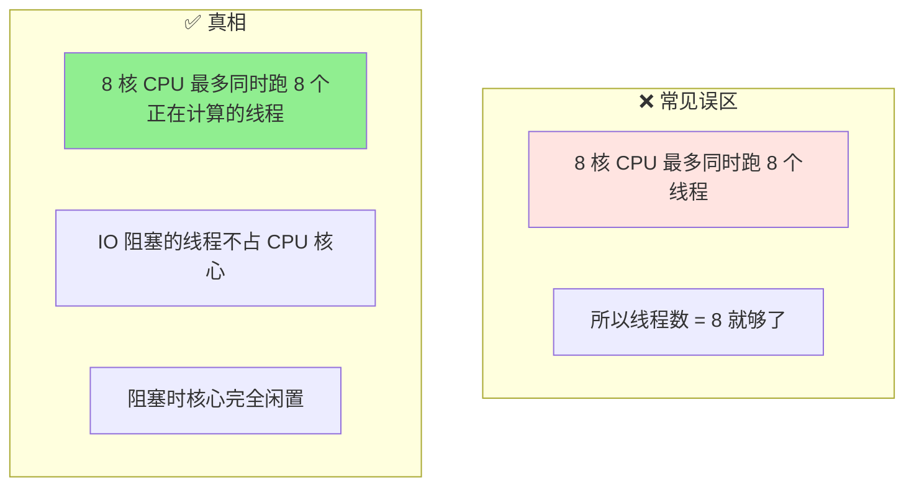
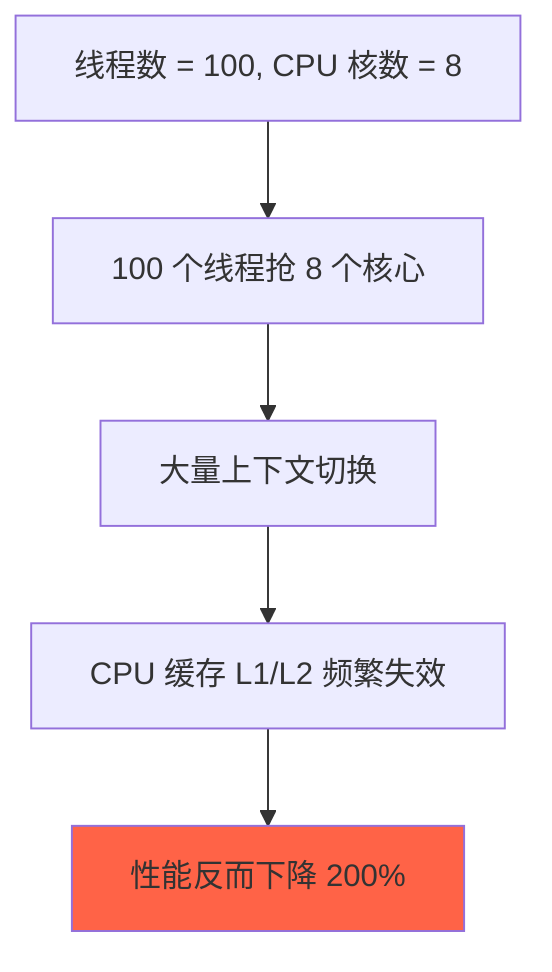
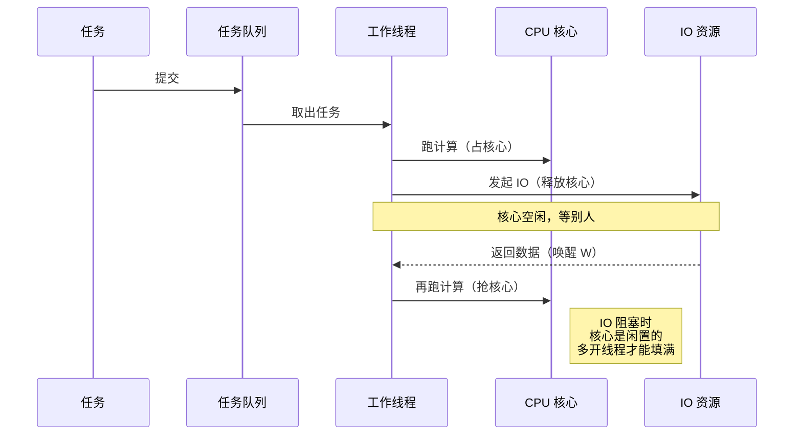
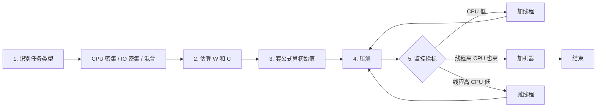

# 😎😎😎线程数到底开多少：CPU 密集 vs IO 密集

> 线程池调参的终极一问：**核心线程数设多少？最大线程数设多少？**
> 答案只有一句话——**看你等不等 IO**。

---

## 📑 目录

- [一、一句话结论](#一一句话结论)
- [二、核心矛盾：CPU 不会"自动"切到别的线程](#二核心矛盾cpu-不会自动切到别的线程)
- [三、用时间轴看清楚：为什么 8 线程不够](#三用时间轴看清楚为什么-8-线程不够)
- [四、加大线程池会发生什么](#四加大线程池会发生什么)
- [五、经典公式：W/C 模型](#五经典公式wc-模型)
- [六、CPU 密集型为什么不能多开](#六cpu-密集型为什么不能多开)
- [七、对比表](#七对比表)
- [八、回到 Java 线程池的执行流程](#八回到-java-线程池的执行流程)
- [九、实际代码里 16\~32 怎么来的](#九实际代码里-1632-怎么来的)
- [十、调参实战步骤](#十调参实战步骤)
- [十一、一句话总结](#十一一句话总结)

---

## 一、一句话结论

> **CPU 密集型怕的是"线程抢 CPU"（多开会内卷）**
> **IO 密集型怕的是"CPU 空转没人用"（少开会浪费）**
> 公式：线程数 = 核数 × (1 + W / C)，让 CPU 在每个时间片都有活干。

---

## 二、核心矛盾：CPU 不会"自动"切到别的线程



**关键点**：线程有三种状态，**只有 RUNNING 才占 CPU**。

| 状态 | 占 CPU 吗 | 例子 |
|------|----------|------|
| `RUNNING` | ✅ 占满一个核 | 计算、循环、序列化 |
| `BLOCKED` / `WAITING` | ❌ 完全不占 | `socket.read()` 等网络包 |
| `RUNNABLE` 但实际等 IO | ❌ 不占 | 数据库查询等结果返回 |

---

## 三、用时间轴看清楚：为什么 8 线程不够

假设 **8 核 CPU**，**8 个线程**，**每个任务 IO:Compute = 9:1**：

```mermaid
gantt
    title 线程数=8，CPU核数=8（IO 密集场景）
    dateFormat X
    axisFormat %s
    
    section CPU-1
    T1-IO等待 :a1, 0, 9
    T1-计算 :a2, 9, 10
    
    section CPU-2
    T2-IO等待 :b1, 0, 9
    T2-计算 :b2, 9, 10
    
    section CPU-3
    T3-IO等待 :c1, 0, 9
    T3-计算 :c2, 9, 10
    
    section CPU-4
    T4-IO等待 :d1, 0, 9
    T4-计算 :d2, 9, 10
    
    section CPU-5
    T5-IO等待 :e1, 0, 9
    T5-计算 :e2, 9, 10
    
    section CPU-6
    T6-IO等待 :f1, 0, 9
    T6-计算 :f2, 9, 10
    
    section CPU-7
    T7-IO等待 :g1, 0, 9
    T7-计算 :g2, 9, 10
    
    section CPU-8
    T8-IO等待 :h1, 0, 9
    T8-计算 :h2, 9, 10
```



**问题来了**：第 0~9 秒，8 个核心**全部空转**！这时候第 9 个请求进来，**没人接**。

---

## 四、加大线程池会发生什么

线程数 = 80，CPU 核数 = 8：

```mermaid
gantt
    title 线程数=80，CPU核数=8（IO 密集场景）
    dateFormat X
    axisFormat %s
    
    section CPU-1
    T1-IO :a1, 0, 9
    T1-CPU :a2, 9, 10
    T9-IO :a3, 1, 10
    T9-CPU :a4, 10, 11
    
    section CPU-2
    T2-IO :b1, 0, 9
    T2-CPU :b2, 9, 10
    T10-IO :b3, 1, 10
    
    section CPU-3
    T3-IO :c1, 0, 9
    T3-CPU :c2, 9, 10
    T11-IO :c3, 2, 11
    
    section CPU-4
    T4-IO :d1, 0, 9
    T4-CPU :d2, 9, 10
    
    section CPU-5
    T5-IO :e1, 0, 9
    T5-CPU :e2, 9, 10
    
    section CPU-6
    T6-IO :f1, 0, 9
    T6-CPU :f2, 9, 10
    
    section CPU-7
    T7-IO :g1, 0, 9
    T7-CPU :g2, 9, 10
    
    section CPU-8
    T8-IO :h1, 0, 9
    T8-CPU :h2, 9, 10
```



**变化**：

- 第 1 秒：T1~T8 都在等 IO，**8 个核心全空**
- 但队列里还有 T9~T80 **待命**
- 某个 IO 提前返回（T1 在第 5 秒拿到数据），T1 立刻进入 CPU 计算，**不用等别人释放核心**
- 整个时间窗口内，**总有一些线程在 RUNNING 状态喂满 CPU**

**CPU 利用率从 ~0% 提升到 ~80~90%**。

---

## 五、经典公式：W/C 模型

来自《Java Concurrency in Practice》：

```
线程数 =  CPU 核数  ×  ( 1 +  W / C )
                    └─ 阻塞比 ─┘
```

| 符号 | 含义 |
|------|------|
| W | IO 等待时间（Wait） |
| C | CPU 计算时间（Compute） |

**实际算一下**：

| 场景 | W (IO 等待) | C (计算) | W/C | 8 核理论线程数 |
|------|------|------|------|------|
| 纯计算（排序、压缩） | 0 | 100ms | 0 | 8 |
| DB 查询为主 | 50ms | 5ms | 10 | 88 |
| HTTP 调用下游 | 100ms | 2ms | 50 | 408 |
| Redis 缓存查询 | 5ms | 1ms | 5 | 48 |

**所以"16~32 线程"只是经验值**，真实值要按这个公式估算，再压测调优。

---

## 六、CPU 密集型为什么不能多开？



**三个负面效应**：

1. **上下文切换开销**：一次切换 ≈ 1~10 微秒，频繁切换吃光 CPU
2. **缓存污染**：每个核心的 L1/L2 缓存（约 64KB~1MB）只能装下几个线程的工作集，切换导致 cache miss
3. **调度延迟**：Linux CFS 调度器、Java 内部队列都有锁竞争

**CPU 密集型线程数 = 核数 + 1**（那 1 个是备胎，防止主线程被换出）。

---

## 七、对比表

| 维度 | CPU 密集型 | IO 密集型 |
|------|----------|----------|
| 线程数 | 核数 + 1 | 核数 × (1 + W/C)，可数十倍 |
| 阻塞时间占比 | < 10% | > 50% |
| CPU 利用率（线程数=核数时） | 90%+ | 极低（核心全空） |
| 多开线程的代价 | 上下文切换、缓存抖动 | 几乎免费（都在阻塞） |
| 经典栈 | 加密、压缩、图像处理 | HTTP、DB、RPC、消息队列 |

---

## 八、回到 Java 线程池的执行流程



**核心洞察**：

- 如果只有 8 个线程：8 个都在等 IO 时，第 9 个请求来，**CPU 全空，没人能跑**
- 如果有 80 个线程：队列里有大量候补，某个 IO 唤醒后**立刻能跑下一个**

---

## 九、实际代码里 16~32 怎么来的？

```java
private static final ExecutorService ioPool = new ThreadPoolExecutor(
    16, 32, 60, TimeUnit.SECONDS,    // core=16, max=32
    new LinkedBlockingQueue<>(1024),
    new ThreadFactoryBuilder().setNameFormat("io-pool-%d").build()
);
```

**这 16~32 不是拍脑袋**：

- 假设服务以**调用 DB / 下游 HTTP 为主**，W ≈ 50ms
- 计算部分 C ≈ 5ms（反序列化、业务拼装）
- 8 核机器，理论值 = 8 × (1 + 10) = **88**
- 但 max 通常不会超过 32~64，原因：
  - **下游 DB 连接数有限**（如 200），线程再多也得排队
  - **内存**：每线程栈 1MB，32 线程 ≈ 32MB，800 线程 ≈ 800MB
  - **操作系统文件描述符上限**（默认 1024）
- 所以经验值落在 **16~32**，需要压测再调

**对照 CPU 密集型**：

```java
private static final ExecutorService cpuPool = new ThreadPoolExecutor(
    Runtime.getRuntime().availableProcessors(),
    Runtime.getRuntime().availableProcessors(),
    0, TimeUnit.MILLISECONDS,
    new SynchronousQueue<>(),
    new ThreadFactoryBuilder().setNameFormat("cpu-pool-%d").build()
);
```

---

## 十、调参实战步骤



**关键监控指标**：

| 指标 | 含义 | 看哪个池 |
|------|------|------|
| `CPU 使用率` | 系统整体 | 整体 |
| `活跃线程数 / poolSize` | 线程池饱和度 | 线程池 |
| `队列堆积` | 任务来不及处理 | 线程池 |
| `响应时间 P99` | 业务感受 | 业务 |
| `GC 频率 / 内存` | 线程太多的副作用 | JVM |

---

## 十一、一句话总结

> **CPU 密集型**：线程数 ≈ 核数 + 1，多了内卷
> **IO 密集型**：线程数 = 核数 × (1 + W/C)，少了浪费
> **调参铁律**：理论算 + 压测 + 监控，三者缺一不可 🎉🎉🎉

---

## 🔗 相关笔记

- [[线程池七大核心参数]] —— 线程池七大参数详解
- [[API/CompletableFuture]] —— 异步任务编排
- [[../面经/10.27美团后端]] —— 面试中线程池相关考点
- [[../计算机网络/计算机网络知识总结]] —— IO 密集型场景与网络 IO 的关系
