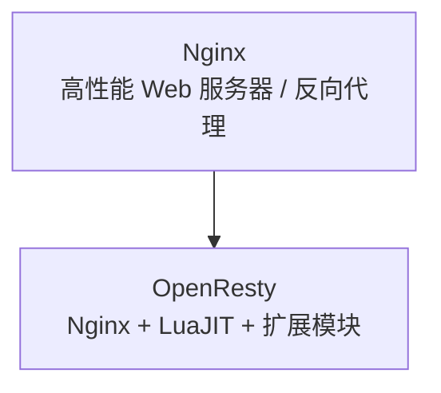
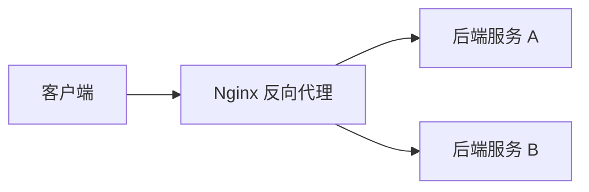
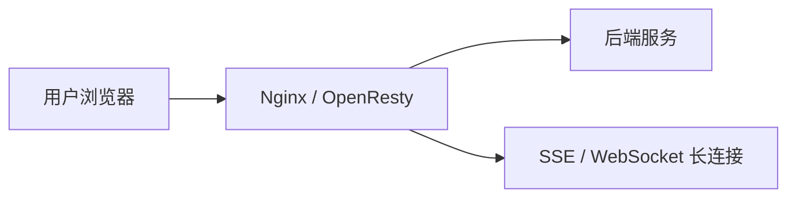

# OpenResty 和 Nginx 的关系 😎😎😎

## 一、先说结论

**OpenResty 不是 Nginx 的替代品，也不是一个独立无关的服务器。**

更准确地说：

> **OpenResty = Nginx + LuaJIT + 一组常用扩展模块 + 更方便的脚本化能力**

所以它们的关系可以理解成：

- **Nginx** 是底座，负责高性能 HTTP 服务、反向代理、负载均衡、静态资源等
- **OpenResty** 是在 Nginx 基础上增强出来的一套可编程平台，重点是让你能在 Nginx 里写 Lua 逻辑



---

## 二、各自是干什么的

### 2.1 Nginx

Nginx 主要做这些事：

- 静态资源服务
- 反向代理
- 负载均衡
- SSL 终止
- 请求转发
- 限流、缓存、压缩

它本身已经非常强，但原生的动态业务逻辑能力比较有限。

### 2.2 OpenResty

OpenResty 的重点不是“再造一个 Web 服务器”，而是让 Nginx 变得更容易写业务逻辑。

它通常会提供：

- `LuaJIT`
- `ngx_lua` 相关能力
- 常用第三方模块
- 更方便的脚本化扩展方式

你可以把它理解成：

> **让 Nginx 不只是转发请求，还能在边缘层直接跑一段业务代码。**

---

### 2.3 正向代理和反向代理

这两个概念很容易混，记住一句话就够了：

- **正向代理**：代理的是**客户端**
- **反向代理**：代理的是**服务端**

#### 正向代理

客户端知道代理服务器的存在，先把请求发给代理，再由代理去访问目标网站。

常见场景：

- 公司内网访问外网
- 科学上网
- 统一出口控制、审计、缓存

请求链路大概是这样：


#### 反向代理

客户端只知道自己访问的是 `www.xxx.com`，并不知道后面还有哪些真实后端服务器。

常见场景：

- 隐藏后端真实地址
- SSL 终止
- 负载均衡
- 统一做限流、缓存、鉴权

请求链路大概是这样：



#### Nginx 更适合哪一个

- **反向代理**是 Nginx 的强项，基本就是它最常见的使用方式
- **正向代理**不是 Nginx 的主场，能做但不算原生强项
- 如果你要做完整的 HTTP/HTTPS 正向代理，通常会优先考虑 `Squid`、`Charles`、`mitmproxy`

---

### 2.4 Nginx 的配置文件怎么写

Nginx 最常见的配置文件是 `nginx.conf`，核心结构一般分成这几层：

- `main`：全局配置
- `events`：连接相关配置
- `http`：HTTP 服务相关配置
- `server`：一个虚拟主机
- `location`：路径匹配和转发规则

一个最基础的结构如下：

```nginx
worker_processes  auto;

events {
    worker_connections  1024;
}

http {
    include       mime.types;
    default_type   application/octet-stream;
    sendfile      on;
    keepalive_timeout  65;

    server {
        listen       80;
        server_name  localhost;

        location / {
            root   html;
            index  index.html index.htm;
        }
    }
}
```

如果你想把它写得更接近生产环境，一般会再补这些内容：

- 统一日志格式
- `upstream` 后端池
- HTTP 自动跳转到 HTTPS
- 静态资源单独处理
- 反向代理超时和头部透传
- 健康检查接口
- `conf.d` 拆分子配置

一个更完整的模板可以写成这样：

```nginx
user  nginx;
worker_processes  auto;
pid /run/nginx.pid;

error_log  /var/log/nginx/error.log warn;

events {
    worker_connections  2048;
    multi_accept on;
}

http {
    include       mime.types;
    default_type   application/octet-stream;

    log_format main '$remote_addr - $remote_user [$time_local] '
                    '"$request" $status $body_bytes_sent '
                    '"$http_referer" "$http_user_agent" '
                    '"$http_x_forwarded_for"';

    access_log  /var/log/nginx/access.log  main;

    sendfile        on;
    tcp_nopush      on;
    tcp_nodelay     on;
    keepalive_timeout  65;
    server_tokens   off;
    client_max_body_size 20m;
    client_body_timeout 60s;
    client_header_timeout 60s;
    send_timeout    60s;

    gzip on;
    gzip_vary on;
    gzip_min_length 1k;
    gzip_types
        text/plain
        text/css
        application/json
        application/javascript
        text/xml
        application/xml
        application/xml+rss
        image/svg+xml;

    upstream app_backend {
        least_conn;
        server 127.0.0.1:8080 max_fails=3 fail_timeout=30s;
        server 127.0.0.1:8081 max_fails=3 fail_timeout=30s;
        keepalive 32;
    }

    server {
        listen 80;
        server_name example.com www.example.com;
        return 301 https://$host$request_uri;
    }

    server {
        listen 443 ssl http2;
        server_name example.com www.example.com;

        ssl_certificate     /etc/nginx/ssl/example.com.pem;
        ssl_certificate_key /etc/nginx/ssl/example.com.key;
        ssl_protocols       TLSv1.2 TLSv1.3;
        ssl_session_cache   shared:SSL:10m;
        ssl_session_timeout 10m;

        location /static/ {
            alias /var/www/example/static/;
            expires 7d;
            access_log off;
        }

        location /healthz {
            default_type text/plain;
            return 200 "ok\n";
        }

        location / {
            proxy_pass http://app_backend;
            proxy_http_version 1.1;
            proxy_set_header Connection "";
            proxy_set_header Host $host;
            proxy_set_header X-Real-IP $remote_addr;
            proxy_set_header X-Forwarded-For $proxy_add_x_forwarded_for;
            proxy_set_header X-Forwarded-Proto $scheme;
            proxy_connect_timeout 5s;
            proxy_send_timeout 60s;
            proxy_read_timeout 60s;
        }
    }

    include /etc/nginx/conf.d/*.conf;
}
```

#### 反向代理配置示例

最常见的反向代理，就是把外部请求转给本机的后端服务：

```nginx
server {
    listen 80;
    server_name api.example.com;

    location / {
        proxy_pass http://127.0.0.1:8080;
        proxy_set_header Host $host;
        proxy_set_header X-Real-IP $remote_addr;
        proxy_set_header X-Forwarded-For $proxy_add_x_forwarded_for;
        proxy_set_header X-Forwarded-Proto $scheme;
    }
}
```

这几行最常见：

- `proxy_pass`：把请求转发给后端
- `Host`：把原始域名带给后端
- `X-Real-IP`：告诉后端真实客户端 IP
- `X-Forwarded-For`：记录整条代理链路上的来源 IP
- `X-Forwarded-Proto`：告诉后端原始协议是 `http` 还是 `https`

---

### 2.5 OpenResty 的逻辑怎么写进 Nginx 配置

如果你说的“在 Nginx 里写 OpenResty 逻辑”，本质上是指：

> **把 Lua 代码写进 `nginx.conf` 的 `*_by_lua_block` 里。**

OpenResty 提供了一组把 Lua 挂到不同请求阶段的指令，常见的有：

- `init_by_lua_block`：Nginx 启动时执行一次
- `init_worker_by_lua_block`：每个 worker 启动时执行
- `access_by_lua_block`：进入业务前做鉴权、限流、校验
- `content_by_lua_block`：直接生成响应内容
- `header_filter_by_lua_block`：改响应头
- `body_filter_by_lua_block`：改响应体
- `log_by_lua_block`：请求结束后打日志、埋点

官方文档里就是把这些 Lua 指令当成进入 Lua API 的入口来用的。

一个最小可理解的写法如下：

```nginx
worker_processes auto;

events {
    worker_connections 1024;
}

http {
    lua_package_path "/etc/nginx/lua/?.lua;;";
    lua_shared_dict token_cache 10m;

    init_by_lua_block {
        -- 启动时加载公共模块
        app = require "app"
    }

    server {
        listen 80;
        server_name api.example.com;

        location /hello {
            access_by_lua_block {
                local token = ngx.var.http_authorization
                if not token or token == "" then
                    ngx.status = ngx.HTTP_UNAUTHORIZED
                    ngx.say("missing token")
                    return ngx.exit(ngx.HTTP_UNAUTHORIZED)
                end
            }

            content_by_lua_block {
                ngx.header["Content-Type"] = "application/json"
                ngx.say('{"msg":"hello from openresty"}')
            }
        }

        location /proxy/ {
            proxy_pass http://app_backend;
        }
    }
}
```

这段配置里，Lua 逻辑不是写在单独的 `.lua` 服务里，而是直接挂在 Nginx 的请求阶段上。

#### 这和纯 Nginx 的区别

- **纯 Nginx**：主要靠配置指令做转发、改写、限流、缓存
- **OpenResty**：除了这些配置能力，还能在各个阶段执行 Lua 代码

也就是说：

- 只是转发请求，`proxy_pass` 就够了
- 需要动态判断、查缓存、做鉴权、拼响应体，就用 `*_by_lua_block`

#### 静态站点配置示例

如果只是做静态页面服务，可以这样写：

```nginx
server {
    listen 80;
    server_name www.example.com;

    root /usr/share/nginx/html;
    index index.html;

    location / {
        try_files $uri $uri/ /index.html;
    }
}
```

#### 正向代理的说明

Nginx 原生更偏向反向代理。  
如果你硬要把它当正向代理用，通常只适合非常简单的场景，而且 HTTPS 正向代理往往还要额外模块支持。

所以实际项目里，正向代理一般不会首选 Nginx。

---

## 三、最核心的区别

| 维度 | Nginx | OpenResty |
|------|------|-----------|
| 定位 | Web 服务器 / 反向代理 | 基于 Nginx 的可编程平台 |
| 是否能写 Lua | 一般不能直接这样做 | 可以 |
| 适合做什么 | 静态服务、代理、负载均衡 | 鉴权、限流、API 网关逻辑、请求改写 |
| 扩展性 | 强，但主要靠配置和模块 | 更强，偏“脚本化业务处理” |
| 学习成本 | 较低 | 略高 |

---

## 四、一个直观理解

你可以把它们类比成：

- **Nginx** 像高速公路收费站
- **OpenResty** 像在收费站里加了一套可编程控制台

收费、放行、限流、分流这些基础动作，Nginx 就能做；
但如果你想根据用户身份、请求参数、黑白名单、动态规则做更复杂的判断，OpenResty 更顺手。

---

## 五、OpenResty 适合做什么

### 5.1 适合的场景

- API 网关
- 请求鉴权
- 动态路由
- 限流和熔断
- 统一日志埋点
- 灰度发布
- 边缘层做轻量业务判断

### 5.2 不太适合的场景

- 复杂的核心业务服务
- 很重的数据库业务编排
- 需要大量状态管理的长流程系统

因为它本质上还是站在 Nginx 这层，适合做“离用户更近、响应更快”的轻逻辑。

---

## 六、为什么很多人会把它们混在一起说

因为在实际使用里，OpenResty 看到的外观很像 Nginx：

- 配置风格很像 Nginx
- 监听端口、反向代理、转发规则这些也都很像
- 但它多了 Lua 能力，所以在行为上又强很多

所以很多人会误以为：

- OpenResty 是 Nginx 的一个插件
- OpenResty 是另一个独立服务器
- OpenResty 和 Nginx 没关系

这些都不准确。

更准确的理解是：

> **OpenResty 把 Nginx 变成了一个可以直接写脚本处理请求的平台。**

---

## 七、怎么选

| 需求 | 建议 |
|------|------|
| 只要代理、静态资源、负载均衡 | Nginx |
| 需要少量动态逻辑 | OpenResty |
| 需要在网关层做鉴权、限流、灰度 | OpenResty |
| 业务逻辑很重，系统复杂 | 应该放到后端服务里，不要硬塞给 Nginx/OpenResty |

---

## 八、和你前面学的 SSE / WebSocket 的关系

这几个东西不是同一层面的概念：

- **Nginx / OpenResty**：偏基础设施和边缘网关
- **SSE / WebSocket**：偏通信协议和连接方式

它们可以一起配合：

- Nginx 负责反向代理
- OpenResty 负责网关层鉴权和路由
- SSE/WebSocket 负责前后端实时通信



---

## 九、一句话总结

> **Nginx 是底座，OpenResty 是在 Nginx 上加了 Lua 和扩展能力后的可编程平台。**  
> 如果你只想要高性能代理和静态服务，用 Nginx 就够了；如果你想在边缘层直接写请求处理逻辑，OpenResty 更合适。

---

## 十、相关笔记

- [[../通讯协议/SSE/SSE vs WebSocket vs HTTP]] —— 通信方式对比
- [[../通讯协议/SSE/MCP 里的 SSE]] —— SSE 在 MCP 里的角色
- [[../../计算机网络/计算机网络知识总结]] —— 代理、负载均衡、网络基础
