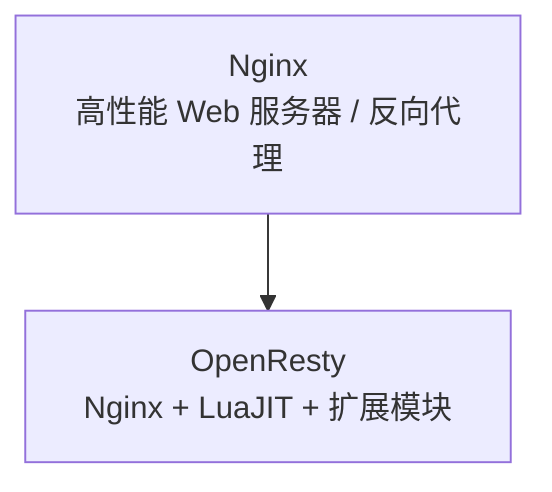
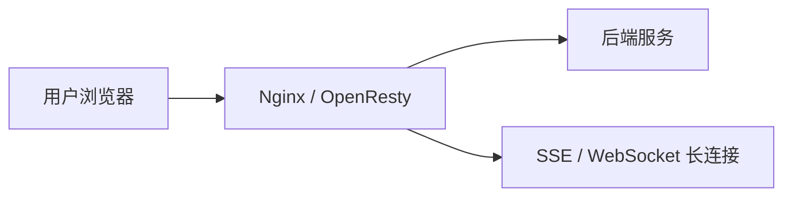

# OpenResty 和 Nginx 的关系 😎😎😎

## 一、先说结论

**OpenResty 不是 Nginx 的替代品，也不是一个独立无关的服务器。**

更准确地说：

> **OpenResty = Nginx + LuaJIT + 一组常用扩展模块 + 更方便的脚本化能力**

所以它们的关系可以理解成：

- **Nginx** 是底座，负责高性能 HTTP 服务、反向代理、负载均衡、静态资源等
- **OpenResty** 是在 Nginx 基础上增强出来的一套可编程平台，重点是让你能在 Nginx 里写 Lua 逻辑

---

## 二、各自是干什么的

### 2.1 Nginx

Nginx 主要做这些事：

- 静态资源服务
- 反向代理
- 负载均衡
- SSL 终止
- 请求转发
- 限流、缓存、压缩

它本身已经非常强，但原生的动态业务逻辑能力比较有限。

### 2.2 OpenResty

OpenResty 的重点不是“再造一个 Web 服务器”，而是让 Nginx 变得更容易写业务逻辑。

它通常会提供：

- `LuaJIT`
- `ngx_lua` 相关能力
- 常用第三方模块
- 更方便的脚本化扩展方式

你可以把它理解成：

> **让 Nginx 不只是转发请求，还能在边缘层直接跑一段业务代码。**

---

## 三、最核心的区别

| 维度 | Nginx | OpenResty |
|------|------|-----------|
| 定位 | Web 服务器 / 反向代理 | 基于 Nginx 的可编程平台 |
| 是否能写 Lua | 一般不能直接这样做 | 可以 |
| 适合做什么 | 静态服务、代理、负载均衡 | 鉴权、限流、API 网关逻辑、请求改写 |
| 扩展性 | 强，但主要靠配置和模块 | 更强，偏“脚本化业务处理” |
| 学习成本 | 较低 | 略高 |

---

## 四、一个直观理解

你可以把它们类比成：

- **Nginx** 像高速公路收费站
- **OpenResty** 像在收费站里加了一套可编程控制台

收费、放行、限流、分流这些基础动作，Nginx 就能做；
但如果你想根据用户身份、请求参数、黑白名单、动态规则做更复杂的判断，OpenResty 更顺手。

---

## 五、OpenResty 适合做什么

### 5.1 适合的场景

- API 网关
- 请求鉴权
- 动态路由
- 限流和熔断
- 统一日志埋点
- 灰度发布
- 边缘层做轻量业务判断

### 5.2 不太适合的场景

- 复杂的核心业务服务
- 很重的数据库业务编排
- 需要大量状态管理的长流程系统

因为它本质上还是站在 Nginx 这层，适合做“离用户更近、响应更快”的轻逻辑。

---

## 六、为什么很多人会把它们混在一起说

因为在实际使用里，OpenResty 看到的外观很像 Nginx：

- 配置风格很像 Nginx
- 监听端口、反向代理、转发规则这些也都很像
- 但它多了 Lua 能力，所以在行为上又强很多

所以很多人会误以为：

- OpenResty 是 Nginx 的一个插件
- OpenResty 是另一个独立服务器
- OpenResty 和 Nginx 没关系

这些都不准确。

更准确的理解是：

> **OpenResty 把 Nginx 变成了一个可以直接写脚本处理请求的平台。**

---

## 七、怎么选

| 需求 | 建议 |
|------|------|
| 只要代理、静态资源、负载均衡 | Nginx |
| 需要少量动态逻辑 | OpenResty |
| 需要在网关层做鉴权、限流、灰度 | OpenResty |
| 业务逻辑很重，系统复杂 | 应该放到后端服务里，不要硬塞给 Nginx/OpenResty |

---

## 八、和你前面学的 SSE / WebSocket 的关系

这几个东西不是同一层面的概念：

- **Nginx / OpenResty**：偏基础设施和边缘网关
- **SSE / WebSocket**：偏通信协议和连接方式

它们可以一起配合：

- Nginx 负责反向代理
- OpenResty 负责网关层鉴权和路由
- SSE/WebSocket 负责前后端实时通信

---

## 九、一句话总结

> **Nginx 是底座，OpenResty 是在 Nginx 上加了 Lua 和扩展能力后的可编程平台。**  
> 如果你只想要高性能代理和静态服务，用 Nginx 就够了；如果你想在边缘层直接写请求处理逻辑，OpenResty 更合适。

---

## 十、相关笔记

- [[../通讯协议/SSE/SSE vs WebSocket vs HTTP]] —— 通信方式对比
- [[../通讯协议/SSE/MCP 里的 SSE]] —— SSE 在 MCP 里的角色
- [[../../计算机网络/计算机网络知识总结]] —— 代理、负载均衡、网络基础
