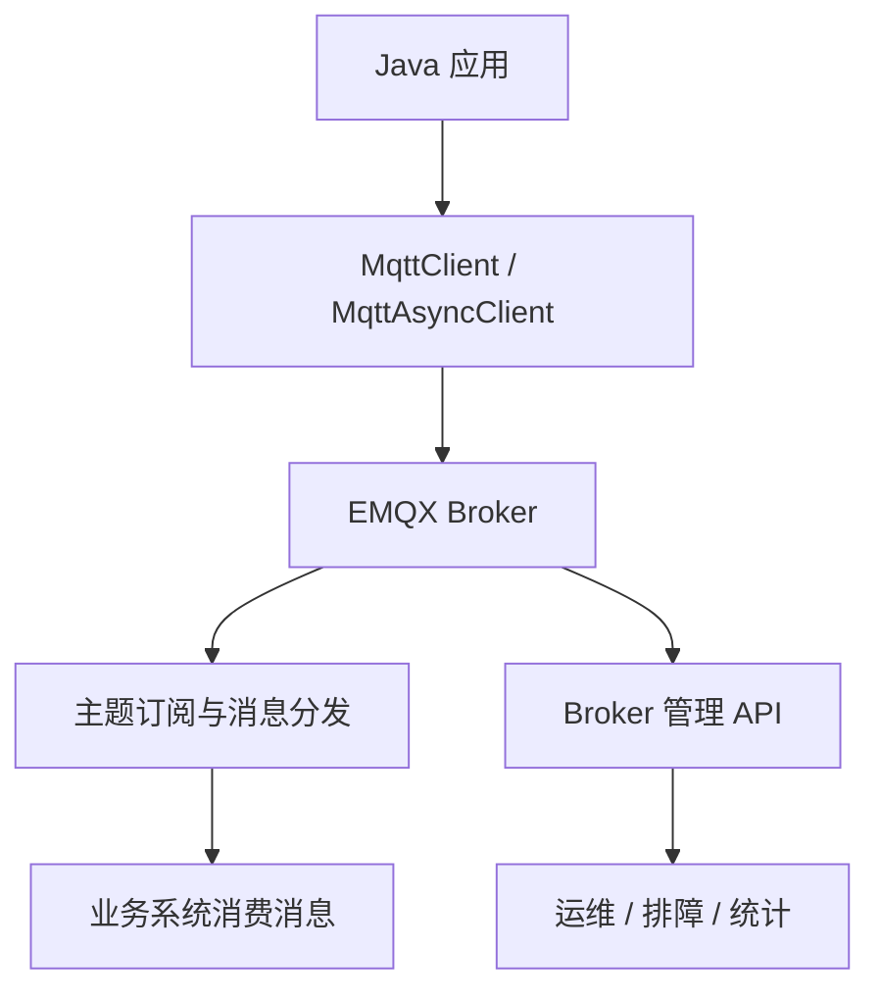
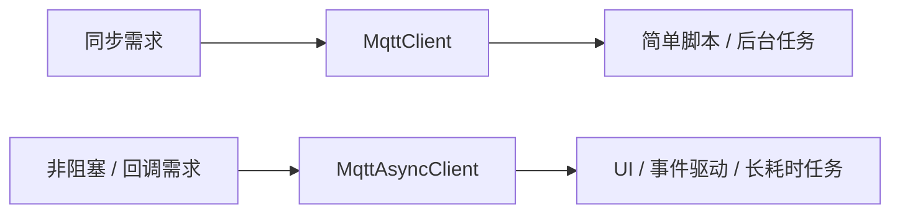
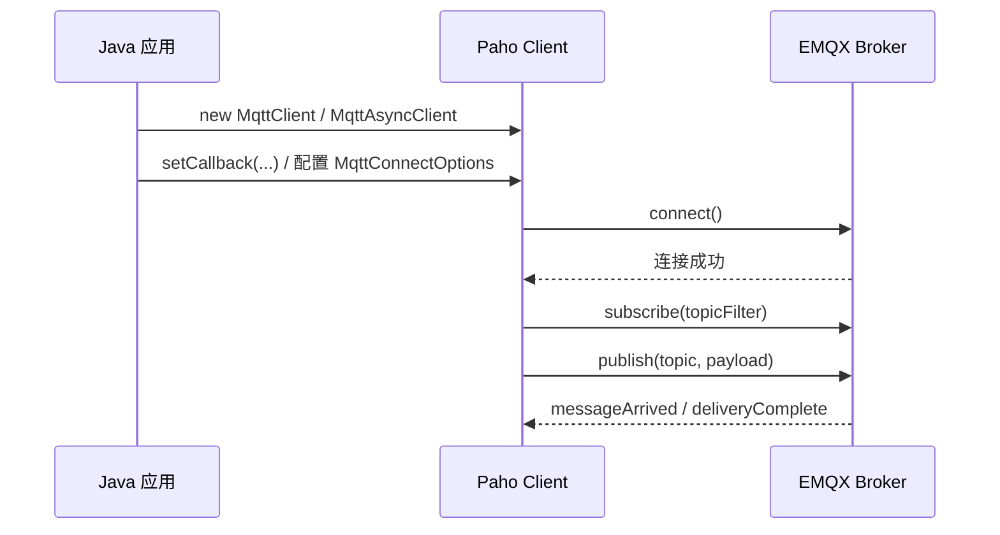
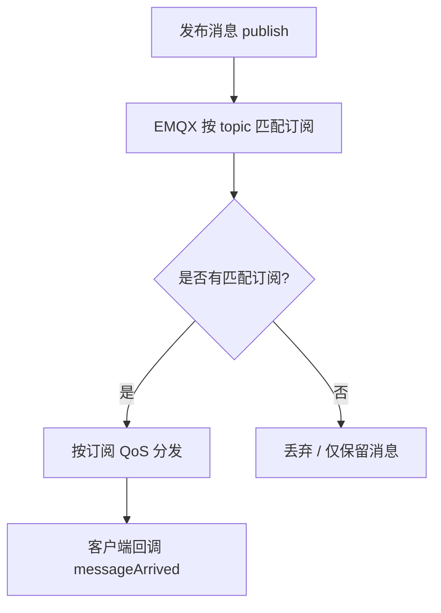
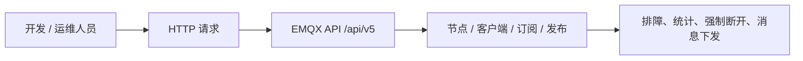

# EMQX + Eclipse Paho Java Client 接口速查 😎😎😎

## 一、用途定位

这篇笔记主要记录 **Java 连接 EMQX 时最常用的 Paho Client 接口、连接参数和 Broker 管理 API**，适合临时查阅和项目开发时快速对照。

常见场景：

- Java 应用作为 MQTT 客户端连接 EMQX Broker
- 需要区分同步 / 异步客户端
- 需要快速查 EMQX 5.x 管理 API



------

## 二、Maven 依赖

```xml
<dependency>
  <groupId>org.eclipse.paho</groupId>
  <artifactId>org.eclipse.paho.client.mqttv3</artifactId>
  <version>1.2.5</version>
</dependency>
```

> 说明：Paho 不是 Spring Boot starter，通常需要自己封装配置类或属性映射。

------

## 三、Spring Boot 配置示例

### 3.1 本地 Broker

```yaml
mqtt:
  broker-url: tcp://127.0.0.1:1883
  client-id: demo-java-001
  username: emqx_test
  password: emqx_test_password
  clean-session: true
  automatic-reconnect: true
  connection-timeout: 10
  keep-alive-interval: 30
  qos: 1
  publish-topic: testtopic/1
  subscribe-topic: testtopic/#
  retain: false
```

### 3.2 TLS Broker

```yaml
mqtt:
  broker-url: ssl://your-cluster.emqxsl.com:8883
  client-id: demo-java-001
  username: your_username
  password: your_password
  clean-session: true
  automatic-reconnect: true
  connection-timeout: 10
  keep-alive-interval: 30
  qos: 1
  publish-topic: testtopic/1
  subscribe-topic: testtopic/#
  retain: false
```

### 3.3 证书校验扩展

```yaml
mqtt:
  broker-url: ssl://your-cluster.emqxsl.com:8883
  client-id: demo-java-001
  username: your_username
  password: your_password
  clean-session: true
  automatic-reconnect: true
  connection-timeout: 10
  keep-alive-interval: 30
  qos: 1
  publish-topic: testtopic/1
  subscribe-topic: testtopic/#
  retain: false
  ssl:
    trust-store: classpath:certs/truststore.jks
    trust-store-password: changeit
```

------

## 四、客户端类型

| 类型 | 说明 | 适合场景 |
|------|------|----------|
| `MqttClient` | 同步 / 阻塞式 API | 简单服务、脚本、后台任务 |
| `MqttAsyncClient` | 异步 / 非阻塞式 API | UI、事件驱动、需要继续处理其他任务 |

### 4.1 常用回调

| 回调 | 作用 |
|------|------|
| `MqttCallback` | 处理 `connectionLost`、`messageArrived`、`deliveryComplete` |
| `MqttCallbackExtended` | 在 `MqttCallback` 基础上增加 `connectComplete(reconnect, serverURI)` |

> 如果你关心自动重连后的状态，优先用 `MqttCallbackExtended`。



------

## 五、核心连接参数

### 5.1 `MqttConnectOptions`

| 方法 | 作用 |
|------|------|
| `setUserName(String userName)` | 设置用户名 |
| `setPassword(char[] password)` | 设置密码 |
| `setCleanSession(boolean cleanSession)` | 是否清理会话 |
| `setAutomaticReconnect(boolean automaticReconnect)` | 是否自动重连 |
| `setConnectionTimeout(int seconds)` | 连接超时 |
| `setKeepAliveInterval(int seconds)` | 心跳间隔 |
| `setMqttVersion(int version)` | 指定 MQTT 协议版本 |
| `setServerURIs(String[] serverURIs)` | 多 Broker 地址 |
| `setWill(String topic, byte[] payload, int qos, boolean retained)` | 遗嘱消息 |
| `setSocketFactory(SocketFactory factory)` | 自定义 Socket 工厂 |
| `setSSLProperties(Properties props)` | SSL 相关属性 |

### 5.2 配置判断

- `clientId` 必须唯一，同名客户端重复连接时，旧连接通常会被踢掉
- `cleanSession = true`：轻量，会话不保留
- `cleanSession = false`：适合需要持久会话和可靠投递的场景
- `setAutomaticReconnect(true)`：断线后自动尝试重连
- 连接建立后，通常先注册回调，再执行订阅



------

## 六、消息对象与收发 API

### 6.1 `MqttMessage`

| 方法 | 作用 |
|------|------|
| `new MqttMessage(byte[] payload)` | 创建消息 |
| `setQos(int qos)` | 设置 QoS |
| `setRetained(boolean retained)` | 设置是否保留 |
| `setPayload(byte[] payload)` | 设置消息体 |
| `getPayload()` | 读取消息体 |
| `getQos()` | 读取 QoS |
| `isRetained()` | 读取是否保留 |

默认值要点：

- 无参构造时默认 QoS = 1
- 默认不 retain

### 6.2 发布

常用方式：

- `publish(String topic, MqttMessage message)`
- `publish(String topic, byte[] payload, int qos, boolean retained)`

要点：

- QoS 只能是 `0 / 1 / 2`
- `retained = true` 时，broker 会保留该 topic 的最后一条消息

### 6.3 订阅

常用方式：

- `subscribe(String topicFilter, int qos)`
- `subscribe(String[] topicFilters, int[] qos)`

要点：

- topic filter 支持通配符
- 订阅 QoS 是上限，不是强制值



### 6.4 取消订阅

常用方式：

- `unsubscribe(String topicFilter)`
- `unsubscribe(String[] topicFilters)`

------

## 七、最小可用同步示例

```java
import java.nio.charset.StandardCharsets;
import org.eclipse.paho.client.mqttv3.IMqttDeliveryToken;
import org.eclipse.paho.client.mqttv3.MqttCallbackExtended;
import org.eclipse.paho.client.mqttv3.MqttClient;
import org.eclipse.paho.client.mqttv3.MqttConnectOptions;
import org.eclipse.paho.client.mqttv3.MqttMessage;
import org.eclipse.paho.client.mqttv3.persist.MemoryPersistence;

public class Demo {
    public static void main(String[] args) throws Exception {
        String broker = "tcp://broker.emqx.io:1883";
        String clientId = "demo-java-001";
        String topic = "testtopic/1";

        MqttClient client = new MqttClient(broker, clientId, new MemoryPersistence());

        MqttConnectOptions options = new MqttConnectOptions();
        options.setCleanSession(true);
        options.setAutomaticReconnect(true);

        client.setCallback(new MqttCallbackExtended() {
            @Override
            public void connectComplete(boolean reconnect, String serverURI) {
                System.out.println("connectComplete reconnect=" + reconnect + ", uri=" + serverURI);
            }

            @Override
            public void connectionLost(Throwable cause) {
                System.out.println("connectionLost: " + cause.getMessage());
            }

            @Override
            public void messageArrived(String topic, org.eclipse.paho.client.mqttv3.MqttMessage message) {
                System.out.println("topic=" + topic + ", payload=" + new String(message.getPayload(), StandardCharsets.UTF_8));
            }

            @Override
            public void deliveryComplete(IMqttDeliveryToken token) {
                System.out.println("deliveryComplete");
            }
        });

        client.connect(options);
        client.subscribe("testtopic/#", 1);

        MqttMessage msg = new MqttMessage("Hello EMQX".getBytes(StandardCharsets.UTF_8));
        msg.setQos(1);
        client.publish(topic, msg);

        client.disconnect();
        client.close();
    }
}
```

------

## 八、EMQX Broker 管理 API

EMQX 5.x 管理面常用前缀是 `/api/v5`，一般通过 API Key 的 Basic Auth 调用。



### 8.1 常用接口速查

| 接口 | 作用 |
|------|------|
| `GET /nodes` | 查看节点信息、连接统计 |
| `GET /clients` | 分页查看客户端列表 |
| `GET /clients/{clientid}` | 查看单个客户端详情 |
| `DELETE /clients/{clientid}` | 踢掉某个客户端并清理会话 |
| `GET /clients/{clientid}/subscriptions` | 查看客户端订阅 |
| `POST /clients/{clientid}/subscribe` | 为客户端新增订阅 |
| `POST /clients/{clientid}/unsubscribe` | 为客户端取消订阅 |
| `GET /subscriptions` | 查看全局订阅列表 |
| `POST /publish` | Broker 侧发布消息 |
| `POST /publish/bulk` | Broker 侧批量发布消息 |

### 8.2 常用查询参数

| 参数 | 作用 |
|------|------|
| `_page` | 页码 |
| `_limit` | 每页条数 |
| `clientid` | 按客户端 ID 过滤 |
| `username` | 按用户名过滤 |
| `ip_address` | 按 IP 过滤 |
| `conn_state` | 按连接状态过滤 |
| `proto_ver` | 按协议版本过滤 |

### 8.3 典型调用示例

#### 查看节点信息

```bash
curl -u <api_key>:<api_secret> \
  -X GET http://localhost:18083/api/v5/nodes \
  -H "Content-Type: application/json"
```

#### 查看客户端列表

```bash
curl -u <api_key>:<api_secret> \
  -X GET "http://localhost:18083/api/v5/clients?_page=1&_limit=20" \
  -H "Content-Type: application/json"
```

#### 踢掉某个客户端

```bash
curl -u <api_key>:<api_secret> \
  -X DELETE http://localhost:18083/api/v5/clients/client_1 \
  -H "Content-Type: application/json"
```

#### Broker 直接发消息

```bash
curl -u <api_key>:<api_secret> \
  -X POST http://localhost:18083/api/v5/publish \
  -H "Content-Type: application/json" \
  -d '{"topic":"testtopic/1","qos":1,"payload":"Hello EMQX"}'
```

------

## 九、开发时最常用的判断

- 想要最简单的代码路径，用 `MqttClient`
- 想要非阻塞和回调，用 `MqttAsyncClient`
- 想要断线自动恢复，用 `setAutomaticReconnect(true)`
- 想要保留会话和 QoS 可靠投递，用 `setCleanSession(false)` + 持久化存储
- 想知道 broker 当前连了多少，查 `GET /nodes`
- 想知道有哪些在线 client，查 `GET /clients`
- 想排查单 client 状态，查 `GET /clients/{clientid}`
- 想查看 broker 上所有订阅，查 `GET /subscriptions`

------

## 十、官方资料

- [EMQX Java 连接文档](https://docs.emqx.com/zh/emqx/latest/connect-emqx/java.html)
- [EMQX Cloud Java 连接文档](https://docs.emqx.com/en/cloud/latest/api/dedicated.html)
- [Eclipse Paho Java Client](https://eclipse.dev/paho/clients/java/)
- [Paho Java Javadoc](https://eclipse.dev/paho/files/javadoc/)
- [EMQX System Topic - connections/count](https://docs.emqx.com/en/emqx/latest/observability/mqtt-system-topics.html)

---

## 🔗 相关笔记

- [[../WebSocket/WebSocket vs HTTP/什么是WebSocket]] —— WebSocket 协议、握手和帧结构
- [[../SSE/SSE vs WebSocket vs HTTP]] —— 三种通信方式的选型对比