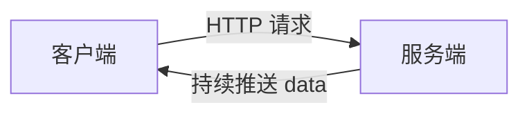
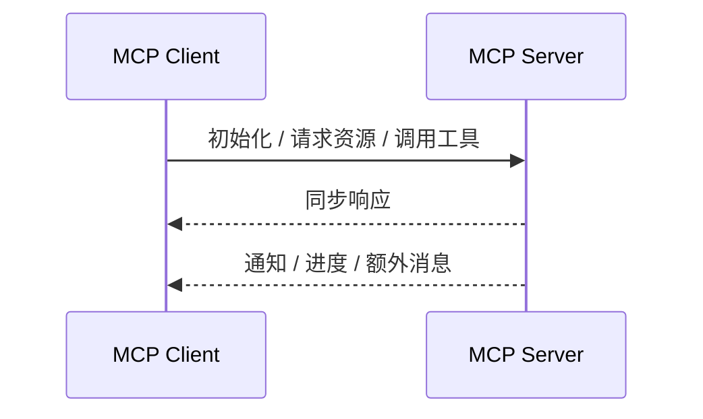
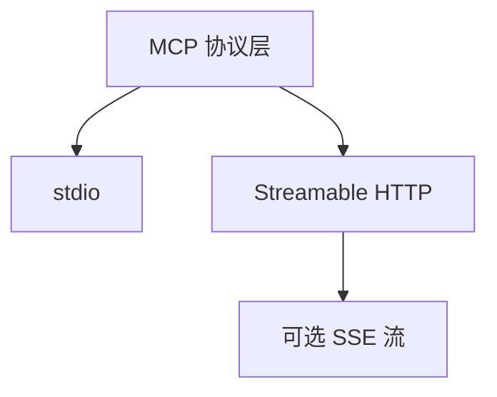
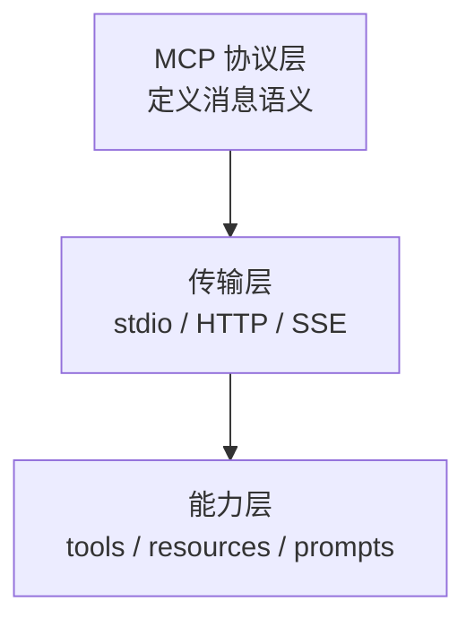

# MCP 里的 SSE：为什么它重要 😎😎😎

## 一、先把结论说清楚

如果你看到有人说“**SSE 是 MCP 的核心**”，这个说法**只对一部分历史资料成立**。

- **MCP 的协议层**本质上是 JSON-RPC 风格的消息交换
- **SSE 的角色**主要是“服务端把消息持续推给客户端”的一种传输手段
- **旧版 MCP**确实大量依赖 `HTTP + SSE`
- **新版 MCP**更推荐 `Streamable HTTP`，SSE 变成了可选的流式能力，甚至在旧的 `HTTP+SSE` 方案里已经被标记为过时

所以更准确的说法是：

> MCP 不是“建立在 SSE 上的协议”，而是“可以用 SSE 作为传输能力之一的协议”。

---

## 二、SSE 到底是什么

SSE（Server-Sent Events）是一种基于 HTTP 的**单向流式推送**技术。

它的特点很简单：

- 客户端先发起一个 HTTP 请求
- 服务端保持连接不断开
- 服务端可以不断往这个连接里写消息
- 客户端只能接收，不能通过这条 SSE 连接反向发消息

### 一个最小脑图



### SSE 适合什么

- 实时通知
- 构建日志
- 监控数据
- 任务进度
- 任何“服务端主动通知客户端”的场景

### SSE 不适合什么

- 聊天这种双方都要频繁发消息的场景
- 高频双向交互
- 需要二进制帧的场景

---

## 三、MCP 里为什么会用到 SSE

MCP 里的一个核心需求是：

- 客户端要发请求给服务端
- 服务端除了同步响应，还可能要**主动发通知**
- 有些通知不是“立刻返回一个结果”就结束，而是需要持续流式传递

这就很像 SSE 的长连接推送能力。

### MCP 的典型通信模型



在这个模型里，SSE 的价值主要是：

- 让服务端能持续推送消息
- 让客户端不用反复轮询
- 让“通知、进度、补充结果”可以顺着同一条流传过去

---

## 四、旧版和新版 MCP 的区别

这里最容易混淆。

### 4.1 旧版思路

旧资料经常写成：

- MCP 使用 `HTTP + SSE`
- 客户端通过 HTTP 建立连接
- 服务端通过 SSE 推送消息

这在老版本里是对的，但它不是今天唯一的方向。

### 4.2 新版思路

当前官方文档更强调的是：

- **stdio**
- **Streamable HTTP**
- **SSE 作为可选的流式能力**

也就是说，MCP 的传输层在演进，SSE 不再是唯一答案。



### 4.3 你学习时要抓住的重点

不要只记“`SSE = MCP`”，要记：

1. MCP 需要一种稳定的消息传输方式
2. SSE 解决的是“服务端持续推送”的那一段
3. 新版 MCP 更强调 HTTP 化的传输能力
4. SSE 现在更像一个兼容/流式补充，而不是协议唯一核心

---

## 五、MCP 为什么不直接只用 WebSocket

你学过 WebSocket，这里可以顺手对比一下。

### 5.1 SSE 和 WebSocket 的差异

| 维度 | SSE | WebSocket |
|------|-----|-----------|
| 通信方向 | 单向，服务端 -> 客户端 | 双向 |
| 协议基础 | HTTP | HTTP Upgrade 后切到 WebSocket |
| 浏览器支持 | 原生 EventSource | 原生 WebSocket |
| 实现复杂度 | 低 | 中 |
| 适合场景 | 通知、进度、日志 | 聊天、协作、双向实时交互 |

### 5.2 MCP 更偏向 SSE / HTTP 的原因

MCP 的使用场景和 WebSocket 不完全一样。

MCP 更像是在做：

- 工具调用
- 资源读取
- 服务器通知
- 流式输出

这些场景更看重：

- HTTP 兼容性
- 代理/网关可穿透性
- 简单的认证方式
- 方便和现有 Web 基础设施配合

所以 SSE 在 MCP 里很自然，因为它：

- 走 HTTP
- 能持续推送
- 对浏览器和代理都比较友好

---

## 六、一个更贴近 MCP 的理解模型

你可以把 MCP 想成三层：

### 6.1 协议层

定义“消息长什么样”。

- 请求
- 响应
- 通知
- 取消
- 错误

### 6.2 传输层

定义“消息怎么运送过去”。

- stdio
- Streamable HTTP
- SSE（历史上常见，今天更多是兼容和流式场景）

### 6.3 能力层

定义“这个 MCP Server 能提供什么”。

- tools
- resources
- prompts
- notifications



这个结构能帮你避免一个常见误区：

> 不是“会 SSE 就会 MCP”，而是“会用合适的传输层去承载 MCP 的协议消息”。

---

## 七、SSE 在 MCP 里的实际感受

如果你从开发者视角看 MCP，SSE 最常见的价值是这几个：

- **通知**：服务器主动告诉客户端发生了什么
- **进度**：长任务执行时持续回传状态
- **流式输出**：把结果拆成多段慢慢送回来
- **低门槛**：比 WebSocket 更容易接入现有 HTTP 基础设施

### 一个直观比喻

- HTTP：你问一句，我答一句
- SSE：你问一句，我边想边持续给你发消息
- WebSocket：双方随时都能说话

---

## 八、为什么它对学习 MCP 很关键

因为你学 MCP 时，真正要理解的不是“某个库怎么写”，而是：

1. **为什么 MCP 需要持续消息**
2. **为什么服务端要能主动推送**
3. **为什么 HTTP 能做这件事**
4. **为什么 SSE 以前很常见**
5. **为什么新版又在往 Streamable HTTP 走**

只要这条线打通了，你再看 MCP 的示例代码就不会只是在背 API。

---

## 九、最小代码感知

### 前端接收 SSE

```javascript
const es = new EventSource("/stream");

es.onmessage = (event) => {
    console.log("收到服务端消息:", event.data);
};
```

### 服务端推送思路

```java
SseEmitter emitter = new SseEmitter();
emitter.send(SseEmitter.event().data("hello"));
```

### 放到 MCP 里怎么理解

- 前端的 `EventSource` 类似“接收服务端流消息的通道”
- 服务端的 `SseEmitter` 类似“把消息不断写出去的出口”
- MCP 的协议消息可以借这条通道来传递

---

## 十、一句话总结

> SSE 是一种 HTTP 单向流式推送技术，在 MCP 里主要承担“服务端持续向客户端发消息”的传输角色；但今天的 MCP 不应简单理解成“就是 SSE”，更准确的是：MCP 以 JSON-RPC 为协议语义，传输层可以是 stdio、Streamable HTTP，SSE 是其中重要但已经不再唯一的选择。

---

## 十一、相关笔记

- [[./SSE vs WebSocket vs HTTP]] —— 先把三种通信方式的边界搞清楚
- [[./和HTTP的区别]] —— SSE 和 HTTP 长连接、长轮询的关系
- [[../WebSocket/WebSocket vs HTTP/什么是WebSocket]] —— 如果你想继续对比 WebSocket

## 十二、官方参考

- [MCP Transports](https://modelcontextprotocol.io/specification/draft/basic/transports)
- [MCP Architecture Overview](https://modelcontextprotocol.io/docs/learn/architecture)
- [MCP Key Changes](https://modelcontextprotocol.io/specification/2025-03-26/changelog)
