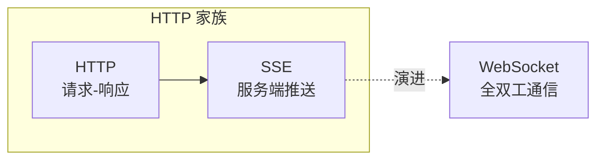
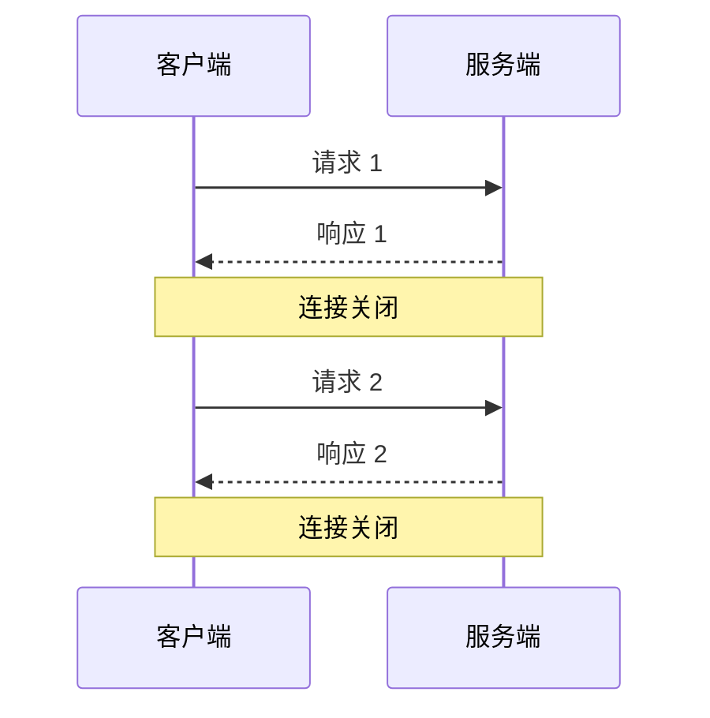
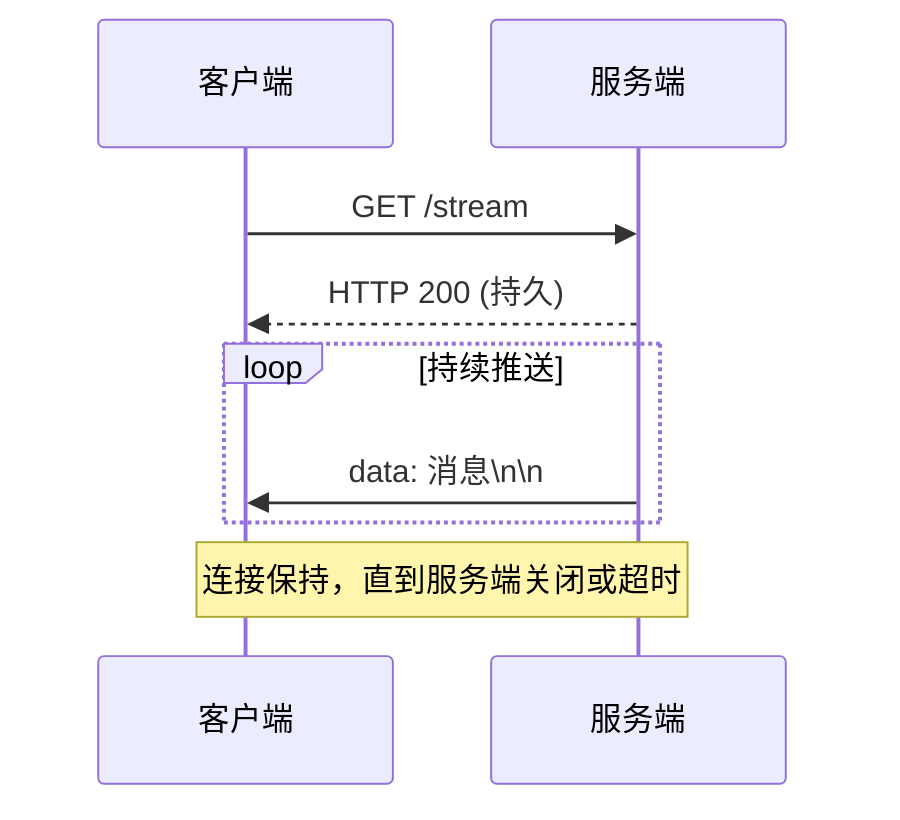
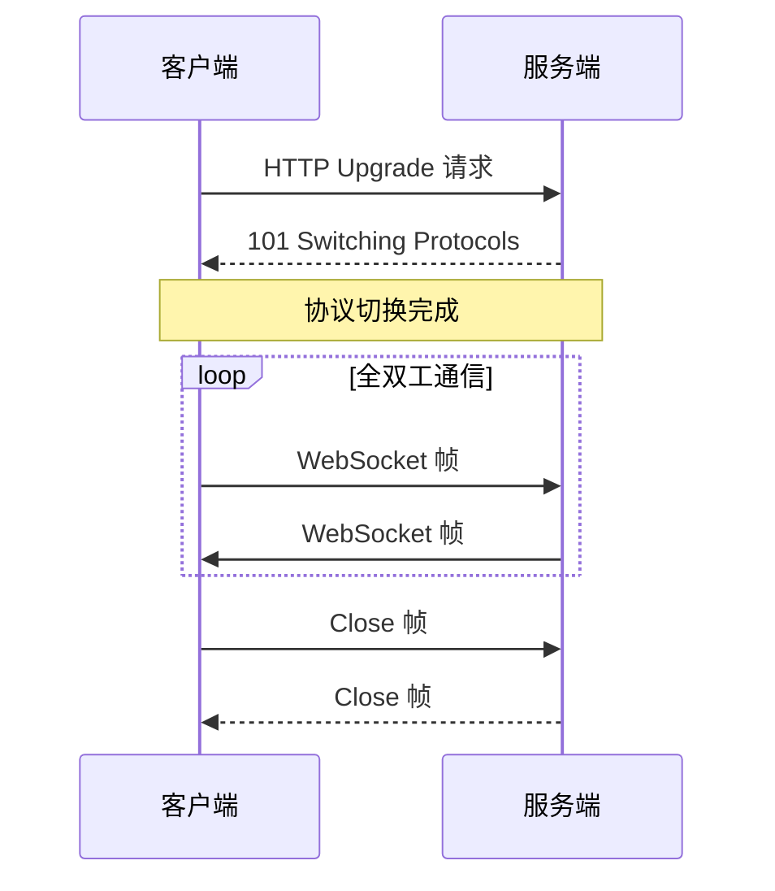
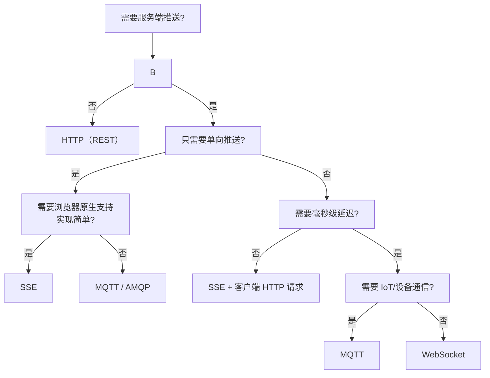
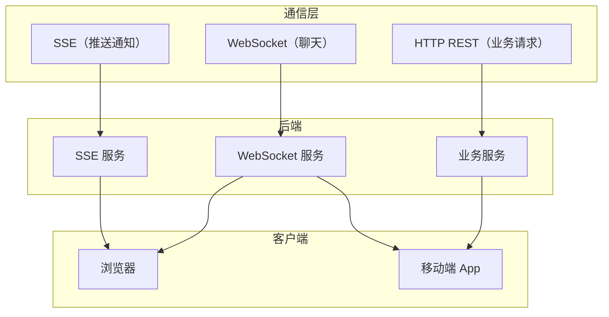

# SSE vs WebSocket vs HTTP 三者对比 😎😎😎

## 一、核心定位

| 技术 | 通信模式 | 协议基础 | 客户端可发送 | 复杂度 |
|------|---------|---------|-------------|-------|
| **HTTP** | 请求-响应 | TCP/HTTP | ✅ | 低 |
| **SSE** | 服务端推送 | HTTP（长连接） | ❌ | 低 |
| **WebSocket** | 全双工双向 | TCP（升级） | ✅ | 中 |

------

## 二、详细对比表

| 维度 | HTTP | SSE | WebSocket |
|------|------|-----|-----------|
| **连接次数** | 每次请求新建 | 一次 HTTP 长连接 | 一次握手，后续复用 |
| **通信方向** | 客户端→服务端 | 服务端→客户端 | 双方等价 |
| **服务器推送** | ❌ | ✅ | ✅ |
| **客户端推送** | ✅ | ❌ | ✅ |
| **自动重连** | ❌ | ✅（浏览器原生） | ❌（需手动实现） |
| **二进制数据** | ✅ | ❌（仅文本） | ✅ |
| **Headers 开销** | 每次请求都有 | 仅首次 | 仅首次握手 |
| **HTTP 端口** | ✅ | ✅ | ⚠️ 需代理配置 |
| **实现难度** | 低 | 低 | 中 |
| **最大并发** | 高（无状态） | 高（需管理连接） | 受限于 fd/内存 |
| **断线检测** | 依赖心跳 | 依赖 HTTP 超时 | 依赖 Ping/Pong |

------

## 三、连接生命周期对比

### HTTP：每次独立

### SSE：持久 HTTP 流

### WebSocket：独立协议通道

------

## 四、性能对比（理论值）

假设每天推送 10000 条消息，每条 100 字节：

| 指标 | HTTP（短轮询 5s间隔） | SSE | WebSocket |
|------|---------------------|-----|-----------|
| **连接数/天** | 17280 | 1 | 1 |
| **数据总量** | ~17MB | ~1MB | ~1MB |
| **RTT 延迟** | 0~5s（轮询间隔） | <100ms | <100ms |
| **服务端 CPU** | 高（频繁建连） | 低 | 低 |

> SSE 和 WebSocket 在消息量大时优势明显；HTTP 轮询在低频低延迟要求时仍可用。

------

## 五、选型决策树

**简化版决策**：
- **单向、低延迟、简单** → SSE
- **双向、低延迟、复杂** → WebSocket
- **IoT/多设备/发布订阅** → MQTT
- **低频查询、无状态** → HTTP

------

## 六、实际场景选型

| 场景 | 推荐 | 原因 |
|------|------|------|
| 实时通知 | SSE | 单向推送足够，浏览器原生支持 |
| 监控大屏 | SSE | 单向、低延迟、兼容性好 |
| 即时通讯 | WebSocket | 需要双向、实时 |
| 在线游戏 | WebSocket / UDP | 毫秒级延迟要求 |
| IoT 传感器 | MQTT | 发布订阅、设备众多 |
| 低频数据查询 | HTTP | 无实时要求，缓存友好 |
| 多人协作编辑 | WebSocket | 双向同步必要 |
| 邮件列表刷新 | SSE | 单向推送足够 |

------

## 七、混合使用示例

实际项目中常**同时使用多种通信方式**：

**分工建议**：
- **HTTP**：普通业务 API（增删改查）
- **SSE**：实时通知、监控数据、进度展示
- **WebSocket**：聊天、实时协作、在线游戏

------

## 八、一句话总结

> **HTTP** 适合一问一答的查询，**SSE** 适合单向实时推送（通知、监控），**WebSocket** 适合双向实时交互（聊天、游戏），**MQTT** 适合 IoT 和发布订阅场景。四者不是互斥的，实际项目常组合使用。

---

## 🔗 相关笔记

- [[../WebSocket/WebSocket vs HTTP/什么是WebSocket]] —— WebSocket 协议深入（帧结构、握手、心跳）
- [[../../../计算机网络/计算机网络知识总结]] —— HTTP / TCP / WebSocket 底层协议详解
- [[../../SpringBoot/SPEL表达式]] —— SSE 推送中可能用到的 SpEL 表达式
- [[./MCP 里的 SSE]] —— MCP 里 SSE 的角色、旧版 HTTP+SSE 和新版 Streamable HTTP
