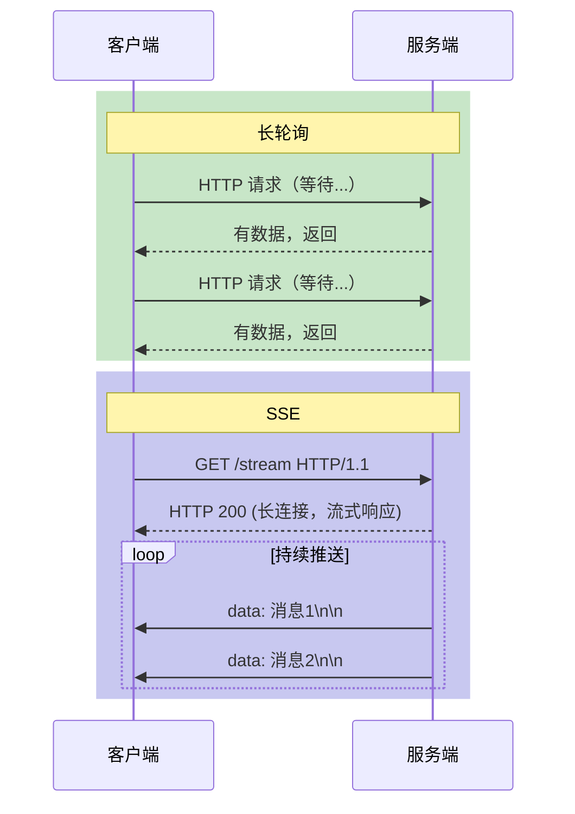
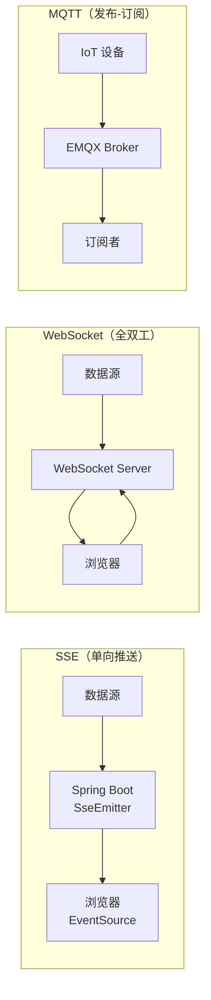

# SSE 和 HTTP 的区别 😎😎😎

## 一、概念定义

SSE（Server-Sent Events）是一种基于 HTTP 的**服务端推送**技术，服务器通过 HTTP 流（长连接）主动向客户端发送消息。客户端只接收，不能主动发送（单向通信）。

- **标准**：W3C Candidate Recommendation，2015 年纳入 HTML5 规范
- **本质**：HTTP 长连接（Content-Type: `text/event-stream`）
- **特点**：轻量、简单、自动重连（浏览器原生支持）

------

## 二、与 HTTP 轮询/长轮询的本质区别

| 方案 | 连接次数 | 服务器主动 | 数据延迟 | 开销 |
|------|---------|-----------|---------|------|
| **短轮询** | 每次请求新建 | ❌ | 高（取决于轮询间隔） | 高（频繁建连） |
| **长轮询** | 每次请求新建 | ❌（等有数据才返回） | 中等 | 中等 |
| **SSE** | 一次连接，HTTP 流 | ✅ | 低（实时推送） | 低（单一连接） |

**SSE vs 长轮询**的核心区别：
- 长轮询：服务端**等有数据才响应**，响应后连接断开，客户端立刻再建立下一个请求
- SSE：服务端**建立连接后持续推送**，连接保持不断



------

## 三、SSE 消息格式

SSE 消息是纯文本，每条消息以 `data:` 开头，以两个换行符 `\n\n` 结尾：

```
data: 第一条消息内容

data: 第二条消息内容
data: 这是第二条消息的第二行

event: custom\n
data: 自定义事件类型的消息\n\n
```

### 字段说明

| 字段 | 说明 |
|------|------|
| `data:` | 数据行，可多行 |
| `event:` | 事件类型（客户端可按类型监听） |
| `id:` | 事件 ID（用于断线重连时的 `Last-Event-ID`） |
| `retry:` | 断线后自动重连间隔（毫秒） |

### 示例

服务端推送 JSON 数据：
```
data: {"temperature": 25.5, "humidity": 60}\n\n
```

多行数据：
```
data: {"name": "Alice"}
data: {"msg": "hello"}\n\n
```

------

## 四、SSE 与 WebSocket 对比

| 维度 | SSE | WebSocket |
|------|-----|-----------|
| **通信模式** | 单向（服务端→客户端） | 全双工（双方可互发） |
| **协议基础** | HTTP | TCP（通过 HTTP Upgrade） |
| **连接类型** | 持久 HTTP 流 | 独立 WebSocket 连接 |
| **自动重连** | ✅ 浏览器原生支持 | ❌ 需手动实现 |
| **Headers 开销** | 每次建立连接一次 | 仅首次握手一次 |
| **二进制数据** | ❌ 仅文本 | ✅ 支持二进制帧 |
| **多复用（多路复用）** | ❌ 单一数据流 | ✅ 可多路复用 |
| **Proxy/防火墙兼容** | ✅（走 HTTP 端口） | ⚠️ 需 WebSocket 支持 |
| **实现复杂度** | 低（几行代码） | 中（需要握手和会话管理） |
| **浏览器支持** | 现代浏览器均支持 | 全面支持 |
| **适用场景** | 通知、监控推送、实时列表 | 聊天、游戏、双向交互 |

### 一句话选型

> **只需要服务端推送** → SSE（简单、低开销）
> **需要双向通信** → WebSocket

------

## 五、快速入门

### 5.1 Spring Boot 实现 SSE

```java
@GetMapping(value = "/stream", produces = MediaType.TEXT_EVENT_STREAM_VALUE)
public SseEmitter stream() {
    SseEmitter emitter = new SseEmitter();

    // 模拟每 3 秒推送一次数据
    new Thread(() -> {
        for (int i = 0; i < 10; i++) {
            try {
                String data = "{\"count\": " + i + ", \"time\": " + System.currentTimeMillis() + "}";
                emitter.send(SseEmitter.event()
                    .name("message")
                    .data(data));
                Thread.sleep(3000);
            } catch (IOException e) {
                emitter.completeWithError(e);
                return;
            }
        }
        emitter.complete();
    }).start();

    // 设置超时时间（0 表示不超时）
    emitter.onCompletion(() -> System.out.println("连接完成"));
    emitter.onTimeout(() -> System.out.println("连接超时"));
    emitter.onError(e -> System.out.println("连接错误: " + e));

    return emitter;
}
```

### 5.2 前端接收 SSE

```javascript
const eventSource = new EventSource("http://localhost:8080/stream");

// 监听默认消息（无 event 字段）
eventSource.onmessage = function(event) {
    console.log("收到消息:", event.data);
};

// 监听指定类型的消息
eventSource.addEventListener("message", function(event) {
    console.log("收到 message 事件:", event.data);
});

// 手动关闭
// eventSource.close();
```

### 5.3 带错误处理和重连的封装

```javascript
class SSEClient {
    constructor(url) {
        this.url = url;
        this.eventSource = null;
    }

    connect() {
        this.eventSource = new EventSource(this.url);

        this.eventSource.onopen = () => {
            console.log("SSE 连接已建立");
        };

        this.eventSource.onmessage = (event) => {
            console.log("收到消息:", event.data);
        };

        this.eventSource.addEventListener("customEvent", (event) => {
            console.log("收到自定义事件:", event.data);
        });

        this.eventSource.onerror = (error) => {
            console.error("SSE 错误:", error);
            // EventSource 会自动重连，这里可以做额外处理
            if (eventSource.readyState === EventSource.CLOSED) {
                console.log("连接已关闭，尝试重连...");
                setTimeout(() => this.connect(), 5000);
            }
        };
    }

    close() {
        if (this.eventSource) {
            this.eventSource.close();
        }
    }
}
```

------

## 六、断线重连机制

SSE 的 `Last-Event-ID` 机制让服务端知道客户端上次接收到了哪条消息：

### 6.1 服务端实现

```java
@GetMapping(value = "/stream", produces = MediaType.TEXT_EVENT_STREAM_VALUE)
public SseEmitter stream(
        @RequestParam(value = "lastEventId", required = false) String lastEventId) {

    SseEmitter emitter = new SseEmitter();

    // 如果有 lastEventId，从该 ID 之后的消息开始发送（补发离线消息）
    if (lastEventId != null) {
        List<Message> missedMessages = messageService.getMessagesAfter(lastEventId);
        for (Message msg : missedMessages) {
            try {
                emitter.send(SseEmitter.event()
                    .id(msg.getId())
                    .data(msg.getContent()));
            } catch (IOException e) {
                // 发送失败，停止补发
                break;
            }
        }
    }

    // ... 继续监听新消息并推送
    return emitter;
}
```

### 6.2 前端自动带 Last-Event-ID

浏览器在重连时，**自动**会在请求头中带上 `Last-Event-ID`：

```http
GET /stream HTTP/1.1
Host: localhost:8080
Accept: text/event-stream
Last-Event-ID: 42
```

------

## 七、实际应用场景

### 7.1 适合 SSE 的场景

- **实时通知**：新消息提示、系统通知
- **监控大屏**：设备状态、服务器指标、股票行情
- **邮件/消息列表**：实时刷新列表（无需双向通信）
- **构建进度**：CI/CD 流水线实时日志

### 7.2 不适合 SSE 的场景

- **聊天/即时通讯**：需要客户端主动发送消息
- **在线游戏**：需要毫秒级双向同步
- **多人协作编辑**：需要双向操作同步

### 7.3 典型架构对比



------

## 八、与 Nginx 的配合

Nginx 默认支持 SSE，但需要注意配置：

```nginx
location /stream {
    proxy_pass http://backend;
    proxy_http_version 1.1;
    proxy_set_header Connection '';
    proxy_set_header Accept 'text/event-stream';
    proxy_cache off;
    proxy_buffering off;  # 关闭缓冲，保证实时推送
}
```

**关键配置**：
- `proxy_http_version 1.1`：必须
- `proxy_set_header Connection ''`：清除 Connection 头
- `proxy_cache off`：关闭缓存，否则消息会被缓冲
- `proxy_buffering off`：关闭缓冲，保证实时

------

## 九、一句话总结

> SSE 是一种基于 HTTP 的**单向服务端推送**技术，浏览器原生支持自动重连，实现简单、开销低，适合通知、监控等只需服务端推送的场景；如需双向通信，应选择 WebSocket。
