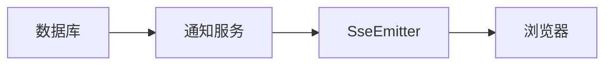
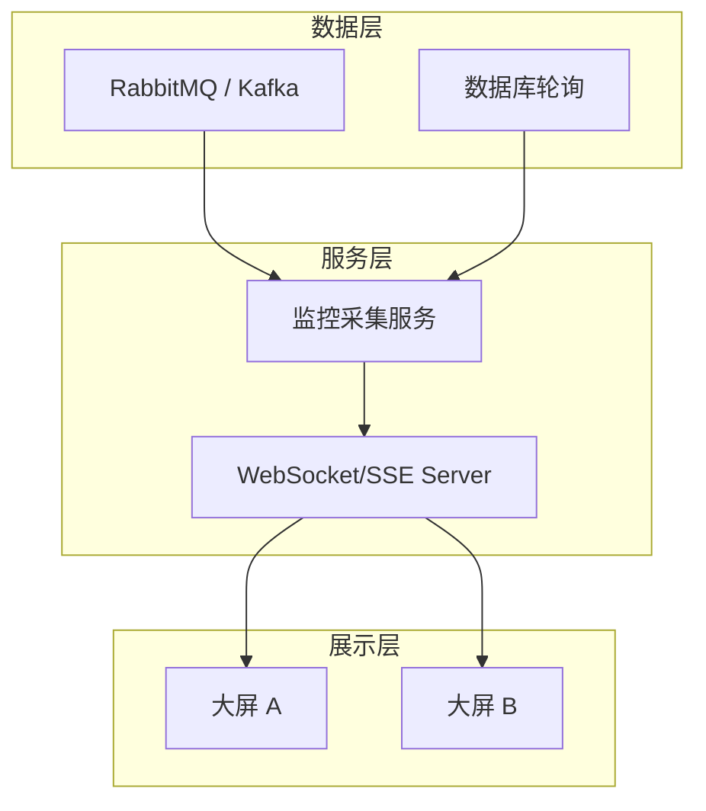
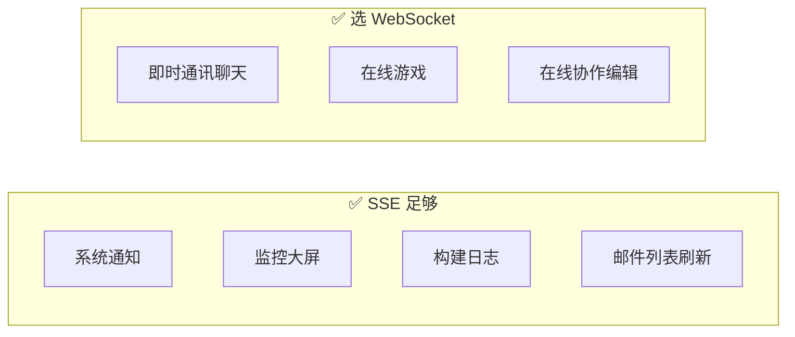

# SSE 实际应用场景 😎😎😎

## 一、核心场景分类

SSE（Server-Sent Events）最适合**只需要服务端推送**的场景，以下是典型用例：

| 场景 | 特点 | 为什么选 SSE |
|------|------|-------------|
| 实时通知 | 服务端主动推，用户只读 | 单向、低延迟、自动重连 |
| 监控大屏 | 数据量大、频率高 | HTTP 端口，兼容性好 |
| 构建日志 | 长时间运行、持续输出 | 流式推送，简单实现 |
| 邮件/消息列表 | 新消息实时刷新 | 单向推送足够 |

------

## 二、实时通知系统

### 场景描述

用户登录后，实时显示系统通知（告警、提醒、系统公告），用户无需刷新页面。

### 架构



### 核心代码

**SSE 连接管理（保存 emitter 以便后续推送）**：

```java
@Service
public class NotificationService {

    // userId -> emitter
    private final Map<String, SseEmitter> emitters = new ConcurrentHashMap<>();

    // 建立连接
    public SseEmitter subscribe(String userId) {
        SseEmitter emitter = new SseEmitter(0L);  // 0 = 不超时
        emitters.put(userId, emitter);

        emitter.onCompletion(() -> emitters.remove(userId));
        emitter.onTimeout(() -> emitters.remove(userId));
        emitter.onError(e -> emitters.remove(userId));

        return emitter;
    }

    // 推送通知
    public void sendNotification(String userId, String message) {
        SseEmitter emitter = emitters.get(userId);
        if (emitter != null) {
            try {
                emitter.send(SseEmitter.event()
                    .name("notification")
                    .data(message));
            } catch (IOException e) {
                emitters.remove(userId);
            }
        }
    }

    // 广播通知
    public void broadcast(String message) {
        emitters.forEach((userId, emitter) -> {
            try {
                emitter.send(SseEmitter.event()
                    .name("notification")
                    .data(message));
            } catch (IOException e) {
                emitters.remove(userId);
            }
        });
    }
}
```

**Controller**：

```java
@RestController
public class NotificationController {

    @Autowired
    private NotificationService notificationService;

    @GetMapping(value = "/subscribe/{userId}", produces = MediaType.TEXT_EVENT_STREAM_VALUE)
    public SseEmitter subscribe(@PathVariable String userId) {
        return notificationService.subscribe(userId);
    }

    // 模拟：其他服务调用这个接口发送通知
    @PostMapping("/notify/{userId}")
    public void notify(@PathVariable String userId, @RequestBody String message) {
        notificationService.sendNotification(userId, message);
    }
}
```

**前端**：

```javascript
const userId = getCurrentUserId();
const eventSource = new EventSource(`/subscribe/${userId}`);

eventSource.addEventListener("notification", (event) => {
    const data = JSON.parse(event.data);
    showToast(data.title, data.content);
});

eventSource.onerror = () => {
    console.error("SSE 连接异常");
};
```

------

## 三、监控大屏

### 场景描述

运维人员查看服务器/IoT 设备实时监控数据（大屏），数据每 N 秒刷新一次。

### 架构



### 核心代码

**RabbitMQ 监听 + SSE 推送**：

```java
@Service
public class MetricsSseService {

    private final Map<String, SseEmitter> screenEmitters = new ConcurrentHashMap<>();

    public SseEmitter subscribe(String screenId) {
        SseEmitter emitter = new SseEmitter();
        screenEmitters.put(screenId, emitter);
        return emitter;
    }

    @RabbitListener(queues = "metrics.queue")
    public void handleMetrics(MetricsMessage message) {
        String data = JSON.toJSONString(message);
        screenEmitters.forEach((screenId, emitter) -> {
            try {
                emitter.send(SseEmitter.event()
                    .name("metrics")
                    .data(data));
            } catch (IOException e) {
                screenEmitters.remove(screenId);
            }
        });
    }
}
```

**前端（Vue 示例）**：

```javascript
const eventSource = new EventSource(`/metrics/subscribe/${screenId}`);

eventSource.addEventListener("metrics", (event) => {
    const data = JSON.parse(event.data);
    updateDashboard({
        cpu: data.cpu,
        memory: data.memory,
        disk: data.disk
    });
});
```

------

## 四、构建/任务进度

### 场景描述

用户触发一个长时间任务（如代码构建、数据导出），前端实时显示任务进度。

### 核心代码

**后端模拟构建进度**：

```java
@GetMapping(value = "/build/logs/{taskId}", produces = MediaType.TEXT_EVENT_STREAM_VALUE)
public SseEmitter streamBuildLogs(@PathVariable String taskId) {
    SseEmitter emitter = new SseEmitter();

    new Thread(() -> {
        try {
            for (int i = 0; i <= 100; i += 10) {
                String log = "[Step " + (i / 10 + 1) + "] 完成 " + i + "%";
                emitter.send(SseEmitter.event()
                    .id(String.valueOf(i))
                    .name("progress")
                    .data(log));
                Thread.sleep(1000);
            }
            emitter.send(SseEmitter.event()
                .name("complete")
                .data("构建完成"));
            emitter.complete();
        } catch (IOException e) {
            emitter.completeWithError(e);
        }
    }).start();

    return emitter;
}
```

**前端**：

```javascript
const taskId = getTaskId();
const eventSource = new EventSource(`/build/logs/${taskId}`);

let lastEventId = null;

eventSource.addEventListener("progress", (event) => {
    lastEventId = event.lastEventId;
    updateProgressBar(event.data);
});

eventSource.addEventListener("complete", (event) => {
    showComplete(event.data);
    eventSource.close();
});

// 断线重连时带上 Last-Event-ID
eventSource.onerror = () => {
    if (eventSource.readyState === EventSource.CLOSED) {
        reconnectWithLastEventId(taskId, lastEventId);
    }
};
```

**带 Last-Event-ID 重连**（断点续传日志）：

```javascript
function reconnectWithLastEventId(taskId, lastEventId) {
    const url = lastEventId
        ? `/build/logs/${taskId}?lastEventId=${lastEventId}`
        : `/build/logs/${taskId}`;
    const eventSource = new EventSource(url);
    // ... 重新绑定事件
}
```

------

## 五、与 WebSocket 的场景对比



### 决策树

```
是否需要客户端主动发消息？
    ├── 否 → SSE（简单、低开销）
    └── 是 → 是否需要毫秒级延迟？
                ├── 否 → 可以考虑 HTTP 轮询 + SSE
                └── 是 → WebSocket
```

------

## 六、生产环境注意事项

### 1. 超时与心跳

SSE 是 HTTP 长连接，很多代理/网关有超时限制。建议：
- 定期发送注释行（`:\n\n`）保持连接活跃
- 设置合理的 `retry` 间隔

```java
emitter.send(SseEmitter.event()
    .comment("heartbeat")
    .data(""));
```

### 2. 多节点部署

SSE 也是长连接，多节点部署时需要类似 WebSocket 的处理：
- **Redis Pub/Sub**：各节点订阅同一 Channel 转发 SSE 消息
- **集中式 Session**：Emitter 存入 Redis，统一管理

```java
// 广播到所有节点
redisTemplate.convertAndSend("sse:broadcast", message);
```

### 3. 资源清理

务必处理 `onCompletion`、`onTimeout`、`onError`，防止 emitter 泄漏：

```java
emitter.onCompletion(() -> cleanup(userId));
emitter.onTimeout(() -> cleanup(userId));
emitter.onError(e -> cleanup(userId));
```

### 4. 限流与认证

- **限流**：同一用户限制 1 个 SSE 连接，超出则关闭旧连接
- **认证**：通过 URL 参数或请求头传递 Token，握手时验证

```java
@GetMapping(value = "/stream", produces = MediaType.TEXT_EVENT_STREAM_VALUE)
public SseEmitter stream(@RequestHeader("Authorization") String token) {
    if (!authService.validate(token)) {
        throw new UnauthorizedException();
    }
    // ...
}
```

------

## 七、一句话总结

> SSE 适合**单向实时推送**场景（通知、监控、进度），实现简单、浏览器原生支持自动重连；多节点部署时需要 Redis 转发，生产环境记得心跳保活和资源清理。
