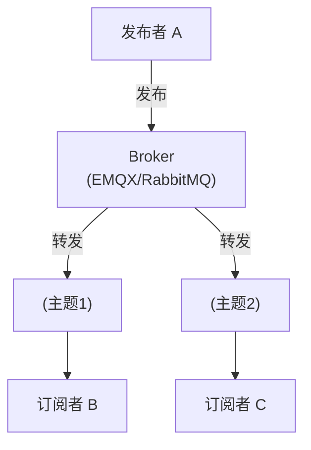
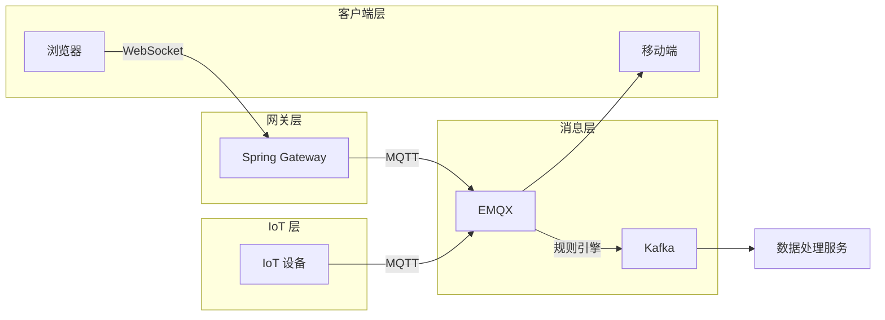

# MQTT 和 HTTP 的区别 😎😎😎

## 一、MQTT 协议简介

MQTT（Message Queuing Telemetry Transport）是一种**轻量级、发布-订阅模式**的物联网通信协议，专门针对低带宽、高延迟、不稳定网络环境设计。

- **设计者**：IBM，1999 年最初用于卫星石油管道监控
- **标准**：OASIS 标准，当前版本 MQTT 5.0（2019）
- **特点**：小体积（最小报文仅 2 字节）、支持 QoS、遗嘱消息、持久会话

------

## 二、核心概念

### 2.1 发布-订阅模型（Pub/Sub）

与 HTTP 的请求-响应模型完全不同：



- **发布者（Publisher）**：发送消息，不需要知道谁会收到
- **订阅者（Subscriber）**：订阅感兴趣的主题（Topic）
- **Broker**：消息代理，负责接收发布者的消息并转发给订阅者
- **Topic（主题）**：消息的"频道"，订阅者按主题过滤消息

**Example**:
- 温度传感器发布到 `sensor/temperature/room1`
- 监控系统订阅 `sensor/temperature/#`（# 匹配任意层级）

### 2.2 MQTT 与 WebSocket 的本质区别

| 维度 | MQTT | WebSocket |
|------|------|-----------|
| **通信模型** | 发布-订阅（多对多） | 点对点（每个连接是独立通道） |
| **Broker** | 必须有中间件（EMQX/RabbitMQ） | 不需要，可直连服务端 |
| **协议层次** | 应用层协议 | 应用层协议（基于 TCP） |
| **设计目标** | 设备到设备/服务端的消息传递 | 浏览器与服务端的双向实时通信 |
| **报文大小** | 最小 2 字节 | 最小 2 字节（帧） |
| **浏览器原生支持** | ❌ 无（需要 MQTT.js 库） | ✅ 原生 WebSocket API |

------

## 三、MQTT 协议核心机制

### 3.1 QoS（服务质量）

MQTT 提供了 3 种 QoS 级别：

| QoS 级别 | 名称 | 可靠性 | 说明 |
|----------|------|--------|------|
| QoS 0 | At most once | 最多一次 | 发完即忘，不确认，可能丢消息 |
| QoS 1 | At least once | 至少一次 | 有 ACK + 重发，可能重复 |
| QoS 2 | Exactly once | 恰好一次 | 四次握手，保证不丢不重（开销最大） |

### 3.2 主题通配符

- `/`：层级分隔符
- `#`：多级通配符（只能出现在订阅主题末尾）
  - `sensor/#` 可匹配 `sensor/temperature/room1`
- `+`：单级通配符
  - `sensor/+/temperature` 可匹配 `sensor/room1/temperature` 和 `sensor/room2/temperature`

### 3.3 遗嘱消息（Last Will）

客户端连接时指定遗嘱主题，**如果客户端异常断开**（没有发送 DISCONNECT），Broker 自动发布遗嘱消息。

应用场景：
- 设备"离线"通知
- 异常掉线告警

### 3.4 持久会话（Persistent Session）

客户端连接时设置 `cleanSession=false`，Broker 会在客户端断开时**保留订阅关系和未接收的消息**，客户端重连后自动恢复。

### 3.5 保活机制（Keep Alive）

客户端设置一个保活间隔（如 60 秒），客户端必须在该间隔内至少发一条消息（PINGREQ），否则 Broker 认为客户端已断开。

------

## 四、MQTT 与 HTTP 详细对比

| 维度 | MQTT | HTTP |
|------|------|------|
| **连接类型** | 长连接（TCP） | 短连接（默认）或长连接（Keep-Alive） |
| **通信模式** | 发布-订阅（一对多、多对多） | 请求-响应（一问一答） |
| **报文大小** | 最小 2 字节，头部紧凑 | Header + Body，通常几百字节 |
| **协议开销** | 极低 | 较高 |
| **服务质量** | QoS 0/1/2 可选 | 无（TCP 本身保证可靠传输） |
| **服务器推送** | ✅ 发布即可推送到所有订阅者 | ❌ 需要轮询或 Long Polling |
| **客户端必须在线** | 否（Broker 缓存离线消息） | 否（HTTP 本身无状态） |
| **网络环境** | 专为不稳定、低带宽设计 | 适合稳定网络 |
| **典型端口** | 1883（明文）/8883（TLS） | 80/443 |
| **浏览器支持** | 需要 MQTT.js 库 | 原生支持 |
| **适用场景** | IoT 传感器、移动推送、消息中间件 | REST API、低频查询 |

------

## 五、EMQX 简介

### 什么是 EMQX

EMQX 是**开源的 MQTT Broker**（星标最多的 MQTT Broker 之一），基于 Erlang/OTP 开发，支持百万级并发连接。

官方地址：https://www.emqx.io/

### 核心特性

- **完整 MQTT 协议支持**：MQTT 3.1.1 / 5.0 / MQTT over WebSocket
- **大规模连接**：单节点支持百万级 MQTT 连接
- **集群**：多节点自动集群，数据同步
- **规则引擎**：消息路由、格式转换、桥接到 Kafka/RabbitMQ
- **Dashboard**：Web UI 管理界面
- **认证授权**：用户名密码、ACL、LDAP、JWT

### EMQX vs 其他 Broker

| Broker | MQTT 支持 | 集群能力 | 文档/生态 | 推荐场景 |
|--------|-----------|---------|-----------|---------|
| EMQX | ⭐⭐⭐⭐⭐ | ⭐⭐⭐⭐⭐ | ⭐⭐⭐⭐⭐ | IoT 平台、生产环境 |
| RabbitMQ | ⭐⭐⭐⭐ | ⭐⭐⭐⭐ | ⭐⭐⭐⭐⭐ | 已有 RabbitMQ 团队 |
| Mosquitto | ⭐⭐⭐⭐ | ⭐（单机） | ⭐⭐⭐ | 轻量级、学习/测试 |
| ActiveMQ | ⭐⭐⭐ | ⭐⭐⭐ | ⭐⭐⭐⭐ | 传统 Java 项目 |

### EMQX 常用配置

```bash
# Docker 快速启动
docker run -d --name emqx \
  -p 1883:1883 \
  -p 8083:8083 \
  -p 8883:8883 \
  -p 8084:8084 \
  -p 18083:18083 \
  emqx/emqx:latest
```

- `1883`：MQTT 端口（TCP）
- `8083`：MQTT over WebSocket（浏览器用）
- `8883`：MQTT TLS 加密
- `18083`：Dashboard 管理界面（默认账号 admin/public）

### EMQX Dashboard

访问 `http://localhost:18083`，可以：
- 查看连接数、主题数、消息数
- 管理客户端（踢掉连接）
- 查看实时流量
- 配置规则引擎和认证

------

## 六、MQTT over WebSocket

MQTT 除了直连 TCP，也可以**通过 WebSocket 传输**，让浏览器（或其他仅支持 WebSocket 的环境）也能使用 MQTT。

### 配置 EMQX 支持 WebSocket

默认 EMQX 的 WebSocket 路径：`/mqtt`

```javascript
// MQTT.js 浏览器端示例
const client = mqtt.connect('ws://localhost:8083/mqtt', {
    clientId: 'browser_client_' + Math.random().toString(16).substr(2, 8),
    username: 'test',
    password: 'test'
});

client.on('connect', () => {
    console.log('MQTT over WebSocket 连接成功');
    client.subscribe('sensor/#');
});

client.on('message', (topic, message) => {
    console.log('收到消息:', topic, message.toString());
});

client.publish('sensor/temperature/room1', JSON.stringify({
    value: 25.5,
    timestamp: Date.now()
}));
```

### 何时用 MQTT over WebSocket

- 浏览器环境需要使用 MQTT 协议
- 需要利用 MQTT 的 QoS 和遗嘱消息机制
- 已有 MQTT 基础设施，想让 Web 前端也接入同一套系统

### MQTT over WebSocket vs 原生 WebSocket

| 维度 | MQTT over WebSocket | 原生 WebSocket |
|------|-------------------|---------------|
| **协议** | MQTT（发布-订阅） | 自定义或 STOMP |
| **生态** | 可接入任何 MQTT Broker | 需要自己实现服务端逻辑 |
| **QoS 支持** | ✅ 完整支持 | ❌ 应用层自己实现 |
| **遗嘱消息** | ✅ 支持 | ❌ 不支持 |
| **包大小** | 更小（MQTT 报文紧凑） | 相对较大（文本帧） |
| **复杂度** | 需 MQTT Broker | 直连服务端即可 |

------

## 七、实际选型建议

### 选 MQTT 的场景

- IoT 设备通信（传感器、智能家居、车联网）
- 需要消息持久化和离线消息
- 需要 QoS 质量保证
- 多设备、多系统之间的消息路由

### 选 HTTP 的场景

- 简单的设备数据上报（一个请求带一批数据）
- 设备可以发送 HTTPS 请求即可，不需要长连接
- 已有 REST API，不需要发布-订阅模型

### 选 WebSocket 的场景

- 浏览器端的实时双向通信
- 低延迟要求的实时交互
- 不需要 MQTT Broker 的简单场景

### 典型架构组合



------

## 八、一句话总结

> MQTT 是一种**轻量级、发布-订阅模型**的消息协议，专为 IoT 和不稳定网络设计，支持 QoS、遗嘱消息、持久会话；EMQX 是 MQTT Broker 的一种实现，支持百万并发和集群；MQTT over WebSocket 让浏览器也能使用 MQTT 协议。选择 MQTT 还是 HTTP/WebSocket，取决于你的场景是否需要发布-订阅模型和 QoS 保证。
