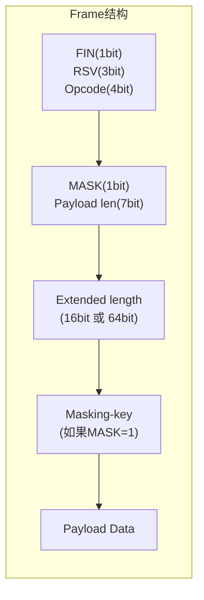

# 什么是 WebSocket 😎😎😎

## 一、概念定义

WebSocket 是一种**基于 TCP 的全双工通信协议**，通过 HTTP 的 Upgrade 机制建立连接，之后在单个 TCP 连接上提供持久的、双向的、低延迟的消息传输。

RFC 文档：**RFC 6455**（2011年正式成为标准）

------

## 二、协议升级机制

WebSocket 的核心是 **HTTP Upgrade**（协议切换）。

### 客户端请求（握手）

```http
GET /ws HTTP/1.1
Host: example.com
Connection: Upgrade
Upgrade: websocket
Sec-WebSocket-Version: 13
Sec-WebSocket-Key: dGhlIHNhbXBsZSBub25jZQ==
Origin: http://example.com
```

关键字段：
- `Connection: Upgrade`：告知服务器要切换协议
- `Upgrade: websocket`：切换目标协议
- `Sec-WebSocket-Key`：一个随机的 Base64 编码字符串，用于握手验证

### 服务端响应

```http
HTTP/1.1 101 Switching Protocols
Connection: Upgrade
Upgrade: websocket
Sec-WebSocket-Accept: s3pPLMBiTxaQ9kYGzzhZRbK+xOo=
```

状态码 `101` 表示**协议切换成功**，之后的所有数据传输都走 WebSocket 帧格式，不再是 HTTP。

### 为什么需要 Sec-WebSocket-Key

这是一个**安全机制**，防止恶意客户端伪装 WebSocket 请求：
1. 客户端生成随机 Key
2. 服务器将其与固定的 GUID 拼接
3. 做 SHA-1 摘要后再 Base64 编码返回
4. 客户端验证后确认服务端确实支持 WebSocket

------

## 三、帧（Frame）结构

WebSocket 传输的数据以**帧（Frame）**为单位，而不是 HTTP 的请求-响应结构。

### 帧格式



| 字段 | 位数 | 说明 |
|------|------|------|
| **FIN** | 1bit | 1=消息结束，0=还有后续帧 |
| **Opcode** | 4bit | 帧类型：0x1文本、0x2二进制、0x8关闭、0x9Ping、0xAPong |
| **MASK** | 1bit | 客户端→服务端必须为1 |
| **Payload length** | 7bit | 数据长度（126/127表示有扩展） |
| **Masking-key** | 32bit | 掩码密钥（客户端发帧时必须有） |
| **Payload Data** | 可变 | 实际传输的数据 |

关键字段：
- **Opcode（4位）**：帧类型
  - `0x1`：文本帧
  - `0x2`：二进制帧
  - `0x8`：关闭帧
  - `0x9`：Ping 帧
  - `0xA`：Pong 帧
- **MASK**：客户端→服务端帧必须置 1（防恶意代理缓存）
- **Payload length**：数据长度（7位/7+16位/7+64位可变）
- **Payload Data**：实际数据

### 最大帧大小

- 理论最大 Payload：2^64 - 1 字节（实际受浏览器/框架限制）
- 单帧最小：仅 2 字节（无数据时）

------

## 四、心跳保活机制（Ping/Pong）

WebSocket 是长连接，如果中间链路断开（如 NAT 超时、交换机路由表老化），连接会变成"死连接"。

### Ping/Pong 帧

- 一方发送 `Opcode=0x9`（Ping）
- 对方必须回应 `Opcode=0xA`（Pong）
- 是一种**对等的心跳机制**，用于检测连接是否存活

### 应用层心跳 vs 协议层 Ping/Pong

很多框架在应用层也实现了自己的心跳（如 Spring WebSocket）：
- 应用层心跳：定时发送一个"ping消息"，对方回一个"pong消息"
- 协议层 Ping/Pong：由 WebSocket 协议栈自动处理

实际项目中**推荐同时开启**，防止连接被意外关闭。

------

## 五、连接关闭

### 正常关闭流程

```
1. 一方发送 Close 帧（Opcode=0x8），可以带状态码和原因
2. 对方收到后返回一个 Close 帧
3. 双方关闭 TCP 通道
```

### 常见状态码

| 状态码 | 含义 |
|--------|------|
| 1000 | 正常关闭 |
| 1001 | 服务端正在关闭（如服务器重启） |
| 1002 | 协议错误 |
| 1003 | 不支持的 DataType |
| 1006 | 连接异常关闭（不能用程序发送） |
| 1009 | 消息太大 |
| 1010 | 客户端要求的扩展不支持 |
| 1011 | 服务端异常 |

------

## 六、与 Socket（TCP）的区别

很多人混淆 WebSocket 和原始 TCP Socket：

| 维度 | TCP Socket | WebSocket |
|------|-------------|-----------|
| **层次** | 传输层 | 应用层（在 TCP 之上） |
| **连接** | 需要自己管理 | HTTP 升级建立 |
| **消息** | 原始字节流 | 有帧结构（文本/二进制） |
| **双工** | 全双工 | 全双工 |
| **浏览器支持** | ❌ 无原生支持 | ✅ 原生 WebSocket API |
| **跨域** | 通常有防火墙限制 | 可借助 HTTP 端口（80/443） |

**WebSocket 本质上是对 TCP 的一种封装**，它定义了帧格式、握手过程，让浏览器可以方便地使用。

------

## 七、一句话总结

> WebSocket 是一个基于 TCP 的全双工协议，通过 HTTP Upgrade 建立连接，用帧（Frame）而非请求-响应的方式传输数据，支持服务端主动推送，常用于实时聊天、游戏、监控推送等场景。