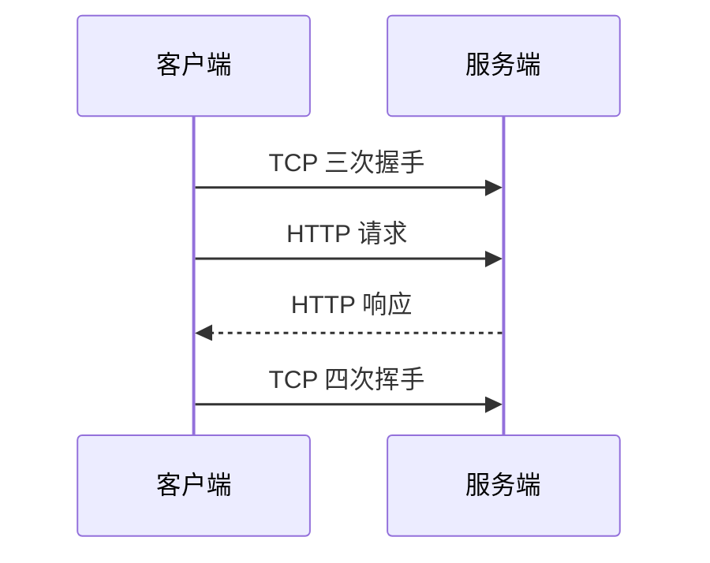
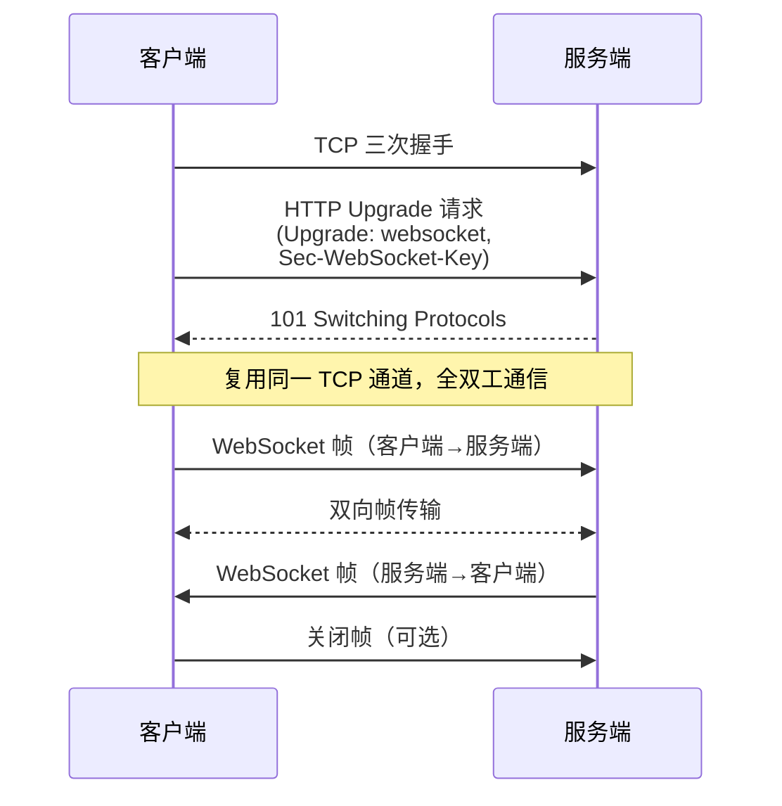

# WebSocket 和 HTTP 的区别 😎😎😎

## 一、宏观对比

| 维度 | HTTP | WebSocket |
|------|------|-----------|
| **连接类型** | 短连接（请求-响应后连接关闭） | 长连接（建立后保持打开） |
| **通信模式** | 半双工（同一时刻只能一方发送） | 全双工（双方可以同时发送） |
| **握手方式** | 标准 HTTP 请求，三次握手 | HTTP 升级（Upgrade），复用 TCP 通道 |
| **数据传输** | 请求体/响应体，任意次请求 | 帧（Frame）为基础的二进制/文本消息 |
| **服务器推送** | ❌ 不支持（需轮询/长轮询） | ✅ 支持（服务端主动推送） |
| **连接次数** | 每次请求新建连接（HTTP/1.1 Keep-Alive 可复用） | 一次握手，后续复用 |
| **Headers 开销** | 每次请求都带完整 Header | 仅首次握手带 Header，后续帧仅 2~14 字节 |
| **适用场景** | 查询类、低频交互 | 实时交互、高频消息推送 |

------

## 二、连接建立过程

### HTTP：标准短连接

每次请求都是独立的，服务器无法主动给客户端发消息。

### WebSocket：HTTP 升级

**核心在于 HTTP 的 `Upgrade` 机制**：客户端发送一个特殊的 HTTP 请求，服务器若支持则返回 `101 Switching Protocols`，之后连接从 HTTP 协议切换为 WebSocket 协议。

------

## 三、为什么 WebSocket 能双向通信

HTTP 的请求-响应模型决定了服务器不能主动发起请求。而 WebSocket 在完成握手后，连接变成了一个**持久的 TCP 通道**，双方都可以随时发送帧。

- **帧（Frame）**：WebSocket 传输的基本单位，分为文本帧、二进制帧、控制帧（Ping/Pong/Close）
- **全双工**：客户端和服务端等价，都可以先发消息

------

## 四、性能对比

### Header 开销

| 场景 | HTTP（Keep-Alive） | WebSocket |
|------|-------------------|-----------|
| 首次连接 | ~200~800 字节 Header | ~500~1000 字节（含 Upgrade + 握手） |
| 后续消息 | ~200~800 字节/请求 | 仅 2~14 字节/帧（最小 2 字节） |
| 1000 条消息/天 | 1000 × ~500 = ~500KB | 建立 1 次 + 1000 × ~5 = ~5KB |

### 延迟

- HTTP 轮询：每次消息需要一次完整的 HTTP 请求/响应 RTT
- WebSocket：消息直接发送，无额外 RTT

------

## 五、实际选择建议

### 用 HTTP（/REST）

- 简单的查询请求
- 低频交互（用户点一下查一下）
- 需要被缓存、CDN 加速
- 无状态服务

### 用 WebSocket

- **实时性要求高**（聊天、在线游戏）
- **高频小消息**（监控数据、股价推送）
- **服务端主动推送**（通知、进度）
- **双向交互**（协作编辑、即时通讯）

### 折中方案

如果只需要**服务端推送**而不需要双向通信，可以考虑 **SSE（Server-Sent Events）**：
- 基于 HTTP，不需要特殊协议
- 服务端可推送，但客户端不能主动发消息
- 更适合"监控大屏"、"实时通知"等场景

------

## 六、一句话总结

> WebSocket 是 HTTP 的"升级"，它借助 HTTP 的 Upgrade 机制建立连接，之后复用 TCP 通道实现**全双工、低延迟、低开销**的实时通信。HTTP 适合"一问一答"，WebSocket 适合"实时双向"。
