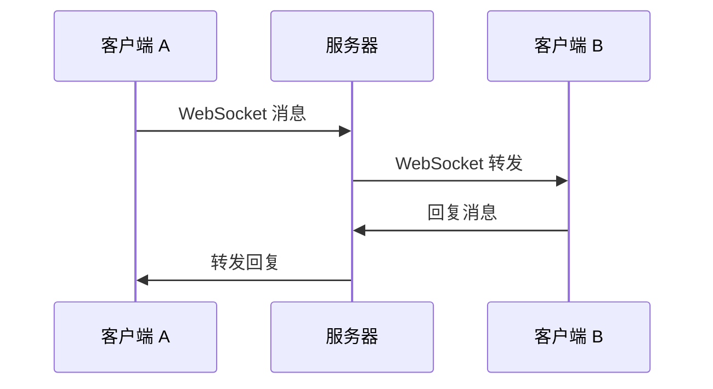
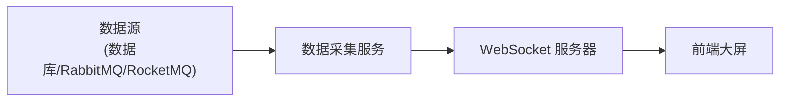
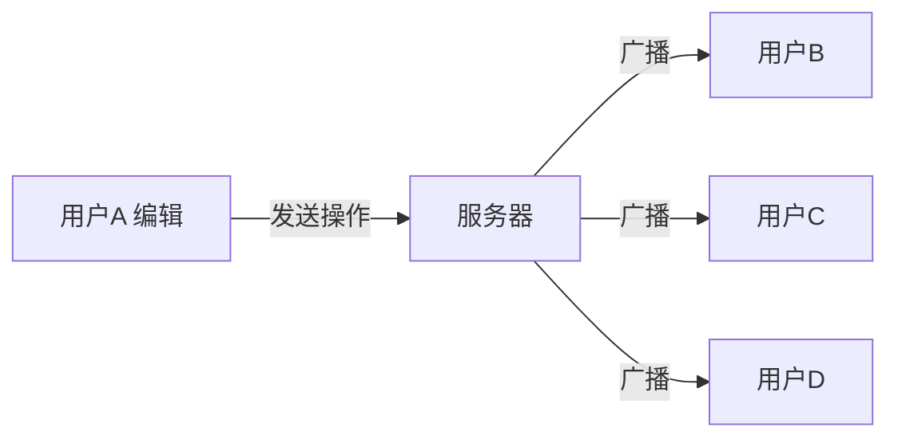
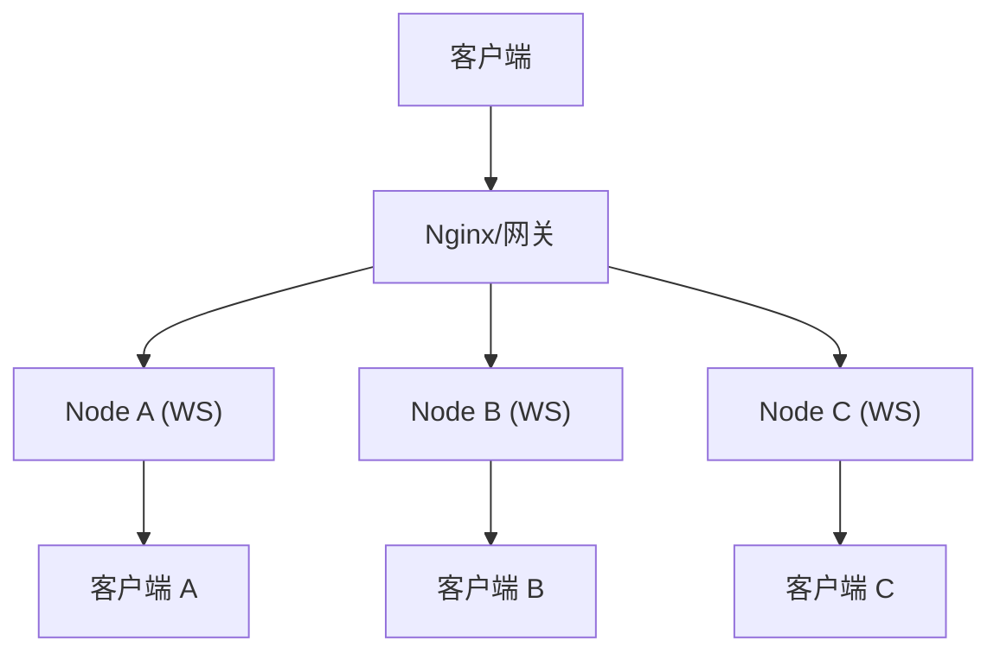

# WebSocket 实际应用场景 😎😎😎

## 一、实时聊天（即时通讯 IM）

### 场景描述

用户 A 发一条消息，用户 B 需要**秒级收到**，不需要刷新页面。

### 方案



### 核心要点

- **私聊**：服务器根据消息中的 `toUserId` 找到目标用户的 WebSocket 会话，直接发送
- **群聊**：服务器维护 `群ID -> 多个会话`，广播消息
- **消息持久化**：WebSocket 只负责实时推送，消息要落库（MySQL/MongoDB）
- **消息可靠**：需要 ACK 机制（客户端收到后回执，服务端未收到则重发）

### 简化代码示例

```java
@Override
protected void handleTextMessage(WebSocketSession session, TextMessage message) throws Exception {
    ChatMessage chat = objectMapper.readValue(message.getPayload(), ChatMessage.class);

    if (chat.getType() == 1) {
        // 私聊：找目标用户
        webSocketSessionManager.sendToUser(chat.getToUserId(),
            new TextMessage(objectMapper.writeValueAsString(chat)));
    } else if (chat.getType() == 2) {
        // 群聊：广播
        chat.setFromUser(chat.getFromUser());
        String json = objectMapper.writeValueAsString(chat);
        sessionManager.broadcast(new TextMessage(json));
    }

    // 落库
    chatService.save(chat);
}
```

### 注意事项

- 单聊时如果对方不在线，需要通过**离线消息机制**兜底
- 消息量大时，考虑**分库分表**或使用专门 IM 数据库（如环信、网易云信）

------

## 二、在线游戏（多人协作/对战）

### 场景描述

玩家操作（移动、攻击、道具使用）需要在**毫秒级**同步到其他玩家。

### 技术挑战

| 问题 | 说明 |
|------|------|
| **低延迟** | 网络 RTT 直接影响游戏体验 |
| **高并发** | 同时在线玩家多，消息量大 |
| **断线重连** | 游戏中断需要快速恢复状态 |
| **帧同步 vs 状态同步** | 帧同步同步操作，状态同步同步数据 |

### 常用方案

- **帧同步**（如 Unity + Photon）：同步操作指令，客户端本地计算结果
- **状态同步**：同步游戏状态（如位置、血量），服务端权威

### WebSocket 在游戏中的位置

WebSocket 不是唯一选择，很多游戏使用 **TCP/UDP Socket**（如 Photon、Mirror）：
- WebSocket 适合**卡牌类、回合制、慢节奏**游戏
- UDP Socket 适合**FPS、MOBA、实时动作**游戏（低延迟，可容忍丢包）

------

## 三、实时数据推送（监控大屏/金融行情）

### 场景描述

服务端数据源（数据库/消息队列）变化时，实时推送到前端展示，不需要前端轮询。

### 典型场景

- **金融行情**：股价、汇率实时变化
- **IoT 监控**：设备状态、传感器数据
- **运营大盘**：DAU、订单量、GMV 实时展示

### 架构



### 示例：RabbitMQ 监听 + WebSocket 推送

```java
@RabbitListener(queues = "order.status.queue")
public void handleOrderStatus(OrderStatusMessage message) {
    // 消息格式：orderId, status, amount, timestamp
    String json = JSON.toJSONString(message);
    // 推送给所有订阅该订单的用户
    webSocketHandler.broadcast(json);
}
```

### 对比轮询

| 方案 | 延迟 | 服务器压力 | 实现复杂度 |
|------|------|-----------|-----------|
| 短轮询 | 高（每次请求都有 RTT） | 高（频繁建连） | 低 |
| 长轮询 | 中等（等待有数据才返回） | 中等 | 中等 |
| WebSocket | 低（实时推送） | 低（长连接复用） | 中等 |
| SSE | 低（服务端推送） | 低 | 低（但仅单向） |

------

## 四、多人协作编辑（如在线文档）

### 场景描述

多人同时编辑同一份文档，某一用户的修改需要**实时同步**到其他所有协作者。

### 核心技术

- **OT（Operational Transform）**：操作转换，解决并发编辑冲突
- **CRDT（Conflict-free Replicated Data Type）**：无冲突复制数据类型
- **WebSocket**：作为实时同步的传输通道

### 简化流程



### 注意事项

- 需要**操作合并**：用户 A 和 B 同时编辑，需要合并操作
- 大量用户同时编辑时，需要**服务端 CRDT 节点**或**中心化 OT 服务**
- WebSocket 断线重连后，需要**增量同步**（而不是全量拉取）

------

## 五、消息推送方案对比

实际项目中，消息推送有多种方案，需要根据场景选择：

### 5.1 WebSocket

- **优点**：全双工，延迟低，双向通信
- **缺点**：需要特殊处理跨域、重连、负载均衡
- **适用**：实时聊天、游戏、双向交互

### 5.2 SSE（Server-Sent Events）

- **优点**：基于 HTTP，无需特殊协议，兼容性好，自动重连
- **缺点**：仅支持服务端→客户端单向推送
- **适用**：通知推送、监控大屏、邮件/消息列表刷新

```java
// Spring Boot SSE 示例
@GetMapping(value = "/stream", produces = MediaType.TEXT_EVENT_STREAM_VALUE)
public SseEmitter stream() {
    SseEmitter emitter = new SseEmitter();
    executorService.schedule(() -> {
        try {
            emitter.send("data: 消息1\n\n");
            emitter.send("data: 消息2\n\n");
            emitter.complete();
        } catch (IOException e) {
            emitter.completeWithError(e);
        }
    }, 1, TimeUnit.SECONDS);
    return emitter;
}
```

### 5.3 MQTT

- **优点**：轻量级，发布订阅模型，支持 QoS（服务质量），适合 IoT
- **缺点**：需要 MQTT Broker（EMQX/RabbitMQ），客户端需要 MQTT 库
- **适用**：IoT 设备通信、跨系统消息推送、移动 App 推送

### 5.4 轮询（不推荐用于实时场景）

- **短轮询**：定时请求，适合低实时性需求
- **长轮询**：等待有数据才返回，比短轮询实时性好一些
- 仅作为"没有 WebSocket 环境时的兜底方案"

### 方案选型表

| 场景 | 推荐方案 |
|------|---------|
| 即时通讯聊天 | WebSocket |
| 在线游戏 | WebSocket / UDP Socket |
| 监控大屏/数据推送 | WebSocket / SSE |
| IoT 设备 | MQTT |
| 通知推送（单一方向） | SSE / MQTT |
| 低实时性查询 | HTTP 轮询 |

------

## 六、WebSocket 在企业级项目中的常见架构

### 6.1 单机部署

所有 WebSocket 会话存储在内存，广播也在单机内完成。适合小规模应用。

### 6.2 集群部署（多节点）



**问题**：Node A 发的消息推不到 Node B 上的客户端。

**解决方案**：
- **Redis Pub/Sub**：各节点订阅同一个 Channel，消息通过 Redis 转发
- **Redis Session 共享**：用户会话信息存 Redis，支持跨节点查找会话
- **MQTT Broker**：所有 WebSocket 连接到 EMQX，由 EMQX 处理跨节点消息
- **专用 WebSocket 网关**：如 Spring Cloud Gateway + websocket-proxy

### 6.3 消息可靠性

WebSocket 不保证消息送达，需要业务层处理：

- **QoS 0**：发完即忘，不确认
- **QoS 1**：至少一次，有 ACK + 重发（推荐）
- **QoS 2**：恰好一次（开销大，聊天场景用不到）

实际项目中常用 **应用层 ACK**：
1. 客户端收到消息后，回发 `ACK` 帧
2. 服务端维护未确认消息队列
3. 超过一定时间未收到 ACK，则重发

------

## 七、一句话总结

> WebSocket 适合需要**服务端主动推送**和**双向实时交互**的场景（聊天、游戏、监控推送）。实际选型时要根据是否需要双向通信、实时性要求、并发规模等因素综合判断，集群环境下需要借助 Redis/MQTT 等实现跨节点消息同步。