# Kafka 快速上手指南

> 面向已有 RocketMQ 经验的开发者，重点对比两者差异，快速建立 Kafka 认知体系。

---

## 一、核心概念对比

| 概念 | RocketMQ | Kafka | 一句话解释 |
|------|----------|-------|-----------|
| 消息服务器 | Broker | Broker | 相同，都是存储和转发消息的服务 |
| 主题 | Topic | Topic | 相同，消息的逻辑分类容器 |
| 队列/分区 | Queue（物理存储） | Partition（物理存储） | **核心差异**：RocketMQ 的 Queue 是物理队列，Kafka 的 Partition 是日志分片 |
| 消费者组 | Consumer Group | Consumer Group | 订阅同一 Topic 的一组消费者，组内负载均衡 |
| 注册中心 | NameServer | ZooKeeper / KRaft | **Kafka 0.9 前用 ZooKeeper**，新版用 KRaft（内置 Raft 协议，无需外部 ZooKeeper） |
| 消息偏移 | Offset（逻辑概念，Broker 管理） | Offset（物理位置，存于 Partition） | **核心差异**：RocketMQ 的 offset 是逻辑序号，Kafka 的 offset 是物理位置（类似数组下标） |
| 顺序消息 | MessageQueue 级别有序 | Partition 级别有序 | Kafka 只保证 Partition 内有序，比 RocketMQ 的 Queue 级别更细粒度 |
| 延迟消息 | 原生支持 | **不支持**，需自行实现 | Kafka 官方明确不支持延迟消息，需借助外部方案 |
| 事务消息 | 原生支持 | 支持（幂等 + 事务 Producer） | Kafka 的事务更底层，主要保证"精确一次"生产 |

**关键差异总结：**
- **并发模型**：Kafka 的并发单位是 Partition（分区），一个 Partition 同时只被一个 Consumer 消费；RocketMQ 的并发单位是 Queue（队列）
- **消费位点管理**：RocketMQ 由 Broker 管理（Consumer 无感），Kafka 由 Consumer 自己管理（存储在 `__consumer_offsets` Topic 中）
- **适用场景**：Kafka 擅长高吞吐日志/流处理，RocketMQ 擅长事务/延迟消息等业务场景

---

## 二、核心架构详解

### 2.1 整体架构图

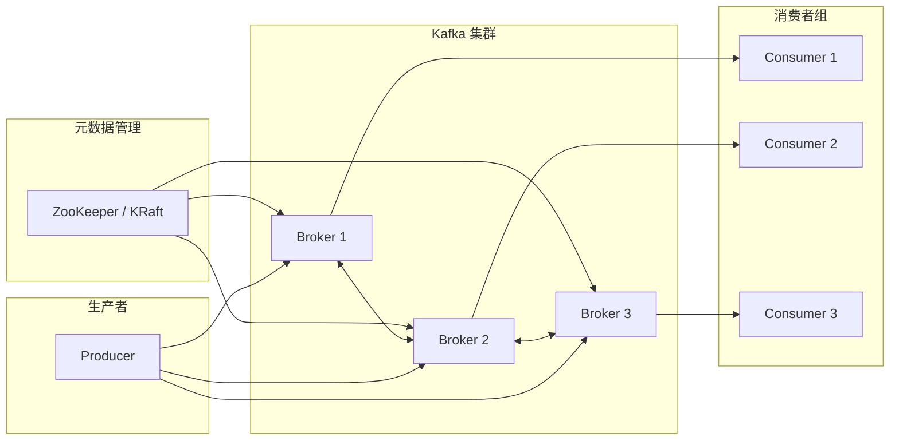

### 2.2 Partition 与 Consumer 分配关系

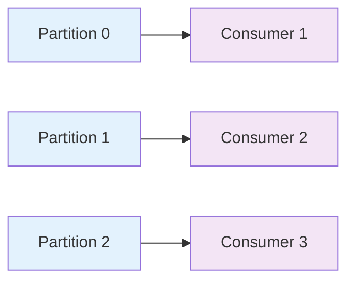

**关键规则：**
1. **一个 Partition 同时只被一个 Consumer 消费**（负载均衡的基础）
2. **消费者数量 ≤ Partition 数量**，否则多余的消费者会空闲
3. **相同 key 的消息永远路由到同一 Partition**（保证同 key 消息的顺序）

### 2.3 消费者数与 Partition 数的关系

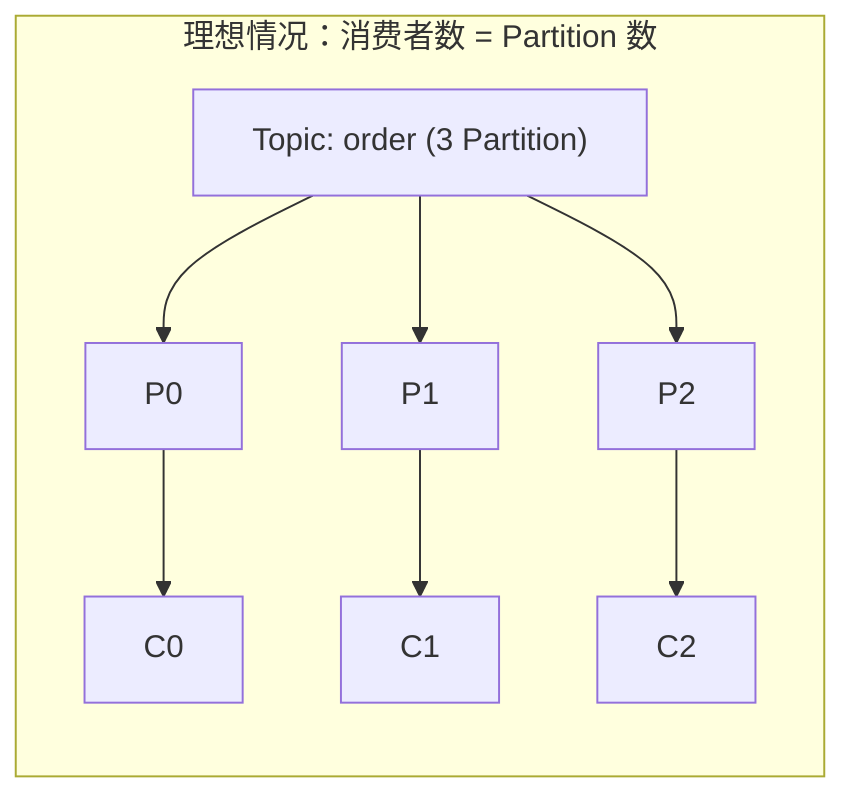

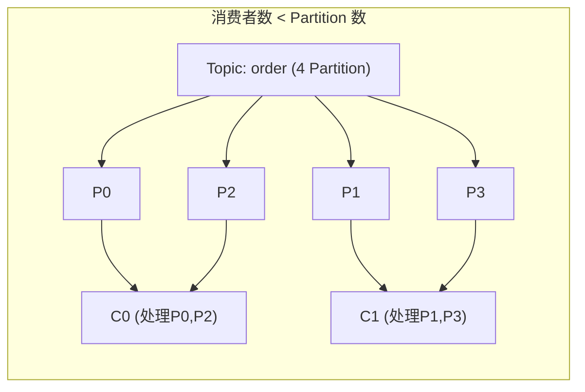

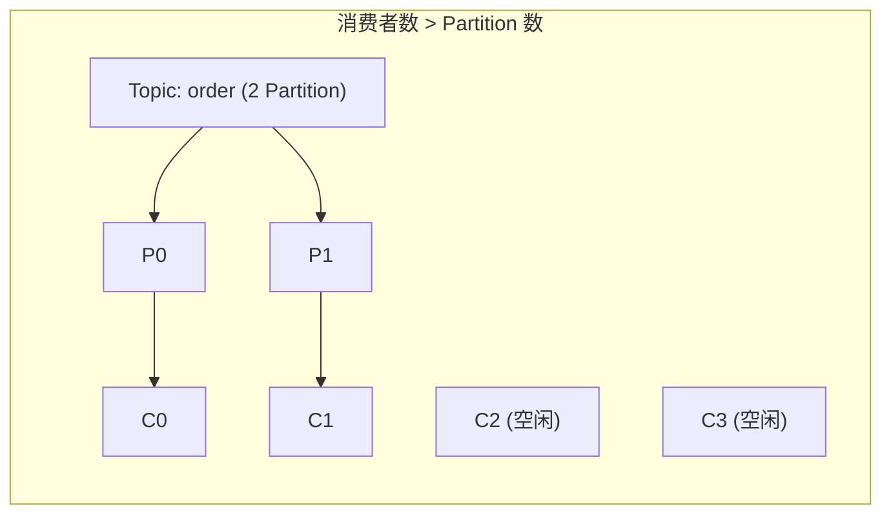

### 2.4 Partition 内部日志结构（⚠️ Kafka 高吞吐的核心设计）

Kafka 把每个 Partition 当成一个**只能追加写、不能修改的日志文件**，再把日志切成一个个 Segment 段来管理。这是 Kafka 高吞吐的基础——理解这一节就理解了 Kafka 一半的设计哲学。

#### 2.4.1 磁盘上的目录布局

一个 Topic-Partition 对应磁盘上一个目录，目录里是**并列的 Segment 文件**（不是链表，是同一目录下的多个文件）：

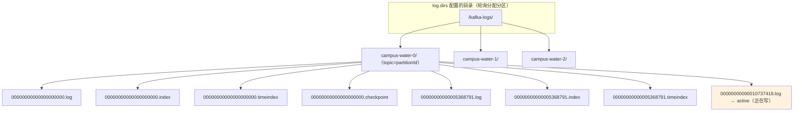

**关键点：**
- 目录命名规则：`<topic>-<partitionId>`，例如 `campus-water-0`、`campus-water-1`
- Segment 文件名 = **20 位零填充的 base offset**，例如 `00000000000000000000.log`（这个段从 offset 0 开始）
- 同一个 base offset 对应**三件套**：
  - `00000000000000000000.log` —— 消息主体（二进制 record batch 流）
  - `00000000000000000000.index` —— offset → 物理位置的稀疏索引
  - `00000000000000000000.timeindex` —— 时间戳 → offset 的稀疏索引
- **active segment**：当前正在被 Producer 写入的那一个段（橙色高亮），写满才滚动成关闭段
- 关闭段还会生成 `.deleted`（待删）、`.cleaned` / `.swap`（compact 中间产物）、`.txnindex`（事务索引，0.11+）等临时文件

#### 2.4.2 消息的物理格式（v2 RecordBatch，Kafka 0.11+）

Kafka 0.11 之前是「裸 message」拼接，0.11 之后改成 **RecordBatch → Record** 的两层结构（KIP-98），目的是支持幂等、事务、压缩。Consumer 拿到的 `ConsumerRecord` 是反序列化后的对象，但落盘的是二进制 batch：

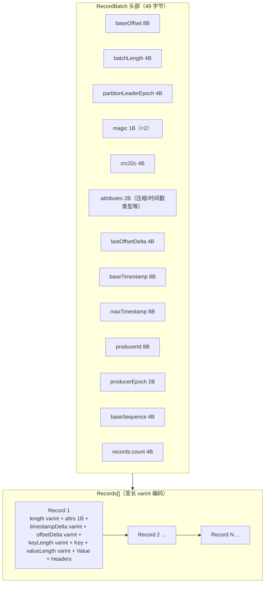

**为什么是 Batch 而不是单条消息？**
- **网络与磁盘 I/O 摊销**：一次顺序写/读多条，比一次写一条快几个数量级
- **压缩友好**：同一批内多条消息一起压缩，重复 key/value 字段能压掉很多
- **幂等与事务载体**：`producerId + baseSequence` 字段为幂等 Producer 提供去重依据
- Kafka 2.8+（KIP-405）增加了 `compactRecordBatch` 单条格式，方便长尾场景

#### 2.4.3 索引机制：为什么 .log 不全量扫描？

`.log` 文件动辄几个 GB，全量顺序扫描读一条消息会非常慢。Kafka 的解法是**稀疏索引**：

| 文件 | 每条条目大小 | 含义 |
|------|------------|------|
| `.index` | **8 字节**（4B relativeOffset + 4B physicalPosition） | offset 偏移量 → 在 `.log` 中的字节位置 |
| `.timeindex` | **12 字节**（8B timestamp + 4B relativeOffset） | 时间戳 → offset |

**稀疏的含义**：不是每条消息都建一条索引，而是每写入 **4 KB** 数据（`log.index.interval.bytes = 4096`）才追加一条索引。所以索引文件本身极小（每 GB 数据约 256 KB 索引），可以**全部装入内存甚至 mmap**。

#### 2.4.4 Offset 查找流程（Consumer 拉取的核心路径）

以「Consumer 要从 offset 12345 开始读」为例，整个过程只涉及**两次二分 + 一次顺序扫描**：

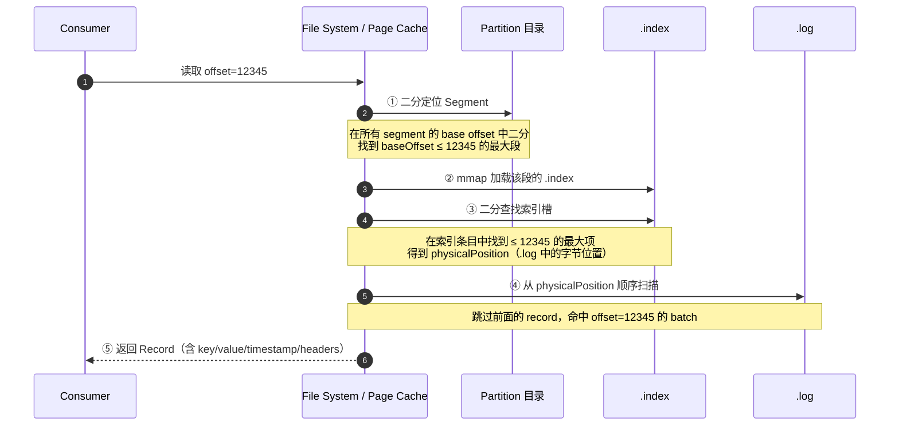

**关键设计：**
- 步骤 ① 的 segment 列表本身就几百字节，可常驻内存
- 步骤 ②③ 的 `.index` 通过 **mmap** 加载到 page cache（KIP-102，0.11+），不走 JVM 堆
- 步骤 ④ 顺序扫描最多扫 4 KB（一个索引区间），磁盘上是顺序 I/O，非常快
- 时间戳查找（`offsetsForTimes`）走 `.timeindex` → 拿到 offset → 再走上面流程

#### 2.4.5 Segment 滚动策略（什么时候切新段？）

active segment 写满后会被**关闭**（frozen），下一个消息写到新段里。触发滚动有三种条件，**任一满足就滚动**：

| 触发条件 | 配置项 | 默认值 |
|---------|--------|--------|
| 大小达到阈值 | `log.segment.bytes` | **1073741824（1 GiB）** |
| 打开时长达到阈值 | `log.segment.ms` | **604800000（7 天）** |
| 索引文件大小达到阈值 | `log.index.size.max.bytes` | **10485760（10 MB）** |

另外还有：
- `log.roll.ms` / `log.roll.hours`：强制空段的最大打开时长（避免空段长期存在）
- 关闭后延迟 `file.delete.delay.ms`（默认 60000ms = 1 分钟）才真正物理删除，给 Follower 同步留时间

#### 2.4.6 保留与清理（消息什么时候被删？）

两种 cleanup 策略，由 `log.cleanup.policy` 控制：

| 策略 | 配置 | 行为 | 适用场景 |
|------|------|------|---------|
| **delete**（默认） | `log.retention.ms/minutes/hours` / `log.retention.bytes` | 按时间或大小删除旧段 | 通用日志、消息队列 |
| **compact** | `min.cleanable.dirty.ratio` | 只保留每个 key 的最新 value | 状态快照、配置中心（如 `__consumer_offsets`） |

**delete 模式关键参数：**
- `log.retention.hours` 默认 **168（7 天）**
- `log.retention.bytes` 默认 **-1（不限）**
- `log.retention.check.interval.ms` 默认 **300000（5 分钟检查一次）**

**compact 模式关键概念：**
- **tombstone**（墓碑）：用 `null` value 表示「删除该 key」
- tombstone 保留 `delete.retention.ms`（默认 24 小时）后才真正物理删除，给消费侧留缓冲
- `min.cleanable.dirty.ratio` 默认 **0.5**：脏段（未压缩）占比超过 50% 才触发压缩

#### 2.4.7 为什么这套设计能做到高吞吐？

| 设计 | 解决的问题 |
|------|-----------|
| **顺序磁盘 I/O** | Producer 只追加写，无随机寻道，机械盘也能扛住高吞吐 |
| **Page Cache** | OS 把热数据缓存在内存，读几乎不落盘 |
| **零拷贝 sendfile** | Consumer fetch 时由 `FileChannel.transferTo` 直接从 page cache 发到 socket，绕过 user space |
| **稀疏索引 + mmap** | 索引文件极小、全部常驻内存；二分查找 O(log n) |
| **批量读写** | Producer/Consumer 都按 batch 收发，摊销网络与系统调用开销 |
| **关闭段只读** | 不需要并发锁，多 Consumer 可并行读，互不干扰 |

**一句话总结**：Kafka 把随机写磁盘变成了顺序写磁盘，把随机读变成了「内存二分 + 顺序读」，所以单机也能扛住百万级 QPS。

#### 2.4.8 关键参数速查（Java 后端必背）

| 参数 | 默认值 | 含义 |
|------|--------|------|
| `log.segment.bytes` | 1073741824 | 段大小上限（1 GiB） |
| `log.segment.ms` | 604800000 | 段最长打开时间（7 天） |
| `log.index.interval.bytes` | 4096 | 每 4 KB 数据追加一条索引 |
| `log.index.size.max.bytes` | 10485760 | 索引文件大小上限（10 MB） |
| `log.retention.hours` | 168 | 数据保留时间（7 天） |
| `log.retention.bytes` | -1 | 数据保留大小（不限） |
| `log.cleanup.policy` | `delete` | 清理策略 |
| `log.flush.interval.messages` | Long.MAX_VALUE | 刷盘条数（默认不强制） |
| `file.delete.delay.ms` | 60000 | 关闭段延迟删除时间（1 分钟） |

> 💡 **与 RocketMQ 的对比**：RocketMQ 的 CommitLog 是单个大文件 + ConsumeQueue 索引；Kafka 的 Partition 是**多段小文件 + 稀疏索引**。两者都能做到高吞吐，但 Kafka 的段式设计让删除/压缩更灵活（直接删一个文件即可）。

### 2.5 消费位点管理对比

**RocketMQ 模式：**

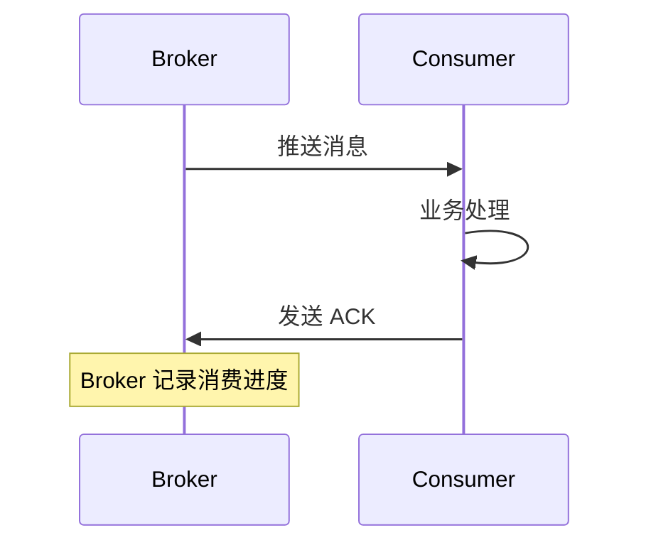

**Kafka 模式：**

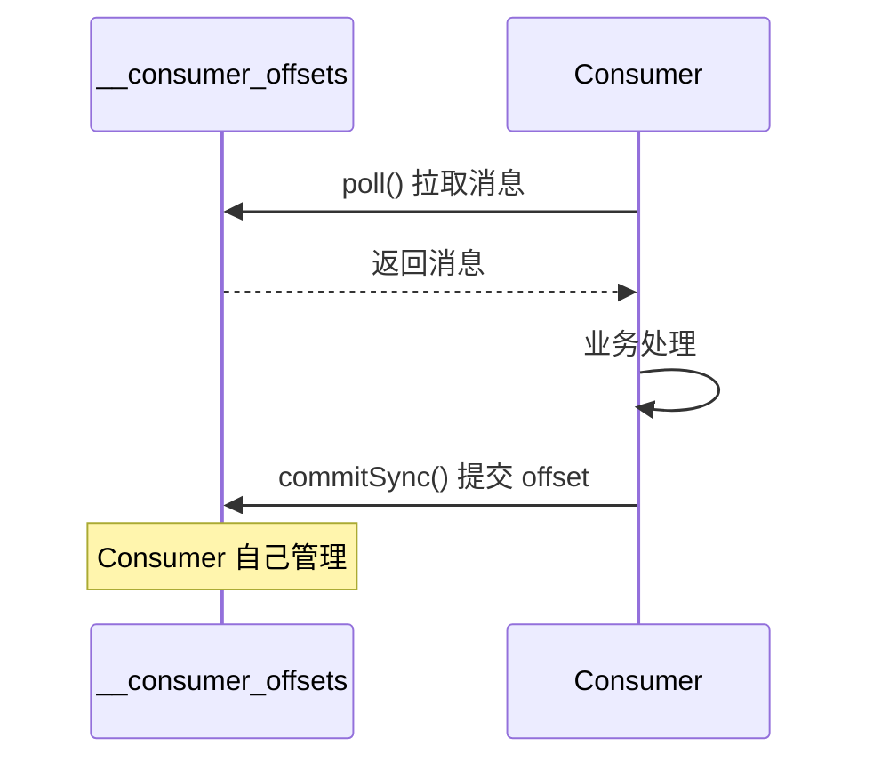

### 2.6 三种消息传递语义

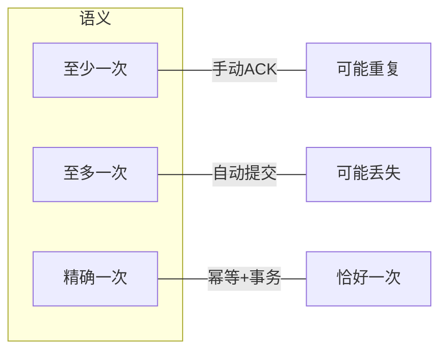

| 语义 | 定义 | 实现方式 | 风险 |
|------|------|---------|------|
| **至少一次** | 消息绝不会丢失，但可能重复消费 | `enable.auto.commit=false` + 手动 `ack.acknowledge()` | 重复消费（需业务方做幂等） |
| **至多一次** | 可能丢失消息，但绝不会重复消费 | `enable.auto.commit=true` + 自动提交 | 消息丢失 |
| **精确一次** | 消息恰好被处理一次 | 幂等 Producer + 事务 Producer + 手动提交 | 实现复杂，Kafka Streams 专用 |

---

## 三、环境搭建（本地单机，Docker）

### 3.1 docker-compose.yml（KRaft 模式，无需 ZooKeeper）

```yaml
version: '3'
services:
  kafka:
    image: bitnami/kafka:3.7          # Bitnami 维护的 Kafka 镜像，自带 ZK
    ports:
      - "9092:9092"                   # Kafka 客户端连接端口
    environment:
      # ========== KRaft 模式核心配置 ==========
      
      # 节点 ID（KRaft 模式必填）
      - KAFKA_CFG_NODE_ID=1
      
      # 当前节点的角色（broker=数据节点，controller=控制节点）
      # 单节点同时担任两个角色
      - KAFKA_CFG_PROCESS_ROLES=broker,controller
      
      # 监听地址（客户端连接用）
      - KAFKA_CFG_LISTENERS=PLAINTEXT://:9092,CONTROLLER://:9093
      
      # 对外暴露的地址（客户端连接时使用，localhost 供本地访问）
      - KAFKA_CFG_ADVERTISED_LISTENERS=PLAINTEXT://localhost:9092
      
      # 监听器安全协议（PLAINTEXT=无加密）
      - KAFKA_CFG_LISTENER_SECURITY_PROTOCOL_MAP=CONTROLLER:PLAINTEXT,PLAINTEXT:PLAINTEXT
      
      # Controller 投票节点列表（格式：节点ID@地址:端口）
      # 单节点模式只需配置自己
      - KAFKA_CFG_CONTROLLER_QUORUM_VOTERS=1@kafka:9093
      
      # Controller 监听器名称（需与 LISTENERS 中的 CONTROLLER 配置一致）
      - KAFKA_CFG_CONTROLLER_LISTENER_NAMES=CONTROLLER
```

**KRaft vs ZooKeeper 模式对比：**

| 对比项 | ZooKeeper 模式 | KRaft 模式 |
|--------|---------------|-----------|
| 依赖 | 需要独立部署 ZooKeeper | 无外部依赖，自带 Raft 协议 |
| 复杂度 | 高（两个系统需要同时管理） | 低（只需管理 Kafka） |
| 适用版本 | Kafka 0.9 之前 | Kafka 2.8+（推荐） |
| 官方态度 | 已废弃，逐步移除 | 官方推荐模式 |

### 3.2 基本命令

```bash
# 进入容器
docker exec -it <container_id> bash

# 创建 Topic（3 个 Partition，副本因子 1）
# --partitions: 分区数，决定并发消费的上限
# --replication-factor: 副本数，用于容灾（1=无副本，仅测试用）
kafka-topics.sh --create \
  --topic campus-water \
  --partitions 3 \
  --replication-factor 1 \
  --bootstrap-server localhost:9092

# 查看 Topic 列表
kafka-topics.sh --list --bootstrap-server localhost:9092

# 查看 Topic 详情
# 输出解释：Leader=主副本所在 Broker，Replicas=所有副本，Isr=同步中的副本
kafka-topics.sh --describe --topic campus-water --bootstrap-server localhost:9092

# 命令行发送消息（输入内容后按回车发送，Ctrl+C 退出）
kafka-console-producer.sh --topic campus-water --bootstrap-server localhost:9092

# 命令行消费消息（从头开始消费）
kafka-console-consumer.sh --topic campus-water \
  --from-beginning \
  --bootstrap-server localhost:9092
```

---

## 四、Java 客户端（Spring Boot 集成）

### 4.1 依赖

```xml
<dependency>
    <groupId>org.springframework.kafka</groupId>
    <artifactId>spring-kafka</artifactId>
</dependency>
```

### 4.2 配置（application.yml）

```yaml
spring:
  kafka:
    bootstrap-servers: localhost:9092
    
    producer:
      key-serializer: org.apache.kafka.common.serialization.StringSerializer
      value-serializer: org.apache.kafka.common.serialization.StringSerializer
      # acks: 消息确认级别
      # acks=0: Producer 不等待确认，最快但可能丢消息
      # acks=1: Leader 副本确认即可
      # acks=all: 所有 ISR 副本确认，最安全但最慢
      acks: all
      retries: 3
      properties:
        # 幂等性：保证相同消息不会重复发送
        enable.idempotence: true
    
    consumer:
      group-id: campus-water-group    # 消费者组 ID，相同组的消费者共享消费进度
      # earliest: 从最早消息开始消费（新消费者组首次启动时）
      # latest: 只消费新消息（新消费者组首次启动时）
      auto-offset-reset: earliest      # 类比 RocketMQ 的 CONSUME_FROM_FIRST_OFFSET
      key-deserializer: org.apache.kafka.common.serialization.StringDeserializer
      value-deserializer: org.apache.kafka.common.serialization.StringDeserializer
      # 关闭自动提交 offset，由 Consumer 手动控制（推荐）
      enable-auto-commit: false
    listener:
      # manual_immediate: 每条消息处理后立即手动提交 offset
      # 其他模式：batch（批量处理后提交）、time（定时提交）
      ack-mode: manual_immediate
```

### 4.3 Producer

```java
@Service
public class WaterDataProducer {

    @Autowired
    private KafkaTemplate<String, String> kafkaTemplate;

    /**
     * 同步发送：等待消息确认后返回
     * key 决定路由到哪个 Partition（相同 key → 同一 Partition → 保证顺序）
     */
    public void sendWaterData(String deviceId, String data) {
        try {
            // send() 返回 ListenableFuture，类似 CompletableFuture
            SendResult<String, String> result =
                kafkaTemplate.send("campus-water", deviceId, data).get();
            
            System.out.println("发送成功，Partition: " + result.getRecordMetadata().partition()
                + ", Offset: " + result.getRecordMetadata().offset());
        } catch (Exception e) {
            log.error("消息发送失败", e);
        }
    }

    /**
     * 异步发送：通过回调处理结果，不阻塞主线程
     */
    public void sendAsync(String deviceId, String data) {
        kafkaTemplate.send("campus-water", deviceId, data)
            .addCallback(
                result -> log.info("发送成功 offset={}", result.getRecordMetadata().offset()),
                ex -> log.error("发送失败", ex)
            );
    }
}
```

### 4.4 Consumer

```java
@Service
public class WaterDataConsumer {

    /**
     * 单条消费，手动提交 offset
     * 注意：@KafkaListener 默认是并发的（多个线程同时消费）
     *       如需保证顺序，设置 concurrency="1"
     */
    @KafkaListener(topics = "campus-water", groupId = "campus-water-group")
    public void consume(ConsumerRecord<String, String> record, Acknowledgment ack) {
        try {
            String deviceId = record.key();
            String data = record.value();
            
            log.info("收到消息 partition={} offset={} key={} value={}",
                record.partition(), record.offset(), deviceId, data);

            // 业务处理
            processWaterData(deviceId, data);

            // 手动提交 offset（类似 RocketMQ 的 ACK）
            ack.acknowledge();
        } catch (Exception e) {
            log.error("消费失败", e);
            // 不 ack，下次重新消费（注意幂等性！）
        }
    }

    /**
     * 批量消费：高吞吐场景下，一次性拉取多条消息处理
     * 需要配合 KafkaConfig 中配置的批量容器工厂
     */
    @KafkaListener(
        topics = "campus-water-batch",
        groupId = "campus-water-batch-group",
        containerFactory = "batchKafkaListenerContainerFactory"  // 需额外配置，见 4.5 节
    )
    public void batchConsume(List<ConsumerRecord<String, String>> records, Acknowledgment ack) {
        log.info("批量消费 {} 条", records.size());
        
        // 批量写入 InfluxDB 等时序数据库
        batchInsertToInfluxDB(records);
        
        // 批量处理完成后统一提交 offset
        ack.acknowledge();
    }
}
```

### 4.5 批量消费容器工厂配置

```java
@Configuration
public class KafkaConfig {

    @Autowired
    private ConsumerFactory<String, String> consumerFactory;

    @Bean
    public ConcurrentKafkaListenerContainerFactory<String, String> batchKafkaListenerContainerFactory() {
        ConcurrentKafkaListenerContainerFactory<String, String> factory =
            new ConcurrentKafkaListenerContainerFactory<>();
        factory.setConsumerFactory(consumerFactory);
        factory.setBatchListener(true);   // 开启批量消费模式
        factory.getContainerProperties().setAckMode(ContainerProperties.AckMode.MANUAL_IMMEDIATE);
        return factory;
    }
}
```

---

## 五、重要机制详解

### 5.1 Offset 管理（⚠️ 与 RocketMQ 最大的差异）

**三种消息传递语义：**

| 语义 | 定义 | 实现方式 | 风险 |
|------|------|---------|------|
| **至少一次（At Least Once）** | 消息绝不会丢失，但可能重复消费 | `enable.auto.commit=false` + 手动 `ack.acknowledge()` | 重复消费（需业务方做幂等） |
| **至多一次（At Most Once）** | 可能丢失消息，但绝不会重复消费 | `enable.auto.commit=true` + 自动提交 + 失败不重试 | 消息丢失 |
| **精确一次（Exactly Once）** | 消息恰好被处理一次 | 幂等 Producer + 事务 Producer + 手动提交 | 实现复杂，Kafka Streams 专用 |

```java
// 精确一次语义配置（事务 Producer）
@Transactional
public void sendWithTransaction(String key, String value) {
    kafkaTemplate.executeInTransaction(t -> {
        t.send("topic1", key, value);
        t.send("topic2", key, value);
        return null;
    });
}
```

### 5.2 消息重试 & 死信队列

**Kafka 原生不支持延迟重试**，Spring Kafka 提供了两种补偿方案：

```java
@Configuration
public class KafkaErrorHandlerConfig {

    /**
     * 方案一：简单重试（不区分异常类型）
     * FixedBackOff: 重试 3 次，每次间隔 1 秒
     */
    @Bean
    public DefaultErrorHandler errorHandler() {
        FixedBackOff backOff = new FixedBackOff(1000L, 3L);
        return new DefaultErrorHandler(backOff);
    }

    /**
     * 方案二：重试失败后发送到死信 Topic（推荐）
     * 死信 Topic 命名规则：原 Topic 名称 + .DLT
     * 例如：campus-water → campus-water.DLT
     */
    @Bean
    public DefaultErrorHandler errorHandlerWithDlt(KafkaOperations<String, String> operations) {
        // recoverer: 重试失败后的处理器，将消息发送到死信 Topic
        DeadLetterPublishingRecoverer recoverer =
            new DeadLetterPublishingRecoverer(operations);
        
        // 重试 3 次，每次间隔 1 秒，仍失败则发到死信 Topic
        return new DefaultErrorHandler(recoverer, new FixedBackOff(1000L, 3L));
    }

    /**
     * 方案三：指数退避重试（更智能的重试策略）
     * 初始间隔 1 秒，最大间隔 30 秒，重试 5 次
     */
    @Bean
    public DefaultErrorHandler exponentialErrorHandler() {
        ExponentialBackOff backOff = new ExponentialBackOff(1000L, 2.0);
        backOff.setMaxInterval(30000L);
        backOff.setMaxElapsedTime(60000L);  // 总最大重试时间
        return new DefaultErrorHandler(backOff);
    }
}
```

### 5.3 顺序消息

**实现思路：相同 key 的消息 → 同一 Partition → 单线程消费**

```java
// Producer: 发送时指定 key，相同 key 会路由到同一 Partition
kafkaTemplate.send("order-topic", orderId, orderData);

// Consumer 方案一：单线程消费单个 Partition（最简单）
@KafkaListener(
    topicPartitions = @TopicPartition(
        topic = "order-topic",
        partitions = {"0"}  // 只消费 Partition 0
    ),
    concurrency = "1"      // 单线程
)
public void consumeOrderPartition0(ConsumerRecord<String, String> record, Acknowledgment ack) {
    // 处理订单（同一订单的所有消息都在 Partition 0，且单线程消费，保证顺序）
    processOrder(record.value());
    ack.acknowledge();
}

// Consumer 方案二：按 key 分区消费（更灵活）
@KafkaListener(
    topics = "order-topic",
    groupId = "order-consumer-group"
)
public void consumeOrder(ConsumerRecord<String, String> record, Acknowledgment ack) {
    String orderId = record.key();
    
    // 同一 orderId 的消息一定在同一个 Partition 内按顺序到达
    // 只需要确保单线程消费该 Partition 即可保证顺序
    synchronized (orderId.intern()) {
        processOrder(record.value());
    }
    ack.acknowledge();
}
```

### 5.4 消息积压排查

```bash
# 查看消费者组的消费进度和积压量（Lag = 积压消息数）
kafka-consumer-groups.sh \
  --bootstrap-server localhost:9092 \
  --describe \
  --group campus-water-group

# 输出示例：
# GROUP               TOPIC          PARTITION  CURRENT-OFFSET  LOG-END-OFFSET  LAG
# campus-water-group  campus-water   0          100             150             50
# campus-water-group  campus-water   1          80              80             0
# campus-water-group  campus-water   2          120            120             0

# 字段解释：
# CURRENT-OFFSET: 当前已消费到的位置
# LOG-END-OFFSET: 生产者最新写入的位置
# LAG: 积压量（LAG > 0 说明消费速度 < 生产速度）
```

**积压原因及解决方案：**

| LAG 大的原因 | 排查方向 | 解决方案 |
|-------------|---------|---------|
| 消费者处理慢 | 业务逻辑耗时、数据库慢查询 | 优化业务逻辑、异步处理、增加 Consumer |
| 消费者故障 | 网络抖动、OOM、异常未捕获 | 检查日志、增加重试机制 |
| Partition 数不够 | 消费者数 > Partition 数 | 增加 Partition 数量（已有消息不变） |
| 消费者频繁 Rebalance | `max.poll.interval.ms` 过小 | 调大该值、减少 `max.poll.records` |

---

## 六、与 RocketMQ 选型建议

| 场景 | 推荐 | 原因 |
|------|------|------|
| 大数据流处理（Flink/Spark 集成） | **Kafka** | 生态最完善，Connector 丰富 |
| 日志采集、埋点数据 | **Kafka** | 高吞吐，适合海量日志 |
| 电商订单、延迟消息、事务消息 | **RocketMQ** | 原生支持延迟/事务，开发成本低 |
| 微服务解耦（国内技术栈） | **RocketMQ** | 文档中文友好，社区活跃 |
| IoT 高频数据采集 | **Kafka** | 极高吞吐，水平扩展能力强 |

---

## 七、常见坑

### 坑 1：Partition 数不够导致并发受限

```bash
# 查看 Topic 的 Partition 数
kafka-topics.sh --describe --topic campus-water --bootstrap-server localhost:9092

# 解决方案：增加 Partition 数量
kafka-topics.sh --alter --topic campus-water --partitions 10 --bootstrap-server localhost:9092
```

### 坑 2：auto.offset.reset 配置错误

| 配置值 | 行为 | 使用场景 |
|--------|------|---------|
| `earliest` | 从最早消息开始消费 | 新消费者组首次启动、需要处理历史数据 |
| `latest` | 只消费新消息 | 生产环境、只关心新消息 |

```yaml
# 生产环境应该用 latest
spring:
  kafka:
    consumer:
      auto-offset-reset: latest
```

### 坑 3：消息体过大

```yaml
spring:
  kafka:
    producer:
      max-request-size: 10485760   # 10MB
    consumer:
      max-poll-records: 10485760   # 10MB
```

### 坑 4：Rebalance 风暴

**原因**：Consumer 处理消息时间过长，超过 `max.poll.interval.ms`

```yaml
spring:
  kafka:
    consumer:
      max-poll-interval-ms: 300000  # 调大
      max-poll-records: 100          # 减少每次拉取数量
```

### 坑 5：在 @KafkaListener 中做耗时操作

```java
// ❌ 错误：阻塞主线程
@KafkaListener(topics = "campus-water")
public void consume(ConsumerRecord<String, String> record) {
    callExternalService(record.value());  // 耗时操作
    ack.acknowledge();
}

// ✅ 正确：异步处理
@KafkaListener(topics = "campus-water")
public void consume(ConsumerRecord<String, String> record) {
    CompletableFuture.runAsync(() -> callExternalService(record.value()));
    ack.acknowledge();
}
```

---

## 八、快速验证代码（纯 Java，无框架）

### 8.1 Producer

```java
public class ProducerDemo {
    public static void main(String[] args) {
        Properties props = new Properties();
        props.put("bootstrap.servers", "localhost:9092");
        props.put("key.serializer", "org.apache.kafka.common.serialization.StringSerializer");
        props.put("value.serializer", "org.apache.kafka.common.serialization.StringSerializer");
        props.put("enable.idempotence", true);
        props.put("acks", "all");

        KafkaProducer<String, String> producer = new KafkaProducer<>(props);
        
        ProducerRecord<String, String> record = 
            new ProducerRecord<>("campus-water", "device-001", "{\"flow\":1.5}");
        
        producer.send(record, (metadata, exception) -> {
            if (exception == null) {
                System.out.printf("发送成功: topic=%s, partition=%d, offset=%d%n",
                    metadata.topic(), metadata.partition(), metadata.offset());
            }
        });
        
        producer.close();
    }
}
```

### 8.2 Consumer

```java
public class ConsumerDemo {
    public static void main(String[] args) {
        Properties props = new Properties();
        props.put("bootstrap.servers", "localhost:9092");
        props.put("group.id", "test-group");
        props.put("key.deserializer", "org.apache.kafka.common.serialization.StringDeserializer");
        props.put("value.deserializer", "org.apache.kafka.common.serialization.StringDeserializer");
        props.put("auto.offset.reset", "earliest");
        props.put("enable.auto.commit", false);

        KafkaConsumer<String, String> consumer = new KafkaConsumer<>(props);
        consumer.subscribe(Collections.singletonList("campus-water"));

        while (true) {
            ConsumerRecords<String, String> records = consumer.poll(Duration.ofMillis(100));
            for (ConsumerRecord<String, String> record : records) {
                System.out.printf("partition=%d, offset=%d, key=%s, value=%s%n",
                    record.partition(), record.offset(), record.key(), record.value());
            }
            consumer.commitSync();
        }
    }
}
```

---

## 九、术语表

| 术语 | 解释 |
|------|------|
| **Broker** | Kafka 集群中的单个节点，负责存储消息 |
| **Topic** | 消息的逻辑分类容器 |
| **Partition** | Topic 的物理分区，每个 Partition 是一个有序的日志文件 |
| **Segment** | Partition 内部的分段文件，包含 .log（数据）和 .index（索引） |
| **Offset** | 消息在 Partition 中的物理位置 |
| **Consumer Group** | 消费者组，同组消费者共享订阅的 Topic，组内负载均衡 |
| **Leader/Follower** | Leader 负责读写请求，Follower 同步数据 |
| **ISR** | In-Sync Replicas，同步中的副本集合 |
| **Lag** | 消费滞后量 = LOG-END-OFFSET - CURRENT-OFFSET |
| **Rebalance** | 消费者组内分区所有权重新分配的过程 |
| **KRaft** | Kafka 内置的 Raft 协议实现 |
| **__consumer_offsets** | Kafka 内置 Topic，存储各消费者组的消费进度 |

---

## 十、Mermaid 图表渲染说明

本文档使用 **Mermaid** 语法绘制架构图，以下环境可正常渲染：

| 环境 | 渲染方式 |
|------|---------|
| **VS Code** | 安装 **Mermaid Markdown Syntax Highlighting** 或 **Markdown Preview Mermaid Support** 插件 |
| **GitHub** | 原生支持 |
| **GitLab** | 原生支持 |
| **飞书** | 原生支持 |
| **Typora** | 开启「视图 → 渲染内容」 |

---

> **下一步推荐**：学习 Kafka Streams 或与 Flink 集成，实现实时流计算。