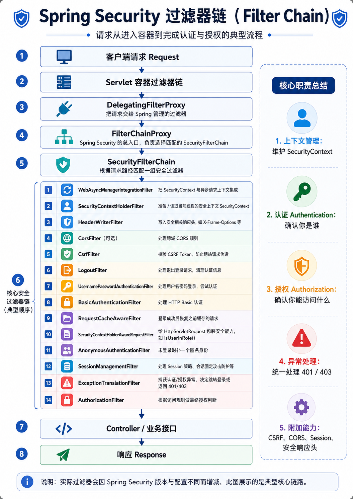

# Spring Security FilterChain：核心层与扩展点

> 适用范围：Spring Security 6.x / 7.x，Servlet（Spring MVC）技术栈。  
> 本文重点不是背诵所有 Filter，而是建立一套能用于开发、调试和扩展的心智模型。

---

> 本文已按二级标题拆分为独立章节，按需进入对应笔记阅读。

## 章节目录

- [[Spring-Security-FilterChain-核心层与扩展点-章节/01-1. 先记住一条主线|1. 先记住一条主线]]
- [[Spring-Security-FilterChain-核心层与扩展点-章节/02-2. 最外层：DelegatingFilterProxy|2. 最外层：DelegatingFilterProxy]]
- [[Spring-Security-FilterChain-核心层与扩展点-章节/03-3. 总入口：FilterChainProxy|3. 总入口：FilterChainProxy]]
- [[Spring-Security-FilterChain-核心层与扩展点-章节/04-4. 第一核心层：SecurityContext|4. 第一核心层：SecurityContext]]
- [[Spring-Security-FilterChain-核心层与扩展点-章节/05-5. 第二核心层：安全防护 Filter|5. 第二核心层：安全防护 Filter]]
- [[Spring-Security-FilterChain-核心层与扩展点-章节/06-6. 第三核心层：认证 Filter|6. 第三核心层：认证 Filter]]
- [[Spring-Security-FilterChain-核心层与扩展点-章节/07-7. 第四核心层：AnonymousAuthenticationFilter|7. 第四核心层：AnonymousAuthenticationFilter]]
- [[Spring-Security-FilterChain-核心层与扩展点-章节/08-8. 第五核心层：ExceptionTranslationFilter|8. 第五核心层：ExceptionTranslationFilter]]
- [[Spring-Security-FilterChain-核心层与扩展点-章节/09-9. 第六核心层：AuthorizationFilter|9. 第六核心层：AuthorizationFilter]]
- [[Spring-Security-FilterChain-核心层与扩展点-章节/10-10. 常见辅助层|10. 常见辅助层]]
- [[Spring-Security-FilterChain-核心层与扩展点-章节/11-11. 扩展点一：添加自定义 Filter|11. 扩展点一：添加自定义 Filter]]
- [[Spring-Security-FilterChain-核心层与扩展点-章节/12-12. 扩展点二：AuthenticationFilter + AuthenticationConverter|12. 扩展点二：AuthenticationFilter + AuthenticationConverter]]
- [[Spring-Security-FilterChain-核心层与扩展点-章节/13-13. 扩展点三：自定义 SecurityFilterChain|13. 扩展点三：自定义 SecurityFilterChain]]
- [[Spring-Security-FilterChain-核心层与扩展点-章节/14-14. 扩展点四：自定义 HttpSecurity DSL|14. 扩展点四：自定义 HttpSecurity DSL]]
- [[Spring-Security-FilterChain-核心层与扩展点-章节/15-15. JWT 项目的推荐做法|15. JWT 项目的推荐做法]]
- [[Spring-Security-FilterChain-核心层与扩展点-章节/16-16. 调试 FilterChain|16. 调试 FilterChain]]
- [[Spring-Security-FilterChain-核心层与扩展点-章节/17-17. 最常见的坑|17. 最常见的坑]]
- [[Spring-Security-FilterChain-核心层与扩展点-章节/18-18. 一张表总结核心扩展点|18. 一张表总结核心扩展点]]
- [[Spring-Security-FilterChain-核心层与扩展点-章节/19-19. 最终心智模型|19. 最终心智模型]]
- [[Spring-Security-FilterChain-核心层与扩展点-章节/20-参考资料|参考资料]]
