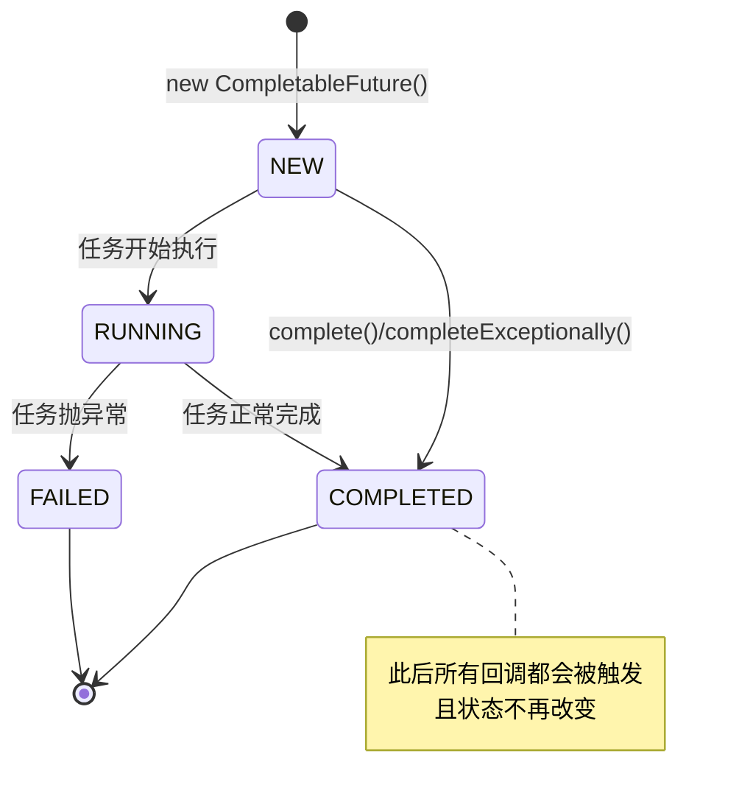
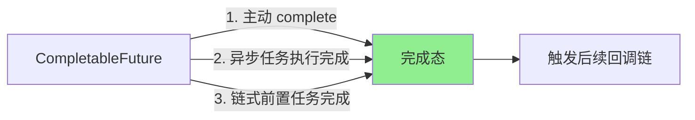

# 二、核心思想

## 2.1 设计哲学

> **回调函数 + 状态机 + 函数式编程**

`CompletableFuture` 实现了 `Future<T>` 和 `CompletionStage<T>` 两个接口：
- `Future<T>`：拿到异步结果
- `CompletionStage<T>`：描述"完成之后做什么"，支持链式组合

## 2.2 状态流转

## 2.3 三种触发方式

---

