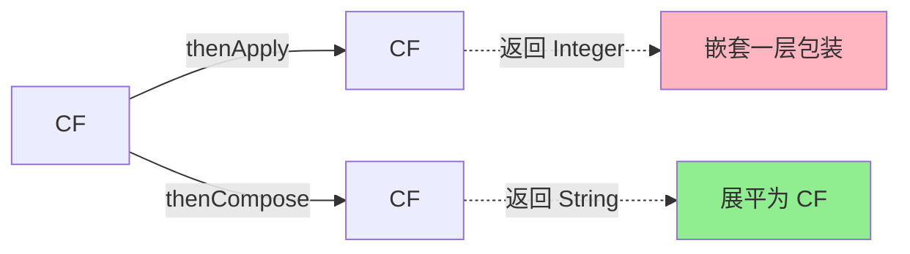

# 四、链式编排：结果转换与消费

## 4.1 三大基础回调

```java
// 1. thenApply：转换结果（有入参，有返回值）
CompletableFuture<Integer> cf1 = CompletableFuture
    .supplyAsync(() -> "123")
    .thenApply(s -> Integer.parseInt(s) + 1);  // 124

// 2. thenAccept：消费结果（有入参，无返回值）
CompletableFuture<Void> cf2 = CompletableFuture
    .supplyAsync(() -> "result")
    .thenAccept(System.out::println);

// 3. thenRun：执行副作用（无入参，无返回值）
CompletableFuture<Void> cf3 = CompletableFuture
    .supplyAsync(() -> "x")
    .thenRun(() -> System.out.println("done"));
```

## 4.2 异步回调：xxxAsync

每个回调都有 `xxxAsync` 版本，**强制切换到线程池**执行：

```java
.thenApply(s -> s + "1")         // 沿用上一步的线程
.thenApplyAsync(s -> s + "2")    // 切到 ForkJoinPool
.thenApplyAsync(s -> s + "3", executor)  // 切到自定义线程池
```

## 4.3 thenApply vs thenCompose



```java
// ❌ thenApply：返回 CompletableFuture<CompletableFuture<String>>
CompletableFuture<CompletableFuture<String>> bad = 
    CompletableFuture.supplyAsync(this::getUserId)
                      .thenApply(this::findUserAsync);

// ✅ thenCompose：展平为 CompletableFuture<String>
CompletableFuture<String> good = 
    CompletableFuture.supplyAsync(this::getUserId)
                      .thenCompose(this::findUserAsync);
```

**记忆口诀**：**Compose 是平铺，Apply 是套娃**。

---

