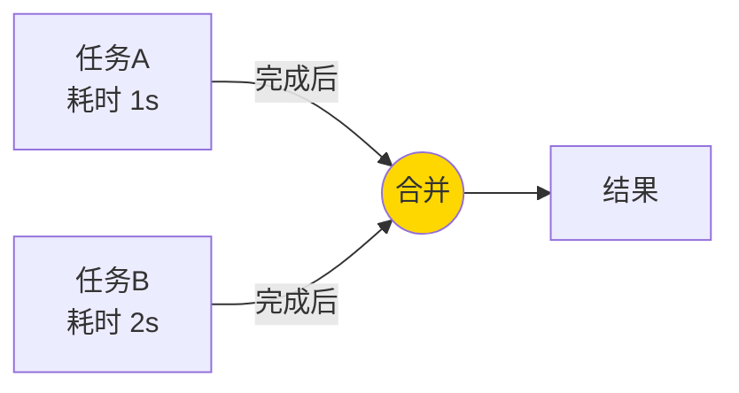
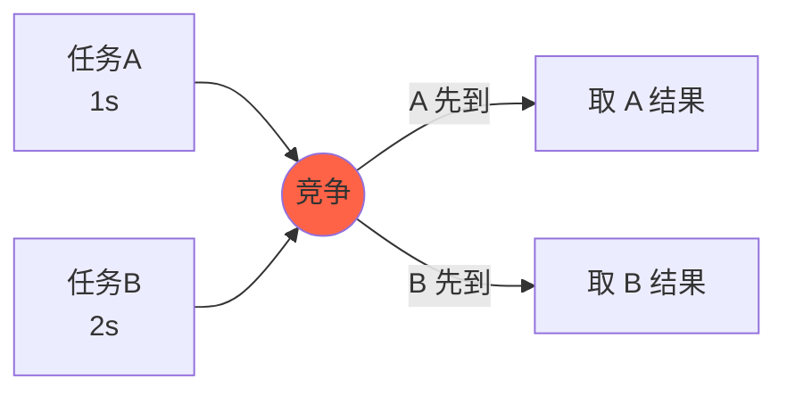

# 五、组合：多任务协同

## 5.1 thenCombine：双任务汇聚

```java
CompletableFuture<String> cfA = CompletableFuture.supplyAsync(() -> "A");
CompletableFuture<Integer> cfB = CompletableFuture.supplyAsync(() -> 100);

CompletableFuture<String> result = cfA.thenCombine(cfB, (a, b) -> a + b);
// result = "A100"
```

**流程图**：



## 5.2 thenAcceptBoth / runAfterBoth

```java
// 两个都完成后，消费结果
cfA.thenAcceptBoth(cfB, (a, b) -> System.out.println(a + b));

// 两个都完成后，执行动作
cfA.runAfterBoth(cfB, () -> System.out.println("都完成"));
```

## 5.3 applyToEither / acceptEither：谁快用谁

```java
CompletableFuture<String> result = cfA.applyToEither(cfB, s -> "先到的是：" + s);
```

**流程图**：



## 5.4 串行 vs 并行 速查

| 模式 | 方法 | 关系 |
|------|------|------|
| 串行依赖 | `thenCompose` | A 完成才能开始 B |
| 汇聚组合 | `thenCombine` | A、B 都完成才触发 |
| 竞争选择 | `applyToEither` | A、B 谁先到用谁 |

---

