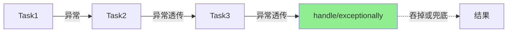

# 六、异常处理

## 6.1 三大异常处理方法

```java
// 1. exceptionally：捕获异常，返回兜底值（类似 catch）
CompletableFuture<Integer> cf1 = CompletableFuture
    .supplyAsync(() -> { throw new RuntimeException("oops"); })
    .exceptionally(ex -> {
        System.out.println("捕获异常：" + ex.getMessage());
        return -1;
    });

// 2. handle：无论成败都能处理（有入参，有返回值）
CompletableFuture<Integer> cf2 = CompletableFuture
    .supplyAsync(() -> 10 / 0)
    .handle((result, ex) -> {
        if (ex != null) return 0;
        return result * 2;
    });

// 3. whenComplete：无论成败都能处理（无返回值）
CompletableFuture<Integer> cf3 = CompletableFuture
    .supplyAsync(() -> "x")
    .whenComplete((result, ex) -> {
        if (ex != null) System.out.println("失败了");
        else System.out.println("成功了：" + result);
    });
```

## 6.2 异常传播链



**注意**：异常会沿着链**透传**，直到被 `handle` 或 `exceptionally` 捕获。

## 6.3 选择指南

| 方法 | 是否有返回值 | 是否能感知结果 | 典型用途 |
|------|------|------|------|
| `exceptionally` | 是 | 只能感知异常 | 兜底降级 |
| `handle` | 是 | 结果 + 异常都能感知 | 统一收口 |
| `whenComplete` | 否 | 结果 + 异常都能感知 | 日志埋点 |

---

