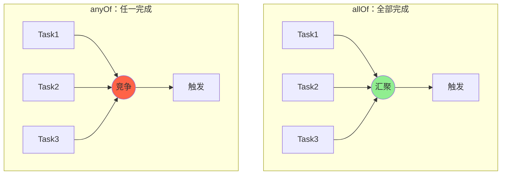

# 七、allOf 与 anyOf

## 7.1 allOf：等待所有任务完成

```java
CompletableFuture<String> a = CompletableFuture.supplyAsync(() -> "A");
CompletableFuture<String> b = CompletableFuture.supplyAsync(() -> "B");
CompletableFuture<String> c = CompletableFuture.supplyAsync(() -> "C");

CompletableFuture<Void> all = CompletableFuture.allOf(a, b, c);
all.thenRun(() -> System.out.println("全部完成"));
```

**注意**：`allOf` 返回 `CompletableFuture<Void>`，**不会**汇聚各子任务的结果，需要手动从 `a/b/c` 取：

```java
all.thenRun(() -> {
    String ra = a.join();
    String rb = b.join();
    String rc = c.join();
    System.out.println(ra + rb + rc);
});
```

## 7.2 anyOf：任一任务完成即触发

```java
CompletableFuture<Object> any = CompletableFuture.anyOf(a, b, c);
any.thenAccept(first -> System.out.println("最先完成：" + first));
```

**注意**：返回类型是 `CompletableFuture<Object>`，**结果是 Object**。

## 7.3 流程图



## 7.4 完整版：allOf + 聚合结果

```java
public static <T> CompletableFuture<List<T>> allOfList(
        CompletableFuture<T>... futures) {
    return CompletableFuture.allOf(futures)
        .thenApply(v -> Stream.of(futures)
                              .map(CompletableFuture::join)
                              .collect(Collectors.toList()));
}
```

---

