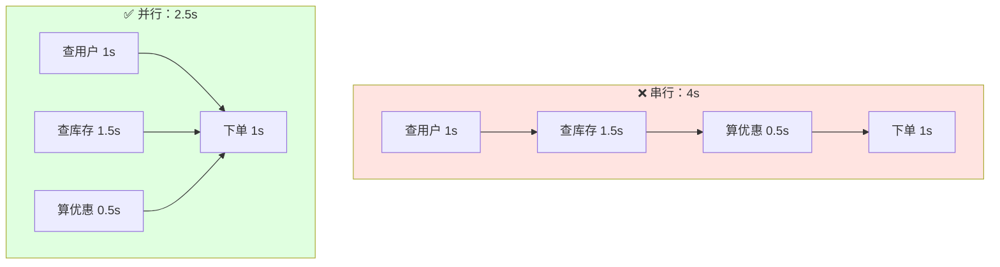

# 八、实战案例：电商下单

## 8.1 场景描述

下单需要：
1. **查用户信息**（1s）
2. **查商品库存**（1.5s）
3. **算优惠**（0.5s）
4. **扣库存 + 创建订单**（1s，依赖前 3 步）

## 8.2 串行 vs 并行优化



## 8.3 完整代码

```java
public CompletableFuture<OrderResult> placeOrder(Long userId, Long skuId) {
    // 1、2、3 步并行
    CompletableFuture<User> userF = CompletableFuture
        .supplyAsync(() -> userService.getById(userId), ioPool);
    CompletableFuture<Sku> skuF = CompletableFuture
        .supplyAsync(() -> skuService.getById(skuId), ioPool);
    CompletableFuture<Discount> discountF = CompletableFuture
        .supplyAsync(() -> discountService.calc(skuId), ioPool);
    
    // 三步汇聚后下单
    return userF.thenCombine(skuF, User::withSku)
               .thenCombine(discountF, Order::applyDiscount)
               .thenCompose(order -> CompletableFuture
                   .supplyAsync(() -> orderService.create(order), ioPool))
               .exceptionally(ex -> {
                   log.error("下单失败", ex);
                   return OrderResult.fail(ex.getMessage());
               });
}
```

## 8.4 多接口聚合（Spring Cloud 场景）

```java
public CompletableFuture<HomePageVO> getHomePage(Long userId) {
    CompletableFuture<User> userF = CompletableFuture
        .supplyAsync(() -> userClient.getById(userId), ioPool);
    CompletableFuture<List<Order>> orderF = CompletableFuture
        .supplyAsync(() -> orderClient.listByUser(userId), ioPool);
    CompletableFuture<List<Coupon>> couponF = CompletableFuture
        .supplyAsync(() -> couponClient.listByUser(userId), ioPool);
    CompletableFuture<Cart> cartF = CompletableFuture
        .supplyAsync(() -> cartClient.get(userId), ioPool);
    
    return CompletableFuture.allOf(userF, orderF, couponF, cartF)
        .thenApply(v -> new HomePageVO(
            userF.join(), orderF.join(), couponF.join(), cartF.join()));
}
```

---

