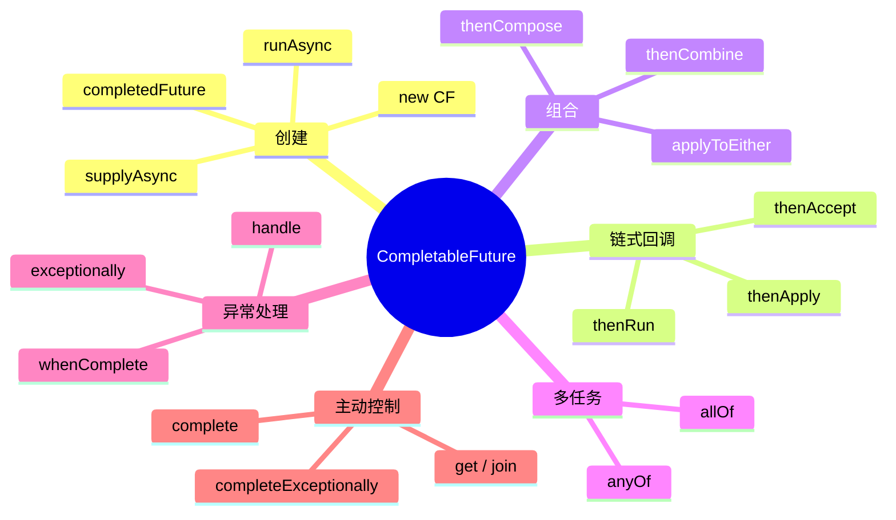

# 十二、整体 API 关系图

```mermaid
mindmap
  root((CompletableFuture))
    创建
      new CF
      runAsync
      supplyAsync
      completedFuture
    链式回调
      thenApply
      thenAccept
      thenRun
    组合
      thenCompose
      thenCombine
      applyToEither
    多任务
      allOf
      anyOf
    异常处理
      exceptionally
      handle
      whenComplete
    主动控制
      complete
      completeExceptionally
      get / join
```

