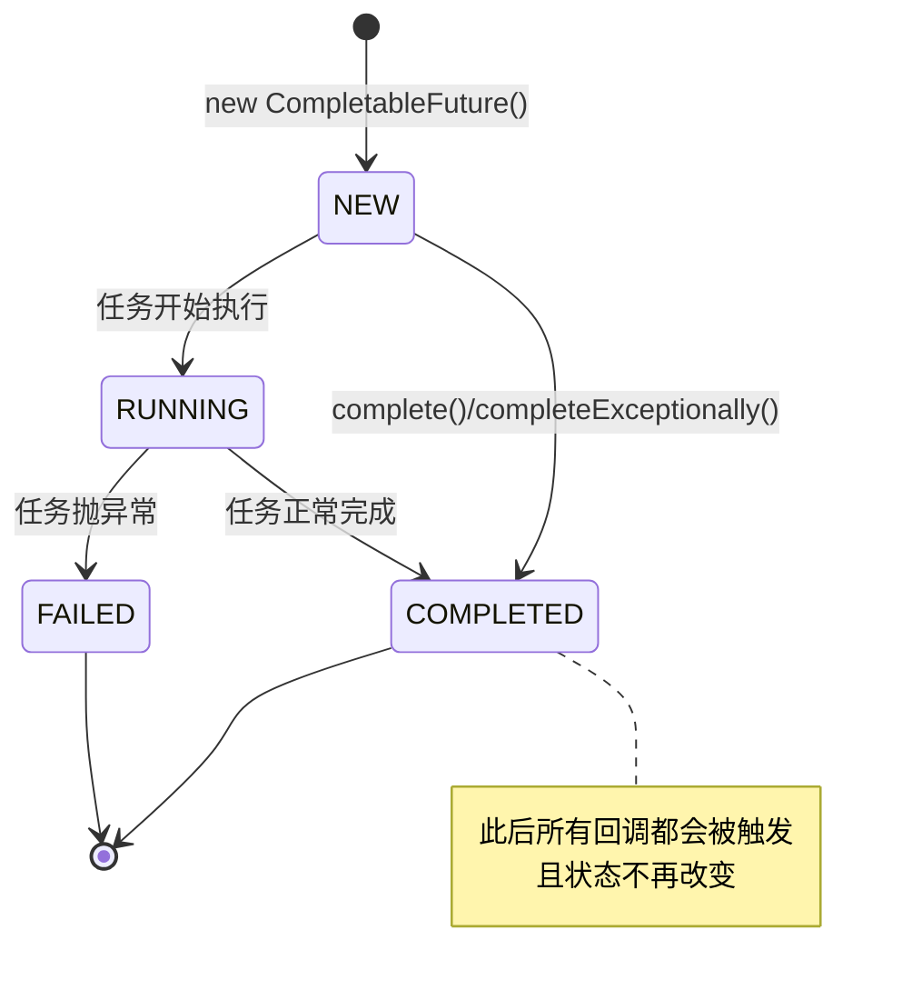
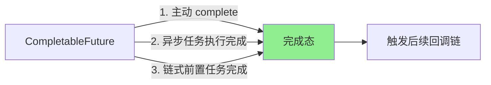
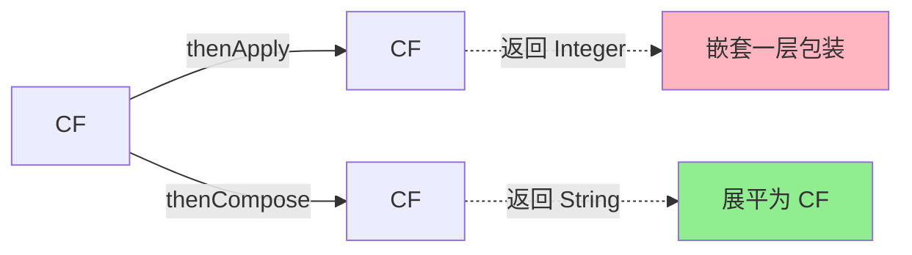
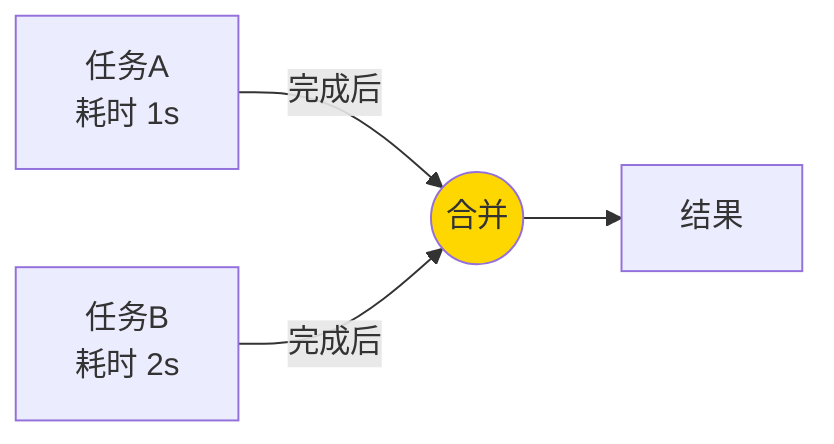
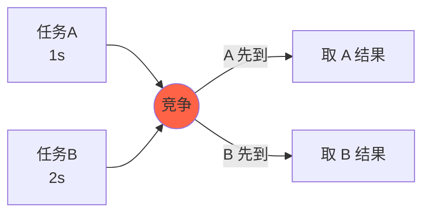
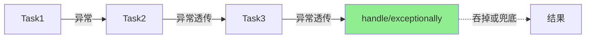
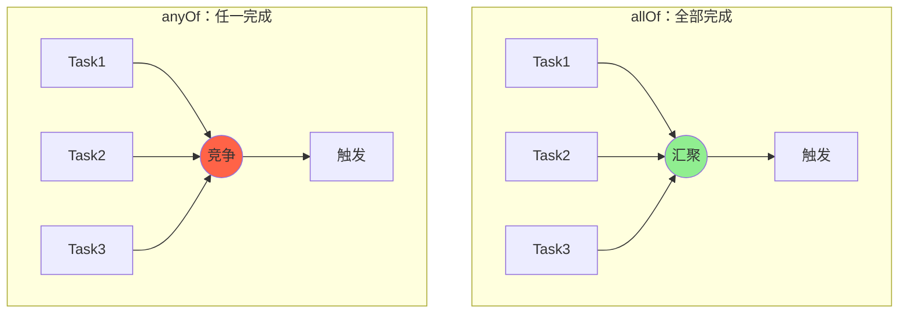
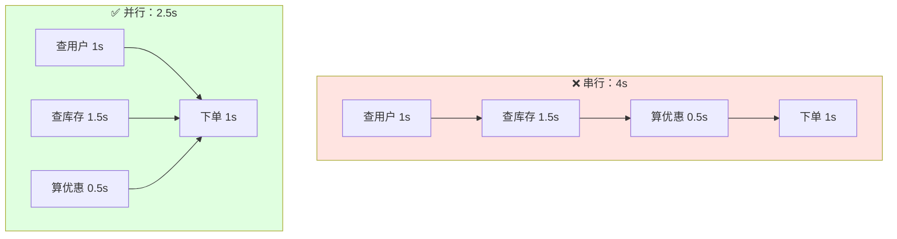
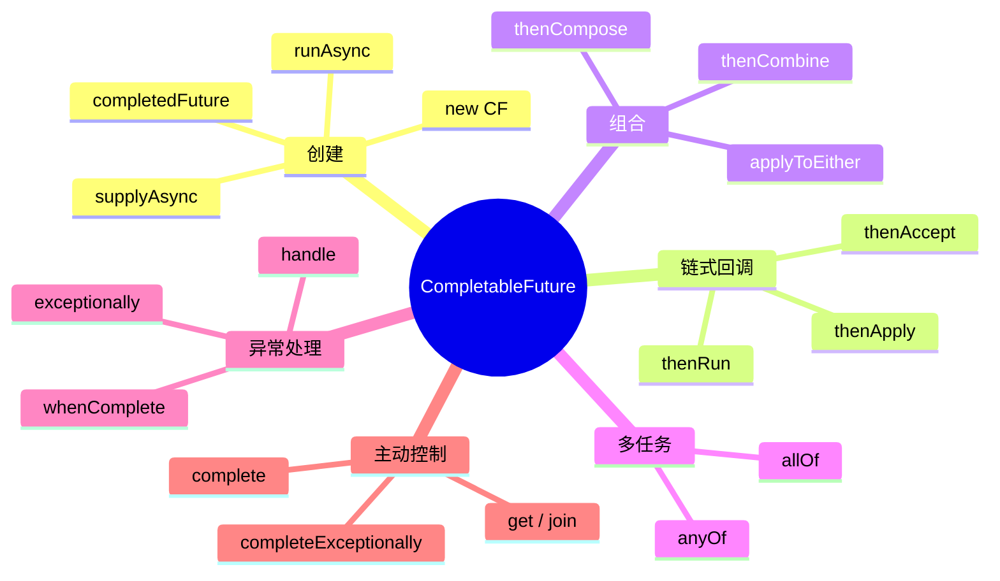

# 😎😎😎聊聊 CompletableFuture：异步任务编排与并发执行

> Java 8 引入的 `java.util.concurrent.CompletableFuture`，是对 `Future` 的增强版，支持**链式编排、回调、组合、异常处理**，是异步编程的"瑞士军刀"。

---

## 📑 目录

- [一、为什么需要 CompletableFuture](#一为什么需要-completablefuture)
- [二、核心思想](#二核心思想)
- [三、四种创建方式](#三四种创建方式)
- [四、链式编排：结果转换与消费](#四链式编排结果转换与消费)
- [五、组合：多任务协同](#五组合多任务协同)
- [六、异常处理](#六异常处理)
- [七、allOf 与 anyOf](#七allof-与-anyof)
- [八、实战案例：电商下单](#八实战案例电商下单)
- [九、注意事项与坑](#九注意事项与坑)
- [十、最佳实践](#十最佳实践)
- [十一、进阶技巧](#十一进阶技巧)
- [十二、整体 API 关系图](#十二整体-api-关系图)
- [十三、一句话总结](#十三一句话总结)

---

## 一、为什么需要 CompletableFuture

### 1.1 传统 `Future` 的痛点

`Future` 是 Java 5 引入的异步结果占位符，但**只能阻塞 `get()` 取结果**，无法做到：

- 任务完成后**自动通知**我
- 多个异步任务**编排组合**（先后、并行、汇聚）
- 任务执行过程中**捕获异常**并处理
- 像写同步代码一样**链式调用**

### 1.2 CompletableFuture 解决了什么

| 能力 | 说明 |
|------|------|
| 主动完成 | `complete()` / `completeExceptionally()` 手动结束 |
| 回调通知 | `thenApply` / `thenAccept` / `thenRun` |
| 链式编排 | `thenCompose` 串行依赖 |
| 任务组合 | `thenCombine` 双源汇聚 |
| 多任务协同 | `allOf` 全完成 / `anyOf` 任一完成 |
| 异常处理 | `exceptionally` / `handle` / `whenComplete` |

### 1.3 适用场景

- 微服务间**并行调用**多个下游接口（聚合数据）
- 耗时操作**异步化**（发短信、写日志、查缓存）
- 复杂的**任务编排 DAG**（有向无环图）
- **流水线式**数据处理

---

## 二、核心思想

### 2.1 设计哲学

> **回调函数 + 状态机 + 函数式编程**

`CompletableFuture` 实现了 `Future<T>` 和 `CompletionStage<T>` 两个接口：
- `Future<T>`：拿到异步结果
- `CompletionStage<T>`：描述"完成之后做什么"，支持链式组合

### 2.2 状态流转



### 2.3 三种触发方式



---

## 三、四种创建方式

### 3.1 方式一：直接 `new` + 手动完成

```java
CompletableFuture<String> cf = new CompletableFuture<>();
// 另起一个线程设置结果
new Thread(() -> {
    try {
        Thread.sleep(1000);
        cf.complete("hello");
    } catch (Exception e) {
        cf.completeExceptionally(e);
    }
}).start();
```

**适用场景**：跨线程传递结果（如 WebSocket、消息推送）。

### 3.2 方式二：`runAsync` —— 无返回值

```java
CompletableFuture<Void> cf = CompletableFuture.runAsync(() -> {
    // 耗时操作，无返回值
    System.out.println("running in " + Thread.currentThread().getName());
});
```

- 默认使用 `ForkJoinPool.commonPool()`
- 可传入自定义 `Executor`

### 3.3 方式三：`supplyAsync` —— 有返回值

```java
CompletableFuture<String> cf = CompletableFuture.supplyAsync(() -> {
    return "Hello CompletableFuture";
}, executor);
```

### 3.4 方式四：已完成的 `completedFuture`

```java
CompletableFuture<String> cf = CompletableFuture.completedFuture("已就绪");
```

**适用场景**：缓存命中、默认值快速返回。

### 3.5 创建方式速查表

| 方法 | 是否有返回值 | 线程池 |
|------|------|------|
| `new CompletableFuture<>()` | 手动 | 由调用方决定 |
| `runAsync(Runnable)` | 否 | ForkJoinPool / 自定义 |
| `supplyAsync(Supplier)` | 是 | ForkJoinPool / 自定义 |
| `completedFuture(value)` | 是 | 立即完成 |

---

## 四、链式编排：结果转换与消费

### 4.1 三大基础回调

```java
// 1. thenApply：转换结果（有入参，有返回值）
CompletableFuture<Integer> cf1 = CompletableFuture
    .supplyAsync(() -> "123")
    .thenApply(s -> Integer.parseInt(s) + 1);  // 124

// 2. thenAccept：消费结果（有入参，无返回值）
CompletableFuture<Void> cf2 = CompletableFuture
    .supplyAsync(() -> "result")
    .thenAccept(System.out::println);

// 3. thenRun：执行副作用（无入参，无返回值）
CompletableFuture<Void> cf3 = CompletableFuture
    .supplyAsync(() -> "x")
    .thenRun(() -> System.out.println("done"));
```

### 4.2 异步回调：xxxAsync

每个回调都有 `xxxAsync` 版本，**强制切换到线程池**执行：

```java
.thenApply(s -> s + "1")         // 沿用上一步的线程
.thenApplyAsync(s -> s + "2")    // 切到 ForkJoinPool
.thenApplyAsync(s -> s + "3", executor)  // 切到自定义线程池
```

### 4.3 thenApply vs thenCompose



```java
// ❌ thenApply：返回 CompletableFuture<CompletableFuture<String>>
CompletableFuture<CompletableFuture<String>> bad = 
    CompletableFuture.supplyAsync(this::getUserId)
                      .thenApply(this::findUserAsync);

// ✅ thenCompose：展平为 CompletableFuture<String>
CompletableFuture<String> good = 
    CompletableFuture.supplyAsync(this::getUserId)
                      .thenCompose(this::findUserAsync);
```

**记忆口诀**：**Compose 是平铺，Apply 是套娃**。

---

## 五、组合：多任务协同

### 5.1 thenCombine：双任务汇聚

```java
CompletableFuture<String> cfA = CompletableFuture.supplyAsync(() -> "A");
CompletableFuture<Integer> cfB = CompletableFuture.supplyAsync(() -> 100);

CompletableFuture<String> result = cfA.thenCombine(cfB, (a, b) -> a + b);
// result = "A100"
```

**流程图**：



### 5.2 thenAcceptBoth / runAfterBoth

```java
// 两个都完成后，消费结果
cfA.thenAcceptBoth(cfB, (a, b) -> System.out.println(a + b));

// 两个都完成后，执行动作
cfA.runAfterBoth(cfB, () -> System.out.println("都完成"));
```

### 5.3 applyToEither / acceptEither：谁快用谁

```java
CompletableFuture<String> result = cfA.applyToEither(cfB, s -> "先到的是：" + s);
```

**流程图**：



### 5.4 串行 vs 并行 速查

| 模式 | 方法 | 关系 |
|------|------|------|
| 串行依赖 | `thenCompose` | A 完成才能开始 B |
| 汇聚组合 | `thenCombine` | A、B 都完成才触发 |
| 竞争选择 | `applyToEither` | A、B 谁先到用谁 |

---

## 六、异常处理

### 6.1 三大异常处理方法

```java
// 1. exceptionally：捕获异常，返回兜底值（类似 catch）
CompletableFuture<Integer> cf1 = CompletableFuture
    .supplyAsync(() -> { throw new RuntimeException("oops"); })
    .exceptionally(ex -> {
        System.out.println("捕获异常：" + ex.getMessage());
        return -1;
    });

// 2. handle：无论成败都能处理（有入参，有返回值）
CompletableFuture<Integer> cf2 = CompletableFuture
    .supplyAsync(() -> 10 / 0)
    .handle((result, ex) -> {
        if (ex != null) return 0;
        return result * 2;
    });

// 3. whenComplete：无论成败都能处理（无返回值）
CompletableFuture<Integer> cf3 = CompletableFuture
    .supplyAsync(() -> "x")
    .whenComplete((result, ex) -> {
        if (ex != null) System.out.println("失败了");
        else System.out.println("成功了：" + result);
    });
```

### 6.2 异常传播链



**注意**：异常会沿着链**透传**，直到被 `handle` 或 `exceptionally` 捕获。

### 6.3 选择指南

| 方法 | 是否有返回值 | 是否能感知结果 | 典型用途 |
|------|------|------|------|
| `exceptionally` | 是 | 只能感知异常 | 兜底降级 |
| `handle` | 是 | 结果 + 异常都能感知 | 统一收口 |
| `whenComplete` | 否 | 结果 + 异常都能感知 | 日志埋点 |

---

## 七、allOf 与 anyOf

### 7.1 allOf：等待所有任务完成

```java
CompletableFuture<String> a = CompletableFuture.supplyAsync(() -> "A");
CompletableFuture<String> b = CompletableFuture.supplyAsync(() -> "B");
CompletableFuture<String> c = CompletableFuture.supplyAsync(() -> "C");

CompletableFuture<Void> all = CompletableFuture.allOf(a, b, c);
all.thenRun(() -> System.out.println("全部完成"));
```

**注意**：`allOf` 返回 `CompletableFuture<Void>`，**不会**汇聚各子任务的结果，需要手动从 `a/b/c` 取：

```java
all.thenRun(() -> {
    String ra = a.join();
    String rb = b.join();
    String rc = c.join();
    System.out.println(ra + rb + rc);
});
```

### 7.2 anyOf：任一任务完成即触发

```java
CompletableFuture<Object> any = CompletableFuture.anyOf(a, b, c);
any.thenAccept(first -> System.out.println("最先完成：" + first));
```

**注意**：返回类型是 `CompletableFuture<Object>`，**结果是 Object**。

### 7.3 流程图



### 7.4 完整版：allOf + 聚合结果

```java
public static <T> CompletableFuture<List<T>> allOfList(
        CompletableFuture<T>... futures) {
    return CompletableFuture.allOf(futures)
        .thenApply(v -> Stream.of(futures)
                              .map(CompletableFuture::join)
                              .collect(Collectors.toList()));
}
```

---

## 八、实战案例：电商下单

### 8.1 场景描述

下单需要：
1. **查用户信息**（1s）
2. **查商品库存**（1.5s）
3. **算优惠**（0.5s）
4. **扣库存 + 创建订单**（1s，依赖前 3 步）

### 8.2 串行 vs 并行优化



### 8.3 完整代码

```java
public CompletableFuture<OrderResult> placeOrder(Long userId, Long skuId) {
    // 1、2、3 步并行
    CompletableFuture<User> userF = CompletableFuture
        .supplyAsync(() -> userService.getById(userId), ioPool);
    CompletableFuture<Sku> skuF = CompletableFuture
        .supplyAsync(() -> skuService.getById(skuId), ioPool);
    CompletableFuture<Discount> discountF = CompletableFuture
        .supplyAsync(() -> discountService.calc(skuId), ioPool);
    
    // 三步汇聚后下单
    return userF.thenCombine(skuF, User::withSku)
               .thenCombine(discountF, Order::applyDiscount)
               .thenCompose(order -> CompletableFuture
                   .supplyAsync(() -> orderService.create(order), ioPool))
               .exceptionally(ex -> {
                   log.error("下单失败", ex);
                   return OrderResult.fail(ex.getMessage());
               });
}
```

### 8.4 多接口聚合（Spring Cloud 场景）

```java
public CompletableFuture<HomePageVO> getHomePage(Long userId) {
    CompletableFuture<User> userF = CompletableFuture
        .supplyAsync(() -> userClient.getById(userId), ioPool);
    CompletableFuture<List<Order>> orderF = CompletableFuture
        .supplyAsync(() -> orderClient.listByUser(userId), ioPool);
    CompletableFuture<List<Coupon>> couponF = CompletableFuture
        .supplyAsync(() -> couponClient.listByUser(userId), ioPool);
    CompletableFuture<Cart> cartF = CompletableFuture
        .supplyAsync(() -> cartClient.get(userId), ioPool);
    
    return CompletableFuture.allOf(userF, orderF, couponF, cartF)
        .thenApply(v -> new HomePageVO(
            userF.join(), orderF.join(), couponF.join(), cartF.join()));
}
```

---

## 九、注意事项与坑

### 9.1 常见坑

| 坑 | 现象 | 解决方案 |
|----|------|----------|
| 包装 `Future` 用 `thenApply` | 出现 `CompletableFuture<CompletableFuture<T>>` | 改用 `thenCompose` |
| 业务线程池被 `join()` 阻塞 | 线程池耗尽 | 用 `thenApply`/`whenComplete` 替代 `join` |
| `allOf` 结果拿不到 | 不会汇聚各子任务结果 | 手动 `.join()` 各 CF 或封装为 `allOfList` |
| 异步任务抛异常没处理 | 结果永远拿不到（无 `get()` 抛 `TimeoutException`） | 末端必加 `exceptionally` / `handle` |
| `ForkJoinPool.commonPool()` 默认大小 | CPU 密集型不够用，IO 密集型被占满 | 自定义 `ThreadPoolExecutor` |

### 9.2 线程池选型

```java
// IO 密集型：多线程
private static final ExecutorService ioPool = new ThreadPoolExecutor(
    16, 32, 60, TimeUnit.SECONDS,
    new LinkedBlockingQueue<>(1024),
    new ThreadFactoryBuilder().setNameFormat("io-pool-%d").build()
);

// CPU 密集型：与 CPU 核数相当
private static final ExecutorService cpuPool = new ThreadPoolExecutor(
    Runtime.getRuntime().availableProcessors(),
    Runtime.getRuntime().availableProcessors(),
    0, TimeUnit.MILLISECONDS,
    new SynchronousQueue<>(),
    new ThreadFactoryBuilder().setNameFormat("cpu-pool-%d").build()
);
```

### 9.3 `ForkJoinPool` 的注意事项

`CompletableFuture` 中不传 `Executor` 的 `runAsync`、`supplyAsync` 以及 `xxxAsync` 回调，默认使用 `ForkJoinPool.commonPool()`。它适合执行**短小、非阻塞、CPU 密集型**任务，但不适合作为所有异步任务的“公共线程池”。

#### 9.3.1 不要在 commonPool 中执行长时间阻塞的 I/O

```java
// ❌ 不推荐：数据库、HTTP、文件等阻塞操作占用 commonPool
CompletableFuture.supplyAsync(() -> httpClient.get(url));

// ✅ 推荐：明确使用 I/O 专用线程池
CompletableFuture.supplyAsync(() -> httpClient.get(url), ioPool);
```

原因如下：

- `commonPool` 是 JVM 级别共享资源，其他并行流、第三方组件和业务代码也可能使用它；
- 工作线程被数据库或 HTTP 调用阻塞时，其他任务可能排队，导致延迟突然升高；
- 一个链路中的大量异步任务可能把公共线程池耗尽，影响无关业务；
- `ForkJoinPool` 主要针对可拆分的计算任务设计，阻塞 I/O 不会自动变成“更适合 I/O 的线程池”。

#### 9.3.2 了解回调到底在哪个线程执行

```java
CompletableFuture.supplyAsync(() -> query(), ioPool)
    .thenApply(this::convert)                 // 可能由完成前置任务的线程直接执行
    .thenApplyAsync(this::enrich, cpuPool)    // 明确切换到 cpuPool
    .thenAcceptAsync(this::publish, mqPool);  // 明确切换到 mqPool
```

- `thenApply` / `thenAccept` / `thenRun` 不保证由提交任务的线程执行，通常会在完成前置阶段的线程中直接执行；
- `thenApplyAsync` 等方法不传线程池时，默认又会切回 `commonPool`；
- 回调中如果有阻塞 I/O、重 CPU 计算或消息发送，应传入职责匹配的线程池；
- 不要只给第一个 `supplyAsync` 指定了 `ioPool`，就认为后续所有阶段都会一直使用 `ioPool`。

#### 9.3.3 不要误解 `ForkJoinPool` 的并行度和补偿机制

- `commonPool` 的并行度由 JVM 和运行环境决定，不能把它当成稳定的业务容量配置；
- `ForkJoinPool` 的工作窃取机制适合短任务和递归拆分，不代表它能解决任意阻塞问题；
- 虽然可以通过 `ForkJoinPool.ManagedBlocker` 告知 ForkJoinPool 存在阻塞，但业务 I/O 通常更适合放入独立的 `ThreadPoolExecutor`，这样容量、队列和拒绝策略更容易控制；
- 不要为了“线程更多”而盲目调大公共线程池并行度，应先隔离任务类型并观察耗时、队列和下游承载能力。

### 9.4 自定义线程池处理 I/O 密集型任务的注意事项

#### 9.4.1 线程数不能简单照抄固定值

I/O 线程数要结合下游连接池、接口限流、机器资源和任务等待比例设置。常用的估算思路是：

> 线程数 ≈ CPU 核数 ×（1 + 等待时间 / 计算时间）

这个公式只能作为起点，实际还要通过压测和监控调整。线程数过大可能导致上下文切换、内存占用和下游雪崩，线程数过小则会让 I/O 等待拖慢吞吐量。

#### 9.4.2 使用有界队列，并明确拒绝策略

```java
ThreadPoolExecutor ioPool = new ThreadPoolExecutor(
    16, 32,
    60, TimeUnit.SECONDS,
    new ArrayBlockingQueue<>(500),
    new ThreadFactoryBuilder().setNameFormat("io-pool-%d").build(),
    new ThreadPoolExecutor.CallerRunsPolicy()
);
```

- 无界队列可能持续堆积任务，最终造成内存压力和请求延迟失控；
- 队列太小会频繁拒绝，队列太大又会把问题隐藏成超长等待；
- `CallerRunsPolicy` 能形成一定反压，但调用线程可能因此被阻塞；在线上应结合接口类型决定是降级、快速失败还是限流；
- 拒绝策略不能替代业务兜底，必须记录拒绝次数并返回可识别的失败结果。

#### 9.4.3 线程池容量必须和下游资源匹配

线程数不应超过数据库连接池、HTTP 连接池、RPC 客户端连接数以及下游服务的可承载并发。否则只是把等待从线程池队列转移到了连接池或下游服务。

建议按资源类型隔离线程池，例如：

| 线程池 | 适合任务 | 目的 |
|------|------|------|
| `dbPool` | 数据库查询、写入 | 避免慢 SQL 拖垮其他 I/O |
| `httpPool` | 外部 HTTP/RPC 调用 | 可按下游服务做隔离和限流 |
| `cpuPool` | JSON 转换、排序、计算 | 避免计算任务阻塞 I/O 线程 |
| `mqPool` | 消息发送、回调处理 | 避免消息系统抖动影响主链路 |

#### 9.4.4 必须设置超时、取消和资源释放

异步只是改变等待方式，并不会消除超时风险。数据库、HTTP 客户端、RPC 客户端都应设置连接超时、读超时和整体超时，并在 `CompletableFuture` 链路上设置业务超时：

```java
CompletableFuture<Result> future = CompletableFuture
    .supplyAsync(() -> remoteCall(), httpPool)
    .orTimeout(800, TimeUnit.MILLISECONDS)
    .exceptionally(ex -> fallback(ex));
```

> `orTimeout` 是 Java 9 引入的 API；Java 8 可以使用定时任务、`get(timeout, unit)` 或底层客户端自身的超时配置实现类似效果。

注意：`orTimeout` 或 `cancel` 主要是让 `CompletableFuture` 尽快结束，**不一定能中断已经在执行的底层 I/O**。真正的超时和中断能力仍取决于底层客户端；应用关闭时也要调用线程池的 `shutdown()`，避免线程和资源泄漏。

#### 9.4.5 监控线程池和任务，而不是只监控异常

至少关注：活跃线程数、核心/最大线程数、队列长度、完成任务数、拒绝次数、任务等待时间、任务执行时间和超时数量。线程池名称应带有业务含义，方便在日志和监控中定位问题。

## 十、最佳实践

1. **显式传入线程池**：只要任务涉及阻塞 I/O、业务隔离或明确的执行资源，就不要依赖 `commonPool`。
2. **按任务类型隔离线程池**：I/O、CPU、数据库、外部接口和消息发送不要混用一个线程池，避免相互拖垮。
3. **每个异步链路都处理异常**：在链路末端统一 `exceptionally` 或 `handle`，日志中携带业务标识、耗时和根因；不要用默认值静默吞掉异常。
4. **合理组合任务**：无依赖的任务并行执行，有依赖的任务使用 `thenCompose`；不要为了“异步”把所有步骤都拆成线程池任务。
5. **避免在异步链路中随意 `get()` / `join()`**：需要等待时优先使用组合 API；确实要阻塞时必须确认不会占满当前线程池。
6. **区分副作用和结果转换**：`thenApply` 用于转换结果，`thenAccept` / `thenRun` 用于副作用，避免在回调中修改共享可变状态。
7. **控制并发数量**：`allOf` 适合有限数量的任务，不要一次性为海量数据创建大量 `CompletableFuture`；批量处理时配合限流、信号量或分批提交。
8. **配置超时和降级**：外部依赖必须有超时、重试上限和降级策略；重试要注意幂等性，避免线程池和下游被重试放大流量。
9. **传递上下文信息**：日志链路追踪、MDC、租户信息等需要通过装饰线程池或显式上下文传递，不能假设异步切线程后 ThreadLocal 仍然存在。
10. **统一管理线程池生命周期**：在线程池中使用自定义线程名、统一配置和监控，并在应用停止时优雅关闭；Spring 项目优先交给容器管理。

一个可复用的检查清单：

| 检查项 | 需要确认的问题 |
|------|------|
| 执行器 | 这个阶段是否明确使用了正确的线程池？ |
| 阻塞 | 是否存在数据库、HTTP、文件或锁等待？ |
| 容量 | 线程数、队列、连接池和下游限流是否匹配？ |
| 超时 | 底层客户端和 `CompletableFuture` 是否都有超时？ |
| 异常 | 异常是否被记录、传播或明确降级？ |
| 资源 | 线程池、连接和其他客户端是否能正确关闭？ |
| 观测 | 是否能看到队列、拒绝、耗时和超时指标？ |

## 十一、进阶技巧

### 11.1 超时返回兜底值：`completeOnTimeout`

`orTimeout` 超时后会以异常结束，`completeOnTimeout` 则会在超时后使用默认值完成任务，适合非核心数据的降级：

```java
CompletableFuture<Profile> profileF = CompletableFuture
    .supplyAsync(() -> profileClient.get(userId), httpPool)
    .completeOnTimeout(Profile.empty(), 300, TimeUnit.MILLISECONDS);
```

> `completeOnTimeout` 是 Java 9 引入的 API。默认值应明确表示“降级结果”，不要把真实业务数据和兜底数据混在一起。

### 11.2 延迟执行与超时竞速：`delayedExecutor`

`delayedExecutor` 可以让任务延迟提交到指定线程池，适合实现简单的延迟重试或超时竞争：

```java
Executor delayed = CompletableFuture.delayedExecutor(
    200, TimeUnit.MILLISECONDS, retryPool);

CompletableFuture<Result> retryF = CompletableFuture
    .supplyAsync(() -> queryAgain(), delayed);
```

它只是延迟提交任务，不会自动取消原任务，也不是完整的重试框架。生产环境仍要补充重试次数、退避策略、幂等控制和异常分类。

### 11.3 用 `applyToEither` 实现超时竞争

可以让真实任务和超时任务进行竞争，先完成者决定结果：

```java
CompletableFuture<Data> timeoutF = new CompletableFuture<>();
scheduler.schedule(
    () -> timeoutF.complete(Data.timeout()),
    500, TimeUnit.MILLISECONDS);

CompletableFuture<Data> result = realF.applyToEither(
    timeoutF, Function.identity());
```

这种方式可以自定义超时返回值，但注意：超时任务先完成并不代表 `realF` 已经停止，底层 HTTP/数据库调用仍需要自己的超时和取消机制。

### 11.4 `failedFuture` 与 `failedStage`：快速构造失败结果

在参数校验、缓存未命中或分支逻辑中，可以直接返回失败的异步结果：

```java
public CompletableFuture<User> findUser(Long userId) {
    if (userId == null) {
        return CompletableFuture.failedFuture(
            new IllegalArgumentException("userId 不能为空"));
    }
    return CompletableFuture.supplyAsync(() -> queryUser(userId), dbPool);
}
```

`failedFuture` 是 Java 9 引入的 API；Java 8 可以使用 `new CompletableFuture<>()` 配合 `completeExceptionally(ex)`。

### 11.5 暴露只读阶段：`minimalCompletionStage` 与 `copy`

如果组件内部需要保留 `complete()` 权限，但对外只想暴露“读取结果和继续编排”的能力，可以使用：

```java
private final CompletableFuture<Config> configF = loadConfig();

public CompletionStage<Config> configStage() {
    return configF.minimalCompletionStage();
}
```

- `minimalCompletionStage()`：对外暴露能力更少的 `CompletionStage`，避免调用方拿到完整的 `CompletableFuture` 控制能力；
- `copy()`：创建一个与原结果同步完成的副本，调用方无法通过副本反向完成原始任务。

这类 API 适合封装组件、缓存加载器和异步配置中心，减少外部代码修改内部异步状态的可能性。

### 11.6 了解 `obtrudeValue` 的危险性

```java
future.obtrudeValue(fallback);
future.obtrudeException(new IllegalStateException("强制失败"));
```

`obtrudeValue` 和 `obtrudeException` 会**强行覆盖**已有结果，可能导致已经拿到旧结果的调用方与后续调用方看到不同值。它们不适合普通超时降级或异常处理，只建议用于故障恢复、测试和调试场景。

### 11.7 正确理解取消：取消的是阶段，不一定是任务

```java
boolean cancelled = future.cancel(true);
```

取消 `CompletableFuture` 通常会让依赖它的阶段以取消异常结束，但不保证已经运行的底层任务被中断。要实现真正可取消，需要同时满足：

- 底层任务响应线程中断或客户端取消信号；
- HTTP、数据库、RPC 客户端支持取消；
- 业务代码在循环或等待点检查取消状态；
- 资源释放逻辑放在 `finally` 中。

### 11.8 使用 `handle` 保留“成功/降级/失败”状态

不要只返回一个默认值而丢失真实状态，可以把结果包装成带状态的对象：

```java
CompletableFuture<CallResult<User>> result = userF.handle((user, ex) -> {
    if (ex != null) {
        return CallResult.fallback(ex.getCause());
    }
    return CallResult.success(user);
});
```

这样调用方可以区分真正成功、业务降级和调用失败，避免后续代码误把降级数据当成正常数据。

## 十二、整体 API 关系图



## 十三、一句话总结

> **CompletableFuture = Future + 回调 + 编排 + 异常处理**
> 异步任务的"乐高积木"，能把复杂的并发逻辑写得**像同步代码一样优雅**。🎉🎉🎉

---

## 🔗 相关笔记

- [[线程池七大核心参数]] —— 异步任务运行的载体
- [[../README]] —— 多线程总览
- [[技术栈/Java与框架/Java/lambda表达式]] —— CompletableFuture 的回调大量使用 Lambda
- [[技术栈/Java与框架/Java/四种特殊的接口]] —— Supplier / Function / Consumer 接口在 thenApply / thenAccept 中的应用

