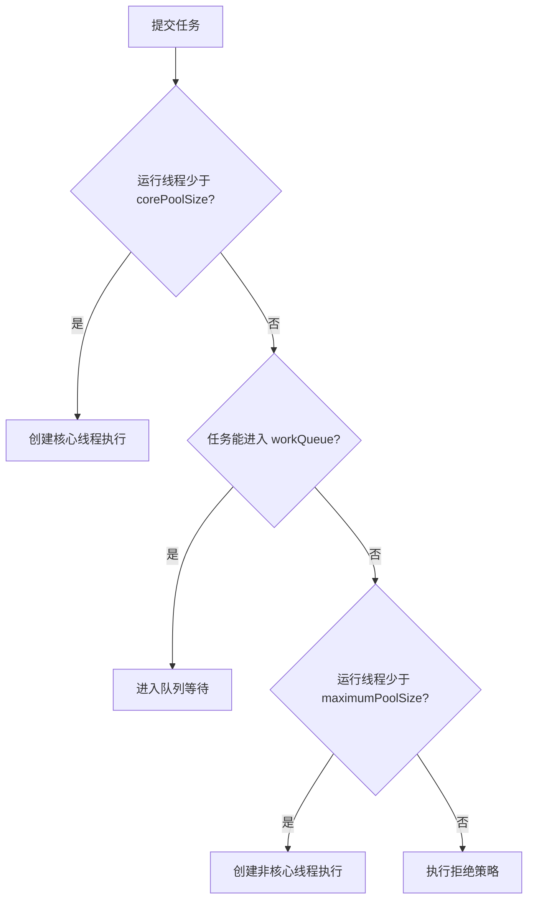

# 😎🤷‍♂️ ThreadPoolExecutor 七大参数与生产实践

线程池不是“线程越多越快”，而是用有限线程和队列控制并发、复用线程并在过载时明确拒绝。核心类名是 `ThreadPoolExecutor`，不是 `ThreadPoolExecutors`。

------

## 一、一份完整构造示例

```java
import java.util.concurrent.ArrayBlockingQueue;
import java.util.concurrent.RejectedExecutionException;
import java.util.concurrent.ThreadFactory;
import java.util.concurrent.ThreadPoolExecutor;
import java.util.concurrent.TimeUnit;
import java.util.concurrent.atomic.AtomicInteger;
import java.util.concurrent.atomic.LongAdder;

AtomicInteger threadNumber = new AtomicInteger();
ThreadFactory threadFactory = task -> {
    Thread thread = new Thread(task);
    thread.setName("order-calculate-" + threadNumber.incrementAndGet());
    thread.setUncaughtExceptionHandler((t, error) ->
            System.err.println(t.getName() + " 执行失败：" + error));
    return thread;
};

LongAdder rejectedCount = new LongAdder();

ThreadPoolExecutor executor = new ThreadPoolExecutor(
        4,                              // corePoolSize
        8,                              // maximumPoolSize
        60,                             // keepAliveTime
        TimeUnit.SECONDS,               // unit
        new ArrayBlockingQueue<>(200),  // workQueue
        threadFactory,                  // threadFactory
        (task, pool) -> {                // rejectedExecutionHandler
            rejectedCount.increment();
            throw new RejectedExecutionException("订单计算线程池已过载");
        });
```

`4、8、200` 只是帮助读代码的示例值，不是通用生产答案。实际容量要结合任务耗时、下游容量、内存和压测结果确定，具体计算见 [[线程数怎么定]]。

## 二、七个核心参数

| 参数 | 类型 | 作用 | 关键约束 |
| --- | --- | --- | --- |
| `corePoolSize` | `int` | 常驻核心线程数量 | 必须 `>= 0` 且不能大于最大线程数 |
| `maximumPoolSize` | `int` | 线程总数上限 | 必须 `> 0` 且不能小于核心线程数 |
| `keepAliveTime` | `long` | 非核心空闲线程回收等待时间 | 配合 `unit` 使用 |
| `unit` | `TimeUnit` | 存活时间单位 | 不要只看数字而忽略单位 |
| `workQueue` | `BlockingQueue<Runnable>` | 保存等待执行的任务 | 容量决定延迟、内存和是否扩容 |
| `threadFactory` | `ThreadFactory` | 创建并命名线程 | 应设置可识别名称和异常处理策略 |
| `handler` | `RejectedExecutionHandler` | 线程与队列都满后的策略 | 拒绝必须可观测，不能悄悄丢关键任务 |

默认情况下，即使设置了核心线程，线程也会在任务到来时按需创建。确实需要提前降低首批请求抖动时，可以调用：

```java
executor.prestartAllCoreThreads();
```

`keepAliveTime` 默认只影响超过核心数的线程；调用 `allowCoreThreadTimeOut(true)` 后，核心线程空闲时也可回收。

## 三、任务提交的完整决策链

线程池收到任务后不是直接创建到 `maximumPoolSize`：



所以：**核心线程满 → 先入队 → 队列满 → 再创建非核心线程 → 全满才拒绝。**

这也解释了为什么无界 `LinkedBlockingQueue` 常让 `maximumPoolSize` 看起来“失效”：任务总能入队，就走不到创建非核心线程的分支。代价是队列可能持续增长，最终带来高延迟甚至 OOM。

## 四、任务队列怎么选

### 4.1 `ArrayBlockingQueue`

固定容量数组队列，内存边界明确，适合大多数需要过载保护的业务线程池。

```java
new ArrayBlockingQueue<Runnable>(200);
```

### 4.2 `LinkedBlockingQueue`

可指定容量；不传容量时上限接近 `Integer.MAX_VALUE`，生产环境通常不应依赖这个默认上限。

```java
new LinkedBlockingQueue<Runnable>(500);
```

### 4.3 `SynchronousQueue`

不保存任务，每个提交都要直接交给可用线程，否则尝试创建新线程。适合任务短、希望快速扩容且最大线程数受严格控制的场景。

### 4.4 `PriorityBlockingQueue`

按优先级取任务，但默认无界，还要处理低优先级饥饿、任务比较规则和同优先级顺序。不能只因为“有重要任务”就贸然使用。

队列容量是在三件事之间做取舍：

- 太小：突发流量时更容易拒绝；
- 太大：请求排队时间增长，超时后任务可能仍在后台执行；
- 无界：缺少内存和延迟边界，故障被隐藏到更晚才爆发。

## 五、四种内置拒绝策略

拒绝发生在“线程达到最大值且队列已满”，或线程池已经关闭时。

| 策略 | 行为 | 风险 |
| --- | --- | --- |
| `AbortPolicy` | 抛出 `RejectedExecutionException` | 调用方必须处理异常；默认策略 |
| `CallerRunsPolicy` | 由提交任务的线程执行 | 能形成反馈压力，但可能拖慢 Web/EventLoop 等关键线程 |
| `DiscardPolicy` | 静默丢弃 | 关键业务不可接受，也不利于排障 |
| `DiscardOldestPolicy` | 丢队头任务，再重试提交当前任务 | 队头不一定最不重要，还可能破坏时序 |

`CallerRunsPolicy` 不是任何场景都安全。例如 Netty EventLoop、消息消费线程或持锁线程提交任务时，由调用线程执行可能阻塞整个上游。

### 自定义拒绝策略

```java
RejectedExecutionHandler handler = (task, executor) -> {
    rejectedCounter.increment();
    log.warn("线程池拒绝任务：active={}, queue={}",
            executor.getActiveCount(),
            executor.getQueue().size());
    throw new RejectedExecutionException("系统繁忙，请稍后重试");
};
```

拒绝策略里不要同步访问慢数据库或阻塞发送 MQ，否则过载时会进一步占住请求线程。需要可靠异步任务时，应在业务入口先把任务写入 MQ 或本地 Outbox，再由消费者处理；线程池拒绝回调不是可靠消息系统。

## 六、`afterExecute` 不能处理“被拒绝的任务”

`afterExecute` 是**任务已经获得线程并执行之后**的钩子。被拒绝的任务根本没有执行，所以不会进入该方法。

它适合做耗时统计、清理 ThreadLocal、统一观察执行异常：

```java
public class ObservedExecutor extends ThreadPoolExecutor {
    // 构造器省略

    @Override
    protected void afterExecute(Runnable task, Throwable error) {
        super.afterExecute(task, error);

        Throwable actual = error;
        if (actual == null && task instanceof Future<?> future
                && future.isDone()) {
            try {
                future.get();
            } catch (CancellationException e) {
                actual = e;
            } catch (ExecutionException e) {
                actual = e.getCause();
            } catch (InterruptedException e) {
                Thread.currentThread().interrupt();
            }
        }

        if (actual != null) {
            log.error("线程池任务执行失败", actual);
        }
    }
}
```

为什么要检查 `Future`？因为 `submit()` 会把异常保存进 `Future`，传给 `afterExecute` 的 `Throwable` 往往是 `null`。

## 七、`execute` 与 `submit` 的异常差异

```java
executor.execute(() -> {
    throw new IllegalStateException("execute failed");
});
```

`execute` 的未捕获异常通常会到线程的 `UncaughtExceptionHandler`，工作线程可能终止后再补建。

```java
Future<?> future = executor.submit(() -> {
    throw new IllegalStateException("submit failed");
});

future.get(); // 这里抛 ExecutionException
```

`submit` 把异常封装在 `Future` 中；如果既不 `get()`，也没有统一钩子，异常可能像“消失”了一样。业务代码应明确结果由谁观察，不能只提交不处理。

## 八、线程数与队列容量怎么定

先确定下游能承受多少并发，再估算线程数：

```text
期望并发数 ≈ 每秒请求数 × 单任务平均耗时（秒）
```

IO 密集任务也可以用等待/计算比估算，但公式只是初值。最终要压测并观察：

- CPU 使用率和上下文切换；
- 活跃线程与最大线程；
- 队列长度和排队时间；
- 任务执行时间与端到端 P99；
- 拒绝数、超时数和下游连接池；
- JVM 堆、GC 和线程栈内存。

线程池不能突破数据库连接池、HTTP 连接池和下游限流的容量。线程设为 200、数据库连接只有 20，往往只是让 180 个线程阻塞等待。

## 九、动态调参的边界

可动态调整：

```java
executor.setCorePoolSize(newCoreSize);
executor.setMaximumPoolSize(newMaximumSize);
executor.setKeepAliveTime(30, TimeUnit.SECONDS);
```

注意：

- 始终满足 `corePoolSize <= maximumPoolSize`，调整顺序也要避免中间状态违规；
- 普通阻塞队列的容量通常不能原地修改，换队列需要迁移或重建线程池；
- 扩容只能缓解执行能力不足，不能修复下游变慢；
- 缩容前要看活跃任务和队列，避免突然大量拒绝；
- Nacos 配置必须有范围校验、审计、指标反馈和回滚机制。

动态线程池不是“发现队列长就一直加线程”。队列长也可能是数据库变慢、锁竞争或网络故障，此时扩容反而放大下游压力。

## 十、优雅停机

```java
executor.shutdown(); // 不再接收新任务，继续处理已提交任务
try {
    if (!executor.awaitTermination(30, TimeUnit.SECONDS)) {
        List<Runnable> dropped = executor.shutdownNow();
        log.warn("强制停止，尚未执行任务数={}", dropped.size());
        if (!executor.awaitTermination(10, TimeUnit.SECONDS)) {
            log.error("线程池未能在截止时间内停止");
        }
    }
} catch (InterruptedException e) {
    executor.shutdownNow();
    Thread.currentThread().interrupt();
}
```

`shutdownNow()` 主要通过中断尝试停止任务，不保证任务立刻结束。任务代码必须正确响应中断，并为外部调用配置超时。

## 十一、生产监控清单

至少采集：

```java
executor.getPoolSize();
executor.getActiveCount();
executor.getLargestPoolSize();
executor.getTaskCount();
executor.getCompletedTaskCount();
executor.getQueue().size();
executor.getQueue().remainingCapacity();
```

此外还需要自己记录拒绝数、任务排队时间、执行时间和超时取消数。告警不要只看当前队列长度，还要看持续时间和增长速度。

## 十二、JDK 21 虚拟线程是否取代线程池

```java
try (ExecutorService executor =
             Executors.newVirtualThreadPerTaskExecutor()) {
    executor.submit(this::callRemoteService);
}
```

虚拟线程很适合大量“同步写法的阻塞 IO”任务，但不代表下游容量无限：

- 数据库连接、HTTP 连接、CPU 和内存仍有限；
- 仍要用 Semaphore、连接池或限流控制并发；
- CPU 密集任务不会因为虚拟线程而变快；
- 长时间 `synchronized` 或本地调用可能造成载体线程固定，需要用 JFR 观察。

平台线程池和虚拟线程应按任务特征选择，而不是把所有线程池机械替换。

## 十三、高频面试题

**1. 为什么无界队列会让最大线程数失效？**

核心线程满后任务总能排队，不会进入“队列满后创建非核心线程”的分支。

**2. 为什么不建议直接使用 `Executors.newFixedThreadPool`？**

它使用无界队列，隐藏了内存与排队延迟边界。显式构造 `ThreadPoolExecutor` 更容易表达容量和拒绝策略。

**3. 线程池满了又不想丢任务怎么办？**

先判断能否让上游限流或同步失败；需要可靠异步时使用 MQ/Outbox，并设计幂等重试。不能仅靠无限队列或在拒绝回调里阻塞写数据库。

**4. 队列长度应该设置多大？**

没有固定答案。用可接受排队时间、任务到达率、单任务内存和突发流量估算，再通过压测校准。

## 十四、官方 API

- [ThreadPoolExecutor](https://docs.oracle.com/en/java/javase/21/docs/api/java.base/java/util/concurrent/ThreadPoolExecutor.html)
- [Executors](https://docs.oracle.com/en/java/javase/21/docs/api/java.base/java/util/concurrent/Executors.html)
- [ExecutorService](https://docs.oracle.com/en/java/javase/21/docs/api/java.base/java/util/concurrent/ExecutorService.html)

------

## 🔗 相关笔记

- [[线程数怎么定]] —— CPU 密集与 IO 密集任务的估算和压测
- [[API/CompletableFuture]] —— 异步任务编排与自定义 Executor
- [[技术栈/分布式与网络/微服务/配置中心/nacos配置中心]] —— 动态配置来源
- [[技术栈/Java与框架/Java/lambda表达式]] —— 线程池任务中的 Lambda
