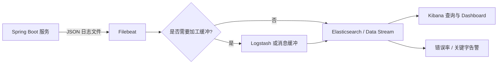

# 分布式日志：从 traceId 到 Filebeat 与 Elasticsearch

> 分布式日志的目标不是“把所有文件搬到一个地方”，而是让一次请求经过网关、多个微服务和 MQ 后，仍能按统一字段快速还原整条链路。

------

## 一、日志、指标、链路追踪分别回答什么

| 信号 | 主要问题 | 示例 |
| --- | --- | --- |
| Logs | 具体发生了什么 | 哪个订单、什么异常、调用参数是否合法 |
| Metrics | 系统整体是否异常 | QPS、错误率、P99、队列长度、JVM 内存 |
| Traces | 一次请求慢在哪里 | 网关 10 ms、订单服务 40 ms、库存服务 800 ms |

三者要通过 `service.name`、`traceId`、`spanId`、环境和实例等字段关联。只有日志没有指标，很难及时发现问题；只有 Trace 没有业务日志，往往不知道具体失败原因。

## 二、推荐采集链路



各组件职责：

- 应用：输出结构化日志，写清业务上下文；
- Filebeat：读取文件、记录 offset、补充主机元数据并发送；
- Logstash：可选，用于复杂解析、清洗和多目的地路由；
- Elasticsearch：索引、检索和生命周期管理；
- Kibana：查询、聚合、仪表盘和告警。

小规模系统可以由 Filebeat 直写 Elasticsearch。需要复杂加工、隔离峰值或多路输出时，再引入 Logstash/消息缓冲，避免一开始堆太多组件。

## 三、先统一日志字段

推荐每条应用日志至少包含：

| 字段 | 含义 | 示例 |
| --- | --- | --- |
| `@timestamp` | 事件时间，统一带时区 | `2026-08-13T10:15:30.123+08:00` |
| `level` | 日志级别 | `INFO`、`WARN`、`ERROR` |
| `service` | 服务名 | `order-service` |
| `env` | 环境 | `dev`、`test`、`prod` |
| `instance` | 实例/Pod | `order-service-7c9...` |
| `traceId` | 一条分布式调用链 | `4f2c...` |
| `spanId` | 当前调用片段 | `a92d...` |
| `requestId` | 业务入口请求标识，可选 | `req-...` |
| `event` | 稳定事件名 | `order.create.failed` |
| `message` | 供人阅读的描述 | `创建订单失败` |
| 业务主键 | 定位业务数据 | `orderId`、`deviceId` |
| `exception.*` | 异常类型、消息、堆栈 | `TimeoutException` |

不要把所有信息拼成一句不可解析的字符串：

```text
不推荐：用户123的订单456调用库存失败了，错误timeout
```

推荐结构：

```json
{
  "level": "ERROR",
  "service": "order-service",
  "traceId": "4f2c8d...",
  "spanId": "a92d1e...",
  "event": "inventory.reserve.failed",
  "orderId": "456",
  "skuId": "10001",
  "message": "预占库存失败",
  "exception.type": "java.util.concurrent.TimeoutException"
}
```

稳定字段用于检索和聚合，`message` 用于阅读。字段名一旦进入索引就尽量保持类型稳定，例如 `orderId` 不要有时是数字、有时又是对象。

## 四、Spring Boot 输出 JSON 日志

Logback 默认文本适合本地阅读，生产集中采集更推荐“一行一个 JSON 对象”。可引入 JSON Encoder：

```xml
<dependency>
    <groupId>net.logstash.logback</groupId>
    <artifactId>logstash-logback-encoder</artifactId>
    <version>${logstash.logback.encoder.version}</version>
</dependency>
```

`logback-spring.xml` 最小示例：

```xml
<?xml version="1.0" encoding="UTF-8"?>
<configuration>
    <springProperty name="serviceName"
                    source="spring.application.name"
                    defaultValue="unknown-service"/>

    <appender name="JSON_FILE"
              class="ch.qos.logback.core.rolling.RollingFileAppender">
        <file>${LOG_PATH:-logs}/application.json</file>

        <rollingPolicy class="ch.qos.logback.core.rolling.SizeAndTimeBasedRollingPolicy">
            <fileNamePattern>${LOG_PATH:-logs}/archive/application.%d{yyyy-MM-dd}.%i.json.gz</fileNamePattern>
            <maxFileSize>100MB</maxFileSize>
            <maxHistory>14</maxHistory>
            <totalSizeCap>10GB</totalSizeCap>
        </rollingPolicy>

        <encoder class="net.logstash.logback.encoder.LogstashEncoder">
            <customFields>{"service":"${serviceName}"}</customFields>
            <includeMdc>true</includeMdc>
        </encoder>
    </appender>

    <root level="INFO">
        <appender-ref ref="JSON_FILE"/>
    </root>
</configuration>
```

版本应由项目统一依赖治理。日志轮转与 Filebeat 的文件识别策略要一起验证，不能在应用刚改名/压缩后就删除尚未采集完的文件。

## 五、traceId 从哪里来

推荐使用 Micrometer Tracing 配合 OpenTelemetry 或 Brave，不要自己用 UUID 模拟完整链路追踪。Spring Boot 在启用 Micrometer Tracing 后，会把当前 `traceId`、`spanId` 关联进日志 MDC。

```text
外部请求携带标准 Trace Context
  -> 服务提取上下文并创建 Server Span
  -> 调用下游时注入 Trace Context
  -> 下游继续同一个 traceId，创建新的 spanId
```

HTTP 客户端应使用框架自动配置的 `RestClient.Builder`、`RestTemplateBuilder` 或 `WebClient.Builder`，否则自动传播可能不生效。OpenFeign、Dubbo 和 RocketMQ 则要启用对应观测集成或编写规范的拦截器/Filter。

### 添加业务字段

```java
import org.slf4j.MDC;

try (MDC.MDCCloseable ignored =
             MDC.putCloseable("orderId", orderId.toString())) {
    log.info("开始创建订单");
    createOrder(orderId);
}
```

必须在 `finally` 或 `MDCCloseable` 中清理。线程池会复用线程，漏清理可能让下一次请求继承上一次的业务字段。

`traceId` 适合技术调用链，`orderId/deviceId` 适合业务链。一个订单可能由定时任务、MQ 重试等多条 Trace 共同处理，所以二者都要保留。

## 六、跨服务与 MQ 如何传播

### 6.1 HTTP / OpenFeign

优先让追踪库按 W3C Trace Context 自动注入和提取 Header，不要自行发明 `X-Trace-Id` 后只复制一个字符串。标准传播不仅包含 Trace ID，还包含父 Span、采样等信息。

用户、租户等业务上下文要单独设计：

- 只传下游确实需要的最小信息；
- 下游不能盲信外部请求直接传来的内部身份 Header；
- Token、手机号、身份证等敏感内容不得写入日志；
- 网关校验身份后再生成可信内部上下文。

### 6.2 Dubbo

使用 Dubbo Filter 在 Consumer 侧注入、Provider 侧提取 Trace Context。注意异步回调和业务线程池切换后的上下文恢复与清理。

### 6.3 RocketMQ / Kafka

生产者把 Trace Context 注入消息属性，消费者提取后创建新的 Consumer Span。业务还应携带独立的 `messageId/eventId`：

```text
traceId   -> 这一次投递与消费调用链
messageId -> 这条业务消息，多次重试仍保持不变
```

消息重试可能创建新的 Trace 或 Span，排查重复消费时必须结合业务 `messageId` 和消费次数。

## 七、Filebeat 最小配置

当前 Filebeat 推荐使用 `filestream` 输入，并为每个输入设置稳定且唯一的 `id`：

```yaml
filebeat.inputs:
  - type: filestream
    id: campus-java-json
    enabled: true
    paths:
      - /var/log/campus/*.json
    parsers:
      - ndjson:
          target: ""
          add_error_key: true
          expand_keys: true
    fields:
      env: prod
    fields_under_root: true

processors:
  - add_host_metadata: ~
  - add_cloud_metadata: ~

output.elasticsearch:
  hosts: ["${ELASTICSEARCH_HOSTS}"]
  api_key: "${ELASTICSEARCH_API_KEY}"
```

关键点：

- `filestream.id` 不要随意修改，否则可能丢失原状态对应关系并造成重复采集；
- JSON 日志保持一条事件一行，异常堆栈作为 JSON 字符串字段，避免再依赖多行正则；
- 凭据从 Secret 或环境变量注入，不提交到 Git；
- Filebeat 会记录文件读取位置，但端到端不能简单宣称“绝不重复”；索引和告警仍要容忍重发；
- 输出阻塞时关注 Filebeat 队列、registry、磁盘和旧日志保留空间。

如果使用容器，优先评估采集 stdout 的 DaemonSet/Agent 方案，避免每个业务容器都运行一个 Filebeat。

## 八、索引与保留策略

日志量通常增长很快，应在上线前确定：

- 按环境、服务还是统一 Data Stream；
- 字段 mapping 与动态字段限制；
- 热数据保留多久、何时转冷、何时删除；
- 哪些审计日志需要更久保留；
- 单条日志最大长度和异常堆栈截断；
- 测试环境是否需要采样或缩短保留时间。

不要把请求 JSON 的任意动态 key 展开为 Elasticsearch 字段，这会造成 mapping explosion。大对象只记录摘要、大小、业务主键或哈希。

## 九、常用查询方式

按一条调用链：

```text
traceId : "4f2c8d..."
```

按服务与错误：

```text
service : "order-service" and level : "ERROR"
```

按业务主键：

```text
orderId : "456"
```

排查顺序：

1. 用告警时间窗口和服务名定位入口错误；
2. 取得 `traceId`，按时间升序还原整条调用链；
3. 找到最早的异常或延迟突增 Span；
4. 用 `orderId/messageId` 查重试、异步消费和补偿任务；
5. 对照 Metrics 判断是个例还是系统性故障。

## 十、日志级别与内容规范

- `ERROR`：当前操作失败，需要处理或告警；
- `WARN`：发生降级、重试或异常状态，但当前操作仍可继续；
- `INFO`：关键生命周期与业务状态变化，不记录每一行循环；
- `DEBUG/TRACE`：排障细节，生产默认关闭或短时、定向开启。

禁止记录：

- 密码、完整 Token、Cookie、私钥；
- 身份证、银行卡、完整手机号等敏感数据；
- 未限制大小的请求体、响应体和文件内容；
- 为了“排障方便”记录完整 SQL 参数中的隐私字段。

异常日志应在最有上下文的一层记录一次。每层都 `log.error` 再抛出，会产生重复堆栈和告警风暴。

## 十一、生产监控与故障清单

| 现象 | 优先检查 | 常见原因 |
| --- | --- | --- |
| 应用有日志，Kibana 查不到 | Filebeat 状态、路径、权限、时间范围 | 路径不匹配、权限不足、时区错误 |
| 同一日志重复 | filestream id、轮转、重发 | 修改输入 ID、文件身份变化、至少一次重试 |
| 异常栈被拆成多条 | 应用输出格式 | 使用了多行文本，解析规则不匹配 |
| traceId 到下游消失 | 客户端构建方式、拦截器、线程切换 | 未使用自动配置客户端、上下文未传播 |
| Elasticsearch 字段爆炸 | mapping、动态 JSON | 把任意请求字段展开成索引字段 |
| 磁盘快速增长 | 采集阻塞、轮转、保留策略 | 下游不可用、应用日志过量、旧文件未清理 |

至少监控：Filebeat 发送失败与积压、日志写入速率、Elasticsearch 索引失败、磁盘水位、查询延迟、ERROR 数和告警噪声。

## 十二、落地步骤

1. 先统一字段、脱敏和日志级别；
2. 在一个服务输出单行 JSON，验证轮转；
3. 接入 Trace，确认 HTTP/RPC/MQ 上下文传播；
4. 用 Filebeat 采集到测试索引；
5. 建立 mapping、保留策略和权限；
6. 创建错误率、超时和关键业务 Dashboard；
7. 人为制造异常，按 `traceId + 业务 ID` 完成一次演练；
8. 再逐服务推广，持续控制成本与敏感信息。

## 十三、官方资料

- [Filebeat filestream 输入](https://www.elastic.co/docs/reference/beats/filebeat/filebeat-input-filestream)
- [Filebeat 工作原理](https://www.elastic.co/docs/reference/beats/filebeat/how-filebeat-works)
- [Spring Boot Micrometer Tracing](https://docs.spring.io/spring-boot/reference/actuator/tracing.html)
- [OpenTelemetry Java 文档](https://opentelemetry.io/docs/languages/java/)

------

## 🔗 相关笔记

- [[../多个微服务之间如何相互调用/OpenFeign]] —— HTTP 跨服务调用
- [[../多个微服务之间如何相互调用/Dubbo]] —— RPC Filter 与调用链传播
- [[../消息队列/RocketMQ学习笔记]] —— 消息属性、重试和消费链路
- [[资料归档/其它/日志级别]] —— 日志级别速查
- [[技术栈/Java与框架/开发常用工具/Actuator与Micrometer]] —— 指标和可观测性
