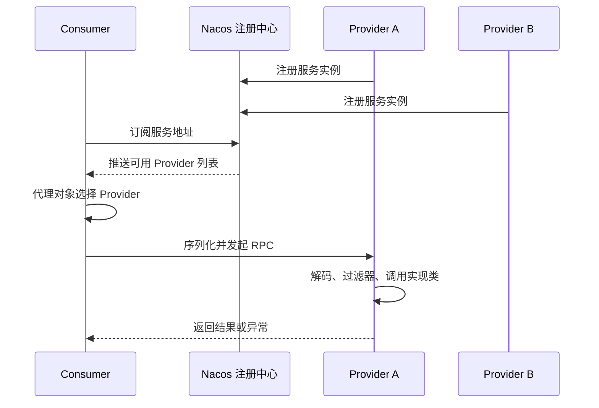

# Dubbo RPC 从入门到工程实践

> Dubbo 的核心作用：让 Consumer 像调用本地 Java 接口一样调用远程 Provider，同时负责服务发现、连接管理、序列化、负载均衡、超时和容错。

------

## 一、先判断是否应该使用 Dubbo

| 方案 | 调用方式 | 适合场景 | 主要代价 |
| --- | --- | --- | --- |
| OpenFeign | HTTP + REST | 对外 API、异构系统、接口便于抓包调试 | 文本协议开销相对大，接口约束较弱 |
| Dubbo | RPC | Java 微服务内部高频调用、强接口契约 | Provider 与 Consumer 耦合更强，需要治理 RPC 接口 |
| MQ | 异步消息 | 解耦、削峰、最终一致、无需立即返回 | 需要处理重复、顺序、积压和最终一致性 |

Dubbo 和 OpenFeign 都是**同步远程调用**：调用方线程通常要等结果，因此下游变慢会沿调用链传播。MQ 不是同步 RPC 的简单替代品；只有业务允许异步化时才选择 MQ。

## 二、一次 Dubbo 调用经历了什么



需要分清三个角色：

- **注册中心**保存“服务在哪里”，不转发每一次业务请求；
- **Consumer**维护 Provider 地址并在本地做负载均衡；
- **Provider**暴露接口实现，通过长连接接收 RPC 请求。

注册中心短暂不可用不一定让已有调用立刻中断，但新实例发现、地址变更和治理规则可能无法更新。

## 三、推荐的模块划分

```text
user-api
  -> 只放 RPC 接口、DTO、异常码和兼容约定

user-provider
  -> 依赖 user-api，实现并发布服务

order-consumer
  -> 依赖 user-api，引用并调用服务
```

不要让 Consumer 直接依赖 Provider 实现模块，否则容易把数据库驱动、Mapper、配置类等无关依赖一并带入。

### 3.1 定义共享接口

```java
package com.example.user.api;

public interface UserQueryService {
    UserDTO findById(Long userId);
}
```

```java
package com.example.user.api;

import java.io.Serializable;

public record UserDTO(Long id, String nickname) implements Serializable {
}
```

RPC DTO 应是稳定的传输契约，不要直接暴露 JPA Entity、MyBatis DO 或包含懒加载对象的领域模型。

### 3.2 Provider 发布服务

```java
import org.apache.dubbo.config.annotation.DubboService;

@DubboService(
        version = "1.0.0",
        group = "campus",
        timeout = 1_000)
public class UserQueryServiceImpl implements UserQueryService {
    private final UserRepository userRepository;

    public UserQueryServiceImpl(UserRepository userRepository) {
        this.userRepository = userRepository;
    }

    @Override
    public UserDTO findById(Long userId) {
        return userRepository.findById(userId)
                .map(user -> new UserDTO(user.id(), user.nickname()))
                .orElse(null);
    }
}
```

### 3.3 Consumer 引用服务

```java
import org.apache.dubbo.config.annotation.DubboReference;

@RestController
@RequestMapping("/orders")
public class OrderController {
    @DubboReference(
            version = "1.0.0",
            group = "campus",
            timeout = 800,
            retries = 0,
            check = false)
    private UserQueryService userQueryService;

    @GetMapping("/{orderId}/user")
    public UserDTO queryUser(@PathVariable Long orderId) {
        Long userId = findUserIdByOrder(orderId);
        return userQueryService.findById(userId);
    }
}
```

`check = false` 允许应用在 Provider 暂时不可用时先启动，不表示调用时不会失败。是否启用要结合服务启动依赖和就绪探针决定。

## 四、Spring Boot 与 Nacos 配置

依赖版本应由父 POM 或 BOM 统一管理，并根据 Spring Boot、JDK 和 Dubbo 的官方兼容表选择：

```xml
<dependency>
    <groupId>org.apache.dubbo</groupId>
    <artifactId>dubbo-spring-boot-starter</artifactId>
</dependency>

<dependency>
    <groupId>org.apache.dubbo</groupId>
    <artifactId>dubbo-nacos-spring-boot-starter</artifactId>
</dependency>
```

Provider：

```yaml
spring:
  application:
    name: user-service

dubbo:
  application:
    name: ${spring.application.name}
  registry:
    address: nacos://${NACOS_HOST:127.0.0.1}:8848
  protocol:
    name: tri
    port: -1
  provider:
    timeout: 1000
```

Consumer 同样配置 `dubbo.application` 和 `dubbo.registry`，不需要开放 Provider 协议端口。生产环境的 Nacos 用户名、密码和命名空间不要硬编码进仓库。

Dubbo 3 常见协议包括：

- `tri`：Triple 协议，适合 Dubbo 3 新项目和跨语言演进；
- `dubbo`：经典高性能二进制协议，存量项目常见。

协议选择必须由调用双方、网关能力和迁移策略共同决定，不能只改单方配置。

## 五、超时、重试与幂等

### 5.1 每个调用都必须有超时

没有超时会让调用线程长期占用，最终拖满线程池和连接。超时应根据接口延迟分位数、上游总预算和降级目标制定，而不是所有接口统一填一个很大的值。

```text
网关总预算 1500 ms
  -> 订单服务本地处理 200 ms
  -> 用户 RPC 预算 400 ms
  -> 库存 RPC 预算 500 ms
  -> 留出网络抖动和返回处理 400 ms
```

长调用链应传递剩余 Deadline。仅让每一跳独立等待 1 秒，三跳调用最坏可能超过上游总预算。

### 5.2 重试只适合幂等操作

`retries = 2` 通常表示首次调用失败后再重试两次，总共最多三次调用。以下操作不要无脑重试：

- 创建订单；
- 扣减库存；
- 付款；
- 发送一次性通知。

查询类接口可根据错误类型做少量重试，并配合总 Deadline、退避和熔断。写接口若必须重试，应携带业务幂等键，由 Provider 去重。

## 六、负载均衡与容错不是一回事

负载均衡解决“这一次选谁”，容错策略解决“调用失败后怎么办”。常见选择思路：

- 实例性能接近：随机或轮询，先保持简单；
- 实例响应差异明显：关注最短响应、活跃调用数等策略；
- 有机房或版本要求：先路由过滤，再在剩余实例中负载均衡；
- 下游异常：快速失败、故障转移、失败安全等策略要按业务语义选择。

重试会放大故障流量。超时、重试、熔断、限流和线程池隔离必须一起设计，不能各自使用默认值。

## 七、接口版本治理

```java
@DubboService(group = "campus", version = "2.0.0")
```

```java
@DubboReference(group = "campus", version = "2.0.0")
```

- `group` 常用于区分业务域、实现组或环境；
- `version` 用于不兼容接口并存和灰度迁移；
- Consumer 与 Provider 的 `interface + group + version` 必须匹配。

兼容演进的原则：

1. 新增可选字段通常比删除、改名安全；
2. 不要改变已有字段的语义；
3. 不兼容修改发布新版本，先部署 Provider，再灰度 Consumer；
4. 确认旧 Consumer 清零后再下线旧 Provider；
5. 用契约测试验证 DTO 序列化和异常兼容性。

## 八、上下文与可观测性

用户身份、租户信息、`traceId` 不会因为“像本地方法调用”就自动可靠传递。推荐使用 Dubbo Filter 和标准追踪组件传播上下文：

```text
HTTP 请求
  -> 网关生成/继续 Trace Context
  -> Consumer Filter 注入 RPC 附件
  -> Provider Filter 提取上下文
  -> 日志 MDC 带 traceId / spanId
```

不要把密码、完整 Token 或超大的业务对象放进附件。线程池切换后还要正确恢复与清理上下文，避免 ThreadLocal 串数据。

至少监控：

- 请求量、成功率、超时率和异常类型；
- P50/P95/P99 延迟；
- Provider 活跃线程、队列和拒绝数；
- Consumer 到各实例的调用分布；
- 注册中心连接与地址推送状态。

## 九、常见故障排查

| 现象 | 优先检查 | 常见原因 |
| --- | --- | --- |
| `No provider available` | 接口、group、version、注册中心 | Provider 未注册、命名空间不同、路由过滤为空 |
| 启动阶段引用失败 | `check`、Provider 状态 | 强启动依赖、配置中心或注册中心不可达 |
| 偶发超时 | P99、线程池、GC、下游 DB | 超时过小、Provider 队列堆积、慢 SQL |
| 写操作重复 | retries、幂等键 | 非幂等接口开启重试、客户端重复提交 |
| 反序列化失败 | DTO 版本、协议、依赖 | 双方契约不兼容、类缺失、字段类型变化 |
| 少数实例流量异常 | 路由、权重、健康状态 | 灰度规则错误、实例假活、长尾延迟 |

排障时先回答：**是否找到 Provider、是否建立连接、请求是否发出、Provider 是否收到、业务是否执行、响应是否返回**。按链路逐段确认，比反复重启更有效。

## 十、上线检查清单

- [ ] API 模块只放稳定契约，没有实现层依赖。
- [ ] 每个接口有超时预算，写接口默认 `retries = 0`。
- [ ] 写操作有业务幂等键或明确不可重试。
- [ ] group/version 与灰度、回滚步骤已经验证。
- [ ] Provider 有限流、线程池容量和过载保护。
- [ ] Trace Context 能跨 RPC 传播，日志可按 traceId 查询。
- [ ] 注册中心、Provider、Consumer 均有健康检查和指标。
- [ ] 优雅下线先摘除流量，再等待在途请求到截止时间。
- [ ] 做过超时、宕机、网络抖动、注册中心不可用演练。

## 十一、官方资料

- [Dubbo Spring Boot 配置](https://dubbo.apache.org/en/overview/mannual/java-sdk/reference-manual/config/spring/spring-boot/)
- [Dubbo 配置项参考](https://dubbo.apache.org/en/overview/mannual/java-sdk/reference-manual/config/properties/)
- [Dubbo 调用超时与 Deadline](https://dubbo.apache.org/en/overview/mannual/java-sdk/tasks/framework/timeout/)
- [Dubbo 官方示例](https://github.com/apache/dubbo-samples)

------

## 🔗 相关笔记

- [[OpenFeign]] —— HTTP 声明式客户端方案
- [[../配置中心/nacos配置中心]] —— Nacos 配置中心与注册中心
- [[../分布式日志/在你的微服务项目中引入分布式日志技术]] —— RPC 调用链日志与 traceId
- [[../消息队列/kafka-quickstart]] —— 允许异步化时的消息方案
