# 二、核心架构详解

## 2.1 整体架构图

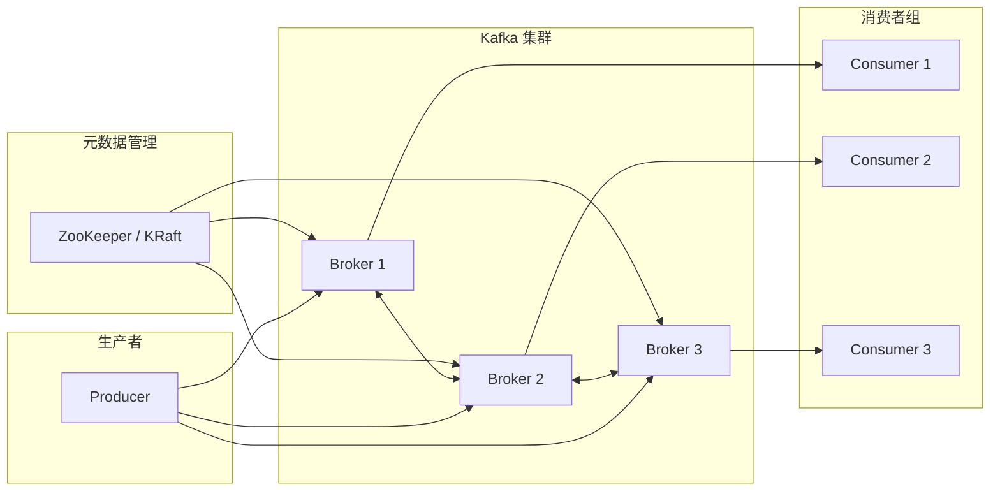

## 2.2 Partition 与 Consumer 分配关系

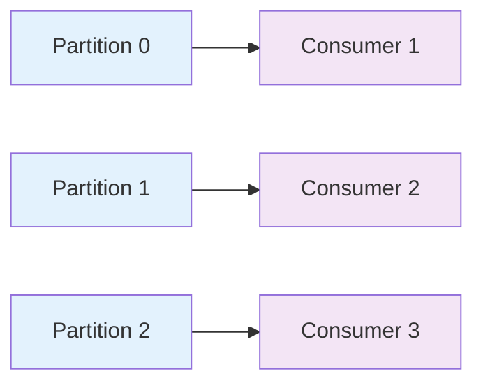

**关键规则：**
1. **一个 Partition 同时只被一个 Consumer 消费**（负载均衡的基础）
2. **消费者数量 ≤ Partition 数量**，否则多余的消费者会空闲
3. **相同 key 的消息永远路由到同一 Partition**（保证同 key 消息的顺序）

## 2.3 消费者数与 Partition 数的关系

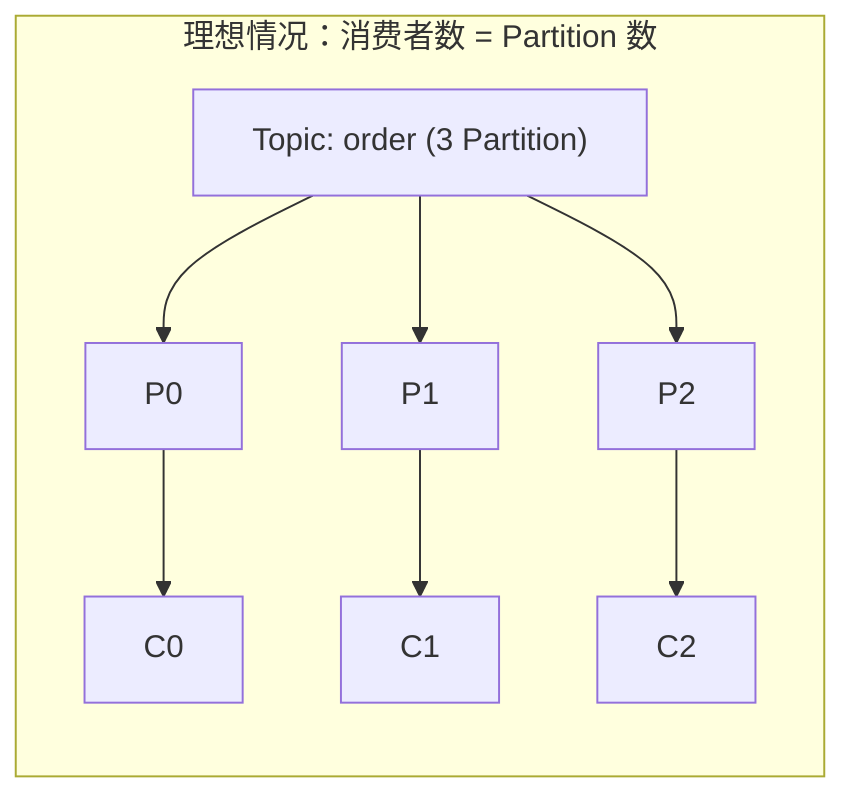

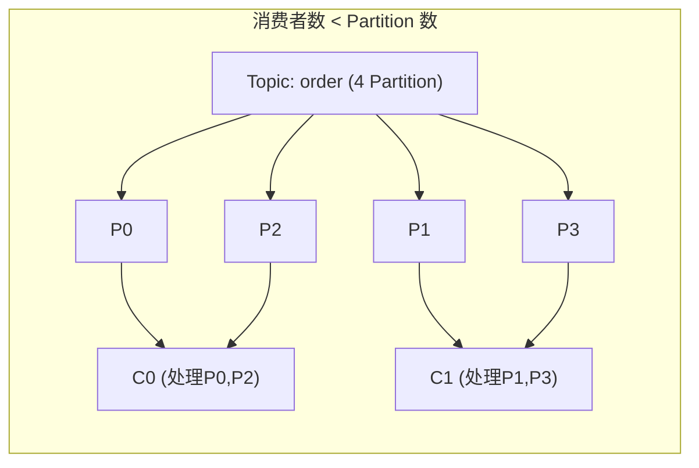

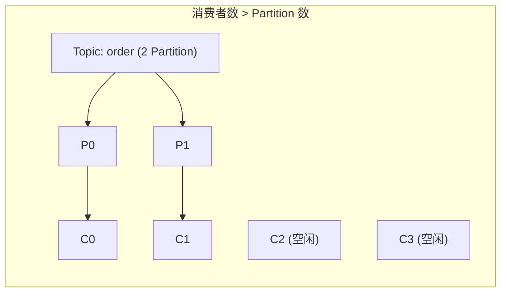

## 2.4 Partition 内部日志结构（⚠️ Kafka 高吞吐的核心设计）

Kafka 把每个 Partition 当成一个**只能追加写、不能修改的日志文件**，再把日志切成一个个 Segment 段来管理。这是 Kafka 高吞吐的基础——理解这一节就理解了 Kafka 一半的设计哲学。

### 2.4.1 磁盘上的目录布局

一个 Topic-Partition 对应磁盘上一个目录，目录里是**并列的 Segment 文件**（不是链表，是同一目录下的多个文件）：

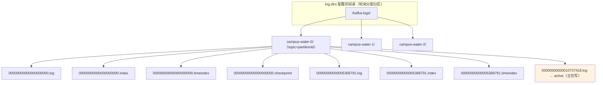

**关键点：**
- 目录命名规则：`<topic>-<partitionId>`，例如 `campus-water-0`、`campus-water-1`
- Segment 文件名 = **20 位零填充的 base offset**，例如 `00000000000000000000.log`（这个段从 offset 0 开始）
- 同一个 base offset 对应**三件套**：
  - `00000000000000000000.log` —— 消息主体（二进制 record batch 流）
  - `00000000000000000000.index` —— offset → 物理位置的稀疏索引
  - `00000000000000000000.timeindex` —— 时间戳 → offset 的稀疏索引
- **active segment**：当前正在被 Producer 写入的那一个段（橙色高亮），写满才滚动成关闭段
- 关闭段还会生成 `.deleted`（待删）、`.cleaned` / `.swap`（compact 中间产物）、`.txnindex`（事务索引，0.11+）等临时文件

### 2.4.2 消息的物理格式（v2 RecordBatch，Kafka 0.11+）

Kafka 0.11 之前是「裸 message」拼接，0.11 之后改成 **RecordBatch → Record** 的两层结构（KIP-98），目的是支持幂等、事务、压缩。Consumer 拿到的 `ConsumerRecord` 是反序列化后的对象，但落盘的是二进制 batch：

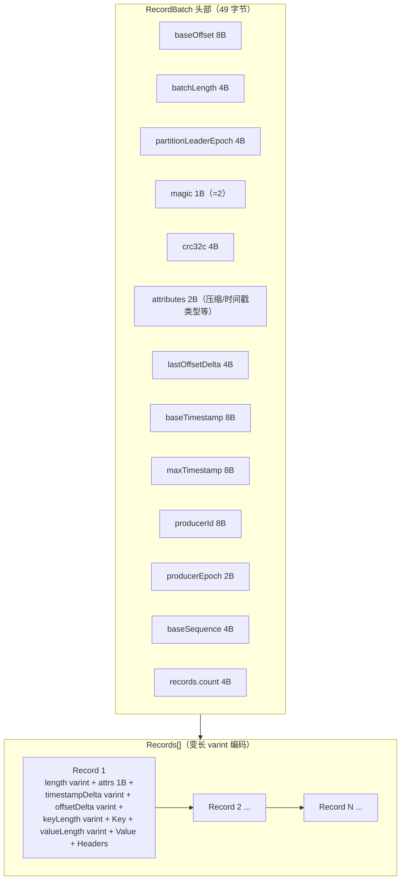

**为什么是 Batch 而不是单条消息？**
- **网络与磁盘 I/O 摊销**：一次顺序写/读多条，比一次写一条快几个数量级
- **压缩友好**：同一批内多条消息一起压缩，重复 key/value 字段能压掉很多
- **幂等与事务载体**：`producerId + baseSequence` 字段为幂等 Producer 提供去重依据
- Kafka 2.8+（KIP-405）增加了 `compactRecordBatch` 单条格式，方便长尾场景

### 2.4.3 索引机制：为什么 .log 不全量扫描？

`.log` 文件动辄几个 GB，全量顺序扫描读一条消息会非常慢。Kafka 的解法是**稀疏索引**：

| 文件 | 每条条目大小 | 含义 |
|------|------------|------|
| `.index` | **8 字节**（4B relativeOffset + 4B physicalPosition） | offset 偏移量 → 在 `.log` 中的字节位置 |
| `.timeindex` | **12 字节**（8B timestamp + 4B relativeOffset） | 时间戳 → offset |

**稀疏的含义**：不是每条消息都建一条索引，而是每写入 **4 KB** 数据（`log.index.interval.bytes = 4096`）才追加一条索引。所以索引文件本身极小（每 GB 数据约 256 KB 索引），可以**全部装入内存甚至 mmap**。

### 2.4.4 Offset 查找流程（Consumer 拉取的核心路径）

以「Consumer 要从 offset 12345 开始读」为例，整个过程只涉及**两次二分 + 一次顺序扫描**：

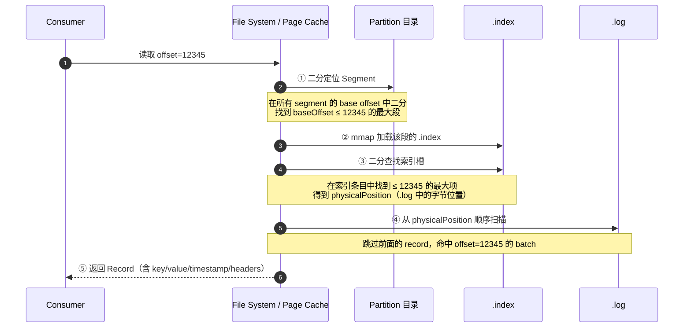

**关键设计：**
- 步骤 ① 的 segment 列表本身就几百字节，可常驻内存
- 步骤 ②③ 的 `.index` 通过 **mmap** 加载到 page cache（KIP-102，0.11+），不走 JVM 堆
- 步骤 ④ 顺序扫描最多扫 4 KB（一个索引区间），磁盘上是顺序 I/O，非常快
- 时间戳查找（`offsetsForTimes`）走 `.timeindex` → 拿到 offset → 再走上面流程

### 2.4.5 Segment 滚动策略（什么时候切新段？）

active segment 写满后会被**关闭**（frozen），下一个消息写到新段里。触发滚动有三种条件，**任一满足就滚动**：

| 触发条件 | 配置项 | 默认值 |
|---------|--------|--------|
| 大小达到阈值 | `log.segment.bytes` | **1073741824（1 GiB）** |
| 打开时长达到阈值 | `log.segment.ms` | **604800000（7 天）** |
| 索引文件大小达到阈值 | `log.index.size.max.bytes` | **10485760（10 MB）** |

另外还有：
- `log.roll.ms` / `log.roll.hours`：强制空段的最大打开时长（避免空段长期存在）
- 关闭后延迟 `file.delete.delay.ms`（默认 60000ms = 1 分钟）才真正物理删除，给 Follower 同步留时间

### 2.4.6 保留与清理（消息什么时候被删？）

两种 cleanup 策略，由 `log.cleanup.policy` 控制：

| 策略 | 配置 | 行为 | 适用场景 |
|------|------|------|---------|
| **delete**（默认） | `log.retention.ms/minutes/hours` / `log.retention.bytes` | 按时间或大小删除旧段 | 通用日志、消息队列 |
| **compact** | `min.cleanable.dirty.ratio` | 只保留每个 key 的最新 value | 状态快照、配置中心（如 `__consumer_offsets`） |

**delete 模式关键参数：**
- `log.retention.hours` 默认 **168（7 天）**
- `log.retention.bytes` 默认 **-1（不限）**
- `log.retention.check.interval.ms` 默认 **300000（5 分钟检查一次）**

**compact 模式关键概念：**
- **tombstone**（墓碑）：用 `null` value 表示「删除该 key」
- tombstone 保留 `delete.retention.ms`（默认 24 小时）后才真正物理删除，给消费侧留缓冲
- `min.cleanable.dirty.ratio` 默认 **0.5**：脏段（未压缩）占比超过 50% 才触发压缩

### 2.4.7 为什么这套设计能做到高吞吐？

| 设计 | 解决的问题 |
|------|-----------|
| **顺序磁盘 I/O** | Producer 只追加写，无随机寻道，机械盘也能扛住高吞吐 |
| **Page Cache** | OS 把热数据缓存在内存，读几乎不落盘 |
| **零拷贝 sendfile** | Consumer fetch 时由 `FileChannel.transferTo` 直接从 page cache 发到 socket，绕过 user space |
| **稀疏索引 + mmap** | 索引文件极小、全部常驻内存；二分查找 O(log n) |
| **批量读写** | Producer/Consumer 都按 batch 收发，摊销网络与系统调用开销 |
| **关闭段只读** | 不需要并发锁，多 Consumer 可并行读，互不干扰 |

**一句话总结**：Kafka 把随机写磁盘变成了顺序写磁盘，把随机读变成了「内存二分 + 顺序读」，所以单机也能扛住百万级 QPS。

### 2.4.8 关键参数速查（Java 后端必背）

| 参数 | 默认值 | 含义 |
|------|--------|------|
| `log.segment.bytes` | 1073741824 | 段大小上限（1 GiB） |
| `log.segment.ms` | 604800000 | 段最长打开时间（7 天） |
| `log.index.interval.bytes` | 4096 | 每 4 KB 数据追加一条索引 |
| `log.index.size.max.bytes` | 10485760 | 索引文件大小上限（10 MB） |
| `log.retention.hours` | 168 | 数据保留时间（7 天） |
| `log.retention.bytes` | -1 | 数据保留大小（不限） |
| `log.cleanup.policy` | `delete` | 清理策略 |
| `log.flush.interval.messages` | Long.MAX_VALUE | 刷盘条数（默认不强制） |
| `file.delete.delay.ms` | 60000 | 关闭段延迟删除时间（1 分钟） |

> 💡 **与 RocketMQ 的对比**：RocketMQ 的 CommitLog 是单个大文件 + ConsumeQueue 索引；Kafka 的 Partition 是**多段小文件 + 稀疏索引**。两者都能做到高吞吐，但 Kafka 的段式设计让删除/压缩更灵活（直接删一个文件即可）。

## 2.5 消费位点管理对比

**RocketMQ 模式：**

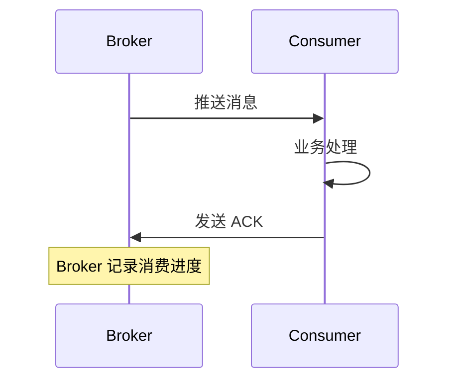

**Kafka 模式：**

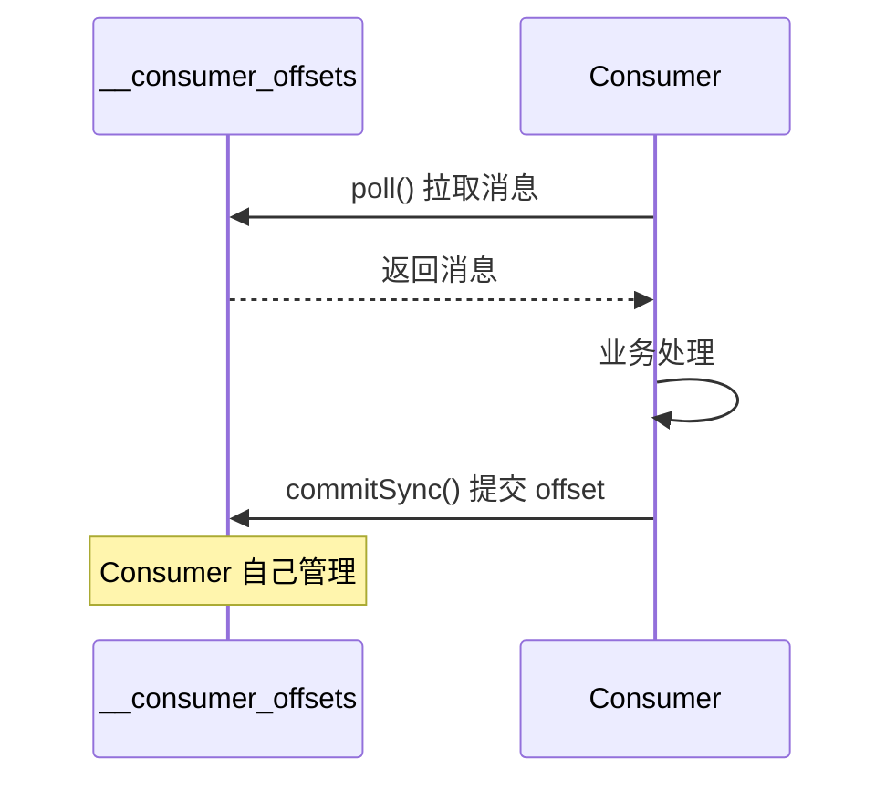

## 2.6 三种消息传递语义

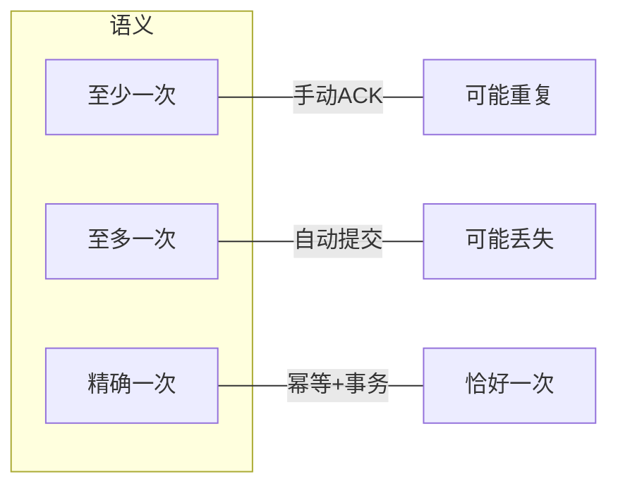

| 语义 | 定义 | 实现方式 | 风险 |
|------|------|---------|------|
| **至少一次** | 消息绝不会丢失，但可能重复消费 | `enable.auto.commit=false` + 手动 `ack.acknowledge()` | 重复消费（需业务方做幂等） |
| **至多一次** | 可能丢失消息，但绝不会重复消费 | `enable.auto.commit=true` + 自动提交 | 消息丢失 |
| **精确一次** | 消息恰好被处理一次 | 幂等 Producer + 事务 Producer + 手动提交 | 实现复杂，Kafka Streams 专用 |

---

