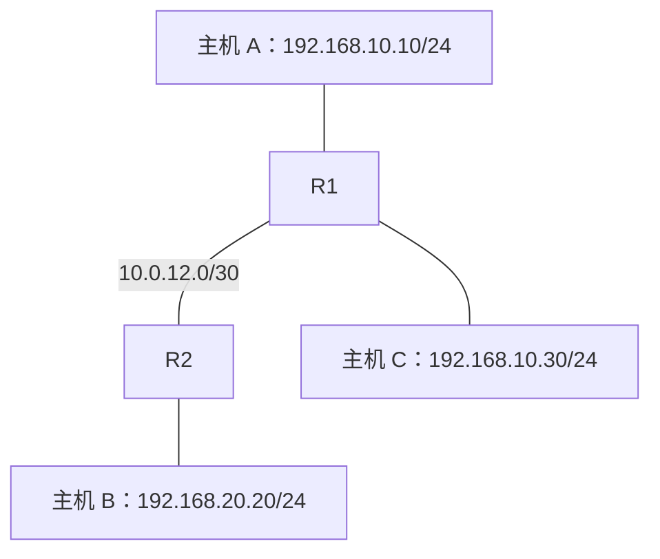

# 25. 多路由器通信：逐跳看地址与路由

[返回网络层学习笔记](<../网络层学习笔记.md>)

## 本章目录

- [25.1 拓扑与地址规划](#251-拓扑与地址规划)
- [25.2 两台路由器需要哪些路由](#252-两台路由器需要哪些路由)
- [25.3 A 发给 B 的每一跳](#253-a-发给-b-的每一跳)
- [25.4 A 发给 C 又怎样](#254-a-发给-c-又怎样)
- [25.5 为什么互联链路用 /30](#255-为什么互联链路用-30)

------

## 25.1 拓扑与地址规划

以下所有链路按以太网简化，路由器不执行 NAT，未配置额外策略。

图中的 A、C 通过同一局域网接入 R1；连线用于表示网络关系，不表示 R1 必须在 A、C 之间执行路由转发。

| 设备／接口 | IP 地址 | 所属网络 |
|---|---|---|
| A | 192.168.10.10/24 | 192.168.10.0/24 |
| C | 192.168.10.30/24 | 192.168.10.0/24 |
| R1 的 LAN 接口 | 192.168.10.1/24 | 192.168.10.0/24 |
| R1 的互联接口 | 10.0.12.1/30 | 10.0.12.0/30 |
| R2 的互联接口 | 10.0.12.2/30 | 10.0.12.0/30 |
| R2 的 LAN 接口 | 192.168.20.1/24 | 192.168.20.0/24 |
| B | 192.168.20.20/24 | 192.168.20.0/24 |

A、C 的默认网关是 `192.168.10.1`；B 的默认网关是 `192.168.20.1`。

## 25.2 两台路由器需要哪些路由

R1 的关键路由：

| 目的前缀 | 下一跳／关系 |
|---|---|
| 192.168.10.0/24 | LAN 直连 |
| 10.0.12.0/30 | 互联链路直连 |
| 192.168.20.0/24 | 经 10.0.12.2 |

R2 的关键路由：

| 目的前缀 | 下一跳／关系 |
|---|---|
| 192.168.20.0/24 | LAN 直连 |
| 10.0.12.0/30 | 互联链路直连 |
| 192.168.10.0/24 | 经 10.0.12.1 |

到对方 LAN 的路由可以静态配置，也可以通过动态协议学习。

**R1 能到 B，并不自动意味着 R2 能把回复送回 A。**往返通信必须检查两个方向。

## 25.3 A 发给 B 的每一跳

设 A 初始 TTL=64。

| 链路 | 源 IP | 目的 IP | 以太网源 MAC | 以太网目的 MAC | 发出时 TTL |
|---|---|---|---|---|---:|
| A → R1 | 192.168.10.10 | 192.168.20.20 | A 的 MAC | R1 LAN MAC | 64 |
| R1 → R2 | 192.168.10.10 | 192.168.20.20 | R1 互联接口 MAC | R2 互联接口 MAC | 63 |
| R2 → B | 192.168.10.10 | 192.168.20.20 | R2 LAN MAC | B 的 MAC | 62 |

必要的 ARP 解析对象依次是：

1. A 解析 `192.168.10.1`。
2. R1 解析 `10.0.12.2`。
3. R2 解析 `192.168.20.20`。

各设备先查自己的缓存，已有有效映射时不必每次重新广播查询。

## 25.4 A 发给 C 又怎样

A 与 C 属于同一直连 `/24`，在普通路由配置中，A 直接解析 C 的 MAC 并发送帧。

帧可以经过交换机，但不需要 R1 做跨网段转发，因此不会仅因为经过二层交换功能而减少 TTL。

## 25.5 为什么互联链路用 /30

`10.0.12.0/30` 有四个地址：

| 地址 | 在这个常规 /30 子网中的用途 |
|---|---|
| 10.0.12.0 | 网络地址 |
| 10.0.12.1 | 可分配给一端 |
| 10.0.12.2 | 可分配给另一端 |
| 10.0.12.3 | 广播地址 |

如果两端支持 RFC 3021，也可使用合适的 `/31` 点到点规划节省地址。上述 `/30` 的 `.0`、`.3` 含义不能直接搬到 `/31`。[4]

------

资料来源与正文中的编号见[参考资料](<32-参考资料.md>)。

[返回目录](<../网络层学习笔记.md>) · [上一章：距离向量路由更新：逐行做题](<24-距离向量路由更新：逐行做题.md>) · [下一章：路由收敛、环路与黑洞](<26-路由收敛、环路与黑洞.md>)
