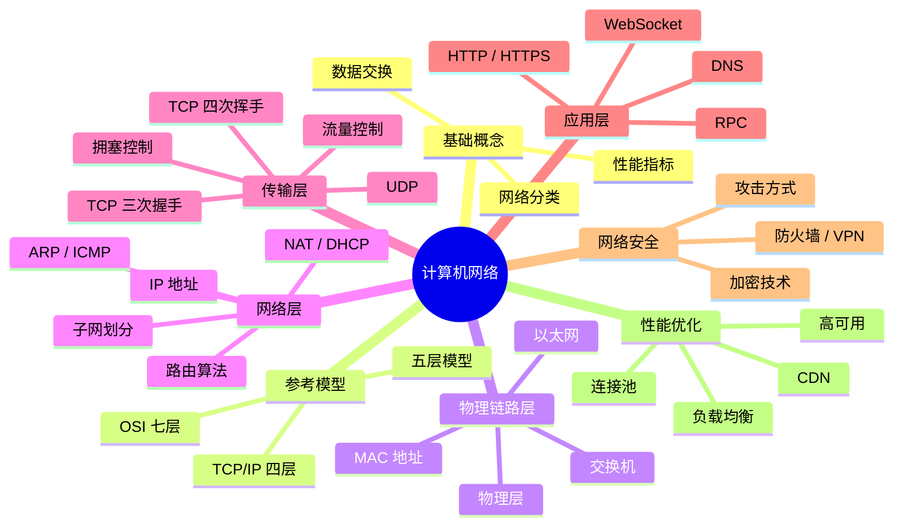

# 🗺️ 知识图谱 (Knowledge Map)

```mermaid
mindmap
  root((计算机网络))
    基础概念
      网络分类
      性能指标
      数据交换
    参考模型
      OSI 七层
      TCP/IP 四层
      五层模型
    物理链路层
      物理层
      MAC 地址
      以太网
      交换机
    网络层
      IP 地址
      子网划分
      ARP / ICMP
      路由算法
      NAT / DHCP
    传输层
      UDP
      TCP 三次握手
      TCP 四次挥手
      流量控制
      拥塞控制
    应用层
      HTTP / HTTPS
      DNS
      WebSocket
      RPC
    网络安全
      攻击方式
      加密技术
      防火墙 / VPN
    性能优化
      CDN
      负载均衡
      高可用
      连接池
```

---

