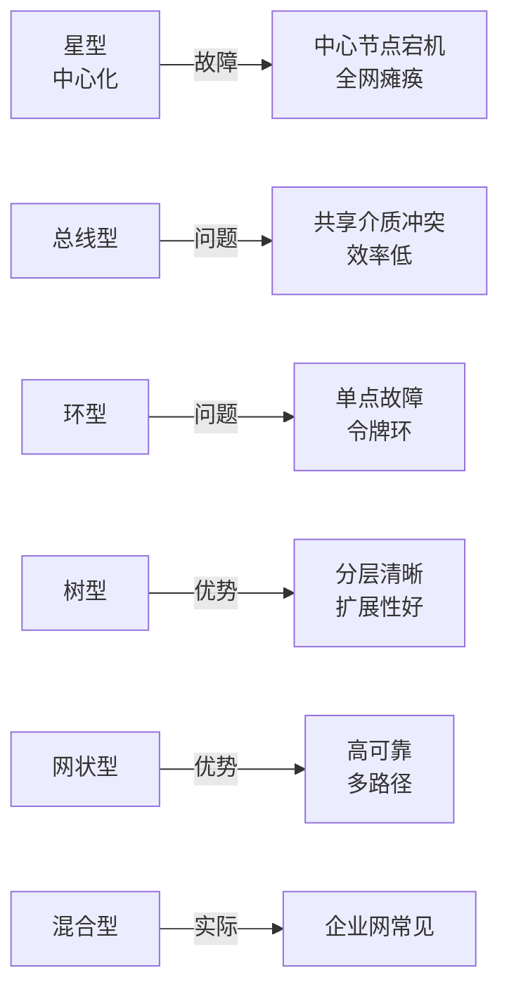
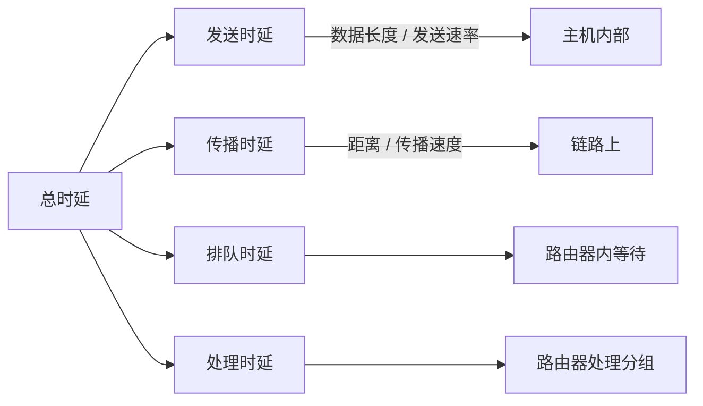
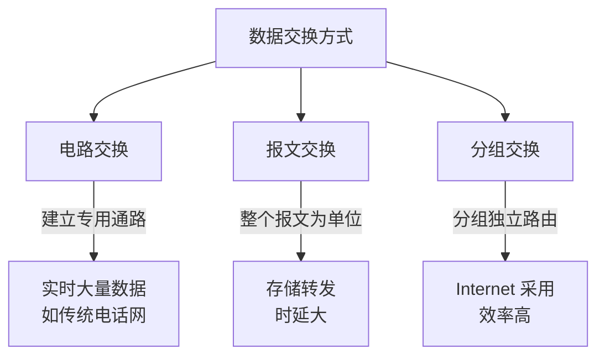

# 一、网络基础概念

## 1.1 计算机网络的定义

计算机网络是指将**地理位置不同**的、具有**独立功能**的多台计算机及其外部设备,通过**通信线路**连接起来,在**网络操作系统、网络管理软件及网络通信协议**的管理和协调下,实现**资源共享和信息传递**的计算机系统。

> 💡 **三要素**:通信主体(计算机/设备) + 通信介质(网线/光纤/无线) + 通信协议(TCP/IP)

## 1.2 网络分类

### 按覆盖范围分类

| 类型 | 全称 | 覆盖范围 | 典型技术 | 速率 | 应用场景 |
|------|------|----------|----------|------|----------|
| **PAN** | Personal Area Network 个人域网 | 1~10m | 蓝牙、红外 | < 1Mbps | 手机、耳机、手表 |
| **LAN** | Local Area Network 局域网 | 10m~10km | 以太网、Wi-Fi | 100Mbps ~ 10Gbps | 公司、校园、家庭 |
| **MAN** | Metropolitan Area Network 城域网 | 10~100km | FDDI、ATM | < 100Mbps | 城市骨干网 |
| **WAN** | Wide Area Network 广域网 | 100km以上 | MPLS、SDH | < 1Gbps | 跨城市、跨国 |
| **Internet** | 因特网 | 全球 | TCP/IP 协议族 | 不限 | 全球互联 |

### 按拓扑结构分类

**详细对比**:

| 拓扑 | 优点 | 缺点 | 适用场景 |
|------|------|------|----------|
| ⭐ **星型** | 结构简单、易扩展 | 中心节点压力大 | 局域网(交换机为中心) |
| 🚌 **总线型** | 布线少、成本低 | 冲突多、效率低 | 早期以太网(已淘汰) |
| 🔄 **环型** | 传输控制简单 | 单点故障 | 令牌环网(已淘汰) |
| 🌳 **树型** | 层次清晰、易扩展 | 根节点故障影响大 | 大型园区网 |
| 🕸️ **网状型** | 高可靠、多路径 | 成本高、复杂 | 互联网骨干网 |

### 按传输介质分类

- **有线网络**:
  - 🔌 **双绞线**(网线):百兆用 1、2 发送,3、6 接收;千兆用全部 8 根
  - 📡 **同轴电缆**:抗干扰性强,曾用于早期以太网和有线电视
  - 💡 **光纤**:单模(远距离,激光) vs 多模(短距离,LED),传输距离远、速度快
- **无线网络**:Wi-Fi、4G/5G、卫星、蓝牙、ZigBee、LoRa

## 1.3 性能指标

### 时延 (Latency) 详解

**公式汇总**:

| 指标 | 公式 | 说明 |
|------|------|------|
| **发送时延** | 数据长度(bit) / 发送速率(bps) | 数据从主机到网卡的时间 |
| **传播时延** | 信道长度(m) / 传播速率(m/s) | 信号在介质上传播时间 |
| **排队时延** | 取决于网络拥塞程度 | 在路由器中等待处理时间 |
| **处理时延** | 取决于路由器性能 | 路由器处理分组时间 |
| **总时延** | 发送 + 传播 + 排队 + 处理 | 数据端到端总时间 |

> 🔑 **总时延 = 发送时延 + 传播时延 + 排队时延 + 处理时延**

### 其他性能指标

| 指标 | 含义 | 单位 | 典型值 |
|------|------|------|--------|
| **带宽 (Bandwidth)** | 最高数据传输速率 | bps | 百兆、千兆 |
| **吞吐量 (Throughput)** | 实际单位时间传输量 | bps | 通常 < 带宽 |
| **RTT (Round-Trip Time)** | 数据往返时间 | ms | 内网 <1ms,公网 10-100ms |
| **丢包率 (Packet Loss)** | 丢失分组 / 总分组 | % | 应 < 1% |
| **利用率** | 信道被占用程度 | % | 过高会产生较大时延 |

> ⚠️ **利用率陷阱**:利用率接近 100% 时,时延会急剧上升。所以利用率一般控制在 50% 以内。

## 1.4 数据交换方式

**三种方式对比**:

| 方式 | 建立连接 | 资源占用 | 可靠性 | 适用场景 |
|------|---------|---------|--------|----------|
| 电路交换 | 需要 | 独占 | 高 | 实时通话(传统电话) |
| 报文交换 | 不需要 | 共享 | 中 | 电报(已淘汰) |
| 分组交换 | 不需要 | 共享 | 中 | Internet(主流) |

---

