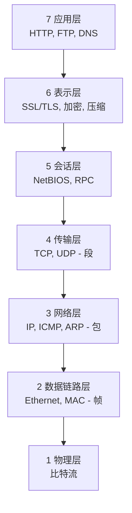
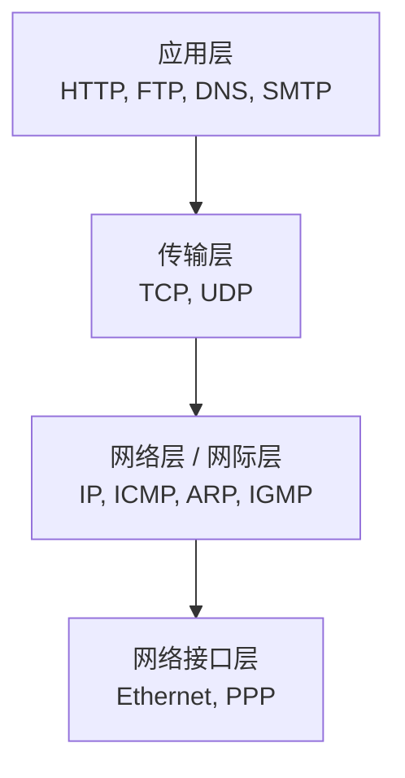
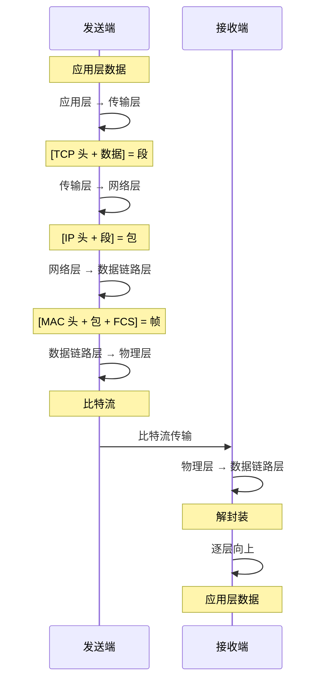

# 二、网络参考模型

## 2.1 OSI 七层模型 (理论模型)



| 层 | 名称 | 主要功能 | 典型协议/设备 | 数据单位 |
|----|------|----------|---------------|----------|
| 7 | **应用层** | 为用户提供网络服务 | HTTP、FTP、SMTP、DNS | 报文(Message) |
| 6 | **表示层** | 数据表示、加密、压缩 | SSL/TLS、JPEG、ASCII | 报文 |
| 5 | **会话层** | 建立、管理、终止会话 | NetBIOS、RPC | 报文 |
| 4 | **传输层** | 端到端可靠传输、流量控制 | TCP、UDP | 段(Segment) |
| 3 | **网络层** | 路由选择、分组转发 | IP、ICMP、ARP、OSPF | 包(Packet) |
| 2 | **数据链路层** | 帧的封装、差错检测、流量控制 | Ethernet、PPP、HDLC | 帧(Frame) |
| 1 | **物理层** | 比特流传输 | 网线、光纤、集线器 | 比特(Bit) |

> 🧠 **记忆口诀**:
> - 中文版(自下而上):**"物数网传会表应"** = 物理 → 数据链路 → 网络 → 传输 → 会话 → 表示 → 应用
> - 英文版(自下而上):**"All People Seem To Need Data Processing"** 或 **"Please Do Not Throw Sausage Pizza Away"**

## 2.2 TCP/IP 四层模型 (实际模型)



| TCP/IP 层 | 对应 OSI 层 | 主要协议 | 关键设备 |
|-----------|-------------|----------|----------|
| **应用层** | 应用层 + 表示层 + 会话层 | HTTP、FTP、SMTP、DNS、Telnet | 主机进程 |
| **传输层** | 传输层 | TCP、UDP | 操作系统内核 |
| **网络层 (网际层)** | 网络层 | IP、ICMP、IGMP、ARP | 路由器 |
| **网络接口层** | 数据链路层 + 物理层 | Ethernet、PPP、帧中继 | 交换机、网卡 |

## 2.3 五层模型 (教学模型)

折中方案: **应用层 → 传输层 → 网络层 → 数据链路层 → 物理层**

> 💡 五层模型是大学教学和国内教材最常用的模型,综合了 OSI 和 TCP/IP 的优点。

## 2.4 数据传输过程



**封装过程示意**:
```
应用层数据  → [传输层头部 + 应用数据] = 段 (Segment)
段          → [网络层头部 + 段]       = 包 (Packet)
包          → [数据链路层头部 + 包 + 尾部] = 帧 (Frame)
帧          → 物理层转换为比特流 (Bit Stream)
```

**数据单位演变**:

| 层级 | 数据单位 | 英文 | 说明 |
|------|---------|------|------|
| 应用层 | 报文 | Message | 用户数据 |
| 传输层 | 段 | Segment | TCP 头 + 数据 |
| 网络层 | 包 | Packet | IP 头 + 段 |
| 数据链路层 | 帧 | Frame | MAC 头 + 包 + FCS |
| 物理层 | 比特流 | Bit | 0/1 信号 |

---

