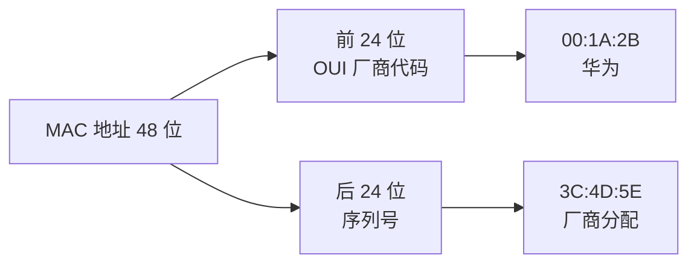
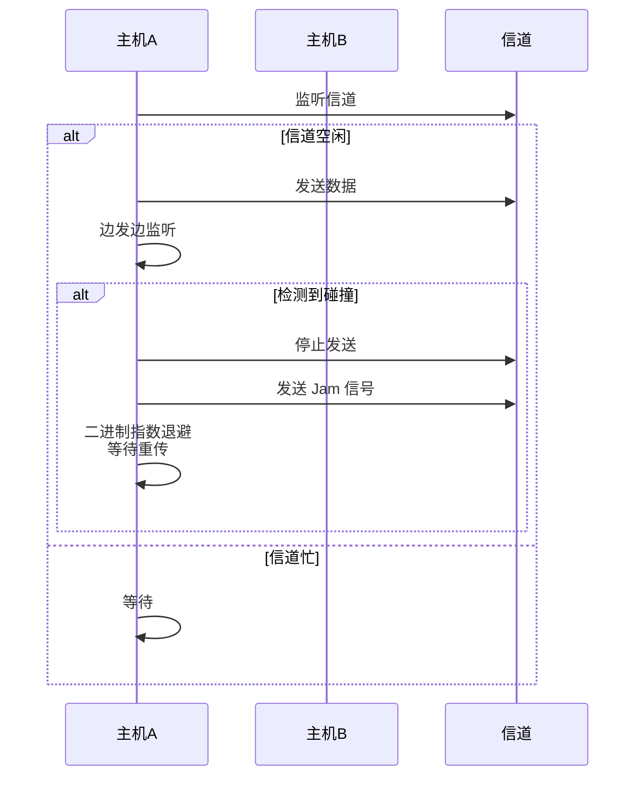
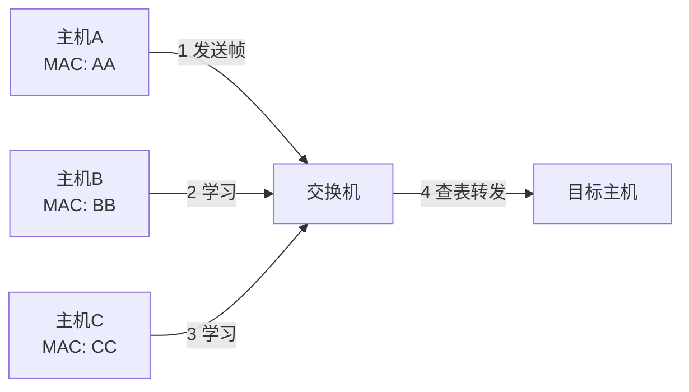

# 三、物理层与数据链路层

## 3.1 物理层基础

- **信号类型**:
  - 📊 **模拟信号**:连续变化的信号(传统电话)
  - 🔢 **数字信号**:离散的两个电平(0/1)
- **编码方式**:
  - **NRZ (不归零编码)**:简单但无同步能力
  - **曼彻斯特编码**:每位中间有跳变,自带时钟(以太网使用)
  - **差分曼彻斯特编码**:抗干扰更强
- **复用技术**:

| 技术 | 全称 | 原理 | 应用 |
|------|------|------|------|
| **TDM** | 时分复用 | 按时间片轮转 | 数字电话 |
| **FDM** | 频分复用 | 按频率划分 | 无线电广播 |
| **WDM** | 波分复用 | 按光波长划分 | 光纤通信 |
| **CDM** | 码分复用 | 按编码区分 | 3G 移动通信 |

- **传输介质**:
  - 🔌 **双绞线**:百兆用 1、2 发送,3、6 接收;Cat5e/Cat6/Cat7 等级
  - 📡 **同轴电缆**:抗干扰性强,曾用于早期以太网
  - 💡 **光纤**:
    - **单模光纤**:激光、长距离(几十公里)、成本高
    - **多模光纤**:LED、短距离(几百米)、成本低

## 3.2 数据链路层

### 3.2.1 主要功能

1. **封装成帧**:添加帧头、帧尾,进行帧定界
2. **透明传输**:处理数据中出现的特殊字符(字符填充/比特填充)
3. **差错检测**:CRC 校验、和校验
4. **流量控制**:协调发送方与接收方速率

### 3.2.2 MAC 地址

- 48 位(6 字节)的物理地址
- 格式: `XX-XX-XX-XX-XX-XX` 或 `XX:XX:XX:XX:XX:XX`
- 前 24 位为**厂商代码 (OUI)**,后 24 位为厂商分配
- 唯一标识网络接口卡(NIC)



**特殊 MAC 地址**:

| MAC 地址 | 含义 |
|----------|------|
| `FF:FF:FF:FF:FF:FF` | 广播地址 |
| `00:00:00:00:00:00` | 全 0 地址(未分配) |
| `01:00:5E:xx:xx:xx` | IPv4 组播地址映射 |

### 3.2.3 以太网 (Ethernet)

| 类型 | 速率 | 标准 | 介质 |
|------|------|------|------|
| 标准以太网 | 10Mbps | 10Base-T | 双绞线 |
| 快速以太网 | 100Mbps | 100Base-TX | 双绞线 |
| 千兆以太网 | 1Gbps | 1000Base-T | 双绞线/光纤 |
| 万兆以太网 | 10Gbps | 10GBase-T | 光纤/双绞线 |
| 100G 以太网 | 100Gbps | 100GBase-SR4 | 光纤 |

**以太网帧格式**:
```
| 前导码(7B) | 帧开始定界符(1B) | 目的MAC(6B) | 源MAC(6B) | 类型(2B) | 数据(46-1500B) | FCS(4B) |
```

> 💡 **MTU (Maximum Transmission Unit)**: 最大传输单元,通常 **1500 字节**,超过会分片。

### 3.2.4 CSMA/CD 协议 (载波监听多路访问/碰撞检测)



**CSMA/CD 工作流程**:
1. **监听信道**: 空闲则发送,忙则等待
2. **边发送边监听**: 检测到碰撞立即停止
3. **碰撞后**: 发送人为干扰信号(Jam),采用**二进制指数退避算法**等待重传

> ⚠️ CSMA/CD 已基本被全双工交换式以太网取代(交换机隔离冲突域)。

### 3.2.5 交换机的自学习算法

通过查看帧的**源 MAC 地址**,记录 MAC 地址与端口的对应关系,生成 **MAC 地址表**。



**MAC 地址表示例**:

| MAC 地址 | 端口 | 老化时间 |
|----------|------|----------|
| AA:AA:AA:AA:AA:AA | 1 | 300s |
| BB:BB:BB:BB:BB:BB | 2 | 300s |

---

