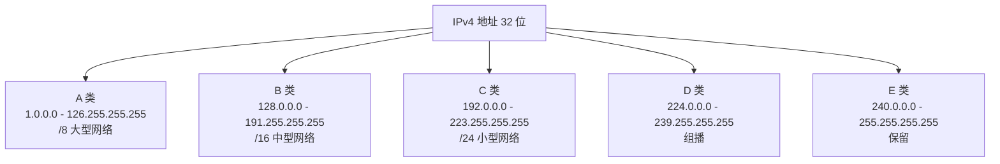
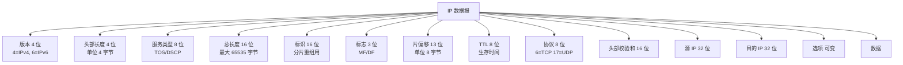
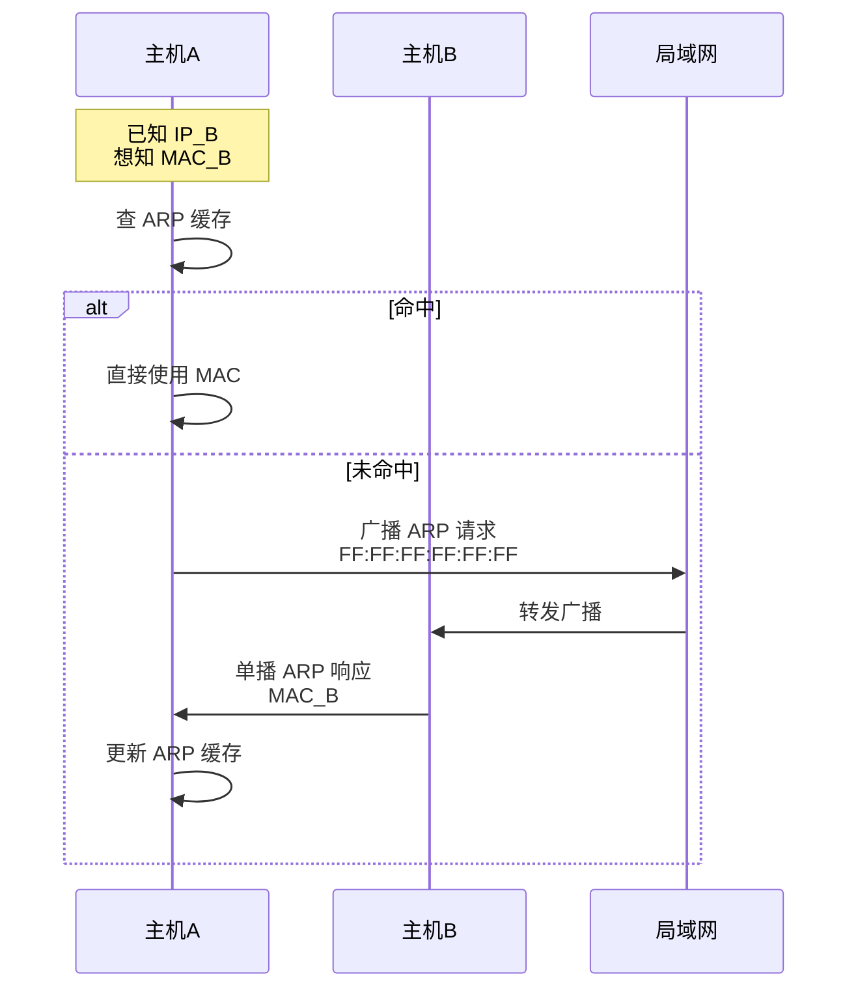
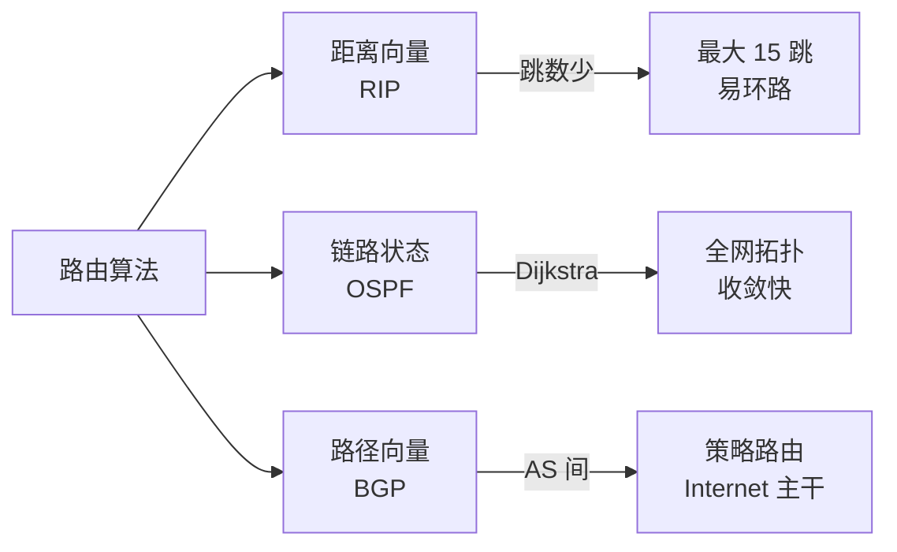
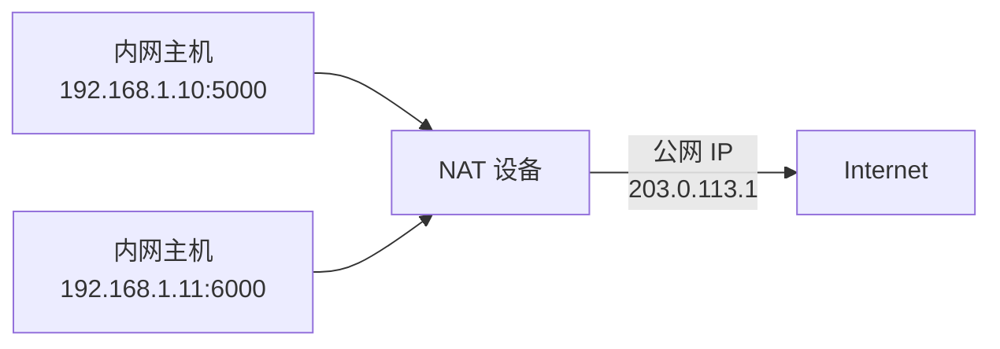
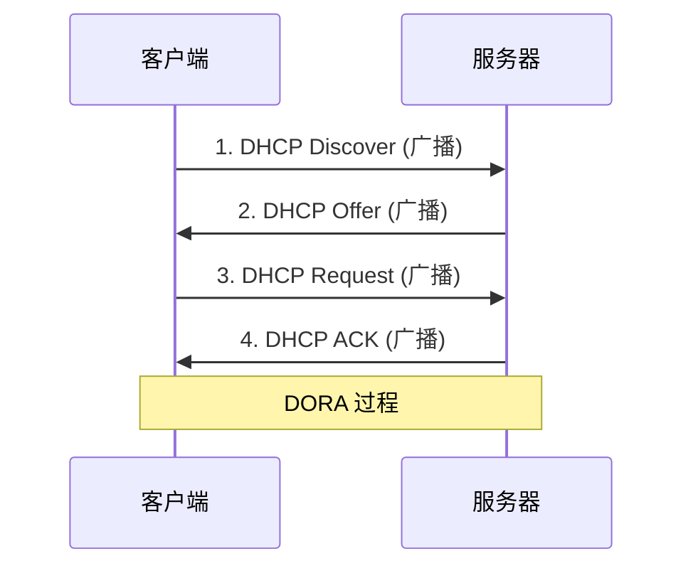

# 四、网络层

## 4.1 IP 地址

### 4.1.1 IP 地址分类 (IPv4, 32 位)



| 类别 | 范围 | 默认子网掩码 | 网络位数 | 主机位数 | 用途 |
|------|------|--------------|----------|----------|------|
| A 类 | 1.0.0.0 ~ 126.255.255.255 | 255.0.0.0 (/8) | 8 | 24 | 大型网络 |
| B 类 | 128.0.0.0 ~ 191.255.255.255 | 255.255.0.0 (/16) | 16 | 16 | 中型网络 |
| C 类 | 192.0.0.0 ~ 223.255.255.255 | 255.255.255.0 (/24) | 24 | 8 | 小型网络 |
| D 类 | 224.0.0.0 ~ 239.255.255.255 | - | - | - | 组播 |
| E 类 | 240.0.0.0 ~ 255.255.255.255 | - | - | - | 保留 |

**特殊 IP 地址**:

| IP 地址 | 含义 |
|---------|------|
| `127.0.0.1` | 本地回环地址(localhost) |
| `0.0.0.0` | 表示本机或默认路由 |
| `255.255.255.255` | 有限广播地址 |
| `169.254.x.x` | APIPA 自动分配地址(DHCP 失败) |
| `10.x.x.x` | 私有 A 类 |
| `172.16.x.x ~ 172.31.x.x` | 私有 B 类 |
| `192.168.x.x` | 私有 C 类 |

> 🧠 **记忆**:私有地址口诀 **"1 个 A,12 个 B,256 个 C"** = 10.x / 172.16-31.x / 192.168.x

### 4.1.2 CIDR (无类域间路由)

- 表示方法: `IP/前缀长度`,如 `192.168.1.0/24`
- 消除了传统分类的局限性,提高地址利用率
- 路由聚合(超网):`192.168.0.0/16` 包含 256 个 C 类

**路由聚合示例**:
```
192.168.0.0/24  ─┐
192.168.1.0/24  ─┼─→  192.168.0.0/22  (聚合)
192.168.2.0/24  ─┤
192.168.3.0/24  ─┘
```

### 4.1.3 子网划分

**示例**: `192.168.1.0/26` 划分:
- 子网掩码: `255.255.255.192`
- 每个子网: 64 个地址
- 可用主机数: **62 个** (减去网络地址和广播地址)

**计算公式**:
- 子网数 = 2^(子网位数)
- 主机数 = 2^(主机位数) - 2

### 4.1.4 IPv4 vs IPv6 对比

| 特性 | IPv4 | IPv6 |
|------|------|------|
| 地址长度 | 32 位 | 128 位 |
| 地址数量 | ~43 亿 | 3.4 × 10³⁸ |
| 表示 | 点分十进制 | 冒号十六进制 |
| 示例 | 192.168.1.1 | 2001:db8::1 |
| 头部 | 复杂(变长) | 简化(固定 40B) |
| 校验和 | 有 | 无(由链路层保证) |
| 安全性 | 需额外配 IPSec | 内置 IPSec |
| 广播 | 支持 | 无,改用组播 |
| 配置 | 手动/DHCP | 自动(SLAAC) |

**IPv6 简写规则**:
- 前导零可省略: `2001:0db8` → `2001:db8`
- 连续零可压缩: `2001:0db8:0000:0000:0000:0000:0000:0001` → `2001:db8::1`

## 4.2 IP 数据报格式



**关键字段**:
- **TTL (Time To Live)**: 生存时间,每经过一个路由器减 1,防止数据包无限循环(默认 64)
- **协议**: 6=TCP, 17=UDP, 1=ICMP
- **片偏移**: 分片后该片在原分组中的相对位置(单位 8 字节)

## 4.3 ARP 协议 (地址解析协议)



- **作用**: 将 IP 地址解析为 MAC 地址
- **流程**:
  1. 检查 ARP 缓存,命中则返回 MAC
  2. 未命中则**广播** ARP 请求(目的 MAC 为 `FF:FF:FF:FF:FF:FF`)
  3. 目标主机**单播** ARP 响应
  4. 主机更新 ARP 缓存
- **ARP 欺骗**: 中间人攻击常用手段(伪造 ARP 响应)

> 💡 **RARP**: 反向 ARP(由 MAC 找 IP),现在已被 BOOTP、DHCP 取代。

## 4.4 ICMP 协议 (网际控制报文协议)

- 用于报告错误和异常
- 常见报文:

| 类型 | 代码 | 名称 | 用途 |
|------|------|------|------|
| 0 | 0 | Echo Reply | Ping 响应 |
| 3 | 0-15 | Destination Unreachable | 目的不可达 |
| 8 | 0 | Echo Request | Ping 请求 |
| 11 | 0 | Time Exceeded | TTL 超时 |

**Ping 工作原理**:
```
本机 → ICMP Echo Request (类型 8) → 目标主机
本机 ← ICMP Echo Reply (类型 0) ← 目标主机
```

**Traceroute 工作原理**:
```
发送 TTL=1 的 UDP 包 → 收到 ICMP Time Exceeded(第一跳路由器)
发送 TTL=2 的 UDP 包 → 收到 ICMP Time Exceeded(第二跳路由器)
...
发送 TTL=N 的 UDP 包 → 收到 ICMP Port Unreachable(到达目标)
```

## 4.5 路由算法对比



| 协议 | 类型 | 算法 | 范围 | 收敛速度 | 适用规模 |
|------|------|------|------|----------|----------|
| **RIP** | 距离向量 | Bellman-Ford | IGP | 慢 | 小型网络 |
| **OSPF** | 链路状态 | Dijkstra | IGP | 快 | 大型网络 |
| **IS-IS** | 链路状态 | Dijkstra | IGP | 快 | ISP 骨干 |
| **BGP** | 路径向量 | 路径属性 | EGP | 中 | Internet 主干 |

### 4.5.1 距离向量算法 (RIP)

- 每个路由器维护到目的网络的**距离(跳数)**
- 定期与邻居交换**完整**路由表
- **最大跳数 15**,16 跳视为不可达
- 收敛慢,易产生路由环路

### 4.5.2 链路状态算法 (OSPF)

- 每台路由器拥有**完整拓扑**
- 通过**洪泛法**传播链路状态
- 采用 **Dijkstra** 最短路径算法
- 收敛快,适合大型网络
- 支持**分层(区域)设计**:骨干区域(area 0) + 普通区域

### 4.5.3 路径向量算法 (BGP)

- 用于**自治系统 (AS)** 之间的路由
- 路径属性中包含 AS 路径信息
- 防止环路、支持策略路由
- 当前 Internet 主干使用 **BGP-4**

## 4.6 NAT (网络地址转换)



- 解决 IPv4 地址不足
- 私有 IP ↔ 公有 IP 转换
- 类型:

| 类型 | 说明 | 一对一 |
|------|------|--------|
| 静态 NAT | 固定映射 | 是 |
| 动态 NAT | 动态分配公网 IP | 临时 |
| **PAT (NAPT)** | 端口地址转换(常用) | 多个内网共享一个公网 IP |

> 💡 **NAPT 工作原理**:通过 (IP + 端口) 组合区分不同内网主机。

## 4.7 DHCP 协议



- 自动分配 IP 地址
- 四步过程: **Discover → Offer → Request → ACK (DORA)**
- 基于 **UDP**, 客户端端口 68,服务端端口 67
- 租期通常 24 小时,到期前需续约

## 4.8 路由器与三层交换机

| 设备 | 工作层 | 功能 | 适用 |
|------|--------|------|------|
| **集线器 (Hub)** | 物理层 | 简单信号放大、广播 | 已淘汰 |
| **交换机 (Switch)** | 数据链路层 | 基于 MAC 转发、隔离冲突域 | 局域网 |
| **路由器 (Router)** | 网络层 | 基于 IP 转发、隔离广播域 | 跨网段 |
| **三层交换机** | 网络层+数据链路层 | 二层交换+三层路由、VLAN 间通信 | 园区网核心 |

---

