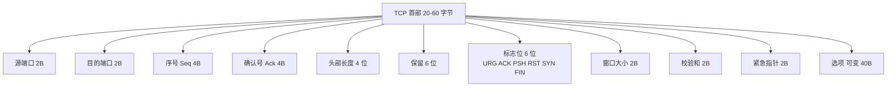
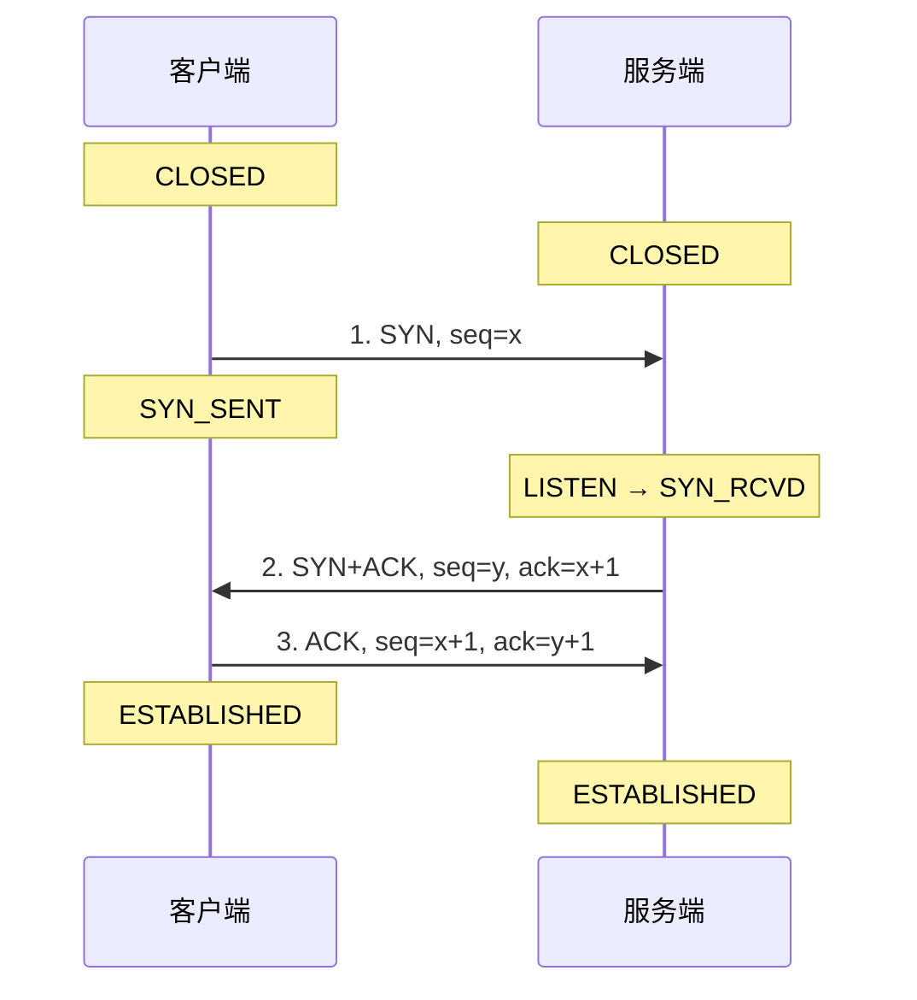
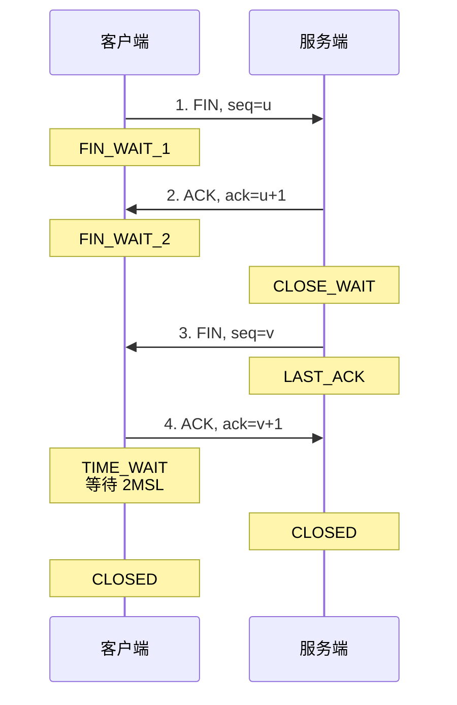
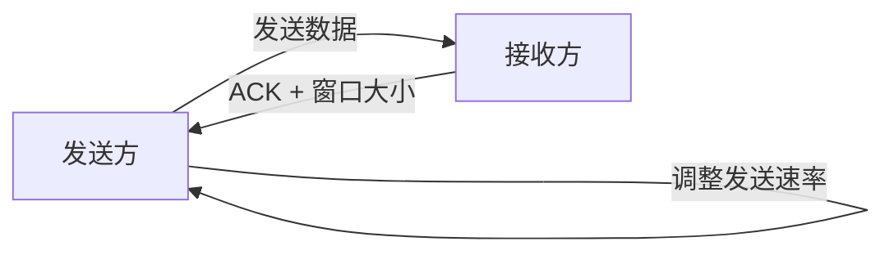
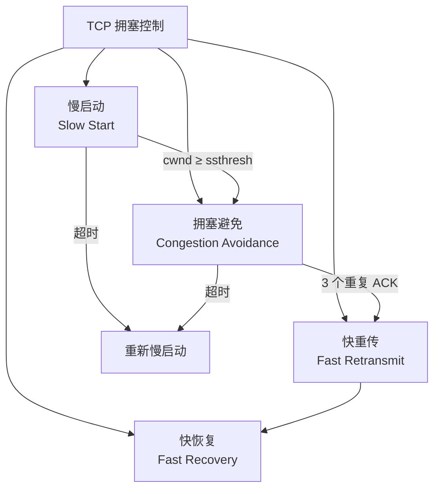

# 五、传输层

## 5.1 端口号

- 16 位,范围 0~65535
- **知名端口 0~1023**:HTTP(80)、HTTPS(443)、FTP(21)、SSH(22)、DNS(53)、Telnet(23)、SMTP(25)、POP3(110)
- **注册端口 1024~49151**
- **动态/私有端口 49152~65535**

## 5.2 UDP (用户数据报协议)

### 5.2.1 特点

- 🚀 **无连接** - 发送前不建立连接
- 🎯 **尽最大努力交付** - 不保证可靠
- 📦 **面向报文** (不拆分、不合并)
- 🚫 **没有拥塞控制**
- 📡 支持一对一、一对多、多对多通信
- 🪶 首部开销小,仅 **8 字节**

### 5.2.2 首部格式

```
| 源端口(2B) | 目的端口(2B) |
| 长度(2B)   | 校验和(2B)   |
```

> 💡 UDP 首部 8 字节 = 2(源端口) + 2(目的端口) + 2(长度) + 2(校验和)

### 5.2.3 适用场景

| 场景 | 原因 |
|------|------|
| 🎮 视频直播、实时游戏 | 低延迟优先,可容忍丢包 |
| 🔍 DNS 查询 | 简单请求-响应 |
| 📞 VoIP | 实时语音,丢包重传意义不大 |
| 📊 SNMP | 简单网络管理 |
| 📡 广播/组播 | TCP 不支持 |

## 5.3 TCP (传输控制协议)

### 5.3.1 特点

- 🤝 **面向连接** (三次握手、四次挥手)
- 🛡️ **可靠传输** (确认、超时重传、序号、校验和)
- 🌊 **面向字节流**
- 🗣️ **全双工通信**
- 🚦 **流量控制** + **拥塞控制**

### 5.3.2 TCP 首部 (20~60 字节)



**6 个标志位详解**:

| 标志 | 全称 | 含义 |
|------|------|------|
| **URG** | Urgent | 紧急指针有效 |
| **ACK** | Acknowledgment | 确认号有效 |
| **PSH** | Push | 接收方应尽快交付应用 |
| **RST** | Reset | 复位,异常关闭连接 |
| **SYN** | Synchronize | 同步,发起连接 |
| **FIN** | Finish | 终止,释放连接 |

> 🧠 **记忆口诀**: **"UAPRSF"** = "Unacceptable Actions Produce Resentful Servers Frequently" 😄

### 5.3.3 三次握手 (建立连接) ⭐⭐⭐



**为什么是三次而不是两次?**
- 防止**已失效的连接请求**突然传到服务器,造成资源浪费
- 双方都需要确认**对方的收发能力**:
  - 第一次: 客户端证明自己**能发**
  - 第二次: 服务端证明自己**能收能发**
  - 第三次: 客户端证明自己**能收**

**为什么不是四次?**
- 服务端可以把 **SYN 和 ACK 合并**为一次发送(捎带确认)

### 5.3.4 四次挥手 (释放连接) ⭐⭐⭐



**为什么是四次?**
- TCP **全双工**,各方向都要单独关闭
- 服务端收到 FIN 后,可能还有数据要发送,所以 **ACK 和 FIN 分开发**

**为什么客户端要等待 2MSL (TIME_WAIT)?**
- 保证**最后一个 ACK 能到达服务端**(防止丢包)
- 让本连接产生的所有报文从网络中**消失**(避免影响后续连接)

> ⚠️ **MSL (Maximum Segment Lifetime)**: 报文最大生存时间,通常 2 分钟。2MSL = 4 分钟。

### 5.3.5 可靠传输机制

| 机制 | 作用 | 关键点 |
|------|------|--------|
| **校验和** | 检测传输错误 | 必选 |
| **序号** | 每个字节都有唯一编号 | 解决乱序、重复 |
| **确认 (ACK)** | 累计确认 + 选择确认 (SACK) | 接收方反馈 |
| **超时重传 (RTO)** | RTO 动态计算 | RTO = SRTT + 4×RTTVAR |
| **快速重传** | 收到 3 个重复 ACK 立即重传 | 不必等超时 |
| **冗余 ACK** | 用于触发快速重传 | 通知发送方丢包 |

### 5.3.6 流量控制 (滑动窗口) ⭐⭐



- 接收方通过 ACK 中的**窗口大小**告知发送方接收能力
- 发送方维护**发送窗口**,确保已发送未确认的字节数 ≤ 接收方窗口
- 防止发送过快导致接收方缓冲区溢出

### 5.3.7 拥塞控制 ⭐⭐⭐

**四大机制**:



**详细说明**:

| 阶段 | 行为 | 增长方式 |
|------|------|----------|
| **慢启动** | 初始 cwnd = 1 MSS,每 ACK 加 1 MSS | 指数增长(1→2→4→8...) |
| **拥塞避免** | cwnd ≥ ssthresh 后,每 RTT 加 1 MSS | 线性增长(+1/RTT) |
| **快重传** | 收到 3 个重复 ACK 立即重传 | 不必等超时 |
| **快恢复** | ssthresh = cwnd/2, cwnd = ssthresh,直接进入拥塞避免 | - |

**状态变化表**:

| 状态变化 | 触发条件 | ssthresh | cwnd |
|----------|----------|----------|------|
| 慢启动 → 拥塞避免 | cwnd ≥ ssthresh | 不变 | +1/RTT |
| 慢启动 → 快重传 | 3 个重复 ACK | cwnd/2 | cwnd/2 + 3 |
| 拥塞避免 → 快恢复 | 3 个重复 ACK | cwnd/2 | cwnd/2 + 3 |
| 任意阶段 → 慢启动 | 超时 | cwnd/2 | 1 |

**拥塞窗口变化曲线**:
```
cwnd
 ↑
 |    /\        /\         /\
 |   /  \      /  \       /  \
 |  /    \    /    \     /    \
 | /      \  /      \   /      \
 |/        \/        \_/        \__
 +--------------------------------→ 时间
   慢启动  超时/3dupACK  拥塞避免
```

### 5.3.8 TCP 粘包与拆包

- **原因**: TCP 是流式协议,无消息边界
- **解决方案**:

| 方案 | 优点 | 缺点 |
|------|------|------|
| 固定消息长度 | 简单 | 浪费空间 |
| 分隔符(如 `\n`) | 灵活 | 需转义 |
| 消息头带长度字段 | 灵活高效 | 实现稍复杂 |
| 高级协议(Protobuf/Thrift) | 自动处理 | 依赖框架 |

> 💡 **应用层协议**:HTTP 用 Content-Length 和 chunked 解决;WebSocket 用帧格式解决。

## 5.4 TCP vs UDP 对比

| 特性 | TCP | UDP |
|------|-----|-----|
| 连接 | 面向连接 | 无连接 |
| 可靠性 | 可靠(重传、确认) | 不可靠(尽最大努力) |
| 顺序 | 保证顺序 | 不保证 |
| 流量控制 | 有(滑动窗口) | 无 |
| 拥塞控制 | 有(4 大机制) | 无 |
| 速度 | 慢 | 快 |
| 首部 | 20-60 字节 | 8 字节 |
| 通信方式 | 一对一 | 一对一/一对多/多对多 |
| 应用 | HTTP、FTP、SSH、邮件 | DNS、视频、直播、游戏 |

---

