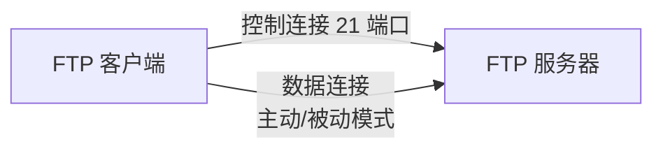
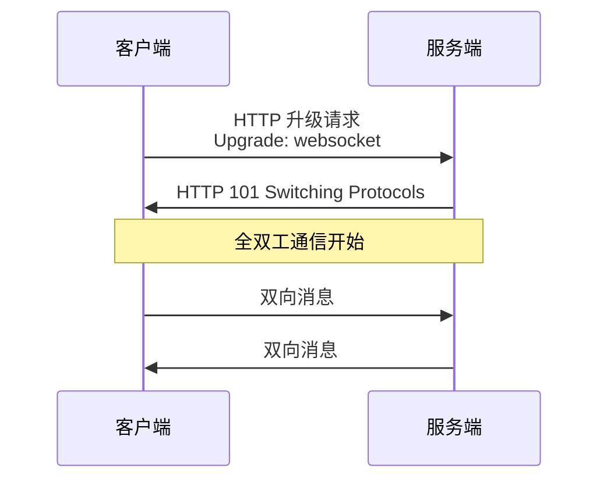

# 六、应用层

## 6.1 常见应用层协议对照表

| 协议 | 端口 | 传输层 | 用途 | 加密 |
|------|------|--------|------|------|
| HTTP | 80 | TCP | 网页浏览 | ❌ |
| HTTPS | 443 | TCP | 加密网页浏览 | ✅ TLS |
| FTP | 21(控制) / 20(数据) | TCP | 文件传输 | ❌ |
| SFTP | 22 | TCP | 加密文件传输 | ✅ SSH |
| SSH | 22 | TCP | 安全远程登录 | ✅ |
| Telnet | 23 | TCP | 远程登录(明文) | ❌ |
| SMTP | 25 | TCP | 邮件发送 | ❌ |
| POP3 | 110 | TCP | 邮件接收 | ❌ |
| IMAP | 143 | TCP | 邮件访问 | ❌ |
| DNS | 53 | UDP/TCP | 域名解析 | ❌ |
| DHCP | 67/68 | UDP | 动态 IP 分配 | ❌ |
| SNMP | 161/162 | UDP | 网络管理 | ❌ |
| NTP | 123 | UDP | 时间同步 | ❌ |
| TFTP | 69 | UDP | 简单文件传输 | ❌ |
| RDP | 3389 | TCP | Windows 远程桌面 | ✅ |

## 6.2 FTP 协议

**主动模式 vs 被动模式**:

| 模式 | 数据连接发起方 | 端口 | 适用 |
|------|--------------|------|------|
| **PORT (主动)** | 服务器从 20 端口主动连客户端 | 服务器 20 | 客户端无防火墙 |
| **PASV (被动)** | 客户端连服务器开放随机端口 | 服务器随机 | 客户端有防火墙(常用) |

- 两个连接: **控制连接**(21) + **数据连接**

## 6.3 邮件相关协议

| 协议 | 端口 | 方向 | 特点 |
|------|------|------|------|
| **SMTP** | 25 | 发送(推) | 邮件从客户端发到服务器、服务器之间转发 |
| **POP3** | 110 | 接收(拉) | 下载后服务器可删除 |
| **IMAP** | 143 | 接收(拉) | 服务器端管理、多设备同步 |

## 6.4 SSH 与 Telnet

| 协议 | 端口 | 加密 | 安全性 |
|------|------|------|--------|
| **Telnet** | 23 | ❌ 明文 | 差(密码可被嗅探) |
| **SSH** | 22 | ✅ RSA/ECC 非对称加密 | 高(替代 Telnet) |

**SSH 工作流程**:
1. 客户端发起连接
2. 服务器发送公钥
3. 协商加密算法
4. 客户端用服务器公钥加密会话密钥
5. 建立加密通道

## 6.5 WebSocket ⭐

- 基于 HTTP **升级机制**的全双工通信协议
- URL 前缀: `ws://` (非加密) / `wss://` (加密,基于 TLS)
- 适用: 实时聊天、在线游戏、实时数据推送、协同编辑
- 握手: HTTP `Upgrade: websocket`

**与 HTTP 轮询对比**:

| 方式 | 延迟 | 服务器压力 | 实时性 |
|------|------|----------|--------|
| 短轮询 | 高 | 高 | 差 |
| 长轮询 | 中 | 中 | 中 |
| **WebSocket** | **低** | **低** | **优** |

## 6.6 RPC (远程过程调用)

- 像调用本地方法一样调用远程服务
- 代表: gRPC、Thrift、Dubbo
- 通常基于 TCP
- 核心组件: 客户端、服务端、注册中心、序列化协议

**RPC vs HTTP**:

| 特性 | RPC (gRPC) | HTTP (REST) |
|------|-----------|------------|
| 协议 | 自定义(Protobuf) | 标准 HTTP |
| 性能 | 高(二进制、HTTP/2) | 一般(文本) |
| 跨语言 | 强(代码生成) | 强(任何客户端) |
| 可读性 | 差 | 好 |
| 适用 | 内部微服务 | 开放 API |

---

