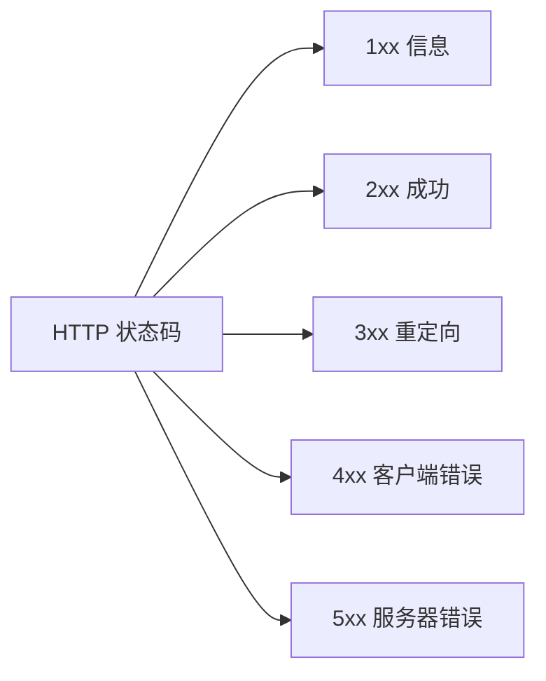
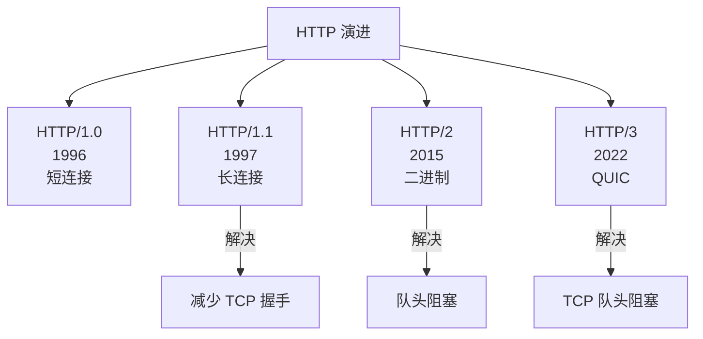
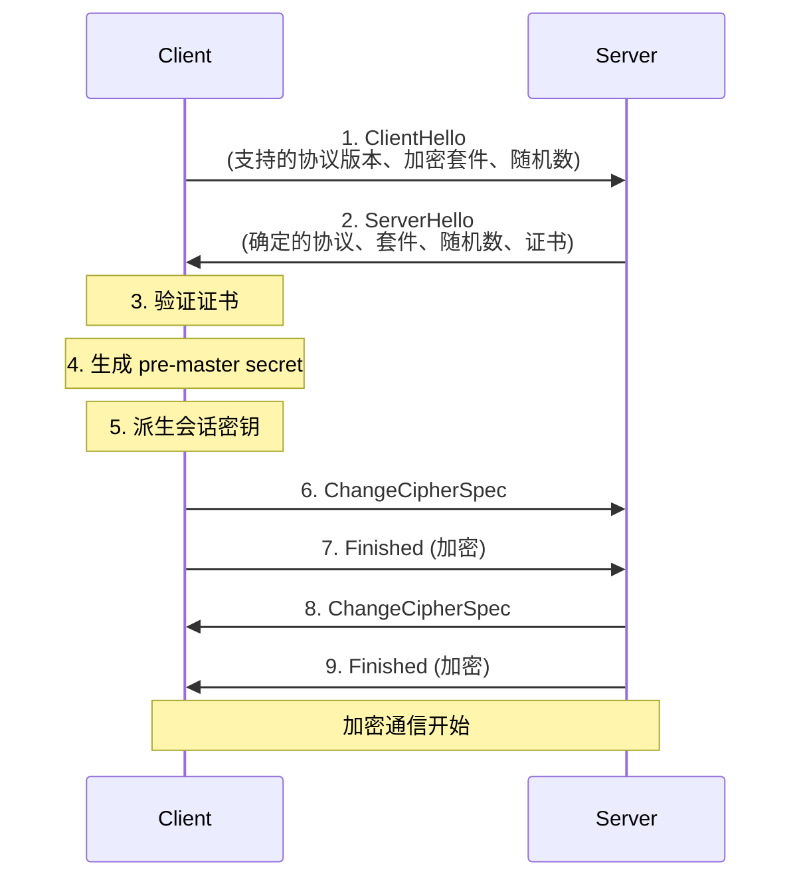
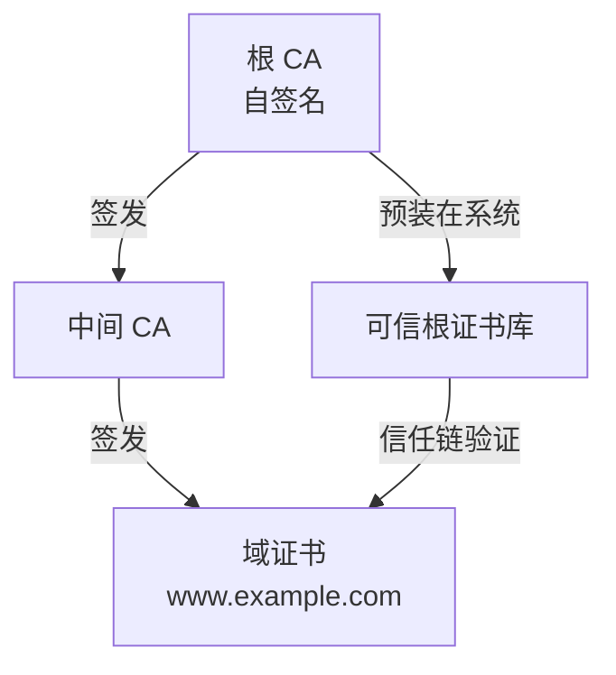
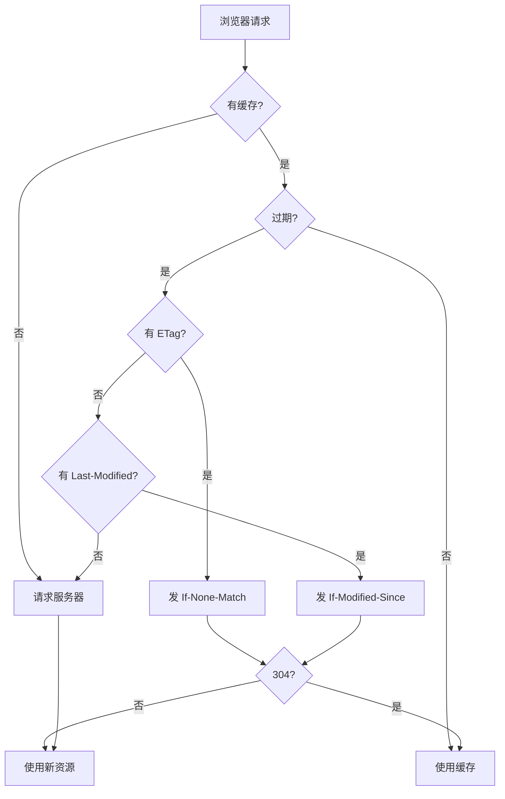
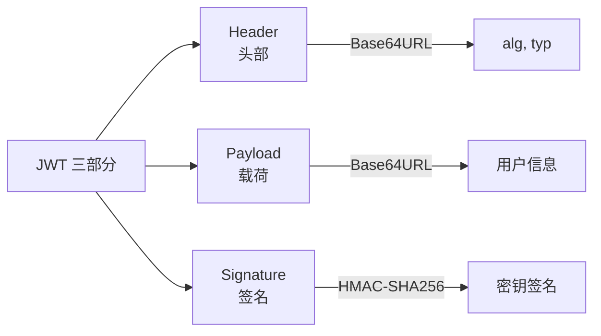

# 七、HTTP 与 HTTPS 详解

## 7.1 HTTP 概述

- **超文本传输协议** (HyperText Transfer Protocol)
- 基于 **请求-响应** 模型
- **无状态** (Cookie/Session 解决)
- 默认端口 80

**HTTP 历史版本**:

| 版本 | 年份 | 关键特性 |
|------|------|----------|
| HTTP/0.9 | 1991 | 仅支持 GET |
| HTTP/1.0 | 1996 | 短连接、支持多种方法 |
| HTTP/1.1 | 1997 | 长连接、管道化(主流) |
| HTTP/2 | 2015 | 二进制分帧、多路复用 |
| HTTP/3 | 2022 | 基于 QUIC (UDP) |

## 7.2 HTTP 请求报文

```http
GET /index.html HTTP/1.1
Host: www.example.com
User-Agent: Mozilla/5.0 (Windows NT 10.0)
Accept: text/html,application/xhtml+xml
Accept-Language: zh-CN,zh;q=0.9
Accept-Encoding: gzip, deflate
Connection: keep-alive
Cookie: sessionId=abc123

[请求体]
```

## 7.3 HTTP 响应报文

```http
HTTP/1.1 200 OK
Content-Type: text/html; charset=UTF-8
Content-Length: 1024
Content-Encoding: gzip
Date: Mon, 17 Jun 2026 10:00:00 GMT
Server: nginx/1.20.0
Set-Cookie: sessionId=xyz789; HttpOnly
Cache-Control: max-age=3600

[响应体]
```

## 7.4 HTTP 方法

| 方法 | 描述 | 幂等 | 安全 | 常见用途 |
|------|------|------|------|----------|
| **GET** | 获取资源 | ✅ | ✅ | 读数据 |
| **POST** | 提交数据 | ❌ | ❌ | 创建资源 |
| **PUT** | 更新资源(整体) | ✅ | ❌ | 整体替换 |
| **PATCH** | 更新资源(部分) | ❌ | ❌ | 局部更新 |
| **DELETE** | 删除资源 | ✅ | ❌ | 删除资源 |
| **HEAD** | 获取头部信息 | ✅ | ✅ | 检查资源 |
| **OPTIONS** | 查看支持方法 | ✅ | ✅ | 跨域预检 |
| **CONNECT** | 建立隧道 | ❌ | ❌ | HTTPS 代理 |

> 💡 **幂等**: 多次执行结果相同
> 💡 **安全**: 不修改服务器数据

## 7.5 HTTP 状态码



**常见状态码速查**:

| 状态码 | 名称 | 含义 | 处理建议 |
|--------|------|------|----------|
| **200** | OK | 请求成功 | 正常处理 |
| **201** | Created | 资源创建成功 | POST 后返回 |
| **204** | No Content | 成功无返回 | DELETE 后常用 |
| **301** | Moved Permanently | 永久重定向 | 更新书签 |
| **302** | Found | 临时重定向 | 临时跳转 |
| **304** | Not Modified | 缓存未修改 | 使用本地缓存 |
| **400** | Bad Request | 请求语法错误 | 检查参数 |
| **401** | Unauthorized | 未认证 | 登录 |
| **403** | Forbidden | 禁止访问 | 权限不足 |
| **404** | Not Found | 资源不存在 | 资源已删除 |
| **405** | Method Not Allowed | 方法不允许 | 检查 HTTP 方法 |
| **429** | Too Many Requests | 请求过多 | 限流 |
| **500** | Internal Server Error | 服务器内部错误 | 服务异常 |
| **502** | Bad Gateway | 网关错误 | 上游服务异常 |
| **503** | Service Unavailable | 服务不可用 | 服务过载/维护 |
| **504** | Gateway Timeout | 网关超时 | 上游响应慢 |

## 7.6 HTTP 头部字段

### 通用头部

| 头部 | 作用 |
|------|------|
| `Cache-Control` | 缓存控制 |
| `Connection` | 连接管理 (keep-alive / close) |
| `Date` | 日期 |
| `Transfer-Encoding` | 传输编码 (chunked) |
| `Via` | 代理信息 |

### 请求头部

| 头部 | 作用 |
|------|------|
| `Host` | 主机名(HTTP/1.1 必需) |
| `User-Agent` | 浏览器信息 |
| `Accept` | 可接受的媒体类型 |
| `Accept-Encoding` | 可接受的编码 (gzip, deflate) |
| `Accept-Language` | 可接受的语言 |
| `Cookie` | 客户端 Cookie |
| `Authorization` | 认证信息(Bearer token) |
| `Referer` | 来源页面 |
| `If-Modified-Since` | 条件请求 |
| `If-None-Match` | ETag 条件请求 |

### 响应头部

| 头部 | 作用 |
|------|------|
| `Content-Type` | 响应体类型 |
| `Content-Length` | 响应体长度 |
| `Content-Encoding` | 响应体编码 |
| `Set-Cookie` | 设置 Cookie |
| `Location` | 重定向地址 |
| `Server` | 服务器信息 |
| `ETag` | 资源标识 |
| `Last-Modified` | 最后修改时间 |
| `Expires` | 过期时间(HTTP/1.0) |
| `Access-Control-Allow-Origin` | CORS 跨域 |

## 7.7 HTTP/1.0 vs HTTP/1.1 vs HTTP/2 vs HTTP/3



### HTTP/1.0
- 短连接: 每个请求/响应都建立新的 TCP 连接
- 支持 GET、HEAD、POST
- 无 Host 头部

### HTTP/1.1 (主流)
- ✅ **长连接** (Connection: keep-alive,默认开启)
- ✅ **管道化** (Pipelining,理论支持,实际很少用)
- ✅ 引入 `Host` 头部(支持虚拟主机)
- ✅ 增加 PUT、PATCH、DELETE、OPTIONS 等方法
- ✅ 引入 `Range` 范围请求、断点续传
- ✅ 引入 `Cache-Control`、`ETag` 等缓存机制
- ❌ **问题**: 队头阻塞、文本协议解析慢

### HTTP/2
- ✅ **二进制分帧**: 将数据分割为更小的帧
- ✅ **多路复用**: 一个连接并行处理多个请求,解决队头阻塞
- ✅ **头部压缩 (HPACK)**
- ✅ **服务器推送 (Server Push)**
- ✅ **流优先级**
- ✅ 基于 TLS,默认 HTTPS

### HTTP/3
- ✅ 基于 **QUIC** 协议 (UDP + 自实现可靠性)
- ✅ 解决 TCP 队头阻塞
- ✅ 内置 TLS 1.3
- ✅ 0-RTT 握手
- ✅ 连接迁移 (Connection ID,IP 变化不影响连接)

**HTTP/1.1 队头阻塞 vs HTTP/2 多路复用**:

```
HTTP/1.1: 请求 1 → 响应 1 → 请求 2 → 响应 2 → ...(串行)
HTTP/2:   并行交错传输多个流(无队头阻塞)
```

## 7.8 HTTPS

### 7.8.1 原理

```
HTTP + SSL/TLS = HTTPS
```

**SSL/TLS 是什么?**

- **SSL (Secure Sockets Layer)**:早期的安全套接层协议,由 Netscape 提出,用于在应用层数据之下提供**加密、身份认证、完整性校验**
- **TLS (Transport Layer Security)**:SSL 的**后续标准版本**,可以理解为"升级版 SSL",由 IETF 标准化维护
- 今天实际生产环境里几乎都使用 **TLS**, 只是很多人习惯口头上继续说 **SSL 证书**、**SSL 握手**

> 💡 严格来说,现代 HTTPS 基本都是 **HTTP over TLS**,不是还在使用老旧的 SSL。

**SSL 与 TLS 的关系**:

| 协议 | 状态 | 说明 |
|------|------|------|
| **SSL 2.0 / 3.0** | ❌ 已废弃 | 存在明显安全问题 |
| **TLS 1.0 / 1.1** | ⚠️ 基本淘汰 | 兼容老系统时才可能见到 |
| **TLS 1.2** | ✅ 仍广泛使用 | 兼容性和安全性较平衡 |
| **TLS 1.3** | ✅ 当前主流推荐 | 更快、更安全、更简洁 |

**TLS 主要解决什么问题?**

- **机密性**:防止传输内容被窃听
- **完整性**:防止数据在途中被篡改
- **身份认证**:通过证书确认你访问的是目标服务器,而不是假冒站点

**它工作在哪一层?**

- 从教学角度看,常放在 **应用层和传输层之间**
- 在 OSI 里常归到 **表示层 / 会话层附近**
- 在 TCP/IP 实际实现里,通常理解为 **运行在 TCP 之上的安全层**

> 🧠 一句话理解:**TLS 不是业务协议,而是给 HTTP、WebSocket、SMTP、IMAP 等上层协议"加一层安全外壳"。**

### 7.8.2 加密机制

**混合加密**:
- 🔓 **非对称加密** (RSA、ECC): 加密对称密钥
- 🔐 **对称加密** (AES、ChaCha20): 加密实际数据

> 💡 为什么混合?非对称慢但安全,对称快但密钥分发难。混合兼顾两者优点。

### 7.8.3 TLS 握手过程 (TLS 1.2)



**总耗时**: 2 RTT

### 7.8.4 TLS 1.3 改进

- 握手从 2 RTT 减少到 **1 RTT** (0-RTT 模式可更快)
- 只支持**前向保密**的加密套件
- 移除了不安全的算法 (MD5、SHA-1、RC4 等)
- 加密更多握手消息

### 7.8.5 数字证书

- 由 **CA (Certificate Authority)** 签发
- 包含: 域名、公钥、CA 签名、有效期、颁发者等
- 验证链: 根 CA → 中间 CA → 域证书



**证书类型**:

| 类型 | 验证级别 | 适用 |
|------|---------|------|
| **DV** (Domain Validation) | 仅验证域名 | 个人网站 |
| **OV** (Organization Validation) | 验证域名+组织 | 企业网站 |
| **EV** (Extended Validation) | 严格验证 | 金融、电商 |

**免费证书**: Let's Encrypt(90 天自动续期)

### 7.8.6 HTTPS 的优缺点

| 维度 | 详情 |
|------|------|
| ✅ **优点** | 数据加密传输,防窃听 / 身份认证,防冒充 / 完整性校验,防篡改 / SEO 优势 |
| ❌ **缺点** | 握手耗时增加延迟 / 加解密消耗 CPU / 证书费用(可免费) / 占用更多带宽 |

## 7.9 HTTP 缓存机制

### 7.9.1 强制缓存

通过 `Cache-Control`、`Expires` 头部控制:

| 指令 | 含义 |
|------|------|
| `max-age=3600` | 1 小时内使用缓存 |
| `no-cache` | 需协商缓存(不是不缓存) |
| `no-store` | 不缓存任何内容 |
| `public` | 任何缓存都可存储 |
| `private` | 仅浏览器可缓存 |

### 7.9.2 协商缓存 (对比缓存)

- `Last-Modified` / `If-Modified-Since` (时间戳,精度 1 秒)
- `ETag` / `If-None-Match` (文件指纹,优先级更高)

**304 Not Modified**: 资源未修改,使用本地缓存

### 缓存决策流程



## 7.10 Cookie / Session / Token

### Cookie
- 浏览器端存储的小段数据
- **4KB 限制**
- 属性:
  - `Expires/Max-Age`: 过期时间
  - `Domain/Path`: 作用范围
  - `Secure`: 仅 HTTPS 传输
  - `HttpOnly`: 禁止 JS 访问(防 XSS)
  - `SameSite`: 防 CSRF(Strict/Lax/None)

### Session
- 服务器端存储会话状态
- 通过 **SessionID** 标识(通常存在 Cookie 中)
- 分布式场景需要 **Session 共享** (Redis、Spring Session)

### Token (JWT)



- **无状态认证**
- 三部分: `Header.Payload.Signature` (用 `.` 连接)
- 适合分布式、微服务
- 缺点: 无法主动失效(需配合黑名单)

### 三者对比

| 特性 | Cookie | Session | Token (JWT) |
|------|--------|---------|-------------|
| 存储位置 | 浏览器 | 服务器 | 客户端 |
| 状态 | 有状态 | 有状态 | 无状态 |
| 跨域 | 受限 | 受限 | 友好 |
| 适用 | 传统 Web | 单体应用 | 微服务/移动端 |
| 安全性 | 中(可被 CSRF) | 高 | 中(需妥善保管) |

## 7.11 跨域问题 (CORS)

**跨域产生原因**: 浏览器**同源策略**(协议、域名、端口必须相同)

**CORS 解决方案**:

| 方案 | 原理 | 适用 |
|------|------|------|
| **CORS (服务端)** | 服务端设置 `Access-Control-Allow-Origin` | 标准方案(推荐) |
| **JSONP** | 利用 `<script>` 标签无跨域限制 | 仅 GET(已过时) |
| **Nginx 反向代理** | 同源代理转发 | 简单场景 |
| **WebSocket** | 不受同源策略限制 | 实时通信 |

**CORS 关键响应头**:
```
Access-Control-Allow-Origin: https://example.com
Access-Control-Allow-Methods: GET, POST, PUT, DELETE
Access-Control-Allow-Headers: Content-Type, Authorization
Access-Control-Allow-Credentials: true
Access-Control-Max-Age: 86400
```

**预检请求 (Preflight)**: 复杂请求会先发 OPTIONS 请求

---

