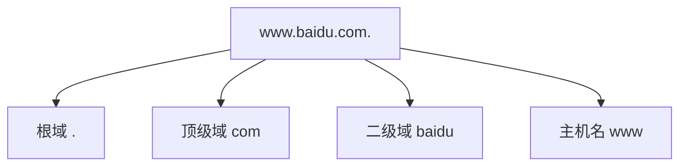
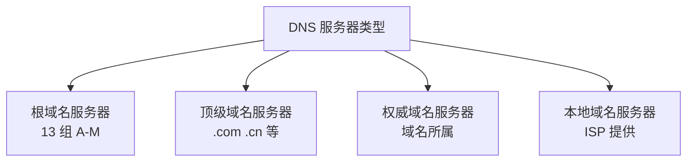
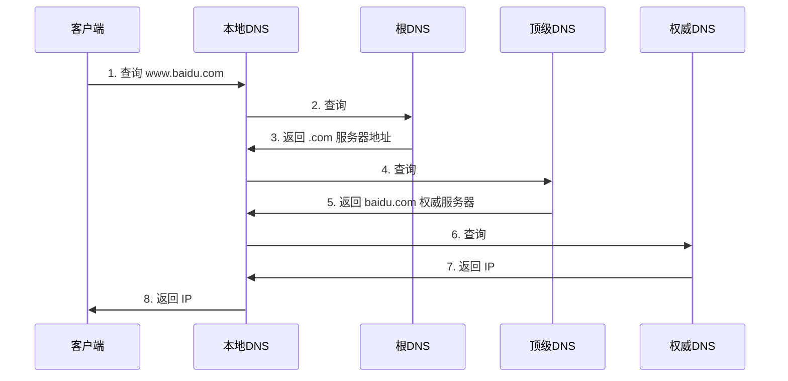

# 八、DNS 域名系统

## 8.1 作用

将**域名**解析为 **IP 地址** (正向解析),或反向解析(IP → 域名)。

## 8.2 域名结构



**顶级域分类**:

| 类别 | 示例 | 用途 |
|------|------|------|
| **gTLD** (通用顶级域) | .com、.org、.net、.edu | 商业、组织 |
| **ccTLD** (国家顶级域) | .cn、.jp、.uk | 国家地区 |
| **新顶级域** | .app、.dev、.io、.ai | 新型应用 |
| **基础设施域** | .arpa | 反向 DNS |

## 8.3 DNS 服务器类型



| 类型 | 数量 | 作用 |
|------|------|------|
| **根域名服务器** | 13 组(全球分布) | 返回顶级域地址 |
| **顶级域名服务器** | 多个 | 返回权威域地址 |
| **权威域名服务器** | 域名所属 | 返回域名 IP |
| **本地域名服务器** | ISP 提供 | 代理用户查询 |

## 8.4 域名解析过程



**查询方式对比**:

| 方式 | 过程 | 客户端负担 | 性能 |
|------|------|----------|------|
| **递归查询** | 本地 DNS 全权代理 | 小 | 快 |
| **迭代查询** | 客户端自己多次查询 | 大 | 慢 |

> 💡 实际是 **递归 + 迭代** 组合:客户端 → 本地 DNS 是递归,本地 DNS → 各级是迭代。

## 8.5 DNS 记录类型

| 类型 | 用途 | 示例 |
|------|------|------|
| **A** | 域名 → IPv4 地址 | `www.example.com → 93.184.216.34` |
| **AAAA** | 域名 → IPv6 地址 | `www.example.com → 2606:2800:220:1:...` |
| **CNAME** | 别名 | `www → example.com` |
| **MX** | 邮件服务器 | `mail.example.com` |
| **NS** | 域名服务器 | `ns1.example.com` |
| **TXT** | 文本记录 | SPF、DKIM、域名验证 |
| **PTR** | IP → 域名(反向解析) | `34.216.184.93.in-addr.arpa` |
| **SOA** | 起始授权机构 | 区域管理信息 |
| **CAA** | 证书颁发授权 | 指定可签发证书的 CA |

## 8.6 DNS 优化

- **DNS 缓存**:
  - 浏览器缓存(Chrome 1 分钟)
  - 操作系统缓存
  - 本地 DNS 缓存(TTL 控制)
- **DNS 预解析**:
  ```html
  <link rel="dns-prefetch" href="//cdn.example.com">
  ```
- **HttpDNS**: 绕过 Local DNS,防劫持(基于 HTTP 的 DNS)
- **CDN 智能调度**: 就近解析
- **TTL 设置权衡**: 大缓存好但更新慢,小缓存反之

## 8.7 常见问题

| 问题 | 描述 | 解决方案 |
|------|------|----------|
| **DNS 劫持** | 返回错误 IP | DoH/DoT、HttpDNS |
| **DNS 污染** | 在 DNS 协议层注入错误响应 | 加密 DNS、备用 DNS |
| **DNS 放大攻击** | 利用大响应发起 DDoS | DNS 速率限制、BCP38 |
| **DNS 慢** | 解析时间长 | 多级缓存、TTL 调优 |

---

