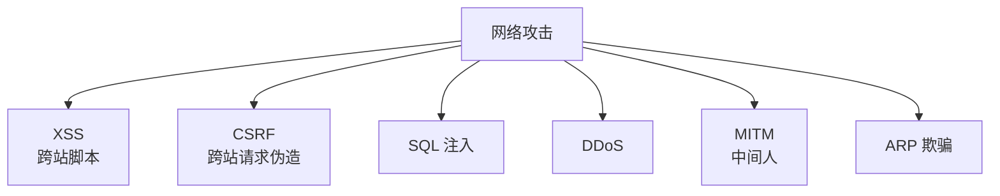
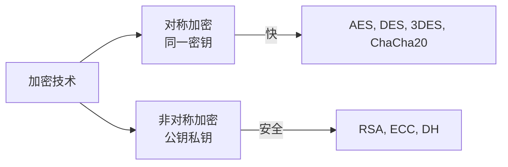
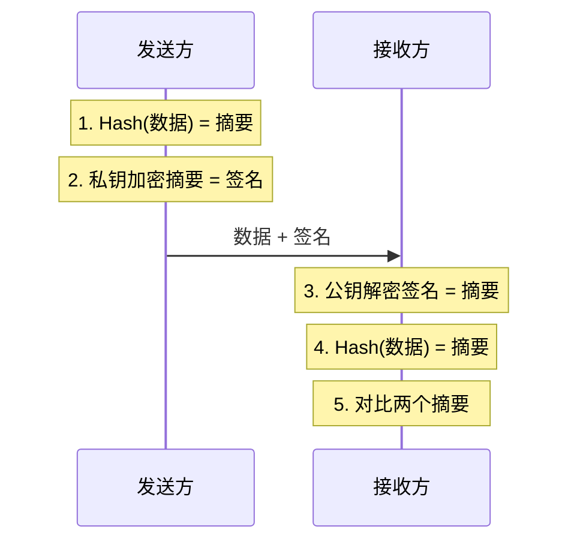

# 九、网络安全

## 9.1 常见攻击方式

| 攻击 | 原理 | 防御 |
|------|------|------|
| **XSS** | 在页面注入恶意 JS | 输入过滤、输出编码、CSP、`HttpOnly` Cookie |
| **CSRF** | 利用用户身份发请求 | Token 验证、`SameSite` Cookie、Referer 检查 |
| **SQL 注入** | 拼接恶意 SQL | 参数化查询、ORM、最小权限 |
| **DDoS** | 大量请求耗尽资源 | 流量清洗、CDN、限流 |
| **MITM** | 拦截篡改通信 | HTTPS、证书校验 |
| **ARP 欺骗** | 伪造 ARP 响应 | 静态 ARP 绑定、ARP 防火墙、Dynamic ARP Inspection |
| **DNS 劫持** | 返回错误 IP | DoH/DoT、HttpDNS |

## 9.2 加密技术

### 9.2.1 对称 vs 非对称加密

| 维度 | 对称加密 | 非对称加密 |
|------|---------|-----------|
| 密钥 | 同一密钥 | 公钥 + 私钥 |
| 速度 | 快 | 慢(100-1000 倍) |
| 密钥分发 | 困难 | 简单(公开公钥) |
| 用途 | 加密大量数据 | 密钥交换、数字签名 |
| 算法 | AES、DES、3DES、ChaCha20 | RSA、ECC、DH、Ed25519 |

### 9.2.2 哈希算法

- 单向、不可逆、定长输出
- 算法对比:

| 算法 | 输出长度 | 安全性 | 应用 |
|------|---------|--------|------|
| **MD5** | 128 位 | ❌ 已不安全 | 文件校验(避免用于安全) |
| **SHA-1** | 160 位 | ❌ 已不安全 | 已淘汰 |
| **SHA-256** | 256 位 | ✅ 安全 | 主流使用、区块链 |
| **SHA-3** | 可变 | ✅ 安全 | 新一代标准 |
| **bcrypt** | 可变 | ✅ 安全 | 密码存储(带盐) |

**应用**: 密码存储(加盐)、文件校验、数字签名、区块链。

### 9.2.3 数字签名

- 发送方: **私钥签名**
- 接收方: **公钥验证**
- 作用: **身份认证 + 完整性 + 不可否认**

## 9.3 防火墙

| 类型 | 工作层 | 检查内容 | 性能 |
|------|--------|---------|------|
| **包过滤** | 网络层 | IP、端口、协议 | 高 |
| **状态检测** | 传输层 | 跟踪连接状态 | 中 |
| **应用层 (WAF)** | 应用层 | HTTP 内容、SQL/XSS | 低 |

## 9.4 VPN 类型

| 类型 | 工作层 | 加密 | 用途 |
|------|--------|------|------|
| **IPSec VPN** | 网络层 | 强 | 站点到站点 |
| **SSL VPN** | 应用层 | 中 | 远程访问 |
| **PPTP/L2TP** | - | 弱 | 已不推荐 |
| **OpenVPN** | 应用层 | 强 | 开源,跨平台 |
| **WireGuard** | 网络层 | 强 | 现代轻量级 |

---

