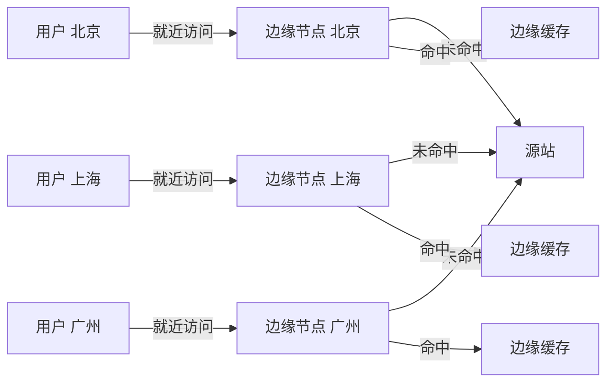
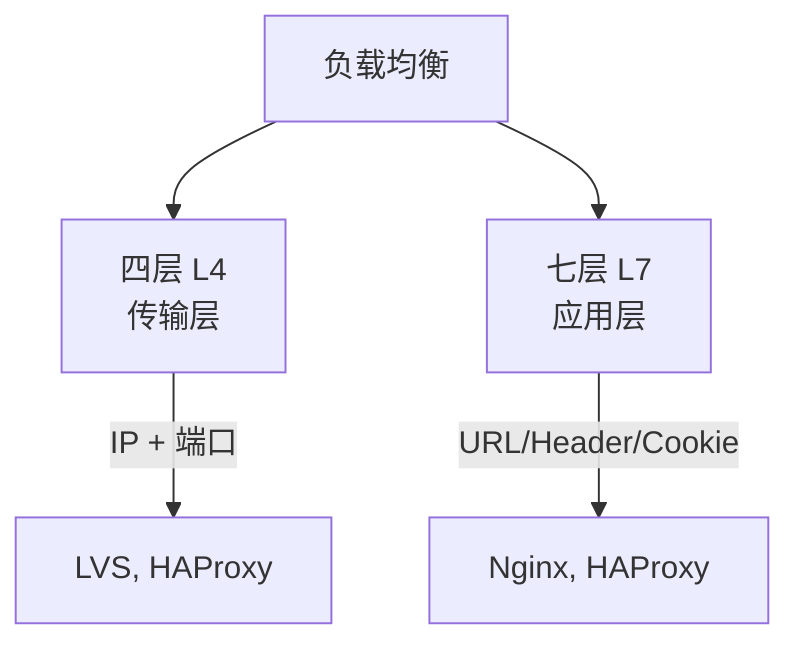
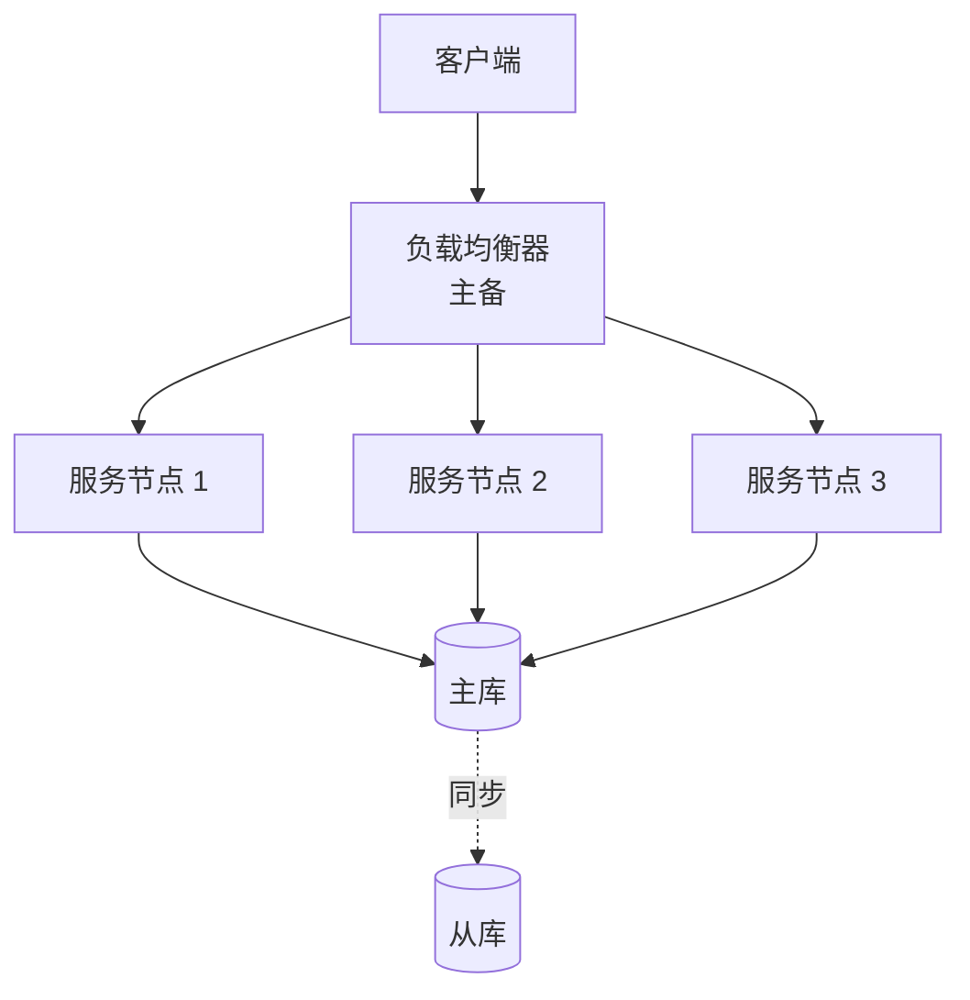

# 十一、性能优化与高可用

## 11.1 CDN (内容分发网络)

- **原理**: 将内容缓存到离用户最近的**边缘节点**
- **加速类型**:
  - **静态加速**:图片、CSS、JS(主流)
  - **动态加速**:API、动态内容(回源优化)
  - **流媒体加速**:视频、直播(分片、HLS)
- **关键技术**:
  - **智能调度**:DNS 解析返回最近节点 IP
  - **缓存策略**:TTL、缓存键、预热
  - **回源机制**:父节点 → 源站
  - **多级缓存**:边缘 → 区域 → 中心

**CDN 工作流程**:
1. DNS 解析返回 CDN 节点 IP(智能调度)
2. 浏览器访问最近的 CDN 节点
3. CDN 节点检查本地缓存
4. 缓存命中直接返回
5. 缓存未命中则回源站拉取,缓存后返回

## 11.2 负载均衡

### 11.2.1 四层 vs 七层

| 维度 | 四层 (L4) | 七层 (L7) |
|------|----------|----------|
| 工作层 | 传输层 | 应用层 |
| 依据 | IP + 端口 | URL、Header、Cookie |
| 性能 | **高**(简单转发) | 略低(内容解析) |
| 功能 | 简单 | **丰富**(URL 路由、缓存) |
| 实现 | LVS、Nginx Stream、HAProxy | Nginx、HAProxy、Apache |
| 适用 | 高并发、数据库 | Web 应用、API |

### 11.2.2 负载均衡算法

| 算法 | 原理 | 适用 |
|------|------|------|
| **轮询 (Round Robin)** | 依次分配 | 服务器性能相同 |
| **加权轮询 (WRR)** | 按权重分配 | 服务器性能不同 |
| **最少连接** | 连接数最少优先 | 长连接 |
| **加权最少连接** | 加权 + 最少连接 | 性能不一 + 长连接 |
| **IP Hash** | 同一 IP 走同一服务器 | 会话保持 |
| **一致性哈希** | 哈希环定位 | 缓存集群 |
| **URL Hash** | 同一 URL 走同一服务器 | 缓存场景 |

## 11.3 高可用架构

**高可用模式**:

| 模式 | 说明 | 适用 |
|------|------|------|
| **主备** | 一主一备,故障切换 | 数据库、VIP |
| **集群** | 多节点同时服务 | 微服务 |
| **异地多活** | 多机房容灾 | 大型互联网 |
| **两地三中心** | 生产 + 同城 + 异地 | 金融级 |

**限流算法**:

| 算法 | 原理 | 特点 |
|------|------|------|
| **固定窗口** | 时间窗内计数 | 简单,有突刺 |
| **滑动窗口** | 滑动时间窗计数 | 平滑 |
| **令牌桶** | 匀速生成令牌 | 允许突发 |
| **漏桶** | 匀速流出 | 强制限速 |

**熔断降级组件**: Sentinel (Alibaba)、Hystrix (Netflix,已停更)、Resilience4J

## 11.4 连接池与池化技术

| 池化对象 | 主流组件 | 配置要点 |
|----------|---------|----------|
| **数据库连接池** | Druid、HikariCP | 最大/最小连接数、超时 |
| **HTTP 连接池** | Apache HttpClient、OkHttp | 连接复用、超时 |
| **线程池** | ThreadPoolExecutor | 核心/最大线程数、队列 |
| **Redis 连接池** | Lettuce、Jedis | 最大连接、空闲连接 |

## 11.5 长连接 vs 短连接

| 对比 | 短连接 | 长连接 |
|------|--------|--------|
| 建立次数 | 每次请求都建立 | 复用连接 |
| 性能 | ❌ 差 | ✅ 好 |
| 资源占用 | 低 | 高 |
| 适用 | 低频请求 | 高频请求 |
| 实现 | HTTP/1.0 | HTTP/1.1+ 默认 |

**HTTP Keep-Alive**: HTTP/1.1 默认开启
**WebSocket**: 真正的长连接(全双工)

## 11.6 性能优化清单

| 层级 | 优化手段 |
|------|----------|
| **前端** | 静态资源 CDN、合并/压缩、懒加载、浏览器缓存、HTTP/2 |
| **网络** | CDN 加速、HTTP/2 or 3、减少请求、压缩传输 |
| **应用** | 缓存(Redis)、连接池、异步、限流、熔断、JVM 调优 |
| **数据库** | 索引、SQL 优化、读写分离、分库分表、连接池 |
| **架构** | 微服务、消息队列、负载均衡、集群、异地多活 |

---

