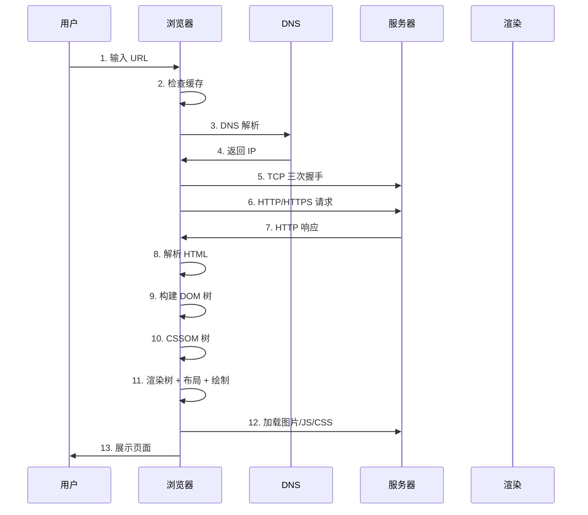
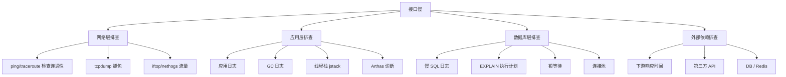
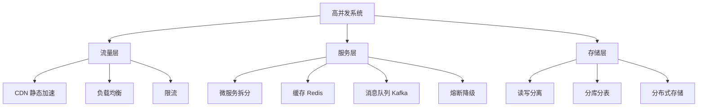

# 十二、实战案例与排查思路

## 12.1 从输入 URL 到页面展示(经典面试题) ⭐⭐⭐

**详细步骤**:

1. **URL 解析**:浏览器解析 URL 各部分(协议、域名、端口、路径)
2. **检查缓存**:浏览器缓存 → 系统缓存 → 路由器缓存,命中则跳过
3. **DNS 解析**:本地 DNS → 根 DNS → 顶级 DNS → 权威 DNS,获取 IP
4. **TCP 连接**:**三次握手**建立连接
5. **TLS 握手**:HTTPS 还需 TLS 握手(HTTP/2 默认 HTTPS)
6. **发送 HTTP 请求**:GET /index.html HTTP/1.1
7. **服务器处理**:反向代理 → 应用服务器 → 数据库查询
8. **返回响应**:HTTP/1.1 200 OK + HTML
9. **浏览器解析**:
   - 解析 HTML → **DOM 树**
   - 解析 CSS → **CSSOM 树**
   - 合并 → **渲染树**
10. **布局 (Layout)**:计算元素位置和大小
11. **绘制 (Paint)**:渲染像素
12. **合成 (Composite)**:GPU 合成图层
13. **加载子资源**:图片、JS、CSS(可能阻塞渲染)
14. **JS 执行**:可能修改 DOM/CSSOM,触发重排重绘
15. **页面展示**

## 12.2 接口响应慢排查思路

**分层排查清单**:

| 层级 | 工具/命令 | 检查点 |
|------|----------|--------|
| **网络层** | `ping`、`traceroute`、`mtr` | 连通性、丢包、延迟 |
| **系统层** | `iftop`、`nethogs`、`ss` | 流量、连接状态 |
| **应用层** | 慢 SQL 日志、GC 日志、jstack | 慢方法、阻塞 |
| **数据库** | 慢查询日志、`EXPLAIN` | 索引、锁、连接数 |
| **外部依赖** | APM 工具(SkyWalking) | 下游响应时间 |

## 12.3 大量 TIME_WAIT 问题

**问题**: 短连接频繁建立/关闭,客户端出现大量 `TIME_WAIT` 状态。

**原因**:
- 主动关闭方会进入 TIME_WAIT(等待 2MSL)
- 占用端口和系统资源

**解决方案**:

| 方案 | 配置 | 说明 |
|------|------|------|
| 开启 `tcp_tw_reuse` | `net.ipv4.tcp_tw_reuse = 1` | 允许复用 TIME_WAIT 套接字(客户端) |
| 调整 `tcp_max_tw_buckets` | `net.ipv4.tcp_max_tw_buckets = 5000` | 限制最大 TIME_WAIT 数 |
| 增大端口范围 | `net.ipv4.ip_local_port_range` | 增加可用端口 |
| **使用长连接** | 业务层改造 | **最佳方案** |
| 使用连接池 | HTTP/DB 连接池 | 减少连接建立 |
| 负载均衡 | 多机分摊 | 分散单点压力 |

## 12.4 SYN Flood 攻击防御

**原理**: 攻击者发送大量 SYN 包但不完成第三次握手,耗尽服务器的半连接队列。

**防御**:

| 方案 | 原理 |
|------|------|
| **SYN Cookie** | 不分配资源,编码到序列号 |
| **增大半连接队列** | `tcp_max_syn_backlog` |
| **SYN Proxy** | 防火墙代理 SYN 握手 |
| **限流** | 限制单 IP 的 SYN 速率 |
| **云防护** | 高防 IP、流量清洗 |

## 12.5 高并发系统设计思路

**设计要点**:

| 层级 | 措施 | 目标 |
|------|------|------|
| **流量层** | CDN、负载均衡、Nginx | 分散流量 |
| **服务层** | 微服务、缓存、MQ、限流、熔断 | 提高吞吐 |
| **存储层** | 读写分离、分库分表、NoSQL | 提高容量和性能 |
| **架构层** | 多机房、异地多活、容器化 | 高可用 |

## 12.6 跨域问题排查

**步骤**:
1. 浏览器 F12 打开 Network,查看响应头
2. 检查是否包含 `Access-Control-Allow-Origin`
3. 检查请求方法是否触发预检(OPTIONS)
4. 确认 `withCredentials` 与 `Allow-Credentials` 匹配

**常见错误**:

| 错误 | 原因 | 解决 |
|------|------|------|
| `No 'Access-Control-Allow-Origin'` | 响应头缺失 | 服务端配置 CORS |
| `Credentials flag is 'true'` | 不允许携带凭证 | 设置 `Allow-Credentials: true` |
| `wildcard origin` | 使用 `*` 携带凭证 | 指定明确 origin |

---

