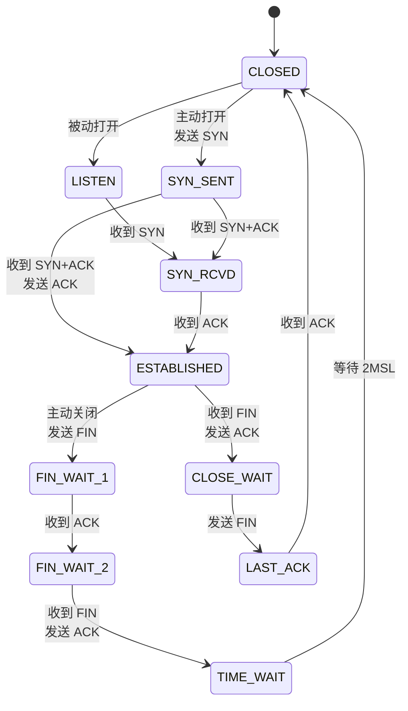

# 十四、附录与速查表

## 📚 推荐学习资源

### 经典书籍 📖
- 《计算机网络》(谢希仁) - 教材经典
- 《TCP/IP 详解 卷一:协议》(Richard Stevens) - 进阶必读
- 《HTTP 权威指南》- Web 工程师必读
- 《图解 HTTP》《图解 TCP/IP》- 入门友好
- 《网络是怎样连接的》(户根勤) - 全流程理解
- 《计算机网络:自顶向下方法》(Kurose) - 国际教材

### 在线资源 🌐
- [RFC 文档库](https://www.rfc-editor.org/) - 协议标准
- Wireshark 抓包分析实例
- 极客时间相关专栏
- 慕课网 / Bilibili 计算机网络课程

### 实验环境 🔬
- Wireshark + curl 抓包分析
- Linux 网络工具(`ip`、`ss`、`tcpdump`)
- eNSP / Packet Tracer 模拟器
- Docker + Nginx 搭建代理测试
- 用 Go/Java 写一个简易 HTTP/TCP 服务器

---

## 🚀 常用端口速查

| 端口 | 协议 | 用途 |
|------|------|------|
| 20/21 | FTP | 文件传输控制/数据 |
| 22 | SSH | 安全远程登录 |
| 23 | Telnet | 远程登录(明文) |
| 25 | SMTP | 邮件发送 |
| 53 | DNS | 域名解析 |
| 67/68 | DHCP | 动态 IP 分配 |
| 69 | TFTP | 简单文件传输 |
| 80 | HTTP | 网页浏览 |
| 110 | POP3 | 邮件接收 |
| 123 | NTP | 时间同步 |
| 143 | IMAP | 邮件访问 |
| 161/162 | SNMP | 网络管理 |
| 443 | HTTPS | 加密网页 |
| 3306 | MySQL | 数据库 |
| 5432 | PostgreSQL | 数据库 |
| 6379 | Redis | 缓存 |
| 8080 | HTTP Proxy | HTTP 代理 |
| 9200 | Elasticsearch | 搜索引擎 |
| 27017 | MongoDB | NoSQL 数据库 |

---

## 🔄 TCP 状态机



**简化流程**:
```
客户端:   CLOSED → SYN_SENT → ESTABLISHED → FIN_WAIT_1 → FIN_WAIT_2 → TIME_WAIT → CLOSED
服务端:   CLOSED → LISTEN → SYN_RCVD → ESTABLISHED → CLOSE_WAIT → LAST_ACK → CLOSED
```

---

## 🌐 IP 地址段速查

| 段 | 用途 |
|----|------|
| `10.0.0.0/8` | 私有 A 类 |
| `172.16.0.0/12` | 私有 B 类 |
| `192.168.0.0/16` | 私有 C 类 |
| `127.0.0.0/8` | 回环 |
| `169.254.0.0/16` | 链路本地(APIPA) |
| `224.0.0.0/4` | 组播 |
| `0.0.0.0/0` | 默认路由 |
| `255.255.255.255` | 有限广播 |

---

## 📐 常用公式

| 名称 | 公式 |
|------|------|
| 发送时延 | 数据长度(bit) / 发送速率(bps) |
| 传播时延 | 信道长度(m) / 传播速率(m/s) |
| 信道利用率 | 有数据通过时间 / 总时间 |
| 奈奎斯特定理 | 极限码元速率 = 2W Baud |
| 香农定理 | 极限传输速率 = W × log₂(1 + S/N) |
| 子网数 | 2^(子网位数) |
| 主机数 | 2^(主机位数) - 2 |
| CIDR 聚合 | 多个连续子网求最大前缀匹配 |

---

## 🎯 面试应答技巧

1. **先总后分**:先给核心结论,再展开细节
2. **画图说明**:用图示(时序图、状态机)辅助表达
3. **举例说明**:用真实场景加深理解
4. **对比说明**:用对比表格凸显记忆点
5. **追问准备**:对每个答案预想 2-3 个连环追问
6. **承认不会**:不懂就说不懂,不要瞎编

---

> 📌 **本文档持续更新中**,欢迎反馈补充。
> 如需深入某个主题,建议参考 RFC 文档和经典教材。
> 维护:JingXu | 最后更新:2026-06-17 😘😘🎉

---

