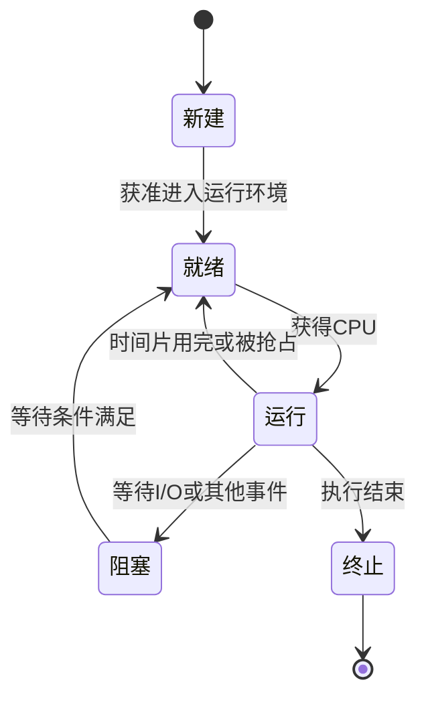

# 02 进程、线程与通信

[返回教程目录](操作系统教程.md) · [下一章：CPU 调度](03-CPU调度与计算题.md)

## 本章目标

会画进程状态图，理解 PCB，解释进程与线程的资源关系，并选择合适的通信方式。

## 1. 程序、进程与线程

**程序**是静态的指令和数据，例如磁盘上的可执行文件。**进程**是程序的一次执行活动及其资源环境。同一个程序可以对应多个进程。

**线程**是进程内的一条执行流。一个进程至少有一条执行流，也可以有多个线程共同处理工作。

可把进程理解成一家餐厅：餐厅拥有厨房、食材和订单系统；线程是其中的工作人员。工作人员各自处理任务，但会访问同一套资源。

| 比较项 | 进程 | 同一进程中的线程 |
| --- | --- | --- |
| 地址空间 | 通常相互隔离 | 共享进程地址空间 |
| 资源 | 拥有资源环境和系统对象引用 | 共享进程的很多资源 |
| 执行状态 | 通过所属执行流推进 | 各自有寄存器状态、栈等 |
| 通信 | 需要 IPC 或显式共享机制 | 可通过共享变量协作，但需同步 |
| 故障影响 | 通常有较强隔离 | 非法内存操作等可能导致整个进程退出 |
| 创建与切换 | 通常涉及更多资源管理工作 | 同一进程内切换通常较轻，但仍有成本 |

教材常说“进程是资源分配的基本单位，线程是调度的基本单位”。这适合描述支持内核线程的常见系统；具体实现可能使用不同术语和统一的任务结构。

每个线程有自己的栈，不代表这个栈在硬件上对同进程其他线程完全不可访问。它们仍共享地址空间，必须遵守语言和运行时的访问规则。

Windows 的进程与线程资源划分可参考 [Microsoft 官方概述](https://learn.microsoft.com/en-us/windows/win32/procthread/about-processes-and-threads)。

## 2. 进程状态与转换

- **就绪**：执行条件已经具备，只缺 CPU。
- **运行**：正在使用 CPU。
- **阻塞 / 等待**：还缺少某个事件，例如磁盘读取完成或锁可用。

核心考点：**阻塞解除通常先进入就绪，再由调度器安排运行。** 得到数据不等于立刻得到 CPU。

拓展：部分教材有“挂起”状态，表示进程被暂停参与普通运行，经典模型中可能与调出内存有关。“就绪挂起”和“阻塞挂起”仍要区分事件是否满足。现代系统的换页与进程挂起不宜直接画等号。

## 3. PCB 保存什么

PCB（Process Control Block，进程控制块）是操作系统管理进程的信息集合，通常包括：

- 标识与状态：进程编号、父子关系、运行状态。
- 执行上下文：恢复执行所需的信息。
- 调度信息：优先级、队列关系、统计信息。
- 资源信息：地址空间、打开文件、权限等。

具体字段随系统变化。考试重点是：**为什么需要保存这些信息？因为任务离开 CPU 后，将来还要从正确位置继续执行。**

## 4. 上下文切换

把 CPU 执行权从任务 A 交给任务 B 时，需要保存 A 的执行状态，恢复 B 的状态，并进行相关管理操作。

成本不仅是保存寄存器，还可能包括调度开销以及 CPU 缓存、TLB 局部性变化。不同地址空间之间切换通常有额外工作；现代硬件也会提供优化，因此不要说“每次进程切换必然清空所有缓存”。

区分三件事：普通函数调用、用户态 / 内核态切换、任务上下文切换。它们可能相关，但不是同一件事。

## 5. 进程间通信 IPC

| 方式 | 直观用途 | 注意点 |
| --- | --- | --- |
| 管道 | 把一个任务的输出交给另一个任务 | 字节流；匿名管道常用于有亲缘关系的进程 |
| 命名管道 | 通过约定的入口交换数据 | 可供无亲缘关系的进程使用，语义依平台而异 |
| 消息队列 | 按消息交付数据 | 有消息边界、容量和协议约定 |
| 共享内存 | 多个进程访问同一片映射区域 | 仍需要锁、信号量等协调 |
| 信号 | 通知发生某事件 | 适合事件通知，不适合大量数据传输 |
| Socket | 本机或跨机器通信 | 需要处理连接、数据边界和错误 |

共享内存减少了某些数据复制，但“能看见同一份数据”并不保证读写顺序正确，也不保证一次复杂更新是原子的。

## 6. 拓展：协程、孤儿与僵尸

**协程**通常由语言运行时或框架管理执行与挂起，常用于组织大量等待 I/O 的任务。它并不自动绕过 CPU 核数限制，也不保证所有调用都不会阻塞底层线程。不同语言的协程调度方式有差异。

在 Unix / Linux 语境中：

- **孤儿进程**：父进程先退出，而子进程仍存活；会被合适的系统进程或子收割器接管。
- **僵尸进程**：子进程已经结束，父进程尚未收集退出状态；保留少量记录，通常不再执行，也不是继续占着原来的全部内存。

## 自测与答案

1. 线程等待磁盘读取时，属于就绪还是阻塞？读取完成后呢？
2. 同一进程的两个线程，修改共享计数器是否需要考虑同步？
3. 多进程使用共享内存后，是否就不存在竞态？
4. “线程越多，任务执行越快”是否成立？

**答案**：①等待时阻塞，完成后通常就绪；②需要；③仍可能有竞态；④不成立，受 CPU、锁、I/O 和调度成本等限制。
