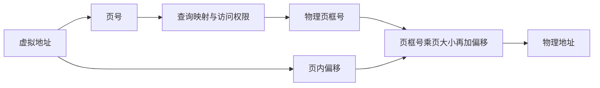

# 06 内存管理与地址转换

[返回教程目录](操作系统教程.md) · [下一章：虚拟内存](07-虚拟内存与页面置换.md)

## 本章目标

理解逻辑地址与物理地址，比较分区、分页和分段，并完成页号、偏移、页表容量及 TLB 时间计算。

## 1. 为什么程序不直接使用物理地址

不同程序可能都认为自己的某个变量位于同一个地址；操作系统通过地址映射，把它们对应到不同物理位置，同时检查访问权限。

**虚拟 / 逻辑地址**是程序使用的地址；**物理地址**是实际内存中的位置。课程中“逻辑地址”和“虚拟地址”常用于相近含义，但应按老师的定义表述。

地址转换由硬件和操作系统共同支持：操作系统建立映射与权限，硬件在访存时执行转换和检查。不同进程也可以显式共享物理页，因此“地址空间隔离”不代表“绝不共享物理内存”。

进程私有虚拟地址空间的概念可参考 [Microsoft 官方说明](https://learn.microsoft.com/en-us/windows/win32/memory/virtual-address-space)。

## 2. 连续分配与碎片

早期或教学模型可把一个任务放到一块连续内存中。

| 方法 | 做法 | 主要问题 |
| --- | --- | --- |
| 固定分区 | 预先划分固定大小区域 | 任务较小时，分区内部有浪费 |
| 动态分区 | 按任务需要分配连续区域 | 分配回收后形成零散空洞 |

**内部碎片**：已经分给任务的区域中，有一部分没有被使用。

**外部碎片**：空闲总量可能够，但零散空洞无法满足一次连续分配。

例：空闲区依次为 100、500、200、300、600 KiB，请求 212 KiB。

- 首次适应 First Fit：选第一个足够大的 500 KiB 区。
- 最佳适应 Best Fit：选足够大且最小的 300 KiB 区。
- 最坏适应 Worst Fit：选最大的 600 KiB 区。

“最佳适应”是算法名称，不保证长期碎片最少。它可能留下很多难以利用的小空洞。

## 3. 分页：把大块拆成等大的小块

把虚拟空间分成**页 Page**，物理内存分成同样大小的**页框 / 页帧 Frame**。一个进程的不同页可以放到不连续的物理页框。

虚拟地址拆成两部分：**页号 + 页内偏移**。

页表回答“某个虚拟页映射到哪个物理页框”，并可记录有效性、访问权限、修改情况等。

分页消除了基本按页分配中的外部碎片，但仍可能有页内浪费，而且页表有开销。实际系统若需要连续的大块物理内存，仍可能遇到更高层次的碎片问题。

## 4. 地址转换完整例题

页大小 1 KiB = 1024 字节，虚拟地址 2500，页表中第 2 页映射到第 5 页框，页号从 0 开始。

1. 页号 = ⌊2500 / 1024⌋ = 2。
2. 页内偏移 = 2500 mod 1024 = 452。
3. 物理地址 = 5 × 1024 + 452 = **5572**。

偏移始终不变，改变的是页号到页框号的映射。

若页大小为 4 KiB = 2¹² 字节，则偏移占 12 位。32 位、按字节编址的虚拟地址，页号占 20 位，共有 2²⁰ 个虚拟页。

如果使用完整单级页表，每项 4 字节，则页表大小为 2²⁰ × 4 = 2²² 字节 = **4 MiB**。

注意：“地址为 32 位”“每项为 4 字节”是题目条件，不能推广成所有真实机器的固定配置。

## 5. 多级页表与 TLB

**多级页表**把映射组织成层级结构。对于稀疏地址空间，没有使用的大片区域可以不建立末级页表，从而节省内存；代价是未命中缓存时，页表遍历可能需要多次访问。

**TLB**缓存的是地址转换信息，通常可理解为近期虚拟页到物理页框的映射；它与保存数据内容的 CPU Cache 不是同一类缓存。

TLB 未命中通常表示需要查询页表，**不等于页面不在内存，也不等于一定发生缺页**。

### TLB 有效访存时间例题

假设单级页表，忽略 CPU Cache、缺页及其他开销；查 TLB 耗时 10 ns，访问内存 100 ns，命中率 90%，TLB 查询与后续访问顺序进行。

- 命中：查 TLB 10 ns + 访问数据 100 ns = 110 ns。
- 未命中：查 TLB 10 ns + 查页表 100 ns + 访问数据 100 ns = 210 ns。
- 平均时间 = 0.9 × 110 + 0.1 × 210 = **120 ns**。

若教材假设 TLB 与内存操作重叠，或使用多级页表，公式会不同。做题先写访问路径，再算加权平均。

## 6. 分段与段页式

分段按照程序逻辑单位划分，如代码段、数据段。每段长度可不同，逻辑地址由段号和段内偏移构成。

段表保存段基址和界限。若某段基址为 4000、长度为 1000，偏移 800 合法，物理地址为 4800；偏移 1200 越界。长度是 1000 时，合法偏移通常为 0～999。

| 比较项 | 分页 | 分段 |
| --- | --- | --- |
| 划分依据 | 固定大小 | 逻辑意义 |
| 大小 | 一般固定 | 可以不同 |
| 地址组成 | 页号、页内偏移 | 段号、段内偏移 |
| 基本碎片特征 | 可能内部碎片 | 连续放置各段时可能外部碎片 |
| 保护与共享 | 可按页实现 | 逻辑段适合表达相关边界 |

段页式先确定段，再在段内进行分页。它组合了逻辑组织和非连续分配，但管理和转换更加复杂。

## 7. 拓展：虚拟内存占用不等于实际驻留

进程可能预留很大的地址区域，却没有立即使用同等大小的物理内存。看进程内存时要区分地址空间规模、实际驻留、共享页等概念。

Java 堆也不等于进程全部内存：线程栈、元空间、直接内存、代码缓存及本地库等都会占用内存。

## 自测与答案

1. 页大小 4 KiB，虚拟地址 9000，第 2 页映射到第 7 页框，物理地址是多少？
2. TLB 未命中是否必然访问磁盘？
3. 分页是否完全没有内存浪费？

**答案**：①页号 2、偏移 808，物理地址 7×4096+808=29480；②不必然，可能查页表就得到映射；③仍可能存在内部碎片、页表等开销。
