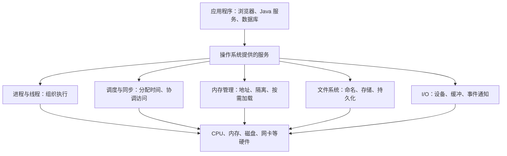

# 操作系统教程：期末考试与求职面试

> 适用：本科操作系统课程复习，以及 Java / 后端开发实习、校招面试。
> 范围：理解机制、推演过程、手算经典题、解释工程现象；不涉及内核源码、汇编或底层代码实现。
> 编写日期：2026-09-30。

------

## 如何使用

第一次学习按 01～10 顺序读。每章先理解例子，再合上笔记回答自测；计算题必须亲手写出过程。已经学过课程，可先做第 11 章，再回到不会的章节。

期末复习重点：**概念辨析、进程状态、调度计算、同步关系、银行家算法、地址转换、页面置换、磁盘调度和文件索引计算**。

面试复习重点：**进程与线程、上下文切换、锁、死锁、虚拟内存、缺页、I/O 模型，以及 CPU / 内存 / 磁盘异常的排查思路**。

这里给出通用本科课程范围，具体考试范围与术语以你的教材、老师课件和历年题为准。标为“拓展”的内容可在掌握基础后阅读。

## 章节导航

| 章节 | 你要解决的问题 | 期末重点 | 面试重点 |
| --- | --- | --- | --- |
| [01 操作系统全景与基础概念](01-操作系统全景与基础概念.md) | 操作系统究竟负责什么？ | 特征、系统调用、中断 | 用户态与内核态 |
| [02 进程、线程与通信](02-进程线程与通信.md) | 一个程序如何运行并与其他程序协作？ | 状态转换、PCB、通信 | 线程、切换、协程 |
| [03 CPU 调度与计算题](03-CPU调度与计算题.md) | 多个任务如何轮流用 CPU？ | FCFS、SJF、SRTF、RR | 吞吐量、响应时间 |
| [04 同步、互斥与经典问题](04-同步互斥与经典问题.md) | 多个任务如何安全访问共享数据？ | 信号量、生产者消费者 | 锁、条件变量、线程安全 |
| [05 死锁与银行家算法](05-死锁与银行家算法.md) | 为什么任务会互相等到永远？ | 四条件、安全序列 | 锁顺序、超时与排查 |
| [06 内存管理与地址转换](06-内存管理与地址转换.md) | 程序中的地址怎样对应实际内存？ | 分区、分页、分段、TLB | 地址隔离、内存指标 |
| [07 虚拟内存与页面置换](07-虚拟内存与页面置换.md) | 内存不够时系统怎么办？ | FIFO、LRU、OPT、缺页率 | COW、抖动、OOM |
| [08 文件系统与持久化](08-文件系统与持久化.md) | 文件怎样命名、存储和恢复？ | 分配、目录、索引计算 | inode、链接、持久化 |
| [09 I/O、磁盘与网络服务](09-IO磁盘与网络服务.md) | 数据如何进入和离开程序？ | DMA、缓冲、磁盘调度 | 多路复用、epoll、零拷贝 |
| [10 把知识用到后端项目](10-把知识用到后端项目.md) | 系统慢、卡、占内存时如何分析？ | 综合理解 | 线程池、排查、容器 |
| [11 期末模拟卷与解析](11-期末模拟卷与解析.md) | 是否真的会做题？ | 100 分模拟卷 | 基础查漏补缺 |
| [12 面试问答与追问](12-面试问答与追问.md) | 如何讲清楚并接住追问？ | 简答题表达 | 22 组问题 |
| [13 复习计划与考前速查](13-复习计划与考前速查.md) | 怎样安排时间和检验掌握程度？ | 七天冲刺、公式 | 三周路线、口述清单 |

## 先建立一张地图

学习时一直追问三个问题：**谁拥有资源？谁正在执行？谁在等待什么？** 很多难题都能被这三个问题拆开。

## 学到什么程度算掌握

- 能用自己的话解释概念，并给出一个例子和一个容易混淆的反例。
- 能画出状态图、调度时间线、资源关系或地址转换过程。
- 能独立完成计算题，并说明题目的假设条件。
- 能从机制解释项目现象，例如“线程很多但 CPU 不高”“写入成功后断电仍丢数据”。

不必先背所有名词。先理解任务为什么要等待、资源为什么要隔离、数据为什么要缓存，再补充规范表达。
