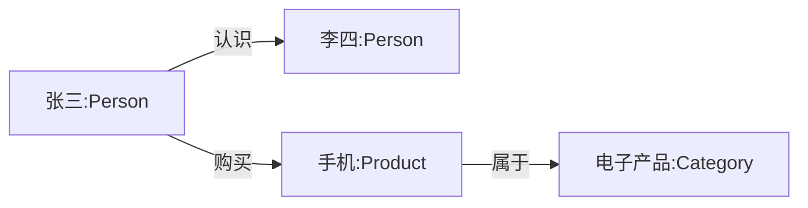

# Neo4j 快速上手 😎😎😎

## 1. 先说结论

Neo4j 是一个**图数据库**。

它不是按“表”来存数据，而是按：

- **节点 Node**：实体
- **关系 Relationship**：实体之间的连接
- **属性 Property**：节点或关系上的字段
- **标签 Label**：给节点分类

如果你的数据天然就是“谁和谁有什么关系”，比如：

- 社交关系
- 推荐系统
- 知识图谱
- 风控关系网
- 路径查询

那 Neo4j 往往比传统关系型数据库更顺手。

---

## 2. 一个直观理解

关系型数据库更像“表格”：

- 用户表
- 订单表
- 商品表
- 通过外键关联

Neo4j 更像“关系网络”：

- 张三 是 `Person`
- 张三 认识 李四
- 张三 购买 了 手机
- 手机 属于 `Product`



---

## 3. Neo4j 和 MySQL / PostgreSQL 的区别

| 维度 | Neo4j | MySQL / PostgreSQL |
|---|---|---|
| 数据模型 | 图结构 | 表结构 |
| 核心对象 | 节点、关系、属性、标签 | 表、行、列 |
| 关联方式 | 关系本身就是一等公民 | 通过外键 / JOIN |
| 强项 | 多跳关系查询、路径查询 | 事务、报表、强结构化数据 |
| 查询语言 | Cypher | SQL |
| 适合场景 | 关系密集型业务 | 业务数据、交易系统、报表系统 |

一句话：

**关系越复杂，Neo4j 越香；表越规整，MySQL / PostgreSQL 越稳。**

---

## 4. Docker 一键启动

### 4.1 启动命令

```powershell
docker run -d `
  --name neo4j `
  -p 7474:7474 `
  -p 7687:7687 `
  -e NEO4J_AUTH=neo4j/12345678 `
  -v neo4j_data:/data `
  -v neo4j_logs:/logs `
  neo4j:5
```

### 4.2 参数说明

| 参数 | 说明 |
|---|---|
| `7474` | Neo4j Browser 的 Web 端口 |
| `7687` | Bolt 协议端口，应用程序常用 |
| `NEO4J_AUTH=neo4j/12345678` | 账号密码，默认用户名通常是 `neo4j` |
| `-v neo4j_data:/data` | 数据持久化 |
| `-v neo4j_logs:/logs` | 日志持久化 |

### 4.3 常用命令

```powershell
# 看日志
docker logs neo4j

# 停止 / 启动
docker stop neo4j
docker start neo4j

# 删除容器
docker rm -f neo4j
```

### 4.4 访问方式

- 浏览器打开：`http://localhost:7474`
- 默认使用：`Bolt` 连接到 `localhost:7687`

---

## 5. Neo4j 的核心概念

### 5.1 节点 Node

节点表示一个实体，比如用户、商品、城市。

```cypher
CREATE (:Person {name: '张三', age: 18})
```

### 5.2 标签 Label

标签相当于节点分类。

```cypher
(:Person)
(:Product)
(:City)
```

### 5.3 关系 Relationship

关系表示两个节点之间的连接，方向很重要。

```cypher
(:Person)-[:KNOWS]->(:Person)
(:Person)-[:BOUGHT]->(:Product)
```

### 5.4 属性 Property

节点和关系都可以带属性。

```cypher
(:Person {name: '张三', age: 18})
[:BOUGHT {time: '2026-07-01'}]
```

---

## 6. Cypher 基础语法

Cypher 是 Neo4j 的查询语言，风格有点像 SQL，但更偏图查询。

### 6.1 创建节点

```cypher
CREATE (:Person {name: '张三', age: 18})
```

### 6.2 创建关系

```cypher
CREATE (a:Person {name: '张三'})
CREATE (b:Person {name: '李四'})
CREATE (a)-[:KNOWS]->(b)
```

### 6.3 一次性创建图

```cypher
CREATE (a:Person {name: '张三'})-[:KNOWS]->(b:Person {name: '李四'})
```

### 6.4 查询节点

```cypher
MATCH (p:Person)
RETURN p
```

```cypher
MATCH (p:Person {name: '张三'})
RETURN p
```

### 6.5 查询关系

```cypher
MATCH (a:Person)-[:KNOWS]->(b:Person)
RETURN a, b
```

### 6.6 条件过滤

```cypher
MATCH (p:Person)
WHERE p.age >= 18
RETURN p.name, p.age
```

### 6.7 更新节点

```cypher
MATCH (p:Person {name: '张三'})
SET p.age = 20
RETURN p
```

### 6.8 删除节点和关系

```cypher
MATCH (p:Person {name: '张三'})
DELETE p
```

如果节点上还有关系，通常要先删关系：

```cypher
MATCH (p:Person {name: '张三'})-[r]-()
DELETE r, p
```

---

## 7. 常用查询写法

### 7.1 查某个人认识谁

```cypher
MATCH (a:Person {name: '张三'})-[:KNOWS]->(b:Person)
RETURN b.name
```

### 7.2 查两层关系

```cypher
MATCH (a:Person {name: '张三'})-[:KNOWS]->(:Person)-[:KNOWS]->(c:Person)
RETURN c.name
```

### 7.3 查路径

```cypher
MATCH path = (a:Person {name: '张三'})-[:KNOWS*1..3]->(b:Person)
RETURN path
```

`*1..3` 表示查 1 到 3 跳的路径。

### 7.4 去重查询

```cypher
MATCH (p:Person)-[:KNOWS]->(f:Person)
RETURN DISTINCT f.name
```

---

## 8. 索引和约束

Neo4j 也有索引和约束，不是完全靠遍历。

### 8.1 唯一约束

```cypher
CREATE CONSTRAINT person_name_unique IF NOT EXISTS
FOR (p:Person)
REQUIRE p.name IS UNIQUE;
```

### 8.2 普通索引

```cypher
CREATE INDEX person_age_index IF NOT EXISTS
FOR (p:Person)
ON (p.age);
```

### 8.3 为什么要建索引

- 提高按属性查找的速度
- 让唯一性校验更快
- 关系多、数据大时差别很明显

---

## 9. 一个小案例

假设你要建一个“用户购买商品”的图。

### 9.1 建图

```cypher
CREATE
  (u:User {id: 1, name: '张三'}),
  (p:Product {id: 1001, name: 'iPhone'}),
  (u)-[:BOUGHT {time: '2026-07-01'}]->(p)
```

### 9.2 查询张三买过什么

```cypher
MATCH (u:User {name: '张三'})-[:BOUGHT]->(p:Product)
RETURN p.name
```

### 9.3 查询买过 iPhone 的人

```cypher
MATCH (u:User)-[:BOUGHT]->(p:Product {name: 'iPhone'})
RETURN u.name
```

这个场景在关系型数据库里也能做，但如果再叠加：

- 买过的人
- 买过的人认识的人
- 认识的人又买了什么
- 多跳推荐

图数据库会更自然。

---

## 10. Neo4j 适合做什么

- 推荐系统
- 社交关系链
- 风控关系网
- 知识图谱
- 组织架构
- 路径搜索
- 设备拓扑

---

## 11. Neo4j 不太适合什么

- 大量简单事务型读写
- 纯报表分析
- 非常规整、表结构特别稳定的业务
- 对 SQL 生态依赖很深的项目

如果你的业务主要是：

- 下单
- 支付
- 库存
- 账务

通常还是关系型数据库更合适。

---

## 12. 常见误区

### 12.1 图数据库不是“更高级的数据库”

不是。它只是解决另一类问题更强。

### 12.2 Neo4j 不是拿来替代 MySQL 的

更准确地说：

- MySQL / PostgreSQL 负责交易和结构化数据
- Neo4j 负责关系探索和图查询

### 12.3 不是所有关系都该上图数据库

如果数据关系并不复杂，硬上 Neo4j 反而会增加学习和运维成本。

---

## 13. 一句话总结

**Neo4j = 把“关系”当成核心数据来存的数据库，适合处理多跳关系、路径查询和知识网络。**

---

## 14. 相关笔记

- [[技术栈/数据库/MySQL/SQL知识]] —— 关系型数据库基础
- [[技术栈/数据库/PostgreSQL/PostgreSQL知识库]] —— 另一种通用数据库
- [[项目与成长/实习方法论/通讯协议/SSE/SSE vs WebSocket vs HTTP]] —— 如果你在做实时推送，可以一起看

