# 计算机网络知识总结 😎😎😎

> 一份系统、完整的计算机网络学习与面试知识手册
> 适用人群:后端开发工程师 / 求职面试者 / 在校学生
> 最后更新:2026-06

---

## 📑 目录 (Table of Contents)

### 🌐 基础篇
- [一、网络基础概念](#一网络基础概念)
- [二、网络参考模型](#二网络参考模型)

### 🔧 协议篇
- [三、物理层与数据链路层](#三物理层与数据链路层)
- [四、网络层](#四网络层)
- [五、传输层](#五传输层)
- [六、应用层](#六应用层)

### 🚀 进阶篇
- [七、HTTP 与 HTTPS 详解](#七http-与-https-详解)
- [八、DNS 域名系统](#八dns-域名系统)
- [九、网络安全](#九网络安全)

### 🛠️ 实践篇
- [十、常见网络工具与命令](#十常见网络工具与命令)
- [十一、性能优化与高可用](#十一性能优化与高可用)
- [十二、实战案例与排查思路](#十二实战案例与排查思路)

### 📝 面试篇
- [十三、常见面试题汇总](#十三常见面试题汇总)
- [十四、附录与速查表](#十四附录与速查表)

---

## 🗺️ 知识图谱 (Knowledge Map)

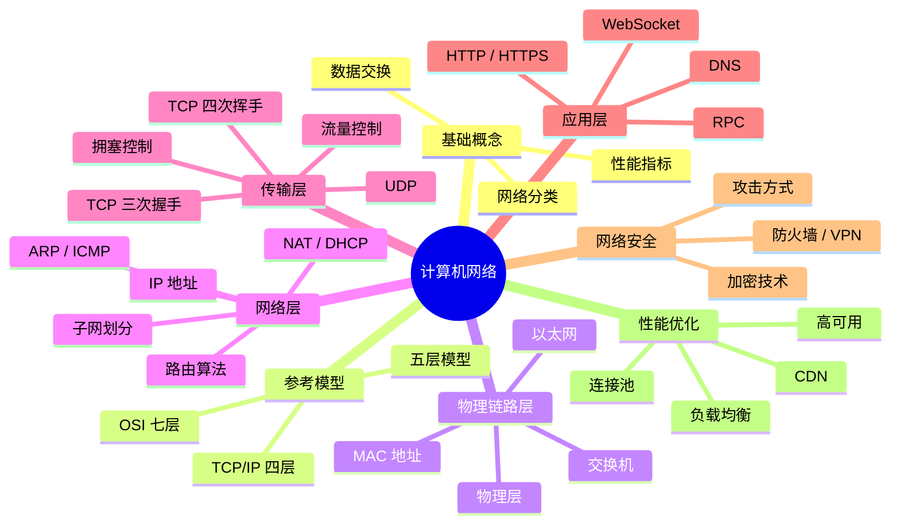

---

## 一、网络基础概念

### 1.1 计算机网络的定义

计算机网络是指将**地理位置不同**的、具有**独立功能**的多台计算机及其外部设备,通过**通信线路**连接起来,在**网络操作系统、网络管理软件及网络通信协议**的管理和协调下,实现**资源共享和信息传递**的计算机系统。

> 💡 **三要素**:通信主体(计算机/设备) + 通信介质(网线/光纤/无线) + 通信协议(TCP/IP)

### 1.2 网络分类

#### 按覆盖范围分类

| 类型 | 全称 | 覆盖范围 | 典型技术 | 速率 | 应用场景 |
|------|------|----------|----------|------|----------|
| **PAN** | Personal Area Network 个人域网 | 1~10m | 蓝牙、红外 | < 1Mbps | 手机、耳机、手表 |
| **LAN** | Local Area Network 局域网 | 10m~10km | 以太网、Wi-Fi | 100Mbps ~ 10Gbps | 公司、校园、家庭 |
| **MAN** | Metropolitan Area Network 城域网 | 10~100km | FDDI、ATM | < 100Mbps | 城市骨干网 |
| **WAN** | Wide Area Network 广域网 | 100km以上 | MPLS、SDH | < 1Gbps | 跨城市、跨国 |
| **Internet** | 因特网 | 全球 | TCP/IP 协议族 | 不限 | 全球互联 |

#### 按拓扑结构分类

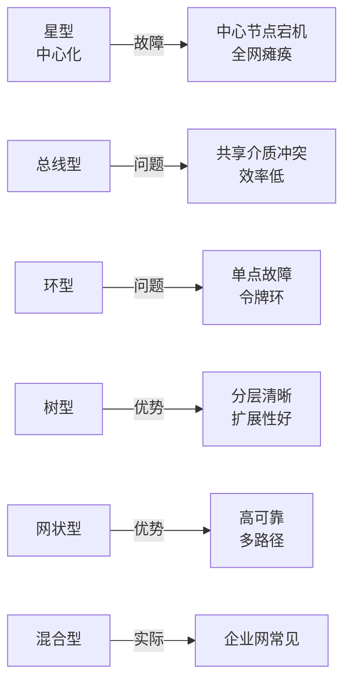

**详细对比**:

| 拓扑 | 优点 | 缺点 | 适用场景 |
|------|------|------|----------|
| ⭐ **星型** | 结构简单、易扩展 | 中心节点压力大 | 局域网(交换机为中心) |
| 🚌 **总线型** | 布线少、成本低 | 冲突多、效率低 | 早期以太网(已淘汰) |
| 🔄 **环型** | 传输控制简单 | 单点故障 | 令牌环网(已淘汰) |
| 🌳 **树型** | 层次清晰、易扩展 | 根节点故障影响大 | 大型园区网 |
| 🕸️ **网状型** | 高可靠、多路径 | 成本高、复杂 | 互联网骨干网 |

#### 按传输介质分类

- **有线网络**:
  - 🔌 **双绞线**(网线):百兆用 1、2 发送,3、6 接收;千兆用全部 8 根
  - 📡 **同轴电缆**:抗干扰性强,曾用于早期以太网和有线电视
  - 💡 **光纤**:单模(远距离,激光) vs 多模(短距离,LED),传输距离远、速度快
- **无线网络**:Wi-Fi、4G/5G、卫星、蓝牙、ZigBee、LoRa

### 1.3 性能指标

#### 时延 (Latency) 详解

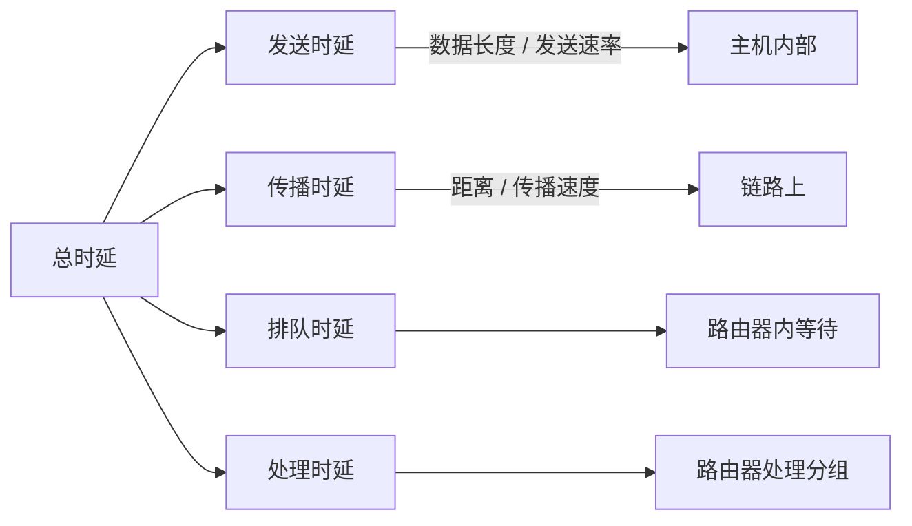

**公式汇总**:

| 指标 | 公式 | 说明 |
|------|------|------|
| **发送时延** | 数据长度(bit) / 发送速率(bps) | 数据从主机到网卡的时间 |
| **传播时延** | 信道长度(m) / 传播速率(m/s) | 信号在介质上传播时间 |
| **排队时延** | 取决于网络拥塞程度 | 在路由器中等待处理时间 |
| **处理时延** | 取决于路由器性能 | 路由器处理分组时间 |
| **总时延** | 发送 + 传播 + 排队 + 处理 | 数据端到端总时间 |

> 🔑 **总时延 = 发送时延 + 传播时延 + 排队时延 + 处理时延**

#### 其他性能指标

| 指标 | 含义 | 单位 | 典型值 |
|------|------|------|--------|
| **带宽 (Bandwidth)** | 最高数据传输速率 | bps | 百兆、千兆 |
| **吞吐量 (Throughput)** | 实际单位时间传输量 | bps | 通常 < 带宽 |
| **RTT (Round-Trip Time)** | 数据往返时间 | ms | 内网 <1ms,公网 10-100ms |
| **丢包率 (Packet Loss)** | 丢失分组 / 总分组 | % | 应 < 1% |
| **利用率** | 信道被占用程度 | % | 过高会产生较大时延 |

> ⚠️ **利用率陷阱**:利用率接近 100% 时,时延会急剧上升。所以利用率一般控制在 50% 以内。

### 1.4 数据交换方式

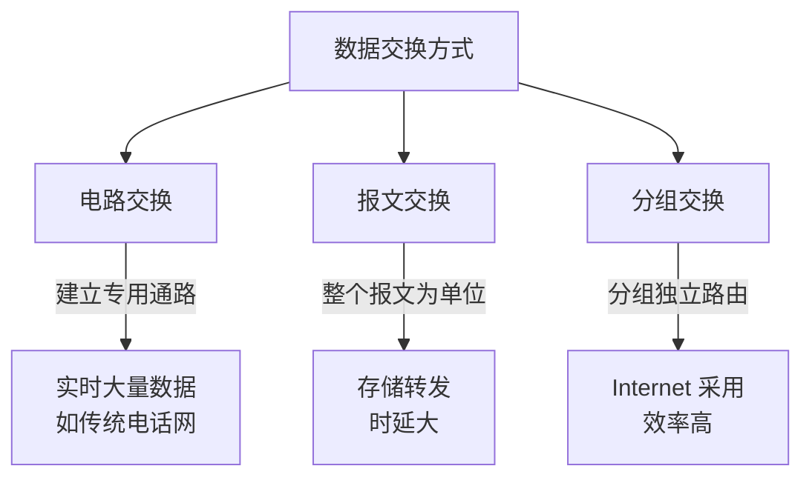

**三种方式对比**:

| 方式 | 建立连接 | 资源占用 | 可靠性 | 适用场景 |
|------|---------|---------|--------|----------|
| 电路交换 | 需要 | 独占 | 高 | 实时通话(传统电话) |
| 报文交换 | 不需要 | 共享 | 中 | 电报(已淘汰) |
| 分组交换 | 不需要 | 共享 | 中 | Internet(主流) |

---

## 二、网络参考模型

### 2.1 OSI 七层模型 (理论模型)

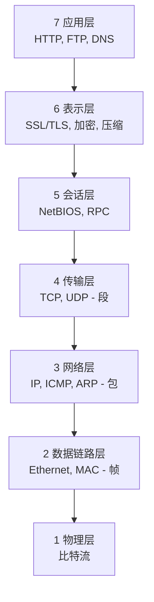

| 层 | 名称 | 主要功能 | 典型协议/设备 | 数据单位 |
|----|------|----------|---------------|----------|
| 7 | **应用层** | 为用户提供网络服务 | HTTP、FTP、SMTP、DNS | 报文(Message) |
| 6 | **表示层** | 数据表示、加密、压缩 | SSL/TLS、JPEG、ASCII | 报文 |
| 5 | **会话层** | 建立、管理、终止会话 | NetBIOS、RPC | 报文 |
| 4 | **传输层** | 端到端可靠传输、流量控制 | TCP、UDP | 段(Segment) |
| 3 | **网络层** | 路由选择、分组转发 | IP、ICMP、ARP、OSPF | 包(Packet) |
| 2 | **数据链路层** | 帧的封装、差错检测、流量控制 | Ethernet、PPP、HDLC | 帧(Frame) |
| 1 | **物理层** | 比特流传输 | 网线、光纤、集线器 | 比特(Bit) |

> 🧠 **记忆口诀**:
> - 中文版(自下而上):**"物数网传会表应"** = 物理 → 数据链路 → 网络 → 传输 → 会话 → 表示 → 应用
> - 英文版(自下而上):**"All People Seem To Need Data Processing"** 或 **"Please Do Not Throw Sausage Pizza Away"**

### 2.2 TCP/IP 四层模型 (实际模型)

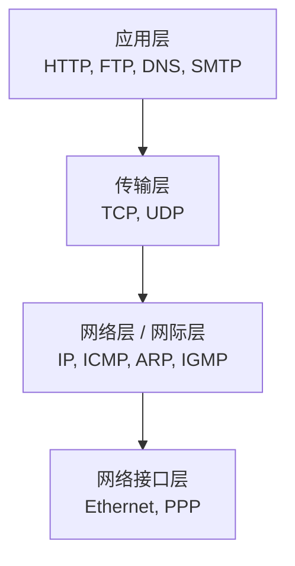

| TCP/IP 层 | 对应 OSI 层 | 主要协议 | 关键设备 |
|-----------|-------------|----------|----------|
| **应用层** | 应用层 + 表示层 + 会话层 | HTTP、FTP、SMTP、DNS、Telnet | 主机进程 |
| **传输层** | 传输层 | TCP、UDP | 操作系统内核 |
| **网络层 (网际层)** | 网络层 | IP、ICMP、IGMP、ARP | 路由器 |
| **网络接口层** | 数据链路层 + 物理层 | Ethernet、PPP、帧中继 | 交换机、网卡 |

### 2.3 五层模型 (教学模型)

折中方案: **应用层 → 传输层 → 网络层 → 数据链路层 → 物理层**

> 💡 五层模型是大学教学和国内教材最常用的模型,综合了 OSI 和 TCP/IP 的优点。

### 2.4 数据传输过程

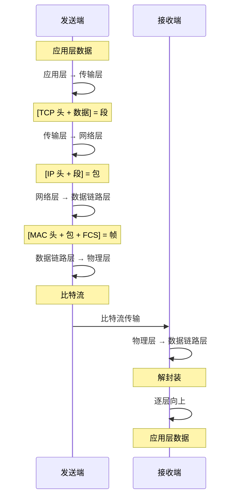

**封装过程示意**:
```
应用层数据  → [传输层头部 + 应用数据] = 段 (Segment)
段          → [网络层头部 + 段]       = 包 (Packet)
包          → [数据链路层头部 + 包 + 尾部] = 帧 (Frame)
帧          → 物理层转换为比特流 (Bit Stream)
```

**数据单位演变**:

| 层级 | 数据单位 | 英文 | 说明 |
|------|---------|------|------|
| 应用层 | 报文 | Message | 用户数据 |
| 传输层 | 段 | Segment | TCP 头 + 数据 |
| 网络层 | 包 | Packet | IP 头 + 段 |
| 数据链路层 | 帧 | Frame | MAC 头 + 包 + FCS |
| 物理层 | 比特流 | Bit | 0/1 信号 |

---

## 三、物理层与数据链路层

### 3.1 物理层基础

- **信号类型**:
  - 📊 **模拟信号**:连续变化的信号(传统电话)
  - 🔢 **数字信号**:离散的两个电平(0/1)
- **编码方式**:
  - **NRZ (不归零编码)**:简单但无同步能力
  - **曼彻斯特编码**:每位中间有跳变,自带时钟(以太网使用)
  - **差分曼彻斯特编码**:抗干扰更强
- **复用技术**:

| 技术 | 全称 | 原理 | 应用 |
|------|------|------|------|
| **TDM** | 时分复用 | 按时间片轮转 | 数字电话 |
| **FDM** | 频分复用 | 按频率划分 | 无线电广播 |
| **WDM** | 波分复用 | 按光波长划分 | 光纤通信 |
| **CDM** | 码分复用 | 按编码区分 | 3G 移动通信 |

- **传输介质**:
  - 🔌 **双绞线**:百兆用 1、2 发送,3、6 接收;Cat5e/Cat6/Cat7 等级
  - 📡 **同轴电缆**:抗干扰性强,曾用于早期以太网
  - 💡 **光纤**:
    - **单模光纤**:激光、长距离(几十公里)、成本高
    - **多模光纤**:LED、短距离(几百米)、成本低

### 3.2 数据链路层

#### 3.2.1 主要功能

1. **封装成帧**:添加帧头、帧尾,进行帧定界
2. **透明传输**:处理数据中出现的特殊字符(字符填充/比特填充)
3. **差错检测**:CRC 校验、和校验
4. **流量控制**:协调发送方与接收方速率

#### 3.2.2 MAC 地址

- 48 位(6 字节)的物理地址
- 格式: `XX-XX-XX-XX-XX-XX` 或 `XX:XX:XX:XX:XX:XX`
- 前 24 位为**厂商代码 (OUI)**,后 24 位为厂商分配
- 唯一标识网络接口卡(NIC)

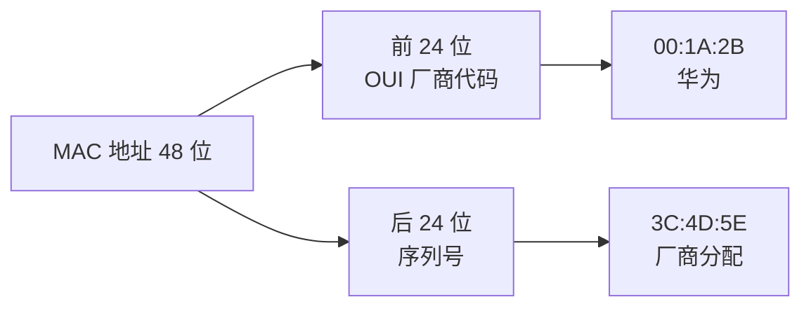

**特殊 MAC 地址**:

| MAC 地址 | 含义 |
|----------|------|
| `FF:FF:FF:FF:FF:FF` | 广播地址 |
| `00:00:00:00:00:00` | 全 0 地址(未分配) |
| `01:00:5E:xx:xx:xx` | IPv4 组播地址映射 |

#### 3.2.3 以太网 (Ethernet)

| 类型 | 速率 | 标准 | 介质 |
|------|------|------|------|
| 标准以太网 | 10Mbps | 10Base-T | 双绞线 |
| 快速以太网 | 100Mbps | 100Base-TX | 双绞线 |
| 千兆以太网 | 1Gbps | 1000Base-T | 双绞线/光纤 |
| 万兆以太网 | 10Gbps | 10GBase-T | 光纤/双绞线 |
| 100G 以太网 | 100Gbps | 100GBase-SR4 | 光纤 |

**以太网帧格式**:
```
| 前导码(7B) | 帧开始定界符(1B) | 目的MAC(6B) | 源MAC(6B) | 类型(2B) | 数据(46-1500B) | FCS(4B) |
```

> 💡 **MTU (Maximum Transmission Unit)**: 最大传输单元,通常 **1500 字节**,超过会分片。

#### 3.2.4 CSMA/CD 协议 (载波监听多路访问/碰撞检测)

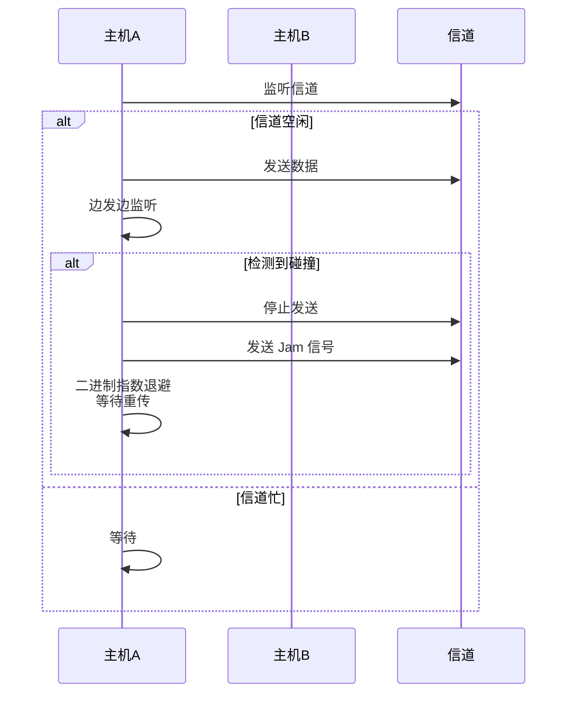

**CSMA/CD 工作流程**:
1. **监听信道**: 空闲则发送,忙则等待
2. **边发送边监听**: 检测到碰撞立即停止
3. **碰撞后**: 发送人为干扰信号(Jam),采用**二进制指数退避算法**等待重传

> ⚠️ CSMA/CD 已基本被全双工交换式以太网取代(交换机隔离冲突域)。

#### 3.2.5 交换机的自学习算法

通过查看帧的**源 MAC 地址**,记录 MAC 地址与端口的对应关系,生成 **MAC 地址表**。

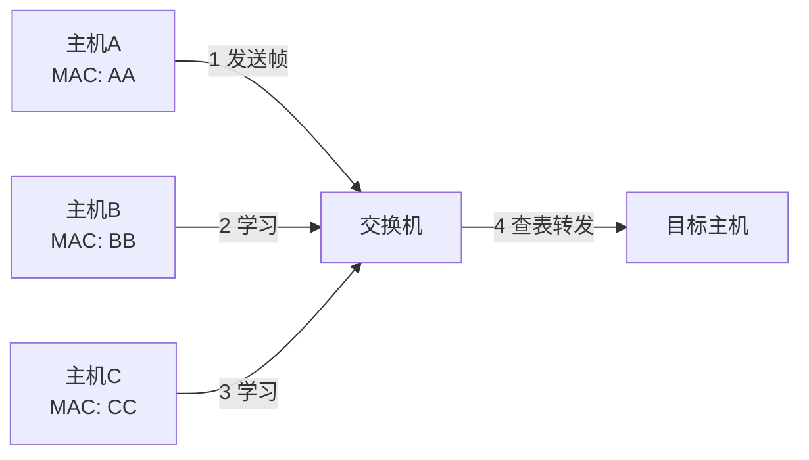

**MAC 地址表示例**:

| MAC 地址 | 端口 | 老化时间 |
|----------|------|----------|
| AA:AA:AA:AA:AA:AA | 1 | 300s |
| BB:BB:BB:BB:BB:BB | 2 | 300s |

---

## 四、网络层

### 4.1 IP 地址

#### 4.1.1 IP 地址分类 (IPv4, 32 位)

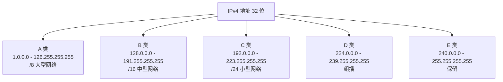

| 类别 | 范围 | 默认子网掩码 | 网络位数 | 主机位数 | 用途 |
|------|------|--------------|----------|----------|------|
| A 类 | 1.0.0.0 ~ 126.255.255.255 | 255.0.0.0 (/8) | 8 | 24 | 大型网络 |
| B 类 | 128.0.0.0 ~ 191.255.255.255 | 255.255.0.0 (/16) | 16 | 16 | 中型网络 |
| C 类 | 192.0.0.0 ~ 223.255.255.255 | 255.255.255.0 (/24) | 24 | 8 | 小型网络 |
| D 类 | 224.0.0.0 ~ 239.255.255.255 | - | - | - | 组播 |
| E 类 | 240.0.0.0 ~ 255.255.255.255 | - | - | - | 保留 |

**特殊 IP 地址**:

| IP 地址 | 含义 |
|---------|------|
| `127.0.0.1` | 本地回环地址(localhost) |
| `0.0.0.0` | 表示本机或默认路由 |
| `255.255.255.255` | 有限广播地址 |
| `169.254.x.x` | APIPA 自动分配地址(DHCP 失败) |
| `10.x.x.x` | 私有 A 类 |
| `172.16.x.x ~ 172.31.x.x` | 私有 B 类 |
| `192.168.x.x` | 私有 C 类 |

> 🧠 **记忆**:私有地址口诀 **"1 个 A,12 个 B,256 个 C"** = 10.x / 172.16-31.x / 192.168.x

#### 4.1.2 CIDR (无类域间路由)

- 表示方法: `IP/前缀长度`,如 `192.168.1.0/24`
- 消除了传统分类的局限性,提高地址利用率
- 路由聚合(超网):`192.168.0.0/16` 包含 256 个 C 类

**路由聚合示例**:
```
192.168.0.0/24  ─┐
192.168.1.0/24  ─┼─→  192.168.0.0/22  (聚合)
192.168.2.0/24  ─┤
192.168.3.0/24  ─┘
```

#### 4.1.3 子网划分

**示例**: `192.168.1.0/26` 划分:
- 子网掩码: `255.255.255.192`
- 每个子网: 64 个地址
- 可用主机数: **62 个** (减去网络地址和广播地址)

**计算公式**:
- 子网数 = 2^(子网位数)
- 主机数 = 2^(主机位数) - 2

#### 4.1.4 IPv4 vs IPv6 对比

| 特性 | IPv4 | IPv6 |
|------|------|------|
| 地址长度 | 32 位 | 128 位 |
| 地址数量 | ~43 亿 | 3.4 × 10³⁸ |
| 表示 | 点分十进制 | 冒号十六进制 |
| 示例 | 192.168.1.1 | 2001:db8::1 |
| 头部 | 复杂(变长) | 简化(固定 40B) |
| 校验和 | 有 | 无(由链路层保证) |
| 安全性 | 需额外配 IPSec | 内置 IPSec |
| 广播 | 支持 | 无,改用组播 |
| 配置 | 手动/DHCP | 自动(SLAAC) |

**IPv6 简写规则**:
- 前导零可省略: `2001:0db8` → `2001:db8`
- 连续零可压缩: `2001:0db8:0000:0000:0000:0000:0000:0001` → `2001:db8::1`

### 4.2 IP 数据报格式

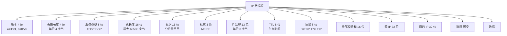

**关键字段**:
- **TTL (Time To Live)**: 生存时间,每经过一个路由器减 1,防止数据包无限循环(默认 64)
- **协议**: 6=TCP, 17=UDP, 1=ICMP
- **片偏移**: 分片后该片在原分组中的相对位置(单位 8 字节)

### 4.3 ARP 协议 (地址解析协议)

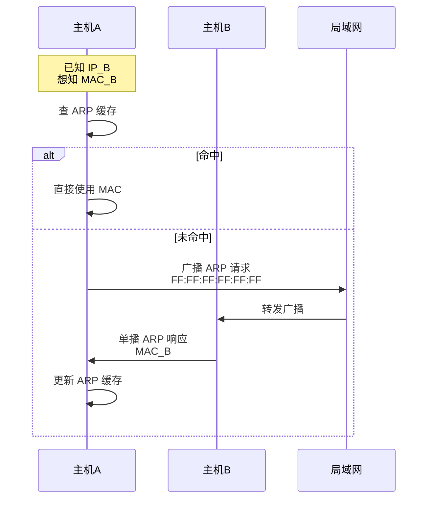

- **作用**: 将 IP 地址解析为 MAC 地址
- **流程**:
  1. 检查 ARP 缓存,命中则返回 MAC
  2. 未命中则**广播** ARP 请求(目的 MAC 为 `FF:FF:FF:FF:FF:FF`)
  3. 目标主机**单播** ARP 响应
  4. 主机更新 ARP 缓存
- **ARP 欺骗**: 中间人攻击常用手段(伪造 ARP 响应)

> 💡 **RARP**: 反向 ARP(由 MAC 找 IP),现在已被 BOOTP、DHCP 取代。

### 4.4 ICMP 协议 (网际控制报文协议)

- 用于报告错误和异常
- 常见报文:

| 类型 | 代码 | 名称 | 用途 |
|------|------|------|------|
| 0 | 0 | Echo Reply | Ping 响应 |
| 3 | 0-15 | Destination Unreachable | 目的不可达 |
| 8 | 0 | Echo Request | Ping 请求 |
| 11 | 0 | Time Exceeded | TTL 超时 |

**Ping 工作原理**:
```
本机 → ICMP Echo Request (类型 8) → 目标主机
本机 ← ICMP Echo Reply (类型 0) ← 目标主机
```

**Traceroute 工作原理**:
```
发送 TTL=1 的 UDP 包 → 收到 ICMP Time Exceeded(第一跳路由器)
发送 TTL=2 的 UDP 包 → 收到 ICMP Time Exceeded(第二跳路由器)
...
发送 TTL=N 的 UDP 包 → 收到 ICMP Port Unreachable(到达目标)
```

### 4.5 路由算法对比

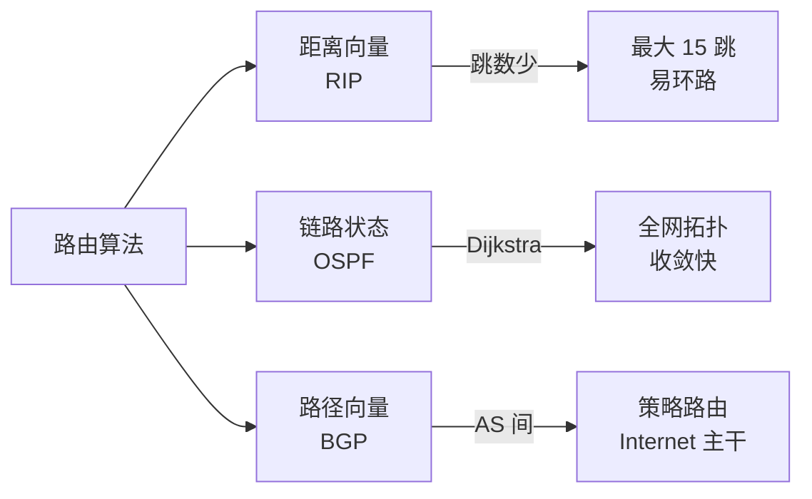

| 协议 | 类型 | 算法 | 范围 | 收敛速度 | 适用规模 |
|------|------|------|------|----------|----------|
| **RIP** | 距离向量 | Bellman-Ford | IGP | 慢 | 小型网络 |
| **OSPF** | 链路状态 | Dijkstra | IGP | 快 | 大型网络 |
| **IS-IS** | 链路状态 | Dijkstra | IGP | 快 | ISP 骨干 |
| **BGP** | 路径向量 | 路径属性 | EGP | 中 | Internet 主干 |

#### 4.5.1 距离向量算法 (RIP)

- 每个路由器维护到目的网络的**距离(跳数)**
- 定期与邻居交换**完整**路由表
- **最大跳数 15**,16 跳视为不可达
- 收敛慢,易产生路由环路

#### 4.5.2 链路状态算法 (OSPF)

- 每台路由器拥有**完整拓扑**
- 通过**洪泛法**传播链路状态
- 采用 **Dijkstra** 最短路径算法
- 收敛快,适合大型网络
- 支持**分层(区域)设计**:骨干区域(area 0) + 普通区域

#### 4.5.3 路径向量算法 (BGP)

- 用于**自治系统 (AS)** 之间的路由
- 路径属性中包含 AS 路径信息
- 防止环路、支持策略路由
- 当前 Internet 主干使用 **BGP-4**

### 4.6 NAT (网络地址转换)

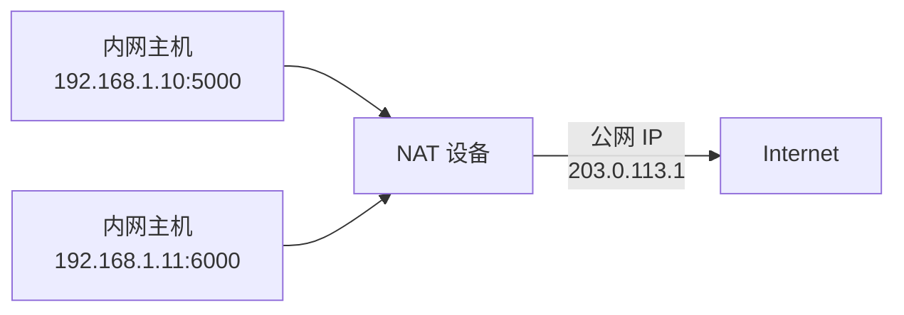

- 解决 IPv4 地址不足
- 私有 IP ↔ 公有 IP 转换
- 类型:

| 类型 | 说明 | 一对一 |
|------|------|--------|
| 静态 NAT | 固定映射 | 是 |
| 动态 NAT | 动态分配公网 IP | 临时 |
| **PAT (NAPT)** | 端口地址转换(常用) | 多个内网共享一个公网 IP |

> 💡 **NAPT 工作原理**:通过 (IP + 端口) 组合区分不同内网主机。

### 4.7 DHCP 协议

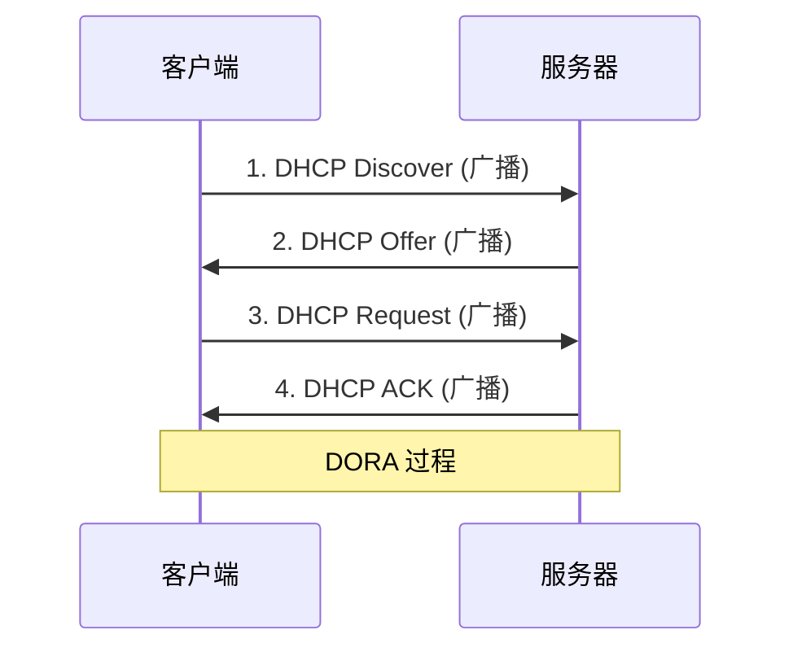

- 自动分配 IP 地址
- 四步过程: **Discover → Offer → Request → ACK (DORA)**
- 基于 **UDP**, 客户端端口 68,服务端端口 67
- 租期通常 24 小时,到期前需续约

### 4.8 路由器与三层交换机

| 设备 | 工作层 | 功能 | 适用 |
|------|--------|------|------|
| **集线器 (Hub)** | 物理层 | 简单信号放大、广播 | 已淘汰 |
| **交换机 (Switch)** | 数据链路层 | 基于 MAC 转发、隔离冲突域 | 局域网 |
| **路由器 (Router)** | 网络层 | 基于 IP 转发、隔离广播域 | 跨网段 |
| **三层交换机** | 网络层+数据链路层 | 二层交换+三层路由、VLAN 间通信 | 园区网核心 |

---

## 五、传输层

### 5.1 端口号

- 16 位,范围 0~65535
- **知名端口 0~1023**:HTTP(80)、HTTPS(443)、FTP(21)、SSH(22)、DNS(53)、Telnet(23)、SMTP(25)、POP3(110)
- **注册端口 1024~49151**
- **动态/私有端口 49152~65535**

### 5.2 UDP (用户数据报协议)

#### 5.2.1 特点

- 🚀 **无连接** - 发送前不建立连接
- 🎯 **尽最大努力交付** - 不保证可靠
- 📦 **面向报文** (不拆分、不合并)
- 🚫 **没有拥塞控制**
- 📡 支持一对一、一对多、多对多通信
- 🪶 首部开销小,仅 **8 字节**

#### 5.2.2 首部格式

```
| 源端口(2B) | 目的端口(2B) |
| 长度(2B)   | 校验和(2B)   |
```

> 💡 UDP 首部 8 字节 = 2(源端口) + 2(目的端口) + 2(长度) + 2(校验和)

#### 5.2.3 适用场景

| 场景 | 原因 |
|------|------|
| 🎮 视频直播、实时游戏 | 低延迟优先,可容忍丢包 |
| 🔍 DNS 查询 | 简单请求-响应 |
| 📞 VoIP | 实时语音,丢包重传意义不大 |
| 📊 SNMP | 简单网络管理 |
| 📡 广播/组播 | TCP 不支持 |

### 5.3 TCP (传输控制协议)

#### 5.3.1 特点

- 🤝 **面向连接** (三次握手、四次挥手)
- 🛡️ **可靠传输** (确认、超时重传、序号、校验和)
- 🌊 **面向字节流**
- 🗣️ **全双工通信**
- 🚦 **流量控制** + **拥塞控制**

#### 5.3.2 TCP 首部 (20~60 字节)

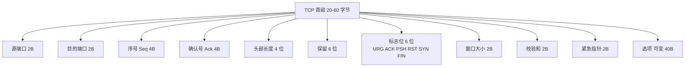

**6 个标志位详解**:

| 标志 | 全称 | 含义 |
|------|------|------|
| **URG** | Urgent | 紧急指针有效 |
| **ACK** | Acknowledgment | 确认号有效 |
| **PSH** | Push | 接收方应尽快交付应用 |
| **RST** | Reset | 复位,异常关闭连接 |
| **SYN** | Synchronize | 同步,发起连接 |
| **FIN** | Finish | 终止,释放连接 |

> 🧠 **记忆口诀**: **"UAPRSF"** = "Unacceptable Actions Produce Resentful Servers Frequently" 😄

#### 5.3.3 三次握手 (建立连接) ⭐⭐⭐

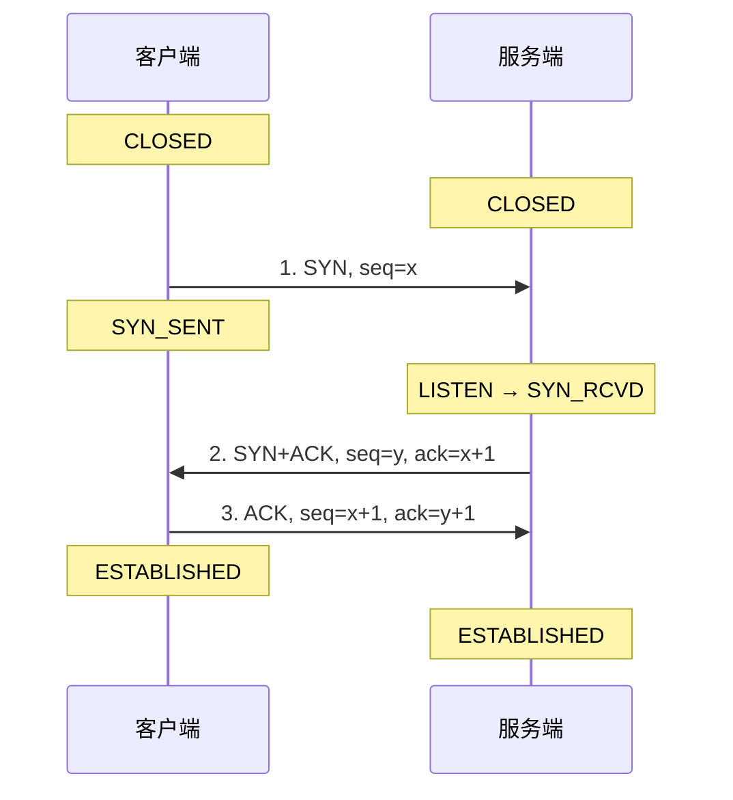

**为什么是三次而不是两次?**
- 防止**已失效的连接请求**突然传到服务器,造成资源浪费
- 双方都需要确认**对方的收发能力**:
  - 第一次: 客户端证明自己**能发**
  - 第二次: 服务端证明自己**能收能发**
  - 第三次: 客户端证明自己**能收**

**为什么不是四次?**
- 服务端可以把 **SYN 和 ACK 合并**为一次发送(捎带确认)

#### 5.3.4 四次挥手 (释放连接) ⭐⭐⭐

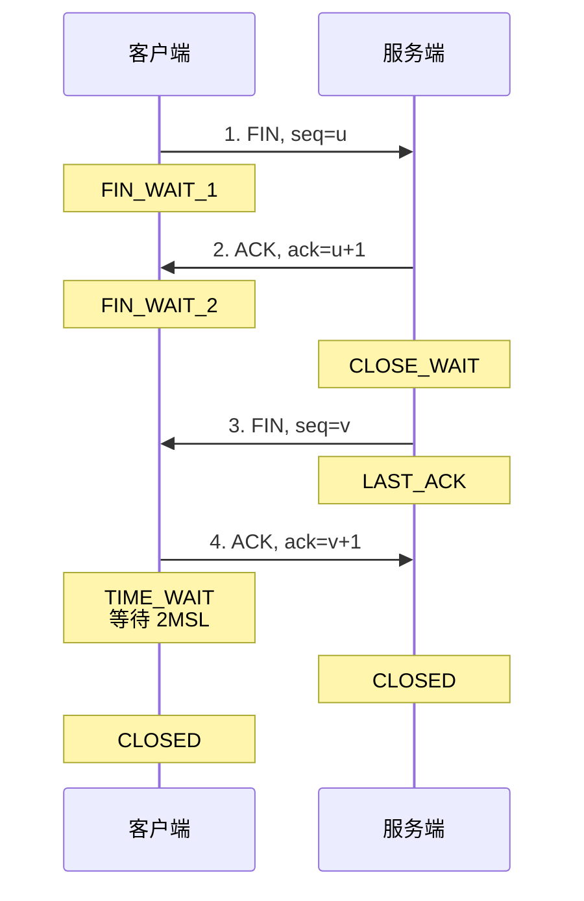

**为什么是四次?**
- TCP **全双工**,各方向都要单独关闭
- 服务端收到 FIN 后,可能还有数据要发送,所以 **ACK 和 FIN 分开发**

**为什么客户端要等待 2MSL (TIME_WAIT)?**
- 保证**最后一个 ACK 能到达服务端**(防止丢包)
- 让本连接产生的所有报文从网络中**消失**(避免影响后续连接)

> ⚠️ **MSL (Maximum Segment Lifetime)**: 报文最大生存时间,通常 2 分钟。2MSL = 4 分钟。

#### 5.3.5 可靠传输机制

| 机制 | 作用 | 关键点 |
|------|------|--------|
| **校验和** | 检测传输错误 | 必选 |
| **序号** | 每个字节都有唯一编号 | 解决乱序、重复 |
| **确认 (ACK)** | 累计确认 + 选择确认 (SACK) | 接收方反馈 |
| **超时重传 (RTO)** | RTO 动态计算 | RTO = SRTT + 4×RTTVAR |
| **快速重传** | 收到 3 个重复 ACK 立即重传 | 不必等超时 |
| **冗余 ACK** | 用于触发快速重传 | 通知发送方丢包 |

#### 5.3.6 流量控制 (滑动窗口) ⭐⭐

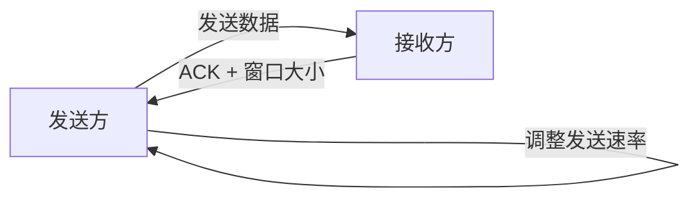

- 接收方通过 ACK 中的**窗口大小**告知发送方接收能力
- 发送方维护**发送窗口**,确保已发送未确认的字节数 ≤ 接收方窗口
- 防止发送过快导致接收方缓冲区溢出

#### 5.3.7 拥塞控制 ⭐⭐⭐

**四大机制**:

```mermaid
graph TB
    A[TCP 拥塞控制] --> B[慢启动<br/>Slow Start]
    A --> C[拥塞避免<br/>Congestion Avoidance]
    A --> D[快重传<br/>Fast Retransmit]
    A --> E[快恢复<br/>Fast Recovery]
    B -->|cwnd ≥ ssthresh| C
    C -->|3 个重复 ACK| D
    D --> E
    B -->|超时| B1[重新慢启动]
    C -->|超时| B1
```

**详细说明**:

| 阶段 | 行为 | 增长方式 |
|------|------|----------|
| **慢启动** | 初始 cwnd = 1 MSS,每 ACK 加 1 MSS | 指数增长(1→2→4→8...) |
| **拥塞避免** | cwnd ≥ ssthresh 后,每 RTT 加 1 MSS | 线性增长(+1/RTT) |
| **快重传** | 收到 3 个重复 ACK 立即重传 | 不必等超时 |
| **快恢复** | ssthresh = cwnd/2, cwnd = ssthresh,直接进入拥塞避免 | - |

**状态变化表**:

| 状态变化 | 触发条件 | ssthresh | cwnd |
|----------|----------|----------|------|
| 慢启动 → 拥塞避免 | cwnd ≥ ssthresh | 不变 | +1/RTT |
| 慢启动 → 快重传 | 3 个重复 ACK | cwnd/2 | cwnd/2 + 3 |
| 拥塞避免 → 快恢复 | 3 个重复 ACK | cwnd/2 | cwnd/2 + 3 |
| 任意阶段 → 慢启动 | 超时 | cwnd/2 | 1 |

**拥塞窗口变化曲线**:
```
cwnd
 ↑
 |    /\        /\         /\
 |   /  \      /  \       /  \
 |  /    \    /    \     /    \
 | /      \  /      \   /      \
 |/        \/        \_/        \__
 +--------------------------------→ 时间
   慢启动  超时/3dupACK  拥塞避免
```

#### 5.3.8 TCP 粘包与拆包

- **原因**: TCP 是流式协议,无消息边界
- **解决方案**:

| 方案 | 优点 | 缺点 |
|------|------|------|
| 固定消息长度 | 简单 | 浪费空间 |
| 分隔符(如 `\n`) | 灵活 | 需转义 |
| 消息头带长度字段 | 灵活高效 | 实现稍复杂 |
| 高级协议(Protobuf/Thrift) | 自动处理 | 依赖框架 |

> 💡 **应用层协议**:HTTP 用 Content-Length 和 chunked 解决;WebSocket 用帧格式解决。

### 5.4 TCP vs UDP 对比

| 特性 | TCP | UDP |
|------|-----|-----|
| 连接 | 面向连接 | 无连接 |
| 可靠性 | 可靠(重传、确认) | 不可靠(尽最大努力) |
| 顺序 | 保证顺序 | 不保证 |
| 流量控制 | 有(滑动窗口) | 无 |
| 拥塞控制 | 有(4 大机制) | 无 |
| 速度 | 慢 | 快 |
| 首部 | 20-60 字节 | 8 字节 |
| 通信方式 | 一对一 | 一对一/一对多/多对多 |
| 应用 | HTTP、FTP、SSH、邮件 | DNS、视频、直播、游戏 |

---

## 六、应用层

### 6.1 常见应用层协议对照表

| 协议 | 端口 | 传输层 | 用途 | 加密 |
|------|------|--------|------|------|
| HTTP | 80 | TCP | 网页浏览 | ❌ |
| HTTPS | 443 | TCP | 加密网页浏览 | ✅ TLS |
| FTP | 21(控制) / 20(数据) | TCP | 文件传输 | ❌ |
| SFTP | 22 | TCP | 加密文件传输 | ✅ SSH |
| SSH | 22 | TCP | 安全远程登录 | ✅ |
| Telnet | 23 | TCP | 远程登录(明文) | ❌ |
| SMTP | 25 | TCP | 邮件发送 | ❌ |
| POP3 | 110 | TCP | 邮件接收 | ❌ |
| IMAP | 143 | TCP | 邮件访问 | ❌ |
| DNS | 53 | UDP/TCP | 域名解析 | ❌ |
| DHCP | 67/68 | UDP | 动态 IP 分配 | ❌ |
| SNMP | 161/162 | UDP | 网络管理 | ❌ |
| NTP | 123 | UDP | 时间同步 | ❌ |
| TFTP | 69 | UDP | 简单文件传输 | ❌ |
| RDP | 3389 | TCP | Windows 远程桌面 | ✅ |

### 6.2 FTP 协议

```mermaid
graph LR
    A[FTP 客户端] -->|控制连接 21 端口| S[FTP 服务器]
    A -->|数据连接<br/>主动/被动模式| S
```

**主动模式 vs 被动模式**:

| 模式 | 数据连接发起方 | 端口 | 适用 |
|------|--------------|------|------|
| **PORT (主动)** | 服务器从 20 端口主动连客户端 | 服务器 20 | 客户端无防火墙 |
| **PASV (被动)** | 客户端连服务器开放随机端口 | 服务器随机 | 客户端有防火墙(常用) |

- 两个连接: **控制连接**(21) + **数据连接**

### 6.3 邮件相关协议

```mermaid
graph LR
    A[发件人] -->|SMTP 25| S1[发件服务器]
    S1 -->|SMTP| S2[收件服务器]
    S2 -->|POP3/IMAP| B[收件人]
```

| 协议 | 端口 | 方向 | 特点 |
|------|------|------|------|
| **SMTP** | 25 | 发送(推) | 邮件从客户端发到服务器、服务器之间转发 |
| **POP3** | 110 | 接收(拉) | 下载后服务器可删除 |
| **IMAP** | 143 | 接收(拉) | 服务器端管理、多设备同步 |

### 6.4 SSH 与 Telnet

| 协议 | 端口 | 加密 | 安全性 |
|------|------|------|--------|
| **Telnet** | 23 | ❌ 明文 | 差(密码可被嗅探) |
| **SSH** | 22 | ✅ RSA/ECC 非对称加密 | 高(替代 Telnet) |

**SSH 工作流程**:
1. 客户端发起连接
2. 服务器发送公钥
3. 协商加密算法
4. 客户端用服务器公钥加密会话密钥
5. 建立加密通道

### 6.5 WebSocket ⭐

```mermaid
sequenceDiagram
    participant 客户端
    participant 服务端
    客户端->>服务端: HTTP 升级请求<br/>Upgrade: websocket
    服务端->>客户端: HTTP 101 Switching Protocols
    Note over 客户端,服务端: 全双工通信开始
    客户端->>服务端: 双向消息
    服务端->>客户端: 双向消息
```

- 基于 HTTP **升级机制**的全双工通信协议
- URL 前缀: `ws://` (非加密) / `wss://` (加密,基于 TLS)
- 适用: 实时聊天、在线游戏、实时数据推送、协同编辑
- 握手: HTTP `Upgrade: websocket`

**与 HTTP 轮询对比**:

| 方式 | 延迟 | 服务器压力 | 实时性 |
|------|------|----------|--------|
| 短轮询 | 高 | 高 | 差 |
| 长轮询 | 中 | 中 | 中 |
| **WebSocket** | **低** | **低** | **优** |

### 6.6 RPC (远程过程调用)

- 像调用本地方法一样调用远程服务
- 代表: gRPC、Thrift、Dubbo
- 通常基于 TCP
- 核心组件: 客户端、服务端、注册中心、序列化协议

**RPC vs HTTP**:

| 特性 | RPC (gRPC) | HTTP (REST) |
|------|-----------|------------|
| 协议 | 自定义(Protobuf) | 标准 HTTP |
| 性能 | 高(二进制、HTTP/2) | 一般(文本) |
| 跨语言 | 强(代码生成) | 强(任何客户端) |
| 可读性 | 差 | 好 |
| 适用 | 内部微服务 | 开放 API |

---

## 七、HTTP 与 HTTPS 详解

### 7.1 HTTP 概述

- **超文本传输协议** (HyperText Transfer Protocol)
- 基于 **请求-响应** 模型
- **无状态** (Cookie/Session 解决)
- 默认端口 80

**HTTP 历史版本**:

| 版本 | 年份 | 关键特性 |
|------|------|----------|
| HTTP/0.9 | 1991 | 仅支持 GET |
| HTTP/1.0 | 1996 | 短连接、支持多种方法 |
| HTTP/1.1 | 1997 | 长连接、管道化(主流) |
| HTTP/2 | 2015 | 二进制分帧、多路复用 |
| HTTP/3 | 2022 | 基于 QUIC (UDP) |

### 7.2 HTTP 请求报文

```http
GET /index.html HTTP/1.1
Host: www.example.com
User-Agent: Mozilla/5.0 (Windows NT 10.0)
Accept: text/html,application/xhtml+xml
Accept-Language: zh-CN,zh;q=0.9
Accept-Encoding: gzip, deflate
Connection: keep-alive
Cookie: sessionId=abc123

[请求体]
```

### 7.3 HTTP 响应报文

```http
HTTP/1.1 200 OK
Content-Type: text/html; charset=UTF-8
Content-Length: 1024
Content-Encoding: gzip
Date: Mon, 17 Jun 2026 10:00:00 GMT
Server: nginx/1.20.0
Set-Cookie: sessionId=xyz789; HttpOnly
Cache-Control: max-age=3600

[响应体]
```

### 7.4 HTTP 方法

| 方法 | 描述 | 幂等 | 安全 | 常见用途 |
|------|------|------|------|----------|
| **GET** | 获取资源 | ✅ | ✅ | 读数据 |
| **POST** | 提交数据 | ❌ | ❌ | 创建资源 |
| **PUT** | 更新资源(整体) | ✅ | ❌ | 整体替换 |
| **PATCH** | 更新资源(部分) | ❌ | ❌ | 局部更新 |
| **DELETE** | 删除资源 | ✅ | ❌ | 删除资源 |
| **HEAD** | 获取头部信息 | ✅ | ✅ | 检查资源 |
| **OPTIONS** | 查看支持方法 | ✅ | ✅ | 跨域预检 |
| **CONNECT** | 建立隧道 | ❌ | ❌ | HTTPS 代理 |

> 💡 **幂等**: 多次执行结果相同
> 💡 **安全**: 不修改服务器数据

### 7.5 HTTP 状态码

```mermaid
graph LR
    A[HTTP 状态码] --> B[1xx 信息]
    A --> C[2xx 成功]
    A --> D[3xx 重定向]
    A --> E[4xx 客户端错误]
    A --> F[5xx 服务器错误]
```

**常见状态码速查**:

| 状态码 | 名称 | 含义 | 处理建议 |
|--------|------|------|----------|
| **200** | OK | 请求成功 | 正常处理 |
| **201** | Created | 资源创建成功 | POST 后返回 |
| **204** | No Content | 成功无返回 | DELETE 后常用 |
| **301** | Moved Permanently | 永久重定向 | 更新书签 |
| **302** | Found | 临时重定向 | 临时跳转 |
| **304** | Not Modified | 缓存未修改 | 使用本地缓存 |
| **400** | Bad Request | 请求语法错误 | 检查参数 |
| **401** | Unauthorized | 未认证 | 登录 |
| **403** | Forbidden | 禁止访问 | 权限不足 |
| **404** | Not Found | 资源不存在 | 资源已删除 |
| **405** | Method Not Allowed | 方法不允许 | 检查 HTTP 方法 |
| **429** | Too Many Requests | 请求过多 | 限流 |
| **500** | Internal Server Error | 服务器内部错误 | 服务异常 |
| **502** | Bad Gateway | 网关错误 | 上游服务异常 |
| **503** | Service Unavailable | 服务不可用 | 服务过载/维护 |
| **504** | Gateway Timeout | 网关超时 | 上游响应慢 |

### 7.6 HTTP 头部字段

#### 通用头部

| 头部 | 作用 |
|------|------|
| `Cache-Control` | 缓存控制 |
| `Connection` | 连接管理 (keep-alive / close) |
| `Date` | 日期 |
| `Transfer-Encoding` | 传输编码 (chunked) |
| `Via` | 代理信息 |

#### 请求头部

| 头部 | 作用 |
|------|------|
| `Host` | 主机名(HTTP/1.1 必需) |
| `User-Agent` | 浏览器信息 |
| `Accept` | 可接受的媒体类型 |
| `Accept-Encoding` | 可接受的编码 (gzip, deflate) |
| `Accept-Language` | 可接受的语言 |
| `Cookie` | 客户端 Cookie |
| `Authorization` | 认证信息(Bearer token) |
| `Referer` | 来源页面 |
| `If-Modified-Since` | 条件请求 |
| `If-None-Match` | ETag 条件请求 |

#### 响应头部

| 头部 | 作用 |
|------|------|
| `Content-Type` | 响应体类型 |
| `Content-Length` | 响应体长度 |
| `Content-Encoding` | 响应体编码 |
| `Set-Cookie` | 设置 Cookie |
| `Location` | 重定向地址 |
| `Server` | 服务器信息 |
| `ETag` | 资源标识 |
| `Last-Modified` | 最后修改时间 |
| `Expires` | 过期时间(HTTP/1.0) |
| `Access-Control-Allow-Origin` | CORS 跨域 |

### 7.7 HTTP/1.0 vs HTTP/1.1 vs HTTP/2 vs HTTP/3

```mermaid
graph TB
    A[HTTP 演进] --> B[HTTP/1.0<br/>1996<br/>短连接]
    A --> C[HTTP/1.1<br/>1997<br/>长连接]
    A --> D[HTTP/2<br/>2015<br/>二进制]
    A --> E[HTTP/3<br/>2022<br/>QUIC]
    C -->|解决| C1[减少 TCP 握手]
    D -->|解决| D1[队头阻塞]
    E -->|解决| E1[TCP 队头阻塞]
```

#### HTTP/1.0
- 短连接: 每个请求/响应都建立新的 TCP 连接
- 支持 GET、HEAD、POST
- 无 Host 头部

#### HTTP/1.1 (主流)
- ✅ **长连接** (Connection: keep-alive,默认开启)
- ✅ **管道化** (Pipelining,理论支持,实际很少用)
- ✅ 引入 `Host` 头部(支持虚拟主机)
- ✅ 增加 PUT、PATCH、DELETE、OPTIONS 等方法
- ✅ 引入 `Range` 范围请求、断点续传
- ✅ 引入 `Cache-Control`、`ETag` 等缓存机制
- ❌ **问题**: 队头阻塞、文本协议解析慢

#### HTTP/2
- ✅ **二进制分帧**: 将数据分割为更小的帧
- ✅ **多路复用**: 一个连接并行处理多个请求,解决队头阻塞
- ✅ **头部压缩 (HPACK)**
- ✅ **服务器推送 (Server Push)**
- ✅ **流优先级**
- ✅ 基于 TLS,默认 HTTPS

#### HTTP/3
- ✅ 基于 **QUIC** 协议 (UDP + 自实现可靠性)
- ✅ 解决 TCP 队头阻塞
- ✅ 内置 TLS 1.3
- ✅ 0-RTT 握手
- ✅ 连接迁移 (Connection ID,IP 变化不影响连接)

**HTTP/1.1 队头阻塞 vs HTTP/2 多路复用**:

```
HTTP/1.1: 请求 1 → 响应 1 → 请求 2 → 响应 2 → ...(串行)
HTTP/2:   并行交错传输多个流(无队头阻塞)
```

### 7.8 HTTPS

#### 7.8.1 原理

```
HTTP + SSL/TLS = HTTPS
```

#### 7.8.2 加密机制

**混合加密**:
- 🔓 **非对称加密** (RSA、ECC): 加密对称密钥
- 🔐 **对称加密** (AES、ChaCha20): 加密实际数据

> 💡 为什么混合?非对称慢但安全,对称快但密钥分发难。混合兼顾两者优点。

#### 7.8.3 TLS 握手过程 (TLS 1.2)

```mermaid
sequenceDiagram
    participant Client
    participant Server
    Client->>Server: 1. ClientHello<br/>(支持的协议版本、加密套件、随机数)
    Server->>Client: 2. ServerHello<br/>(确定的协议、套件、随机数、证书)
    Note over Client: 3. 验证证书
    Note over Client: 4. 生成 pre-master secret
    Note over Client: 5. 派生会话密钥
    Client->>Server: 6. ChangeCipherSpec
    Client->>Server: 7. Finished (加密)
    Server->>Client: 8. ChangeCipherSpec
    Server->>Client: 9. Finished (加密)
    Note over Client,Server: 加密通信开始
```

**总耗时**: 2 RTT

#### 7.8.4 TLS 1.3 改进

- 握手从 2 RTT 减少到 **1 RTT** (0-RTT 模式可更快)
- 只支持**前向保密**的加密套件
- 移除了不安全的算法 (MD5、SHA-1、RC4 等)
- 加密更多握手消息

#### 7.8.5 数字证书

- 由 **CA (Certificate Authority)** 签发
- 包含: 域名、公钥、CA 签名、有效期、颁发者等
- 验证链: 根 CA → 中间 CA → 域证书

```mermaid
graph TB
    R[根 CA<br/>自签名] -->|签发| M[中间 CA]
    M -->|签发| D[域证书<br/>www.example.com]
    R -->|预装在系统| T[可信根证书库]
    T -->|信任链验证| D
```

**证书类型**:

| 类型 | 验证级别 | 适用 |
|------|---------|------|
| **DV** (Domain Validation) | 仅验证域名 | 个人网站 |
| **OV** (Organization Validation) | 验证域名+组织 | 企业网站 |
| **EV** (Extended Validation) | 严格验证 | 金融、电商 |

**免费证书**: Let's Encrypt(90 天自动续期)

#### 7.8.6 HTTPS 的优缺点

| 维度 | 详情 |
|------|------|
| ✅ **优点** | 数据加密传输,防窃听 / 身份认证,防冒充 / 完整性校验,防篡改 / SEO 优势 |
| ❌ **缺点** | 握手耗时增加延迟 / 加解密消耗 CPU / 证书费用(可免费) / 占用更多带宽 |

### 7.9 HTTP 缓存机制

#### 7.9.1 强制缓存

通过 `Cache-Control`、`Expires` 头部控制:

| 指令 | 含义 |
|------|------|
| `max-age=3600` | 1 小时内使用缓存 |
| `no-cache` | 需协商缓存(不是不缓存) |
| `no-store` | 不缓存任何内容 |
| `public` | 任何缓存都可存储 |
| `private` | 仅浏览器可缓存 |

#### 7.9.2 协商缓存 (对比缓存)

- `Last-Modified` / `If-Modified-Since` (时间戳,精度 1 秒)
- `ETag` / `If-None-Match` (文件指纹,优先级更高)

**304 Not Modified**: 资源未修改,使用本地缓存

#### 缓存决策流程

```mermaid
graph TD
    A[浏览器请求] --> B{有缓存?}
    B -->|否| C[请求服务器]
    B -->|是| D{过期?}
    D -->|否| E[使用缓存]
    D -->|是| F{有 ETag?}
    F -->|否| G{有 Last-Modified?}
    F -->|是| H[发 If-None-Match]
    G -->|是| I[发 If-Modified-Since]
    G -->|否| C
    H --> J{304?}
    I --> J
    J -->|是| E
    J -->|否| K[使用新资源]
    C --> K
```

### 7.10 Cookie / Session / Token

#### Cookie
- 浏览器端存储的小段数据
- **4KB 限制**
- 属性:
  - `Expires/Max-Age`: 过期时间
  - `Domain/Path`: 作用范围
  - `Secure`: 仅 HTTPS 传输
  - `HttpOnly`: 禁止 JS 访问(防 XSS)
  - `SameSite`: 防 CSRF(Strict/Lax/None)

#### Session
- 服务器端存储会话状态
- 通过 **SessionID** 标识(通常存在 Cookie 中)
- 分布式场景需要 **Session 共享** (Redis、Spring Session)

#### Token (JWT)

```mermaid
graph LR
    A[JWT 三部分] --> B[Header<br/>头部]
    A --> C[Payload<br/>载荷]
    A --> D[Signature<br/>签名]
    B -->|Base64URL| B1[alg, typ]
    C -->|Base64URL| C1[用户信息]
    D -->|HMAC-SHA256| D1[密钥签名]
```

- **无状态认证**
- 三部分: `Header.Payload.Signature` (用 `.` 连接)
- 适合分布式、微服务
- 缺点: 无法主动失效(需配合黑名单)

#### 三者对比

| 特性 | Cookie | Session | Token (JWT) |
|------|--------|---------|-------------|
| 存储位置 | 浏览器 | 服务器 | 客户端 |
| 状态 | 有状态 | 有状态 | 无状态 |
| 跨域 | 受限 | 受限 | 友好 |
| 适用 | 传统 Web | 单体应用 | 微服务/移动端 |
| 安全性 | 中(可被 CSRF) | 高 | 中(需妥善保管) |

### 7.11 跨域问题 (CORS)

**跨域产生原因**: 浏览器**同源策略**(协议、域名、端口必须相同)

**CORS 解决方案**:

| 方案 | 原理 | 适用 |
|------|------|------|
| **CORS (服务端)** | 服务端设置 `Access-Control-Allow-Origin` | 标准方案(推荐) |
| **JSONP** | 利用 `<script>` 标签无跨域限制 | 仅 GET(已过时) |
| **Nginx 反向代理** | 同源代理转发 | 简单场景 |
| **WebSocket** | 不受同源策略限制 | 实时通信 |

**CORS 关键响应头**:
```
Access-Control-Allow-Origin: https://example.com
Access-Control-Allow-Methods: GET, POST, PUT, DELETE
Access-Control-Allow-Headers: Content-Type, Authorization
Access-Control-Allow-Credentials: true
Access-Control-Max-Age: 86400
```

**预检请求 (Preflight)**: 复杂请求会先发 OPTIONS 请求

---

## 八、DNS 域名系统

### 8.1 作用

将**域名**解析为 **IP 地址** (正向解析),或反向解析(IP → 域名)。

### 8.2 域名结构

```mermaid
graph TB
    A[www.baidu.com.] --> B[根域 .]
    A --> C[顶级域 com]
    A --> D[二级域 baidu]
    A --> E[主机名 www]
```

**顶级域分类**:

| 类别 | 示例 | 用途 |
|------|------|------|
| **gTLD** (通用顶级域) | .com、.org、.net、.edu | 商业、组织 |
| **ccTLD** (国家顶级域) | .cn、.jp、.uk | 国家地区 |
| **新顶级域** | .app、.dev、.io、.ai | 新型应用 |
| **基础设施域** | .arpa | 反向 DNS |

### 8.3 DNS 服务器类型

```mermaid
graph TB
    A[DNS 服务器类型] --> B[根域名服务器<br/>13 组 A-M]
    A --> C[顶级域名服务器<br/>.com .cn 等]
    A --> D[权威域名服务器<br/>域名所属]
    A --> E[本地域名服务器<br/>ISP 提供]
```

| 类型 | 数量 | 作用 |
|------|------|------|
| **根域名服务器** | 13 组(全球分布) | 返回顶级域地址 |
| **顶级域名服务器** | 多个 | 返回权威域地址 |
| **权威域名服务器** | 域名所属 | 返回域名 IP |
| **本地域名服务器** | ISP 提供 | 代理用户查询 |

### 8.4 域名解析过程

```mermaid
sequenceDiagram
    participant 客户端
    participant 本地DNS
    participant 根DNS
    participant 顶级DNS
    participant 权威DNS
    客户端->>本地DNS: 1. 查询 www.baidu.com
    本地DNS->>根DNS: 2. 查询
    根DNS->>本地DNS: 3. 返回 .com 服务器地址
    本地DNS->>顶级DNS: 4. 查询
    顶级DNS->>本地DNS: 5. 返回 baidu.com 权威服务器
    本地DNS->>权威DNS: 6. 查询
    权威DNS->>本地DNS: 7. 返回 IP
    本地DNS->>客户端: 8. 返回 IP
```

**查询方式对比**:

| 方式 | 过程 | 客户端负担 | 性能 |
|------|------|----------|------|
| **递归查询** | 本地 DNS 全权代理 | 小 | 快 |
| **迭代查询** | 客户端自己多次查询 | 大 | 慢 |

> 💡 实际是 **递归 + 迭代** 组合:客户端 → 本地 DNS 是递归,本地 DNS → 各级是迭代。

### 8.5 DNS 记录类型

| 类型 | 用途 | 示例 |
|------|------|------|
| **A** | 域名 → IPv4 地址 | `www.example.com → 93.184.216.34` |
| **AAAA** | 域名 → IPv6 地址 | `www.example.com → 2606:2800:220:1:...` |
| **CNAME** | 别名 | `www → example.com` |
| **MX** | 邮件服务器 | `mail.example.com` |
| **NS** | 域名服务器 | `ns1.example.com` |
| **TXT** | 文本记录 | SPF、DKIM、域名验证 |
| **PTR** | IP → 域名(反向解析) | `34.216.184.93.in-addr.arpa` |
| **SOA** | 起始授权机构 | 区域管理信息 |
| **CAA** | 证书颁发授权 | 指定可签发证书的 CA |

### 8.6 DNS 优化

- **DNS 缓存**:
  - 浏览器缓存(Chrome 1 分钟)
  - 操作系统缓存
  - 本地 DNS 缓存(TTL 控制)
- **DNS 预解析**:
  ```html
  <link rel="dns-prefetch" href="//cdn.example.com">
  ```
- **HttpDNS**: 绕过 Local DNS,防劫持(基于 HTTP 的 DNS)
- **CDN 智能调度**: 就近解析
- **TTL 设置权衡**: 大缓存好但更新慢,小缓存反之

### 8.7 常见问题

| 问题 | 描述 | 解决方案 |
|------|------|----------|
| **DNS 劫持** | 返回错误 IP | DoH/DoT、HttpDNS |
| **DNS 污染** | 在 DNS 协议层注入错误响应 | 加密 DNS、备用 DNS |
| **DNS 放大攻击** | 利用大响应发起 DDoS | DNS 速率限制、BCP38 |
| **DNS 慢** | 解析时间长 | 多级缓存、TTL 调优 |

---

## 九、网络安全

### 9.1 常见攻击方式

```mermaid
graph TB
    A[网络攻击] --> B[XSS<br/>跨站脚本]
    A --> C[CSRF<br/>跨站请求伪造]
    A --> D[SQL 注入]
    A --> E[DDoS]
    A --> F[MITM<br/>中间人]
    A --> G[ARP 欺骗]
```

| 攻击 | 原理 | 防御 |
|------|------|------|
| **XSS** | 在页面注入恶意 JS | 输入过滤、输出编码、CSP、`HttpOnly` Cookie |
| **CSRF** | 利用用户身份发请求 | Token 验证、`SameSite` Cookie、Referer 检查 |
| **SQL 注入** | 拼接恶意 SQL | 参数化查询、ORM、最小权限 |
| **DDoS** | 大量请求耗尽资源 | 流量清洗、CDN、限流 |
| **MITM** | 拦截篡改通信 | HTTPS、证书校验 |
| **ARP 欺骗** | 伪造 ARP 响应 | 静态 ARP 绑定、ARP 防火墙、Dynamic ARP Inspection |
| **DNS 劫持** | 返回错误 IP | DoH/DoT、HttpDNS |

### 9.2 加密技术

#### 9.2.1 对称 vs 非对称加密

```mermaid
graph LR
    A[加密技术] --> B[对称加密<br/>同一密钥]
    A --> C[非对称加密<br/>公钥私钥]
    B -->|快| B1[AES, DES, 3DES, ChaCha20]
    C -->|安全| C1[RSA, ECC, DH]
```

| 维度 | 对称加密 | 非对称加密 |
|------|---------|-----------|
| 密钥 | 同一密钥 | 公钥 + 私钥 |
| 速度 | 快 | 慢(100-1000 倍) |
| 密钥分发 | 困难 | 简单(公开公钥) |
| 用途 | 加密大量数据 | 密钥交换、数字签名 |
| 算法 | AES、DES、3DES、ChaCha20 | RSA、ECC、DH、Ed25519 |

#### 9.2.2 哈希算法

- 单向、不可逆、定长输出
- 算法对比:

| 算法 | 输出长度 | 安全性 | 应用 |
|------|---------|--------|------|
| **MD5** | 128 位 | ❌ 已不安全 | 文件校验(避免用于安全) |
| **SHA-1** | 160 位 | ❌ 已不安全 | 已淘汰 |
| **SHA-256** | 256 位 | ✅ 安全 | 主流使用、区块链 |
| **SHA-3** | 可变 | ✅ 安全 | 新一代标准 |
| **bcrypt** | 可变 | ✅ 安全 | 密码存储(带盐) |

**应用**: 密码存储(加盐)、文件校验、数字签名、区块链。

#### 9.2.3 数字签名

```mermaid
sequenceDiagram
    participant 发送方
    participant 接收方
    Note over 发送方: 1. Hash(数据) = 摘要
    Note over 发送方: 2. 私钥加密摘要 = 签名
    发送方->>接收方: 数据 + 签名
    Note over 接收方: 3. 公钥解密签名 = 摘要
    Note over 接收方: 4. Hash(数据) = 摘要
    Note over 接收方: 5. 对比两个摘要
```

- 发送方: **私钥签名**
- 接收方: **公钥验证**
- 作用: **身份认证 + 完整性 + 不可否认**

### 9.3 防火墙

| 类型 | 工作层 | 检查内容 | 性能 |
|------|--------|---------|------|
| **包过滤** | 网络层 | IP、端口、协议 | 高 |
| **状态检测** | 传输层 | 跟踪连接状态 | 中 |
| **应用层 (WAF)** | 应用层 | HTTP 内容、SQL/XSS | 低 |

### 9.4 VPN 类型

| 类型 | 工作层 | 加密 | 用途 |
|------|--------|------|------|
| **IPSec VPN** | 网络层 | 强 | 站点到站点 |
| **SSL VPN** | 应用层 | 中 | 远程访问 |
| **PPTP/L2TP** | - | 弱 | 已不推荐 |
| **OpenVPN** | 应用层 | 强 | 开源,跨平台 |
| **WireGuard** | 网络层 | 强 | 现代轻量级 |

---

## 十、常见网络工具与命令

### 10.1 网络诊断命令

| 命令 | 平台 | 功能 | 示例 |
|------|------|------|------|
| `ping` | 通用 | 测试连通性 | `ping www.baidu.com` |
| `traceroute` / `tracert` | Linux/Windows | 路由追踪 | `traceroute 8.8.8.8` |
| `nslookup` / `dig` | 通用 | DNS 查询 | `dig www.baidu.com` |
| `ifconfig` / `ipconfig` | Linux/Windows | 查看网络配置 | `ipconfig /all` |
| `ip addr` / `ip a` | Linux | 显示 IP 地址 | `ip a` |
| `netstat` | 通用 | 网络连接状态 | `netstat -an` |
| `ss` | Linux | 替代 netstat | `ss -tnlp` |
| `arp -a` | 通用 | 查看 ARP 表 | `arp -a` |
| `route` / `ip route` | 通用 | 路由表 | `ip route` |
| `telnet` | 通用 | 测试端口连通性 | `telnet 192.168.1.1 80` |
| `curl` / `wget` | 通用 | HTTP 请求 | `curl -v https://api.example.com` |
| `tcpdump` / `Wireshark` | 通用 | 抓包分析 | `tcpdump -i eth0 port 80` |
| `mtr` | Linux | 综合诊断 | `mtr 8.8.8.8` |
| `iperf3` | 通用 | 带宽测试 | `iperf3 -c server` |
| `nmap` | 通用 | 端口扫描 | `nmap -sP 192.168.1.0/24` |

### 10.2 抓包分析 (Wireshark)

**常用过滤语法**:

```bash
# IP 过滤
ip.addr == 192.168.1.1
ip.src == 192.168.1.1
ip.dst == 192.168.1.1

# 端口过滤
tcp.port == 80
tcp.srcport == 443
udp.port == 53

# 协议过滤
http
tcp
dns
icmp

# HTTP 过滤
http.request.method == "GET"
http.response.code == 200
http.host == "www.example.com"

# TCP 标志位
tcp.flags.syn == 1
tcp.flags.ack == 1
tcp.flags.fin == 1

# 组合过滤
ip.addr == 192.168.1.1 && tcp.port == 80
http && ip.src == 192.168.1.1
```

### 10.3 性能测试工具

| 工具 | 用途 | 特点 |
|------|------|------|
| **iperf3** | 带宽测试 | TCP/UDP 双向测试 |
| **ab (Apache Bench)** | HTTP 压测 | 简单、命令行 |
| **wrk** | 现代 HTTP 压测 | 高性能、Lua 脚本 |
| **JMeter** | 综合压测 | 图形化、丰富协议 |
| **wrk2** | 精确 QPS 测试 | 恒定 QPS 输出 |
| **Locust** | 分布式压测 | Python 编写 |

### 10.4 常用 curl 选项

```bash
# GET 请求
curl https://api.example.com

# POST 请求
curl -X POST -d '{"name":"test"}' -H "Content-Type: application/json" https://api.example.com

# 带 Cookie
curl -b "session=abc123" https://api.example.com

# 跟随重定向
curl -L https://example.com

# 显示响应头
curl -I https://example.com

# 设置超时
curl --connect-timeout 5 --max-time 10 https://example.com

# 保存到文件
curl -o file.html https://example.com

# 详细输出
curl -v https://example.com
```

---

## 十一、性能优化与高可用

### 11.1 CDN (内容分发网络)

```mermaid
graph LR
    A[用户 北京] -->|就近访问| E1[边缘节点 北京]
    A2[用户 上海] -->|就近访问| E2[边缘节点 上海]
    A3[用户 广州] -->|就近访问| E3[边缘节点 广州]
    E1 -->|未命中| O[源站]
    E2 -->|未命中| O
    E3 -->|未命中| O
    E1 -->|命中| C1[边缘缓存]
    E2 -->|命中| C2[边缘缓存]
    E3 -->|命中| C3[边缘缓存]
```

- **原理**: 将内容缓存到离用户最近的**边缘节点**
- **加速类型**:
  - **静态加速**:图片、CSS、JS(主流)
  - **动态加速**:API、动态内容(回源优化)
  - **流媒体加速**:视频、直播(分片、HLS)
- **关键技术**:
  - **智能调度**:DNS 解析返回最近节点 IP
  - **缓存策略**:TTL、缓存键、预热
  - **回源机制**:父节点 → 源站
  - **多级缓存**:边缘 → 区域 → 中心

**CDN 工作流程**:
1. DNS 解析返回 CDN 节点 IP(智能调度)
2. 浏览器访问最近的 CDN 节点
3. CDN 节点检查本地缓存
4. 缓存命中直接返回
5. 缓存未命中则回源站拉取,缓存后返回

### 11.2 负载均衡

#### 11.2.1 四层 vs 七层

```mermaid
graph TB
    A[负载均衡] --> B[四层 L4<br/>传输层]
    A --> C[七层 L7<br/>应用层]
    B -->|IP + 端口| B1[LVS, HAProxy]
    C -->|URL/Header/Cookie| C1[Nginx, HAProxy]
```

| 维度 | 四层 (L4) | 七层 (L7) |
|------|----------|----------|
| 工作层 | 传输层 | 应用层 |
| 依据 | IP + 端口 | URL、Header、Cookie |
| 性能 | **高**(简单转发) | 略低(内容解析) |
| 功能 | 简单 | **丰富**(URL 路由、缓存) |
| 实现 | LVS、Nginx Stream、HAProxy | Nginx、HAProxy、Apache |
| 适用 | 高并发、数据库 | Web 应用、API |

#### 11.2.2 负载均衡算法

| 算法 | 原理 | 适用 |
|------|------|------|
| **轮询 (Round Robin)** | 依次分配 | 服务器性能相同 |
| **加权轮询 (WRR)** | 按权重分配 | 服务器性能不同 |
| **最少连接** | 连接数最少优先 | 长连接 |
| **加权最少连接** | 加权 + 最少连接 | 性能不一 + 长连接 |
| **IP Hash** | 同一 IP 走同一服务器 | 会话保持 |
| **一致性哈希** | 哈希环定位 | 缓存集群 |
| **URL Hash** | 同一 URL 走同一服务器 | 缓存场景 |

### 11.3 高可用架构

```mermaid
graph TB
    A[客户端] --> L[负载均衡器<br/>主备]
    L --> S1[服务节点 1]
    L --> S2[服务节点 2]
    L --> S3[服务节点 3]
    S1 --> D1[(主库)]
    S2 --> D1
    S3 --> D1
    D1 -.->|同步| D2[(从库)]
```

**高可用模式**:

| 模式 | 说明 | 适用 |
|------|------|------|
| **主备** | 一主一备,故障切换 | 数据库、VIP |
| **集群** | 多节点同时服务 | 微服务 |
| **异地多活** | 多机房容灾 | 大型互联网 |
| **两地三中心** | 生产 + 同城 + 异地 | 金融级 |

**限流算法**:

| 算法 | 原理 | 特点 |
|------|------|------|
| **固定窗口** | 时间窗内计数 | 简单,有突刺 |
| **滑动窗口** | 滑动时间窗计数 | 平滑 |
| **令牌桶** | 匀速生成令牌 | 允许突发 |
| **漏桶** | 匀速流出 | 强制限速 |

**熔断降级组件**: Sentinel (Alibaba)、Hystrix (Netflix,已停更)、Resilience4J

### 11.4 连接池与池化技术

| 池化对象 | 主流组件 | 配置要点 |
|----------|---------|----------|
| **数据库连接池** | Druid、HikariCP | 最大/最小连接数、超时 |
| **HTTP 连接池** | Apache HttpClient、OkHttp | 连接复用、超时 |
| **线程池** | ThreadPoolExecutor | 核心/最大线程数、队列 |
| **Redis 连接池** | Lettuce、Jedis | 最大连接、空闲连接 |

### 11.5 长连接 vs 短连接

| 对比 | 短连接 | 长连接 |
|------|--------|--------|
| 建立次数 | 每次请求都建立 | 复用连接 |
| 性能 | ❌ 差 | ✅ 好 |
| 资源占用 | 低 | 高 |
| 适用 | 低频请求 | 高频请求 |
| 实现 | HTTP/1.0 | HTTP/1.1+ 默认 |

**HTTP Keep-Alive**: HTTP/1.1 默认开启
**WebSocket**: 真正的长连接(全双工)

### 11.6 性能优化清单

| 层级 | 优化手段 |
|------|----------|
| **前端** | 静态资源 CDN、合并/压缩、懒加载、浏览器缓存、HTTP/2 |
| **网络** | CDN 加速、HTTP/2 or 3、减少请求、压缩传输 |
| **应用** | 缓存(Redis)、连接池、异步、限流、熔断、JVM 调优 |
| **数据库** | 索引、SQL 优化、读写分离、分库分表、连接池 |
| **架构** | 微服务、消息队列、负载均衡、集群、异地多活 |

---

## 十二、实战案例与排查思路

### 12.1 从输入 URL 到页面展示(经典面试题) ⭐⭐⭐

```mermaid
sequenceDiagram
    participant 用户
    participant 浏览器
    participant DNS
    participant 服务器
    participant 渲染
    用户->>浏览器: 1. 输入 URL
    浏览器->>浏览器: 2. 检查缓存
    浏览器->>DNS: 3. DNS 解析
    DNS->>浏览器: 4. 返回 IP
    浏览器->>服务器: 5. TCP 三次握手
    浏览器->>服务器: 6. HTTP/HTTPS 请求
    服务器->>浏览器: 7. HTTP 响应
    浏览器->>浏览器: 8. 解析 HTML
    浏览器->>浏览器: 9. 构建 DOM 树
    浏览器->>浏览器: 10. CSSOM 树
    浏览器->>浏览器: 11. 渲染树 + 布局 + 绘制
    浏览器->>服务器: 12. 加载图片/JS/CSS
    浏览器->>用户: 13. 展示页面
```

**详细步骤**:

1. **URL 解析**:浏览器解析 URL 各部分(协议、域名、端口、路径)
2. **检查缓存**:浏览器缓存 → 系统缓存 → 路由器缓存,命中则跳过
3. **DNS 解析**:本地 DNS → 根 DNS → 顶级 DNS → 权威 DNS,获取 IP
4. **TCP 连接**:**三次握手**建立连接
5. **TLS 握手**:HTTPS 还需 TLS 握手(HTTP/2 默认 HTTPS)
6. **发送 HTTP 请求**:GET /index.html HTTP/1.1
7. **服务器处理**:反向代理 → 应用服务器 → 数据库查询
8. **返回响应**:HTTP/1.1 200 OK + HTML
9. **浏览器解析**:
   - 解析 HTML → **DOM 树**
   - 解析 CSS → **CSSOM 树**
   - 合并 → **渲染树**
10. **布局 (Layout)**:计算元素位置和大小
11. **绘制 (Paint)**:渲染像素
12. **合成 (Composite)**:GPU 合成图层
13. **加载子资源**:图片、JS、CSS(可能阻塞渲染)
14. **JS 执行**:可能修改 DOM/CSSOM,触发重排重绘
15. **页面展示**

### 12.2 接口响应慢排查思路

```mermaid
graph TD
    A[接口慢] --> B[网络层排查]
    A --> C[应用层排查]
    A --> D[数据库层排查]
    A --> E[外部依赖排查]
    B --> B1[ping/traceroute 检查连通性]
    B --> B2[tcpdump 抓包]
    B --> B3[iftop/nethogs 流量]
    C --> C1[应用日志]
    C --> C2[GC 日志]
    C --> C3[线程栈 jstack]
    C --> C4[Arthas 诊断]
    D --> D1[慢 SQL 日志]
    D --> D2[EXPLAIN 执行计划]
    D --> D3[锁等待]
    D --> D4[连接池]
    E --> E1[下游响应时间]
    E --> E2[第三方 API]
    E --> E3[DB / Redis]
```

**分层排查清单**:

| 层级 | 工具/命令 | 检查点 |
|------|----------|--------|
| **网络层** | `ping`、`traceroute`、`mtr` | 连通性、丢包、延迟 |
| **系统层** | `iftop`、`nethogs`、`ss` | 流量、连接状态 |
| **应用层** | 慢 SQL 日志、GC 日志、jstack | 慢方法、阻塞 |
| **数据库** | 慢查询日志、`EXPLAIN` | 索引、锁、连接数 |
| **外部依赖** | APM 工具(SkyWalking) | 下游响应时间 |

### 12.3 大量 TIME_WAIT 问题

**问题**: 短连接频繁建立/关闭,客户端出现大量 `TIME_WAIT` 状态。

**原因**:
- 主动关闭方会进入 TIME_WAIT(等待 2MSL)
- 占用端口和系统资源

**解决方案**:

| 方案 | 配置 | 说明 |
|------|------|------|
| 开启 `tcp_tw_reuse` | `net.ipv4.tcp_tw_reuse = 1` | 允许复用 TIME_WAIT 套接字(客户端) |
| 调整 `tcp_max_tw_buckets` | `net.ipv4.tcp_max_tw_buckets = 5000` | 限制最大 TIME_WAIT 数 |
| 增大端口范围 | `net.ipv4.ip_local_port_range` | 增加可用端口 |
| **使用长连接** | 业务层改造 | **最佳方案** |
| 使用连接池 | HTTP/DB 连接池 | 减少连接建立 |
| 负载均衡 | 多机分摊 | 分散单点压力 |

### 12.4 SYN Flood 攻击防御

**原理**: 攻击者发送大量 SYN 包但不完成第三次握手,耗尽服务器的半连接队列。

**防御**:

| 方案 | 原理 |
|------|------|
| **SYN Cookie** | 不分配资源,编码到序列号 |
| **增大半连接队列** | `tcp_max_syn_backlog` |
| **SYN Proxy** | 防火墙代理 SYN 握手 |
| **限流** | 限制单 IP 的 SYN 速率 |
| **云防护** | 高防 IP、流量清洗 |

### 12.5 高并发系统设计思路

```mermaid
graph TB
    A[高并发系统] --> B[流量层]
    A --> C[服务层]
    A --> D[存储层]
    B --> B1[CDN 静态加速]
    B --> B2[负载均衡]
    B --> B3[限流]
    C --> C1[微服务拆分]
    C --> C2[缓存 Redis]
    C --> C3[消息队列 Kafka]
    C --> C4[熔断降级]
    D --> D1[读写分离]
    D --> D2[分库分表]
    D --> D3[分布式存储]
```

**设计要点**:

| 层级 | 措施 | 目标 |
|------|------|------|
| **流量层** | CDN、负载均衡、Nginx | 分散流量 |
| **服务层** | 微服务、缓存、MQ、限流、熔断 | 提高吞吐 |
| **存储层** | 读写分离、分库分表、NoSQL | 提高容量和性能 |
| **架构层** | 多机房、异地多活、容器化 | 高可用 |

### 12.6 跨域问题排查

**步骤**:
1. 浏览器 F12 打开 Network,查看响应头
2. 检查是否包含 `Access-Control-Allow-Origin`
3. 检查请求方法是否触发预检(OPTIONS)
4. 确认 `withCredentials` 与 `Allow-Credentials` 匹配

**常见错误**:

| 错误 | 原因 | 解决 |
|------|------|------|
| `No 'Access-Control-Allow-Origin'` | 响应头缺失 | 服务端配置 CORS |
| `Credentials flag is 'true'` | 不允许携带凭证 | 设置 `Allow-Credentials: true` |
| `wildcard origin` | 使用 `*` 携带凭证 | 指定明确 origin |

---

## 十三、常见面试题汇总

### 13.1 基础概念

**Q1: OSI 七层模型与 TCP/IP 四层模型对比?**

| OSI 七层 | TCP/IP 四层 | 五层模型 |
|----------|------------|----------|
| 应用层、表示层、会话层 | 应用层 | 应用层 |
| 传输层 | 传输层 | 传输层 |
| 网络层 | 网际层 | 网络层 |
| 数据链路层、物理层 | 网络接口层 | 数据链路层、物理层 |

- OSI 理论完备,实际少用
- TCP/IP 实际工业标准
- 五层模型是教学折中

**Q2: 为什么要分层?**
- 各层独立,降低耦合
- 易于维护和扩展
- 标准化,促进生态

**Q3: HTTP 与 HTTPS 的区别?**

| 维度 | HTTP | HTTPS |
|------|------|-------|
| 端口 | 80 | 443 |
| 加密 | ❌ | ✅ TLS |
| 证书 | 不需要 | 需要 CA 证书 |
| 性能 | 快 | 略慢(握手+加解密) |
| SEO | 一般 | 优势 |

### 13.2 TCP 相关 ⭐⭐⭐

**Q4: TCP 三次握手过程?为什么三次?**
- 过程: SYN → SYN+ACK → ACK
- 原因: 防止失效请求 + 双方确认收发能力

**Q5: TCP 四次挥手过程?为什么四次?为什么 TIME_WAIT?**
- 过程: FIN → ACK → FIN → ACK
- 四次原因: TCP 全双工,各方向单独关闭
- TIME_WAIT: 保证最后 ACK 到达 + 老报文消失

**Q6: TCP 如何保证可靠传输?**
- 校验和、序号、确认、超时重传、流量控制、拥塞控制

**Q7: TCP 拥塞控制四个机制?**
- 慢启动(指数增长)→ 拥塞避免(线性增长)→ 快重传(3 dup ACK)→ 快恢复(cwnd/2)

**Q8: TCP 滑动窗口原理?**
- 接收方通过 ACK 告知窗口大小
- 发送方维护发送窗口,确保已发送未确认 ≤ 接收方窗口

**Q9: TCP 粘包问题及解决方案?**
- 原因: 流式协议无消息边界
- 方案: 固定长度 / 分隔符 / 长度字段 / 高级协议

**Q10: TCP 与 UDP 区别?如何选择?**

| TCP | UDP |
|-----|-----|
| 面向连接 | 无连接 |
| 可靠 | 不可靠 |
| 慢 | 快 |
| 流量/拥塞控制 | 无 |

- 选 TCP: 需要可靠(文件传输、邮件、HTTP)
- 选 UDP: 需要实时(视频、游戏、DNS)

**Q11: TCP 队头阻塞?HTTP/2 如何解决?**
- 原因: TCP 保证顺序,前一个包丢失阻塞后续
- HTTP/2: 多路复用,但 TCP 层仍存在
- HTTP/3: QUIC 基于 UDP,彻底解决

**Q12: TIME_WAIT 状态过多怎么办?**
- 调整 `tcp_tw_reuse`、增加端口范围
- 使用长连接 + 连接池
- 负载均衡

### 13.3 HTTP 相关

**Q13: HTTP 常见状态码及含义?**
- 200 成功、301/302 重定向、304 缓存
- 400 请求错误、401 未认证、403 禁止、404 不存在
- 500 服务器错误、502 网关错误、503 服务不可用

**Q14: GET 和 POST 区别?**

| 维度 | GET | POST |
|------|-----|------|
| 幂等 | ✅ | ❌ |
| 参数位置 | URL | Body |
| 长度限制 | 浏览器限制(2-8KB) | 无 |
| 缓存 | 可缓存 | 默认不缓存 |
| 安全性 | 低(URL 暴露) | 较高 |

> 💡 **重要**:GET 和 POST 本质都是 TCP 链接,只是 HTTP 协议定义上的语义区别。

**Q15: HTTP/1.1、HTTP/2、HTTP/3 区别?**

| 特性 | HTTP/1.1 | HTTP/2 | HTTP/3 |
|------|----------|--------|--------|
| 传输 | 文本 | 二进制 | 二进制 |
| 多路复用 | ❌ | ✅ | ✅ |
| 头部压缩 | ❌ | HPACK | QPACK |
| 队头阻塞 | TCP 层 | TCP 层 | 解决 |
| 握手 | 1RTT+TCP | 1RTT+TCP | 0/1RTT+QUIC |
| 连接迁移 | ❌ | ❌ | ✅ Connection ID |

**Q16: HTTP 长连接和短连接区别?**
- 短连接:每次请求建立新连接(HTTP/1.0)
- 长连接:复用连接(HTTP/1.1 默认)

**Q17: HTTPS 握手过程?对称加密还是非对称加密?**
- 混合加密
- 非对称加密传对称密钥
- 对称加密实际数据

**Q18: Cookie、Session、Token 区别?**

| 维度 | Cookie | Session | Token |
|------|--------|---------|-------|
| 存储 | 客户端 | 服务端 | 客户端 |
| 状态 | 客户端 | 服务端 | 无状态 |
| 跨域 | 受限 | 受限 | 友好 |

**Q19: HTTP 缓存机制?**
- 强制缓存:Cache-Control / Expires
- 协商缓存:ETag / Last-Modified

**Q20: 跨域是什么?如何解决?**
- 同源策略:协议 + 域名 + 端口必须相同
- 方案: CORS(推荐)、JSONP、Nginx 代理、WebSocket

### 13.4 网络层

**Q21: IP 地址分类、子网划分?**
- A/B/C/D/E 五类
- CIDR 无类路由
- 子网掩码计算:网络位 + 主机位

**Q22: ARP 协议工作原理?**
- IP → MAC
- 广播请求 + 单播响应
- 缓存机制

**Q23: 路由器和交换机区别?**

| 设备 | 工作层 | 依据 | 隔离域 |
|------|--------|------|--------|
| 交换机 | 数据链路层 | MAC | 冲突域 |
| 路由器 | 网络层 | IP | 广播域 |

**Q24: NAT 是什么?有什么作用?**
- 网络地址转换
- 解决 IPv4 地址不足
- 私有 IP 共享公网 IP 上网

**Q25: IPv4 和 IPv6 区别?**
- 地址长度: 32 位 vs 128 位
- 头部简化、内置安全、自动配置

### 13.5 高级问题

**Q26: 从输入 URL 到页面展示的过程?** (见 12.1)

**Q27: 什么是 SYN Flood 攻击?如何防御?**
- 半连接队列耗尽
- 防御: SYN Cookie、增大队列、限流

**Q28: 浏览器如何管理 Cookie?SameSite 属性?**
- SameSite:
  - `Strict`: 严格,完全禁止跨站
  - `Lax`: 宽松,允许 GET 跨站
  - `None`: 不限制(需 Secure)

**Q29: 什么是 QUIC 协议?为什么基于 UDP?**
- Google 提出,HTTP/3 底层
- 基于 UDP 解决 TCP 队头阻塞
- 内置 TLS 1.3
- 连接迁移(Connection ID)

**Q30: CDN 工作原理?如何回源?**
- DNS 解析返回最近节点
- 缓存命中直接返回
- 未命中则回源站拉取

### 13.6 场景题

**Q31: 大量 TIME_WAIT 导致连接耗尽?**
- 开启 `tcp_tw_reuse`
- 调整 `tcp_max_tw_buckets`
- 减少短连接,使用连接池

**Q32: 接口响应慢如何排查?**
- 网络层: ping、traceroute
- 系统层: iftop、netstat、ss
- 应用层: 慢 SQL、GC、日志
- 链路追踪: SkyWalking、Zipkin

**Q33: 如何设计一个高并发系统?**
- 缓存(Redis)
- 消息队列(Kafka)
- 负载均衡
- 限流熔断
- 数据库分库分表
- CDN

**Q34: 如何设计一个高可用的服务?**
- 主备 + 自动故障切换(Keepalived)
- 多节点集群 + 负载均衡
- 异地多活
- 数据多副本
- 监控告警 + 预案演练

---

## 十四、附录与速查表

### 📚 推荐学习资源

#### 经典书籍 📖
- 《计算机网络》(谢希仁) - 教材经典
- 《TCP/IP 详解 卷一:协议》(Richard Stevens) - 进阶必读
- 《HTTP 权威指南》- Web 工程师必读
- 《图解 HTTP》《图解 TCP/IP》- 入门友好
- 《网络是怎样连接的》(户根勤) - 全流程理解
- 《计算机网络:自顶向下方法》(Kurose) - 国际教材

#### 在线资源 🌐
- [RFC 文档库](https://www.rfc-editor.org/) - 协议标准
- Wireshark 抓包分析实例
- 极客时间相关专栏
- 慕课网 / Bilibili 计算机网络课程

#### 实验环境 🔬
- Wireshark + curl 抓包分析
- Linux 网络工具(`ip`、`ss`、`tcpdump`)
- eNSP / Packet Tracer 模拟器
- Docker + Nginx 搭建代理测试
- 用 Go/Java 写一个简易 HTTP/TCP 服务器

---

### 🚀 常用端口速查

| 端口 | 协议 | 用途 |
|------|------|------|
| 20/21 | FTP | 文件传输控制/数据 |
| 22 | SSH | 安全远程登录 |
| 23 | Telnet | 远程登录(明文) |
| 25 | SMTP | 邮件发送 |
| 53 | DNS | 域名解析 |
| 67/68 | DHCP | 动态 IP 分配 |
| 69 | TFTP | 简单文件传输 |
| 80 | HTTP | 网页浏览 |
| 110 | POP3 | 邮件接收 |
| 123 | NTP | 时间同步 |
| 143 | IMAP | 邮件访问 |
| 161/162 | SNMP | 网络管理 |
| 443 | HTTPS | 加密网页 |
| 3306 | MySQL | 数据库 |
| 5432 | PostgreSQL | 数据库 |
| 6379 | Redis | 缓存 |
| 8080 | HTTP Proxy | HTTP 代理 |
| 9200 | Elasticsearch | 搜索引擎 |
| 27017 | MongoDB | NoSQL 数据库 |

---

### 🔄 TCP 状态机

```mermaid
stateDiagram-v2
    [*] --> CLOSED
    CLOSED --> LISTEN: 被动打开
    LISTEN --> SYN_RCVD: 收到 SYN
    CLOSED --> SYN_SENT: 主动打开<br/>发送 SYN
    SYN_SENT --> SYN_RCVD: 收到 SYN+ACK
    SYN_SENT --> ESTABLISHED: 收到 SYN+ACK<br/>发送 ACK
    SYN_RCVD --> ESTABLISHED: 收到 ACK
    ESTABLISHED --> FIN_WAIT_1: 主动关闭<br/>发送 FIN
    ESTABLISHED --> CLOSE_WAIT: 收到 FIN<br/>发送 ACK
    FIN_WAIT_1 --> FIN_WAIT_2: 收到 ACK
    FIN_WAIT_2 --> TIME_WAIT: 收到 FIN<br/>发送 ACK
    CLOSE_WAIT --> LAST_ACK: 发送 FIN
    LAST_ACK --> CLOSED: 收到 ACK
    TIME_WAIT --> CLOSED: 等待 2MSL
```

**简化流程**:
```
客户端:   CLOSED → SYN_SENT → ESTABLISHED → FIN_WAIT_1 → FIN_WAIT_2 → TIME_WAIT → CLOSED
服务端:   CLOSED → LISTEN → SYN_RCVD → ESTABLISHED → CLOSE_WAIT → LAST_ACK → CLOSED
```

---

### 🌐 IP 地址段速查

| 段 | 用途 |
|----|------|
| `10.0.0.0/8` | 私有 A 类 |
| `172.16.0.0/12` | 私有 B 类 |
| `192.168.0.0/16` | 私有 C 类 |
| `127.0.0.0/8` | 回环 |
| `169.254.0.0/16` | 链路本地(APIPA) |
| `224.0.0.0/4` | 组播 |
| `0.0.0.0/0` | 默认路由 |
| `255.255.255.255` | 有限广播 |

---

### 📐 常用公式

| 名称 | 公式 |
|------|------|
| 发送时延 | 数据长度(bit) / 发送速率(bps) |
| 传播时延 | 信道长度(m) / 传播速率(m/s) |
| 信道利用率 | 有数据通过时间 / 总时间 |
| 奈奎斯特定理 | 极限码元速率 = 2W Baud |
| 香农定理 | 极限传输速率 = W × log₂(1 + S/N) |
| 子网数 | 2^(子网位数) |
| 主机数 | 2^(主机位数) - 2 |
| CIDR 聚合 | 多个连续子网求最大前缀匹配 |

---

### 🎯 面试应答技巧

1. **先总后分**:先给核心结论,再展开细节
2. **画图说明**:用图示(时序图、状态机)辅助表达
3. **举例说明**:用真实场景加深理解
4. **对比说明**:用对比表格凸显记忆点
5. **追问准备**:对每个答案预想 2-3 个连环追问
6. **承认不会**:不懂就说不懂,不要瞎编

---

> 📌 **本文档持续更新中**,欢迎反馈补充。
> 如需深入某个主题,建议参考 RFC 文档和经典教材。
> 维护:JingXu | 最后更新:2026-06-17 😘😘🎉

---

## 🔗 相关笔记

- [[../实习方法论/通讯协议/SSE/SSE vs WebSocket vs HTTP]] —— SSE / WebSocket / HTTP 三者对比与选型
- [[../实习方法论/通讯协议/WebSocket/WebSocket vs HTTP/什么是WebSocket]] —— WebSocket 协议深入（帧结构、握手、心跳）
- [[../MybatisPlus/Spring/SpringSecurity/JWT详解]] —— JWT 详解（HTTP 认证机制的实际应用）
- [[../微服务/网关/nacos]] —— 微服务网关（HTTP 路由与负载均衡）
- [[../微服务/消息队列/kafka-quickstart]] —— Kafka 消息队列（TCP 长连接的实际应用）
