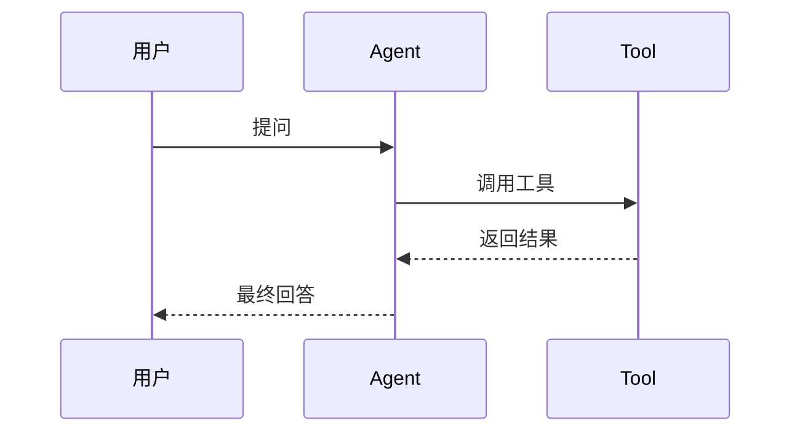
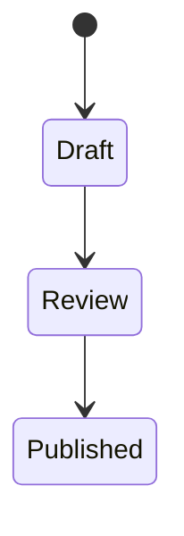

# Markdown 高级语法与公式渲染 😎😎😎

> 适合人群：经常写技术笔记、知识库、面试总结、项目文档的人
> 
> 使用场景：GitHub、Obsidian、VS Code Markdown 预览、个人知识库整理

------

## 📑 目录

- [一、先说结论：Markdown 不只是标题和代码块](#一先说结论markdown-不只是标题和代码块)
- [二、最常用的基础增强语法](#二最常用的基础增强语法)
- [三、表格的高频写法](#三表格的高频写法)
- [四、代码块进阶写法](#四代码块进阶写法)
- [五、引用、折叠、任务列表](#五引用折叠任务列表)
- [六、锚点与目录跳转](#六锚点与目录跳转)
- [七、Mermaid 图表语法](#七mermaid-图表语法)
- [八、公式渲染：行内公式和块级公式](#八公式渲染行内公式和块级公式)
- [九、LaTeX 数学公式常用写法速查](#九latex-数学公式常用写法速查)
- [十、GitHub、Obsidian、VS Code 的渲染差异](#十githubobsidianvs-code-的渲染差异)
- [十一、写知识库时的最佳实践](#十一写知识库时的最佳实践)
- [十二、最容易踩的坑](#十二最容易踩的坑)

------

## 一、先说结论：Markdown 不只是标题和代码块 🚀

很多人对 Markdown 的理解停留在：

- `#` 标题
- `-` 列表
- 代码块

这当然没错，但如果你经常写技术笔记，其实 Markdown 还能很好地承载：

- 表格
- 流程图
- 任务清单
- 折叠块
- 目录跳转
- 数学公式
- Mermaid 架构图

一句话：

**Markdown 不只是“轻量文本格式”，它其实已经够你写大部分技术知识库了。**

------

## 二、最常用的基础增强语法 ✨

### 1. 强调

```md
**加粗**
*斜体*
***加粗斜体***
~~删除线~~
`行内代码`
```

效果：

- **加粗**
- *斜体*
- ***加粗斜体***
- ~~删除线~~
- `行内代码`

### 2. 分隔线

仓库里约定用：

```md
------
```

效果：

------

### 3. 列表

无序列表：

```md
- Redis
- MySQL
- LangChain
```

有序列表：

```md
1. 先看概念
2. 再写 demo
3. 最后做总结
```

### 4. 行内链接

```md
[OpenAI](https://openai.com)
```

### 5. 图片

```md

```

如果是知识库本地图片，也可以用相对路径。

------

## 三、表格的高频写法 📊

### 1. 基础表格

```md
| 技术 | 用途 | 难度 |
| --- | --- | --- |
| Redis | 缓存 / 分布式锁 | 中 |
| MySQL | 关系型数据库 | 中 |
| LangGraph | Agent 编排 | 较高 |
```

效果：

| 技术 | 用途 | 难度 |
| --- | --- | --- |
| Redis | 缓存 / 分布式锁 | 中 |
| MySQL | 关系型数据库 | 中 |
| LangGraph | Agent 编排 | 较高 |

### 2. 对齐方式

```md
| 左对齐 | 居中 | 右对齐 |
| :--- | :---: | ---: |
| Java | Spring | 100 |
| Redis | Cache | 95 |
```

### 3. 表格适合写什么

特别适合：

- 技术对比
- 参数说明
- 接口字段说明
- 面试题速查

不适合：

- 很长的大段解释
- 多层嵌套结构

------

## 四、代码块进阶写法 🧩

### 1. 指定语言高亮

```md
```java
public class Demo {
    public static void main(String[] args) {
        System.out.println("hello");
    }
}
```
```

常见语言标识：

- `java`
- `sql`
- `bash`
- `powershell`
- `json`
- `yaml`
- `python`
- `javascript`

### 2. 写命令时建议分平台

例如：

```powershell
conda create -n langchain-demo python=3.11 -y
conda activate langchain-demo
```

```bash
conda create -n langchain-demo python=3.11 -y
conda activate langchain-demo
```

### 3. 不要把解释混进代码块

不推荐：

```md
```bash
pip install langchain  # 这里是安装命令，注意版本
```
```

更推荐：

先写解释，再给干净代码块。

------

## 五、引用、折叠、任务列表 📦

### 1. 引用

```md
> 这是引用内容
> 常用于结论、提醒、摘录
```

效果：

> 这是引用内容
> 常用于结论、提醒、摘录

### 2. 多层引用

```md
> 一级引用
>> 二级引用
```

### 3. 折叠块

GitHub 和部分 Markdown 渲染器支持：

```md
<details>
  <summary>点击展开</summary>

  这里可以放补充说明、长代码、边角内容。
</details>
```

效果常用于：

- 隐藏长日志
- 收纳补充材料
- 放参考答案

### 4. 任务列表

```md
- [x] 学完 LangChain 基础
- [x] 学会 LangSmith tracing
- [ ] 把 LangGraph 跑通
```

效果：

- [x] 学完 LangChain 基础
- [x] 学会 LangSmith tracing
- [ ] 把 LangGraph 跑通

------

## 六、锚点与目录跳转 🔗

长文档很适合加目录。

### 1. 目录写法

```md
- [一、先说结论](#一先说结论)
- [二、环境准备](#二环境准备)
```

### 2. 锚点的基本规律

一般来说：

- 标题会自动转成锚点
- 中文标题通常也能跳
- 空格会转成连字符

例如标题：

```md
## 三、环境准备
```

常见锚点是：

```md
#三环境准备
```

### 3. 最稳妥的做法

写完目录后，最好自己点一遍。

因为不同平台对中文锚点、标点符号、空格的处理可能略有差异。

------

## 七、Mermaid 图表语法 🗺️

Mermaid 很适合知识库。

### 1. 流程图

```md

```

### 2. 时序图

```md

```

### 3. 状态图

```md

```

### 4. Mermaid 适合什么

很适合：

- 系统流程
- 调用链路
- 状态流转
- 架构草图

不适合：

- 极度复杂的大型正式架构图

------

## 八、公式渲染：行内公式和块级公式 🧮

如果你要记算法、数学推导、复杂度、概率统计、机器学习内容，公式非常有用。

### 1. 行内公式

写法：

```md
二分查找的时间复杂度是 $O(\log n)$。
```

效果：

二分查找的时间复杂度是 $O(\log n)$。

### 2. 块级公式

写法：

```md
$$
f(n) = n^2 + 2n + 1
$$
```

效果：

$$
f(n) = n^2 + 2n + 1
$$

### 3. 适合写什么公式

比如：

- 时间复杂度：$O(n \log n)$
- 概率公式
- 机器学习损失函数
- 线性代数公式
- SQL / 图算法推导笔记

------

## 九、LaTeX 数学公式常用写法速查 📘

Markdown 里的公式渲染，本质上通常是 KaTeX 或 MathJax 对 LaTeX 数学语法的支持。

### 1. 上标和下标

```md
$x^2$
$a_1$
$x_i^2$
```

效果：

- $x^2$
- $a_1$
- $x_i^2$

### 2. 分数

```md
$\frac{1}{2}$
```

效果：

$\frac{1}{2}$

### 3. 求和与积分

```md
$\sum_{i=1}^{n} i$
$\int_0^1 x^2 dx$
```

效果：

- $\sum_{i=1}^{n} i$
- $\int_0^1 x^2 dx$

### 4. 根号

```md
$\sqrt{x}$
$\sqrt[n]{x}$
```

效果：

- $\sqrt{x}$
- $\sqrt[n]{x}$

### 5. 极限

```md
$\lim_{x \to 0} \frac{\sin x}{x} = 1$
```

效果：

$\lim_{x \to 0} \frac{\sin x}{x} = 1$

### 6. 矩阵

```md
$$
\begin{bmatrix}
1 & 2 \\
3 & 4
\end{bmatrix}
$$
```

效果：

$$
\begin{bmatrix}
1 & 2 \\
3 & 4
\end{bmatrix}
$$

### 7. 常见符号

| 写法 | 效果 | 含义 |
| --- | --- | --- |
| `\alpha` | $\alpha$ | alpha |
| `\beta` | $\beta$ | beta |
| `\lambda` | $\lambda$ | lambda |
| `\neq` | $\neq$ | 不等于 |
| `\ge` | $\ge$ | 大于等于 |
| `\le` | $\le$ | 小于等于 |
| `\times` | $\times$ | 乘号 |
| `\cdot` | $\cdot$ | 点乘 |
| `\in` | $\in$ | 属于 |
| `\notin` | $\notin$ | 不属于 |

------

## 十、GitHub、Obsidian、VS Code 的渲染差异 🖥️

这是最容易让人迷惑的一块。

### 1. GitHub

GitHub 对这些支持通常比较好：

- GFM 基础语法
- 表格
- 任务列表
- Mermaid
- 数学公式
- `details` 折叠块

但它也不是完整 HTML 页面编辑器，不要指望随便写什么 HTML/CSS 都完美渲染。

### 2. Obsidian

Obsidian 对这些一般也支持得不错：

- 双向链接 `[[...]]`
- 数学公式
- Mermaid
- Callout

注意：

- Obsidian 的某些特性是它自己的增强，不一定在 GitHub 上也一样

### 3. VS Code Markdown 预览

基础 Markdown 一般没问题，但：

- Mermaid 有时需要插件
- 公式渲染能力取决于预览插件或内置支持情况

### 4. 最稳妥的原则

如果你的文档既要在 GitHub 看，也要在 Obsidian 看：

- 优先使用 GFM 通用语法
- Obsidian 独占语法别滥用
- Mermaid 和公式写完后最好在两个环境都看一遍

------

## 十一、写知识库时的最佳实践 ✅

### 1. 长文档一定加目录

特别是：

- 知识总结
- 面试题汇总
- 教程型笔记

### 2. 表格只放结构化信息

不要把大段解释硬塞进表格。

### 3. 代码块保持干净

解释放正文，代码块只放代码。

### 4. 图表是辅助，不是主角

Mermaid 是为了帮助理解，不是为了堆效果。

### 5. 公式适合精确表达，不适合滥用

如果一句中文能讲清楚，就别强行公式化。

### 6. 同一篇文档风格尽量统一

比如：

- 标题层级统一
- 分隔线统一
- 表格风格统一
- 代码块语言标识统一

### 7. 知识库型笔记尽量可跳转

你可以适当补：

- 目录
- 相关笔记链接
- 双向链接

------

## 十二、最容易踩的坑 ⚠️

### 1. 把 Markdown 当纯文本

这样笔记可读性会差很多。

### 2. 滥用 HTML

有些平台兼容性不好，反而更乱。

### 3. Mermaid 图写太复杂

最后自己都看不懂。

### 4. 公式能渲染，但环境不支持

所以写完最好在目标平台预览一下。

### 5. 中文锚点不验证

目录看起来写好了，但点不开。

### 6. 代码块不写语言

可读性和高亮都会变差。

------

## 🔗 相关补充

- [[技术栈/分布式与网络/微服务/消息队列/kafka-quickstart]] —— 文档中已经有 Mermaid 渲染说明
- [[项目与成长/实习方法论/AI应用/LangChain、LangSmith、LangGraph 一周入门攻略]] —— 一个更偏教程型的 Markdown 笔记示例
- [[项目与成长/实习方法论/AI应用/LangGraph 入门：从状态图到可持久化 Agent]] —— 里面有较多 Mermaid 图和流程型表达
