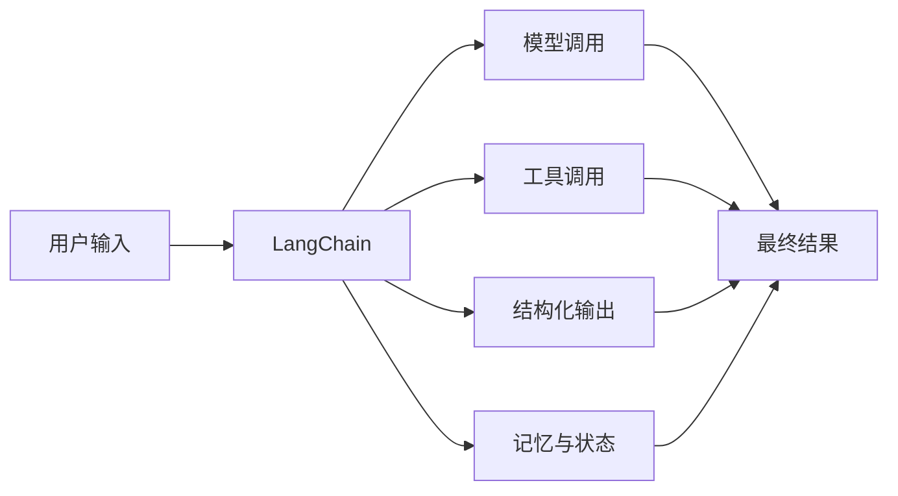

# 一、先搞清楚 LangChain 到底解决什么问题 🚀

很多人第一次接触 LangChain，会把它想成“大模型开发全家桶”。

这个理解不算全错，但太宽了。

更准确一点：

**LangChain 是一个帮助你更方便地构建 LLM 应用和 Agent 的开发框架。**

它最核心的价值，不是“帮你 magically 变强”，而是帮你把下面这些事组织得更顺手：

- 调模型
- 管消息
- 接工具
- 做结构化输出
- 管记忆
- 组织 Agent 执行流程

你可以把它理解成：

------

