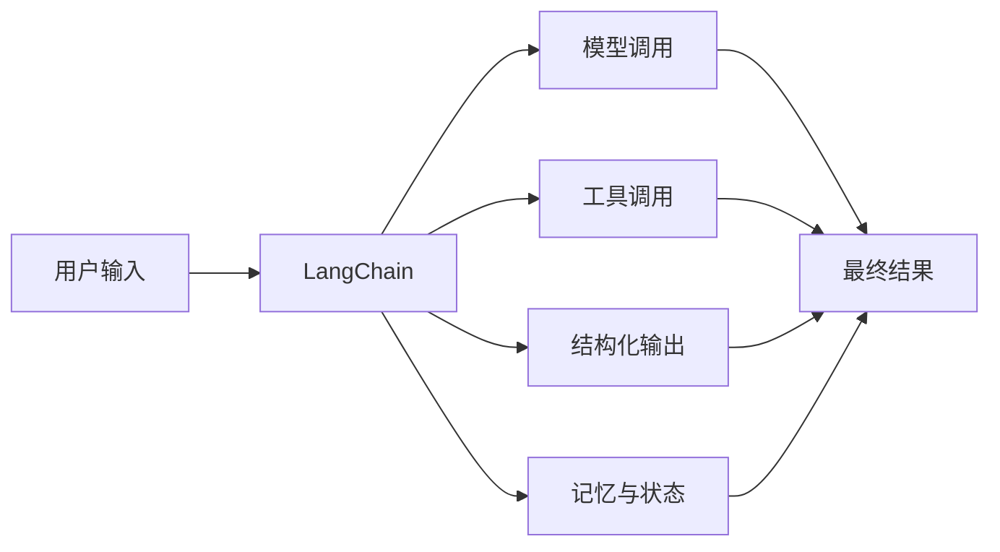

# LangChain 从入门到能写 Agent 😎😎😎

> 适合人群：有一点 Python 基础，想先把 LangChain 跑通并能写出最小 Agent 的人
> 
> 文档基线：基于官方文档整理，时间点为 `2026-07-09`

------

## 📑 目录

- [一、先搞清楚 LangChain 到底解决什么问题](#一先搞清楚-langchain-到底解决什么问题)
- [二、你应该怎么学 LangChain](#二你应该怎么学-langchain)
- [三、环境准备](#三环境准备)
- [四、第一个 LangChain 脚本：先调通模型](#四第一个-langchain-脚本先调通模型)
- [五、第二个脚本：写一个最小 Agent](#五第二个脚本写一个最小-agent)
- [六、什么是 Tool，为什么它这么重要](#六什么是-tool为什么它这么重要)
- [七、结构化输出：LangChain 最值得优先掌握的能力之一](#七结构化输出langchain-最值得优先掌握的能力之一)
- [八、Memory 先建立概念，不要一上来就死磕实现](#八memory-先建立概念不要一上来就死磕实现)
- [九、RAG 和 LangChain 的关系](#九rag-和-langchain-的关系)
- [十、练手项目 1：做一个技术问题分类器](#十练手项目-1做一个技术问题分类器)
- [十一、练手项目 2：做一个带工具的学习助手](#十一练手项目-2做一个带工具的学习助手)
- [十二、一个适合新手的学习顺序](#十二一个适合新手的学习顺序)
- [十三、最容易踩的坑](#十三最容易踩的坑)
- [十四、学完这篇你应该能做到什么](#十四学完这篇你应该能做到什么)

------

## 一、先搞清楚 LangChain 到底解决什么问题

很多人第一次接触 LangChain，会把它想成“大模型开发全家桶”。

这个理解不算全错，但太宽了。

更准确一点：

**LangChain 是一个帮助你更方便地构建 LLM 应用和 Agent 的开发框架。**

它最核心的价值，不是“帮你 magically 变强”，而是帮你把下面这些事组织得更顺手：

- 调模型
- 管消息
- 接工具
- 做结构化输出
- 管记忆
- 组织 Agent 执行流程

你可以把它理解成：



------

## 二、你应该怎么学 LangChain

### 1. 按新版文档学，不要被老教程带偏

现在很多旧教程还在讲：

- `LLMChain`
- 老式 `AgentExecutor`
- 一堆旧 prompt chain 玩法

但 LangChain v1 的方向已经很明确：

- `langchain` 命名空间被精简
- 主打 **essential building blocks for agents**
- 很多旧东西迁到了 `langchain-classic`

所以你学习时优先看：

- `docs.langchain.com/oss/python/langchain/...`

而不是只盯着很老的文章。

### 2. 新手最合理的顺序

不要一开始就啃所有高级概念。

正确顺序应该是：

1. 先调通模型
2. 再学 tool calling
3. 再学结构化输出
4. 再理解 memory
5. 最后再碰更复杂的 agent 形态

------

## 三、环境准备

### 1. Python 版本

LangChain 官方安装页给出的要求是：

- **Python 3.10+**

建议直接用 `Python 3.11` 或 `3.12`，后面如果你继续学 LangGraph 会更顺。

### 2. 虚拟环境

```bash
mkdir langchain-demo
cd langchain-demo
python -m venv .venv
```

Windows:

```powershell
.venv\Scripts\activate
```

macOS / Linux:

```bash
source .venv/bin/activate
```

### 3. 安装依赖

最小安装：

```bash
pip install -U langchain langchain-openai
```

如果你用别的 provider，再装对应集成包。

### 4. 环境变量

```powershell
$env:OPENAI_API_KEY="你的key"
```

如果你不是 OpenAI，就换成对应 provider 的 key。

------

## 四、第一个 LangChain 脚本：先调通模型

今天最重要的目标很简单：

**先完成一次最小模型调用。**

代码如下：

```python
from langchain_openai import ChatOpenAI

llm = ChatOpenAI(model="gpt-4.1-mini")

result = llm.invoke("用三句话解释什么是 LangChain")
print(result.content)
```

这段代码背后，你只需要先理解两件事：

### 1. `ChatOpenAI` 是模型适配器

它负责把你写的 Python 代码，转成 provider 能理解的请求。

### 2. `invoke(...)` 是最基础的调用方式

你传进去一个输入，拿回来一个结果。

如果这一步报错，优先排查：

- API key 有没有配
- 模型名有没有写错
- 包有没有装对
- 虚拟环境有没有激活

### 练手任务

先不要急着进下一节，先把下面 3 个变体都敲一遍：

```python
from langchain_openai import ChatOpenAI

llm = ChatOpenAI(model="gpt-4.1-mini", temperature=0)

questions = [
    "用一句话解释什么是 LangChain",
    "用三点说明 LangChain 和直接调 OpenAI API 的区别",
    "假设我是后端实习生，为什么要学 Agent 框架",
]

for q in questions:
    result = llm.invoke(q)
    print("=" * 40)
    print("问题：", q)
    print("回答：", result.content)
```

观察点：

- 同一个模型，换不同问题，输出风格有什么变化
- `temperature=0` 后，多次执行是否更稳定
- `result` 除了 `content` 之外，还有没有别的信息

------

## 五、第二个脚本：写一个最小 Agent

模型能调通后，下一步就不是“继续聊天”，而是“让模型能调你的函数”。

这就是 Agent 入门的关键一步。

```python
from langchain.agents import create_agent

def get_weather(city: str) -> str:
    """查询天气"""
    return f"{city}，天气晴，25度。"

agent = create_agent(
    model="openai:gpt-4.1-mini",
    tools=[get_weather],
)

result = agent.invoke(
    {"messages": [{"role": "user", "content": "帮我查一下北京天气"}]}
)

print(result)
```

### 这段代码你要重点看什么

#### 1. `create_agent`

这是 LangChain v1 里非常重要的入口。

它的思路不是“给你一堆链类让你拼”，而是围绕 agent 来组织能力。

#### 2. `tools=[get_weather]`

这是把你的 Python 函数暴露给模型。

#### 3. `messages`

Agent 调用不再只是“传个字符串”，而是围绕消息来组织上下文。

### 升级版练手：做 2 个工具

只写一个天气函数还不够，你至少要体会一下模型在多个工具之间做选择。

```python
from langchain.agents import create_agent

def get_weather(city: str) -> str:
    """查询某个城市的天气"""
    return f"{city}：晴天，28 度，适合出门。"

def get_interview_tip(topic: str) -> str:
    """根据主题返回一条面试复习建议"""
    tips = {
        "redis": "先复习数据类型、持久化、缓存穿透、缓存雪崩。",
        "mysql": "先复习索引、事务、锁、MVCC、执行计划。",
        "spring": "先复习 IOC、AOP、事务传播、自定义注解。",
    }
    return tips.get(topic.lower(), f"{topic}：建议先整理核心概念，再准备 5 个高频面试题。")

agent = create_agent(
    model="openai:gpt-4.1-mini",
    tools=[get_weather, get_interview_tip],
)

questions = [
    "帮我查一下郑州天气",
    "我明天面试 Redis，给我一个复习建议",
    "我准备 Spring 面试，给我一个简短建议",
]

for question in questions:
    result = agent.invoke(
        {"messages": [{"role": "user", "content": question}]}
    )
    print("=" * 60)
    print(question)
    print(result)
```

练手要求：

- 把 `get_interview_tip` 改成你自己的方向，比如 Java、并发、MQ
- 再加一个 `get_note_summary(topic: str)` 工具
- 故意把某个工具说明写得很含糊，看模型会不会选错

------

## 六、什么是 Tool，为什么它这么重要

很多人会把 Tool 理解得很玄。

其实先记最简单的版本就够了：

**Tool 就是一个可以被模型调用的函数。**

比如：

- 查天气
- 查数据库
- 调搜索
- 算数学
- 查本地文件

Tool 的意义在于：

- 模型自己并不知道实时天气
- 模型自己也不该直接访问数据库
- 你需要通过 tool，把“外部能力”接给模型

所以 agent 的本质之一，就是：

**模型负责决定何时调用工具，工具负责提供真实能力。**

------

## 七、结构化输出：LangChain 最值得优先掌握的能力之一

如果说新手学 LangChain 最容易低估哪块，那一定是结构化输出。

因为很多人一开始只会：

- 让模型返回一大段自然语言

但真实项目里，后端更常需要的是：

- 分类结果
- 意图识别结果
- 抽取字段
- JSON 风格对象

### 一个最小例子

```python
from pydantic import BaseModel, Field
from langchain_openai import ChatOpenAI

class UserIntent(BaseModel):
    intent: str = Field(description="用户意图")
    urgency: str = Field(description="紧急程度")
    summary: str = Field(description="一句话总结")

llm = ChatOpenAI(model="gpt-4.1-mini")
structured_llm = llm.with_structured_output(UserIntent)

result = structured_llm.invoke("我明天要面试，想快速复习 Redis 持久化")
print(result)
```

### 为什么这件事重要

因为它让你的输出从：

- “看起来差不多对”

变成：

- “字段清晰、类型稳定、后端能接”

### 新手要建立的判断

现在的主线不是“疯狂雕 prompt，让模型吐 JSON”，而是：

- 先定 schema
- 再用 structured output
- prompt 只是补充约束

### 练手升级：做一个“学习任务拆解器”

这个练习比单纯分类更像真实场景。

```python
from pydantic import BaseModel, Field
from langchain_openai import ChatOpenAI

class StudyPlan(BaseModel):
    topic: str = Field(description="学习主题")
    current_level: str = Field(description="当前水平")
    goals: list[str] = Field(description="学习目标列表")
    first_action: str = Field(description="第一步该做什么")
    need_code_practice: bool = Field(description="是否需要代码练习")

llm = ChatOpenAI(model="gpt-4.1-mini", temperature=0)
structured_llm = llm.with_structured_output(StudyPlan)

prompt = """
用户现在有一些 Python 基础。
他希望在一周内学完 LangChain，LangSmith，LangGraph。
请帮他拆成一个清晰的学习任务。
"""

result = structured_llm.invoke(prompt)
print(result)
print(result.model_dump())
```

继续练：

- 把 `goals` 改成 `list[str]` 之外，再增加 `day_by_day_plan`
- 增加 `risk_points`
- 试试把输入换成 “我要准备 Redis 面试” 或 “我要做一个 RAG demo”

------

## 八、Memory 先建立概念，不要一上来就死磕实现

LangChain 里 memory 相关内容容易让新手一头雾水。

先别急着实现，先理解概念。

### 1. Short-term memory

官方文档讲得很清楚：

- 它是线程级、会话内的记忆
- 会随着当前对话推进而更新
- 常见就是 conversation history

### 2. Long-term memory

- 跨线程
- 跨会话
- 可以长期保存用户偏好、事实、知识

### 新手先记一句话

- **短期记忆**：当前对话别忘
- **长期记忆**：下次再来还记得

你先能把这两个概念分清，就已经比很多只会调 API 的人强了。

### 先做一个最小“多轮消息”实验

虽然这里不展开完整 memory 实现，但你至少要体会“消息历史会影响回答”。

```python
from langchain_openai import ChatOpenAI
from langchain_core.messages import HumanMessage, SystemMessage, AIMessage

llm = ChatOpenAI(model="gpt-4.1-mini", temperature=0)

messages = [
    SystemMessage(content="你是一个 Java 学习助手，回答尽量短。"),
    HumanMessage(content="我正在准备 Redis 面试。"),
]

first = llm.invoke(messages)
print("第一轮：", first.content)

messages.append(AIMessage(content=first.content))
messages.append(HumanMessage(content="继续刚才的话题，再给我 5 个高频问题。"))

second = llm.invoke(messages)
print("第二轮：", second.content)
```

这个练习的目标不是实现 memory，而是先建立感受：

- 多轮上下文确实会影响回答
- 只传最后一句，和带着历史消息传，结果会不同

------

## 九、RAG 和 LangChain 的关系

很多人会误以为：

- LangChain = RAG

这是错的。

更准确地说：

- **RAG 是一种应用模式**
- **LangChain 是帮助你实现这种模式的框架之一**

RAG 的核心思想是：

1. 先检索外部信息
2. 再把检索结果喂给模型
3. 模型基于这些上下文回答

LangChain 可以帮你组织这条链路，但它本身不等于 RAG。

### 最小练手：假装做一个本地知识检索工具

你现在不用急着接向量数据库，先用一个假的检索函数把流程跑通。

```python
from langchain.agents import create_agent

NOTES = {
    "redis": "Redis 常考：数据类型、持久化、主从复制、哨兵、分片集群。",
    "mysql": "MySQL 常考：索引、事务、隔离级别、锁、MVCC、执行计划。",
    "mq": "消息队列常考：削峰填谷、异步解耦、重复消费、顺序消息。",
}

def search_notes(topic: str) -> str:
    """根据主题搜索学习笔记"""
    return NOTES.get(topic.lower(), f"没有找到 {topic} 相关笔记。")

agent = create_agent(
    model="openai:gpt-4.1-mini",
    tools=[search_notes],
)

result = agent.invoke(
    {"messages": [{"role": "user", "content": "帮我总结一下 Redis 面试最该先看什么"}]}
)

print(result)
```

你要理解的不是这个例子有多高级，而是：

- “先检索，再回答” 这条链路已经出现了
- 以后把假检索换成真检索，就是更完整的 RAG

------

## 十、练手项目 1：做一个技术问题分类器

这个项目很适合拿来练结构化输出。

### 目标

输入一段用户问题，输出：

- 问题属于什么主题
- 问题想干什么
- 是否紧急

### 参考代码

```python
from pydantic import BaseModel, Field
from langchain_openai import ChatOpenAI

class QuestionTag(BaseModel):
    topic: str = Field(description="主题，例如 redis、mysql、spring、java")
    intent: str = Field(description="意图，例如 提问、总结、复习、改写")
    urgency: str = Field(description="紧急程度，例如 低、中、高")
    reason: str = Field(description="判断依据")

llm = ChatOpenAI(model="gpt-4.1-mini", temperature=0)
structured_llm = llm.with_structured_output(QuestionTag)

samples = [
    "我明天要面试 Redis，帮我快速梳理一下持久化",
    "把这段 Spring Boot 接口文档改得正式一点",
    "解释一下 MySQL 为什么会出现幻读",
]

for text in samples:
    result = structured_llm.invoke(text)
    print("=" * 50)
    print(text)
    print(result.model_dump())
```

### 练手要求

- 自己补 10 条样本
- 统计哪些主题最容易被分错
- 尝试给字段加更清晰的 description，看效果会不会变稳

------

## 十一、练手项目 2：做一个带工具的学习助手

这个项目更接近真实 Agent。

### 目标

用户提问后：

1. 模型判断是否需要查“本地笔记工具”
2. 如果需要，就调工具
3. 最后给出简短回答

### 参考代码

```python
from langchain.agents import create_agent

NOTES = {
    "redis": "Redis 先看：数据类型、持久化、缓存问题、主从复制。",
    "mysql": "MySQL 先看：索引、事务、锁、MVCC、日志。",
    "langchain": "LangChain 先看：model、tools、structured output、agents。",
}

def search_notes(topic: str) -> str:
    """按主题搜索学习笔记摘要"""
    return NOTES.get(topic.lower(), f"暂无 {topic} 相关摘要。")

def generate_todo(topic: str) -> str:
    """按主题生成一个三步学习任务"""
    return f"1. 先看 {topic} 核心概念 2. 整理 5 个高频题 3. 写一个最小 demo"

agent = create_agent(
    model="openai:gpt-4.1-mini",
    tools=[search_notes, generate_todo],
)

questions = [
    "我想快速复习 Redis，先看什么",
    "给我一个 LangChain 的三步学习计划",
    "MySQL 面试前最后两小时该复习什么",
]

for q in questions:
    result = agent.invoke(
        {"messages": [{"role": "user", "content": q}]}
    )
    print("=" * 60)
    print("问题：", q)
    print("结果：", result)
```

### 继续升级

- 给最终输出再套一层结构化 schema
- 把工具返回值改成更长文本，观察模型会不会总结失真
- 再接 LangSmith tracing，看它到底选了哪个工具

------

## 十二、一个适合新手的学习顺序

下面这个顺序，比“顺着官网左侧导航乱点”更适合入门。

### 第一步：看总览

先看：

- Overview
- Install
- Quickstart

### 第二步：看 Agent 主线

重点看：

- Agents
- Models
- Tools

### 第三步：补高价值进阶

重点看：

- Short-term memory
- Long-term memory
- RAG

### 第四步：补 v1 迁移认知

看：

- LangChain v1 migration guide

这样你能知道哪些是新主线，哪些是历史包袱。

------

## 十三、最容易踩的坑

### 1. 上来就看一堆老教程

最后会导致你学到一堆不该优先学的旧 API。

### 2. 只会聊天调用，不会工具调用

那你学到的只是“换了个壳调模型”，不是 agent 开发。

### 3. 忽略结构化输出

这会让你的程序停留在 demo 水平，很难往工程化走。

### 4. 把 LangChain 学成 Prompt 技巧集合

真正重要的是：

- 模型接口
- 工具接入
- 结构化输出
- 记忆
- 可观测性

而不是只会写几段“你是一个专业助手”的提示词。

### 5. 一开始就折腾所有 provider

新手期最重要的是稳定跑通一条链路，不是炫 provider 数量。

------

## 十四、学完这篇你应该能做到什么

如果这篇内容你吃透了，至少应该能做到：

- 能独立搭一个最小 LangChain Python 环境
- 能成功调用模型
- 能写一个最小 agent
- 能让模型调用 tool
- 能写一个结构化输出 demo
- 能说清 short-term memory 和 long-term memory 的区别
- 能解释 LangChain 和 RAG 的关系

做到这里，你就已经完成了从“会调 LLM API”到“开始会写 LLM 应用”的转变。

------

## 🔗 推荐继续看

- [[项目与成长/实习方法论/AI应用/LangSmith 调试、观测与评测入门]] —— 学会看 trace、做评测
- [[项目与成长/实习方法论/AI应用/LangGraph 入门：从状态图到可持久化 Agent]] —— 学会更底层的 agent 编排
- [[项目与成长/实习方法论/AI应用/LangChain、LangSmith、LangGraph 一周入门攻略]] —— 一周学习总路线
